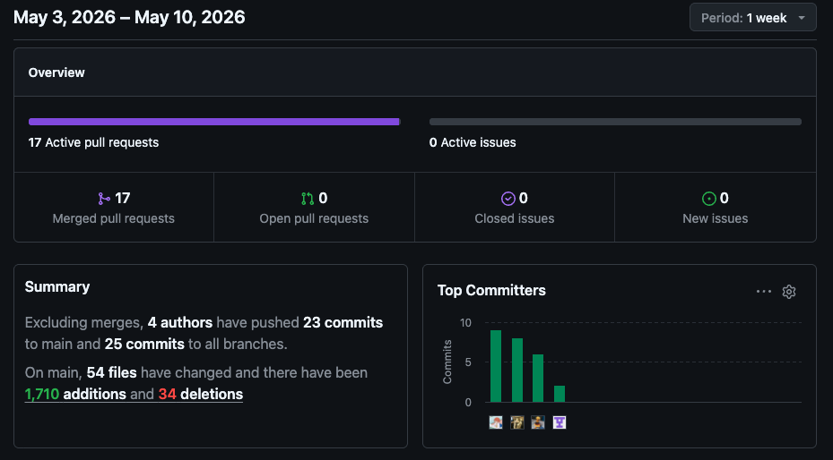
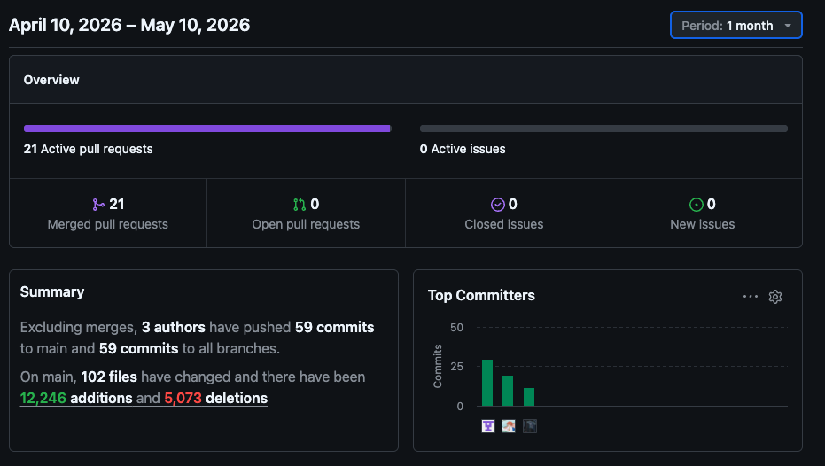

# Capítulo V: Product Implementation

## 5.1. Software Configuration Management.
### 5.1.1. Software Development Environment Configuration.

**Project Management:**

Para la gestión del proyecto Energix, utilizamos WhatsApp como medio principal de comunicación, a través de un grupo grupal en el cual coordinamos tareas, compartimos avances y discutimos decisiones del proyecto en tiempo real. Por otro lado, Discord fue nuestra plataforma para realizar llamadas de voz en equipo, donde organizamos la distribución de responsabilidades entre los integrantes, complementamos ideas y resolvimos dudas de forma síncrona. Asimismo, utilizamos GitHub no solo para el control de versiones, sino también como repositorio centralizado de toda la documentación del proyecto, incluyendo el reporte y la landing page.

**Requirements Management:**

Para la gestión de los requisitos del proyecto Energix, el equipo definió colaborativamente las historias de usuario que representan las principales funcionalidades del sistema. Estas fueron priorizadas y organizadas en el Product Backlog, considerando las necesidades de nuestros segmentos objetivo: propietarios de viviendas y estudiantes que alquilan. El proceso fue participativo, con todos los integrantes del equipo aportando en la identificación y refinamiento de los requerimientos funcionales y no funcionales de la aplicación web.

**Product UX/UI Design:**

Para el diseño de la experiencia de usuario, utilizamos UXPressia, herramienta con la que elaboramos los User Personas, Empathy Maps, Journey Maps e Impact Maps del proyecto Energix. Esto nos permitió adoptar una perspectiva centrada en el usuario y comprender mejor las necesidades de nuestros segmentos objetivo. Para el diseño visual de la aplicación, empleamos Figma como herramienta de diseño colaborativo, a través de la cual creamos los Wireframes, Mock-ups y prototipos de la aplicación web, sirviendo como guía previa al desarrollo. El alcance de Energix no contempla una aplicación móvil nativa en esta fase del proyecto (ver Capítulo IV, secciones 4.4 y 4.5).

**Software Development:**

Como entornos de desarrollo principales, el equipo utilizó Visual Studio Code y WebStorm. Visual Studio Code fue empleado para la creación del landing page y las aplicaciones web con HTML5, CSS3, JavaScript y TypeScript, mientras que WebStorm fue utilizado para trabajar con el framework Angular. Para el backend, adoptamos Spring Boot Framework, que nos permitió desarrollar servicios web RESTful en Java con una base escalable y robusta. Adicionalmente, LucidChart fue utilizado para la creación de diagramas UML, Wireflows y User Flows, y Structurizr para modelar la arquitectura del software mediante diagramas C4. Todo el código fuente fue gestionado en GitHub aplicando el flujo de trabajo GitFlow y la convención Conventional Commits, lo que garantizó un historial de cambios ordenado y comprensible para todos los integrantes.

**Software Testing:**

Para la validación de los criterios de aceptación del proyecto Energix, utilizamos el lenguaje Gherkin, el cual nos permite describir los escenarios de prueba bajo la estructura Given-When-Then. Esta metodología facilita la identificación de las variables de entrada y salida de cada funcionalidad, y al estar escrita en lenguaje natural, resulta comprensible tanto para el equipo técnico como para los stakeholders. La documentación de estas pruebas se gestionó junto con el resto del proyecto en los repositorios de GitHub, usando Markdown como lenguaje de marcado para los archivos README y la documentación técnica general. Gracias a este enfoque, el equipo garantiza que el software cumpla con los requerimientos definidos y que la calidad del producto final sea consistente con los objetivos del proyecto.

### 5.1.2. Source Code Management.

Usuarios de GitHub

| **Integrante**                 | **Nombre de Usuario** |
|--------------------------------|-----------------------|
| Acuña Corahua, Jonatan Ariel   | JonatanFD             |
| Duran Díaz, Antonio Rodrigo    | Sltcrd                |
| Huaman Olivos, Yeira Shari     | YeiShari              |
| Meza Solórzano, Didier Sebastian | DidierSebas           |
| Teves Samaniego, Joan Fernando | Joan3210              |
| Torres Lavandera, Andrés Rodrigo | AndresTorres202312557 |

La gestión del código fuente es parte fundamental del desarrollo de cualquier
proyecto de software, ya que nos permitirá rastrear cambios, revertir versionas y
coordinar a los diferentes integrantes del equipo a la misma vez. En ENERGIX,
utilizaremos GitHub como plataforma para alojar nuestros repositorios.

**URL de repositorio de Landing Page:** https://github.com/EnergixUPC/Landing-Page

**URL de repositorio de Frontend:** https://github.com/EnergixUPC/Frontend

**URL de repositorio de Backend:** https://github.com/EnergixUPC/Backend

**URL de repositorio de Reporte:** https://github.com/EnergixUPC/Reporte

Ejemplos de commits

• feat(login): add user authentication module

• fix(payment): resolve payment gateway issue

• docs(README): update setup instructions

Con estas estructuras, ENERGIX se puede gestionar eficientemente el flujo de
trabajo del desarrollo, asegurándonos una integración continua y una organización
clara del código.

### 5.1.3. Source Code Style Guide & Conventions.

En el proyecto Energix, hemos implementado una serie de guías de estilo y convenciones con el objetivo de asegurar que todos los integrantes del equipo de desarrollo sigan una estructura consistente y clara a lo largo de todo el proyecto, facilitando la legibilidad del código, mejorando la colaboración y garantizando que el código sea mantenible a largo plazo.

**Nomenclatura General**

Para asegurar la coherencia en todo el código, seguimos las siguientes directrices:

- Los nombres de variables, funciones y métodos utilizan camelCase.
- Los nombres de clases y componentes siguen la convención PascalCase.
- Para archivos y carpetas, se emplea la convención kebab-case.
- El uso de inglés es obligatorio para todos los identificadores, con el fin de asegurar la comprensión entre los miembros del equipo y seguir las buenas prácticas de la industria.

**HTML/CSS Conventions**

Para el desarrollo del landing page y las vistas de la aplicación web, seguimos las convenciones establecidas por el estándar HTML5 y las guías de estilo de Google para HTML y CSS:

- Los atributos de los elementos HTML se escriben en minúsculas.
- Las clases CSS siguen la convención kebab-case.
- Se evita el uso de estilos en línea; los estilos se definen en archivos .css o .scss separados.

**JavaScript/TypeScript Conventions**

Para el desarrollo con JavaScript y TypeScript, seguimos las guías de estilo de Airbnb y las recomendaciones oficiales de TypeScript:

- Se usa const y let en lugar de var.
- Se declaran los tipos explícitamente en TypeScript para mejorar la legibilidad y evitar errores en tiempo de compilación.
- Se evita el uso de any; en su lugar, se definen interfaces o tipos específicos.

**Angular Conventions**

Para el desarrollo del frontend con Angular, seguimos la Angular Style Guide oficial:

- Los componentes se nombran en PascalCase con el sufijo Component.
- Los servicios llevan el sufijo Service.
- Cada componente tiene su propio directorio con sus archivos .ts, .html y .css correspondientes.

**Spring Boot/Java Conventions**

Para el desarrollo del backend con Spring Boot, seguimos las convenciones estándar de Java y las recomendaciones de Spring:

- Los nombres de paquetes se escriben en minúsculas y de forma jerárquica.
- Las clases de controlador llevan el sufijo Controller.
- Las clases de servicio llevan el sufijo Service.
- Los repositorios llevan el sufijo Repository.
- Se aplican los principios RESTful para el diseño de endpoints, usando sustantivos en plural (ej. /api/v1/users, /api/v1/energy-records).

**Commits Convencionales**

Los tipos utilizados son:

- feat: para nuevas funcionalidades.
- fix: para corrección de errores.
- docs: para cambios en la documentación.
- style: para cambios de formato que no afectan la lógica.
- refactor: para reestructuración de código sin cambio de funcionalidad.
- test: para adición o modificación de pruebas.

### 5.1.4. Software Deployment Configuration.

En esta sección se detalla la configuración utilizada para el despliegue de los productos desarrollados en el proyecto Energix, abarcando la Landing Page, la aplicación web Frontend y el Backend del sistema SEMS.

**Landing Page — Netlify**

Para el despliegue de la landing page se utilizó Netlify. El proceso consistió en autenticarse con GitHub desde la plataforma, buscar la organización del proyecto, seleccionar el repositorio correspondiente y cargar los archivos. Una vez completado el proceso, Netlify generó automáticamente el enlace de publicación.
La landing page está disponible en: https://energixlp.netlify.app

**Frontend — Vercel**

El frontend desarrollado con Angular fue desplegado en Vercel, conectando el repositorio de GitHub para que cada merge a la rama principal genere un despliegue automático.
La aplicación web está disponible en: https://frontend-sems.vercel.app

**Backend — Render**

El backend con Spring Boot fue desplegado en Render, también con integración continua desde GitHub. Para proteger la dirección IP del servidor y evitar exponerla en un repositorio público, se configuró un proxy mediante Cloudflare Tunnel.

La documentación Swagger está en: https://theft-muscles-inner-protection.trycloudflare.com/swagger-ui/index.html

**Base de datos — Aiven**

La base de datos fue alojada en Aiven, con conexión bajo SSL obligatorio para la seguridad de los datos.

## 5.2. Product Implementation & Deployment.
### 5.2.1. Sprint Backlogs.

### Sprint 1

| User Story ID | User Story Title                | Task ID | Task Title                      | Description                                                  | Estimation | Assigned To     | Status |
|---------------|--------------------------------|---------|--------------------------------|--------------------------------------------------------------|------------|------------------|--------|
| US17          | Consultar la propuesta de valor| UT01    | Redactar contenido             | Crear texto sobre beneficios de la plataforma                | 2h         | Jonatan Acuña    | Done   |
|               |                                | UT02    | Diseñar sección                | Implementar diseño en la landing page                        | 3h         | Jonatan Acuña    | Done   |
| US18          | Acceder a FAQ                  | UT03    | Redactar preguntas             | Crear lista de preguntas frecuentes                          | 2h         | Yeira Huaman     | Done   |
|               |                                | UT04    | Implementar FAQ                | Desarrollar componente tipo acordeón                         | 3h         | Yeira Huaman     | Done   |
| US19          | Revisar planes de suscripción  | UT05    | Redactar planes                | Crear contenido de precios y beneficios                      | 3h         | Andrés Torres    | Done   |
|               |                                | UT06    | Diseñar comparación            | Implementar tabla/cards comparativos                         | 3h         | Andrés Torres    | Done   |
| US20          | Cambiar idioma                 | UT07    | Implementar selector idioma    | Permitir cambio entre español e inglés                       | 4h         | Antonio Duran    | Done   |
|               |                                | UT08    | Configurar traducciones        | Mapear textos en ambos idiomas                               | 3h         | Antonio Duran    | Done   |
| US01          | Registro de cuenta             | UT09    | Diseñar formulario             | Crear interfaz con validaciones                              | 3h         | Didier Meza      | Done   |
|               |                                | UT10    | Implementar registro           | Lógica para crear cuentas                                    | 4h         | Didier Meza      | Done   |
| US02          | Inicio de sesión               | UT11    | Diseñar login                  | Crear interfaz de inicio de sesión                           | 2h         | Joan Teves       | Done   |
|               |                                | UT12    | Implementar autenticación      | Validar credenciales                                         | 3h         | Joan Teves       | Done   |

### 5.2.2. Implemented Landing Page Evidence

Como parte de la implementación del producto, se desarrolló y consolidó la Landing Page de Energix, la cual representa el primer punto de interacción entre el usuario y la propuesta de valor del sistema. Esta página fue diseñada considerando criterios de usabilidad, accesibilidad y claridad en la comunicación de beneficios, permitiendo presentar de forma estructurada las funcionalidades principales del producto.

La Landing Page incluye secciones clave como la barra de navegación, pantalla de inicio, descripción de beneficios, presentación del producto, planes de suscripción, información del equipo, preguntas frecuentes y pie de página. Cada una de estas secciones fue implementada siguiendo los diseños previamente definidos en Figma, asegurando coherencia visual y experiencia de usuario.

A continuación, se presentan las evidencias correspondientes a la implementación final de la Landing Page:

Adicionalmente, la Landing Page fue desplegada en un entorno productivo, permitiendo su acceso público para validación y retroalimentación continua. El despliegue se realizó mediante integración con el repositorio del proyecto, garantizando que cada actualización refleje de manera automática los cambios implementados por el equipo de desarrollo.

URL de la Landing Page desplegada: https://energixlp.netlify.app
### 5.2.3. Implemented Frontend-Web Application Evidence

Como parte de la implementación del producto Energix, se desarrolló la aplicación web frontend, la cual permite a los usuarios interactuar de manera eficiente con el sistema de gestión energética. Esta interfaz fue construida utilizando Angular, siguiendo principios de diseño centrado en el usuario y buenas prácticas de desarrollo frontend.

La aplicación web integra diversas funcionalidades clave que garantizan una experiencia fluida e intuitiva. Entre las principales características implementadas se encuentran:

1. Sistema de autenticación completo, que permite el registro e inicio de sesión diferenciando entre tipos de usuario (propietarios y estudiantes), adaptando la experiencia según el rol.

2. Gestión y personalización del perfil de usuario, permitiendo modificar información relevante y mejorar la experiencia dentro de la plataforma.

3. Visualización de dashboards interactivos, donde el usuario puede monitorear su consumo energético mediante gráficos y métricas claras.

4. Módulo de reportes, que permite filtrar información por fechas y tipos, así como descargar los datos en distintos formatos.

5. Gestión de dispositivos, facilitando el registro, visualización y control de los dispositivos asociados al usuario.

6. Implementación de internacionalización (i18n), permitiendo el uso de la plataforma en más de un idioma.

7. Sistema de navegación robusto, con rutas protegidas que garantizan la seguridad del acceso a la información, además de una página 404 personalizada.

A continuación, se presentan evidencias visuales de las principales vistas implementadas en la aplicación web:

**Login y Autenticación**

**Dashboard Principal**

**Gestión de Dispositivos**

**Módulo de Reportes**

**Configuración de Usuario**

Finalmente, el frontend fue desplegado en un entorno productivo mediante integración continua con el repositorio del proyecto, permitiendo que cada actualización realizada por el equipo se refleje automáticamente en la aplicación en línea.

URL del frontend desplegado: https://frontend-sems.vercel.app
### 5.2.4. Acuerdo de Servicio - SaaS

El sistema Energix se ofrece bajo un modelo Software as a Service (SaaS), lo que permite a los usuarios acceder a la plataforma a través de internet sin necesidad de realizar instalaciones locales. Este enfoque facilita la escalabilidad, el mantenimiento continuo y la disponibilidad del servicio.

**Disponibilidad del Servicio**  
Energix garantiza una alta disponibilidad del sistema, apoyándose en servicios de despliegue en la nube como Vercel (frontend), Render (backend) y Aiven (base de datos). Se busca mantener el servicio activo el mayor tiempo posible, con monitoreo constante para detectar y resolver incidentes.

**Acceso y Autenticación**  
El acceso a la plataforma se realiza mediante credenciales seguras (correo electrónico y contraseña). Cada usuario cuenta con un perfil único, y el sistema implementa control de acceso según el rol (propietario o estudiante), asegurando que la información sea visible únicamente para usuarios autorizados.

**Seguridad de la Información**  
Energix protege la información de los usuarios mediante conexiones seguras (HTTPS) y el uso de bases de datos con conexión cifrada (SSL). Asimismo, se aplican buenas prácticas de desarrollo para evitar vulnerabilidades comunes.

**Actualizaciones y Mantenimiento**  
El sistema se actualiza de manera continua mediante integración con repositorios en GitHub. Las mejoras, correcciones de errores y nuevas funcionalidades se despliegan automáticamente, sin necesidad de intervención del usuario final.

**Escalabilidad del Servicio**  
Gracias al uso de infraestructura en la nube, Energix puede adaptarse al crecimiento en la cantidad de usuarios, permitiendo escalar recursos según la demanda del sistema.

**Soporte y Mejora Continua**  
El equipo de desarrollo realiza seguimiento constante del funcionamiento del sistema, recopilando retroalimentación de los usuarios para implementar mejoras en futuras versiones.

**Limitaciones del Servicio**  
El funcionamiento de Energix depende de la disponibilidad de conexión a internet y de los servicios de terceros utilizados para su despliegue. Interrupciones en estos servicios pueden afectar temporalmente el acceso a la plataforma.

Este acuerdo define las condiciones bajo las cuales Energix ofrece su servicio, garantizando una experiencia confiable, segura y en constante evolución para sus usuarios.
### 5.2.5. Implemented Native-Mobile Application Evidence

**No aplica.** El alcance del producto Energix (Smart Energy Management System) comprende Landing Page, Web Application y RESTful API; no contempla el desarrollo de una aplicación móvil nativa en esta fase del proyecto.

### 5.2.6. Implemented RESTful API and/or Serverless Backend Evidence

Durante el desarrollo del sprint se lograron completar los principales módulos del backend del sistema Energix, consolidando una arquitectura funcional y escalable orientada a la gestión del consumo energético en hogares.

Las funcionalidades implementadas fueron las siguientes:

1. API de autenticación completa, incluyendo endpoints para registro de usuarios, inicio de sesión y validación de sesiones activas.

2. Gestión de perfiles de usuario mediante API, permitiendo consultar y actualizar información personal, así como la carga de imágenes de perfil.

3. Módulo de reportes de consumo energético, con generación y consulta de reportes semanales, diarios, mensuales y por categorías.

4. CRUD de dispositivos inteligentes, incorporando monitoreo en tiempo real, control de encendido/apagado, configuración de preferencias y organización por categorías.

5. Sistema de autenticación robusto, con validación de sesión activa y cierre de sesión seguro, incluyendo manejo adecuado de errores.

6. Backend desplegado en Render, integrado con base de datos, sistema de notificaciones y documentación completa mediante Swagger.

**Capturas de pantalla de la documentación en Swagger**

**Deployment del Backend en Render**

**SEMS API**

### 5.2.7. RESTful API documentation

La documentación de la API REST del sistema Energix ha sido implementada con el objetivo de facilitar la comprensión, integración y consumo de los distintos servicios del backend por parte del frontend y otros posibles clientes.

Para el despliegue del backend se utilizó **Render**, lo que permitió contar con una infraestructura centralizada, escalable y conectada directamente con el repositorio del proyecto. De esta manera, cada actualización en la rama principal se refleja automáticamente en el entorno de producción, optimizando el flujo de desarrollo.

Adicionalmente, se implementó un **proxy mediante Cloudflare Tunnel** con el fin de mejorar la seguridad del sistema. Esta medida permite ocultar la dirección IP real del servidor, reduciendo riesgos asociados a accesos no autorizados o ataques directos. Por ello, la API solo es accesible mediante una URL pública controlada.

La base URL de la API es la siguiente:

https://theft-muscles-inner-protection.trycloudflare.com

La documentación interactiva se encuentra disponible a través de Swagger UI:

https://theft-muscles-inner-protection.trycloudflare.com/swagger-ui/index.html

---

### Endpoints principales de la API

| Método HTTP | Endpoint                          | Descripción                                   |
|-------------|-----------------------------------|-----------------------------------------------|
| POST        | /api/v1/auth/register             | Registro de nuevos usuarios                   |
| POST        | /api/v1/auth/login                | Inicio de sesión de usuario                   |
| GET         | /api/v1/auth/validate             | Validación de sesión activa                   |
| GET         | /api/profile/{userId}             | Consulta de perfil de usuario                 |
| PUT         | /api/profile/{userId}             | Actualización de información de perfil        |
| GET         | /api/v1/devices                   | Listado de dispositivos registrados           |
| POST        | /api/v1/devices                   | Creación de dispositivos                       |
| GET         | /api/v1/devices/{deviceId}        | Detalle de un dispositivo                      |
| PUT         | /api/v1/devices/{deviceId}        | Actualización de dispositivo                   |
| DELETE      | /api/v1/devices/{deviceId}        | Eliminación de dispositivo                     |
| POST        | /api/v1/devices/{deviceId}/toggle | Cambio de estado de dispositivo                |
| GET         | /api/v1/alerts                    | Consulta de alertas                            |
| POST        | /api/v1/alerts                    | Creación de alertas                            |
| GET         | /api/v1/notifications             | Listado de notificaciones                      |
| GET         | /api/v1/consumption/daily         | Consumo energético diario                      |
| GET         | /api/v1/consumption/monthly       | Consumo energético mensual                     |
| GET         | /api/v1/reports/weeklyConsumption | Reporte semanal de consumo                     |
| GET         | /api/v1/dashboard/stats           | Estadísticas generales del sistema             |
### 5.2.8. Team Collaboration Insights
En esta sección se presenta la participación activa de los integrantes del equipo en los distintos repositorios del proyecto Energix, evidenciando el trabajo colaborativo tanto en el desarrollo del backend, frontend y la landing page.

---

### Backend de la Aplicación

Repositorio del Backend:  
https://github.com/EnergixUPC/Backend

| **Integrante**                           | **Actividad**                                                                                          |  
|------------------------------------------|--------------------------------------------------------------------------------------------------------|
| **Huaman Olivos, Yeira Shari**           | Desarrollo de funcionalidades del backend y aportes al documento **chapter 5.md**                     |
| **Torres Lavandera, Andrés Rodrigo**     | Desarrollo de funcionalidades del backend y aportes al documento **chapter 5.md**                     |
| **Acuña Corahua, Jonatan Ariel**         | Desarrollo de funcionalidades del backend y aportes al documento **chapter 5.md**                     |
| **Teves Samaniego, Joan Fernando**       | Desarrollo de funcionalidades del backend y aportes al documento **chapter 5.md**                     |

---

### Frontend de la Aplicación Web

Repositorio del Frontend:  
https://github.com/EnergixUPC/Frontend

| **Integrante**                           | **Actividad**                                                                                                         |  
|------------------------------------------|-----------------------------------------------------------------------------------------------------------------------|
| **Huaman Olivos, Yeira Shari**           | Desarrollo de interfaces del frontend y contribuciones a los **chapter 1, 2, 3, 4 y 5.md**                           |
| **Torres Lavandera, Andrés Rodrigo**     | Desarrollo de interfaces del frontend y contribuciones a los **chapter 1, 2, 3, 4 y 5.md**                           |
| **Acuña Corahua, Jonatan Ariel**         | Desarrollo de interfaces del frontend y contribuciones a los **chapter 1, 2, 3, 4 y 5.md**                           |
| **Duran Díaz, Antonio Rodrigo**          | Desarrollo de interfaces del frontend y contribuciones a los **chapter 1, 2, 3, 4 y 5.md**                           |

---

### Landing Page

Repositorio de Landing Page:  
https://github.com/EnergixUPC/Landing-Page
| **Integrante**                           | **Actividad**                                                                                          |  
|------------------------------------------|--------------------------------------------------------------------------------------------------------|
| **Huaman Olivos, Yeira Shari**           | Desarrollo de secciones de la landing page y contribuciones a los **chapter 1, 2, 3, 4 y 5.md**       |
| **Torres Lavandera, Andrés Rodrigo**     | Desarrollo de secciones de la landing page y contribuciones a los **chapter 1, 2, 3, 4 y 5.md**       |
| **Acuña Corahua, Jonatan Ariel**         | Desarrollo de secciones de la landing page y contribuciones a los **chapter 1, 2, 3, 4 y 5.md**       |
| **Meza Solórzano, Didier Sebastian**     | Desarrollo de secciones de la landing page y contribuciones a los **chapter 1, 2, 3, 4 y 5.md**       |
| **Duran Díaz, Antonio Rodrigo**          | Desarrollo de secciones de la landing page y contribuciones a los **chapter 1, 2, 3, 4 y 5.md**       |
| **Teves Samaniego, Joan Fernando**       | Desarrollo de secciones de la landing page y contribuciones a los **chapter 1, 2, 3, 4 y 5.md**       |

## 5.3. Video About-the-Product.
