# Capítulo VI: Product Verification & Validation

## 6.1. Testing Suites & Validation

En esta sección se detalla la estrategia integral de pruebas diseñada para garantizar la calidad y fiabilidad del software. Este proceso abarca la validación aislada de las reglas de negocio a través de las pruebas unitarias, la correcta interacción entre los componentes y servicios mediante pruebas de integración, la alineación del desarrollo con los requerimientos del usuario utilizando Behavior-Driven Development, y la ejecución de flujos completos desde la perspectiva del cliente a través de las pruebas de sistema.

### 6.1.1. Core Entities Unit Tests.

Los Core Entities Unit Tests permiten validar el correcto funcionamiento de las entidades principales del sistema de manera aislada, asegurando que las reglas de negocio, validaciones y comportamientos esenciales se ejecuten correctamente. Estas pruebas son fundamentales para detectar errores tempranamente, mejorar la estabilidad del proyecto y facilitar el mantenimiento del software durante el desarrollo.

**User Profile Test**

**Dashboard Test**

**Device Test**

### 6.1.2. Core Integration Tests.

Los Controller Tests y Core Integration Tests son fundamentales para verificar el correcto funcionamiento de los endpoints y la interacción entre los distintos componentes del sistema, como servicios y bases de datos. Estas pruebas permiten validar respuestas, manejo de errores y códigos de estado, contribuyendo a desarrollar un software más estable, confiable y de calidad.

**Authentication Controller Test**

**User Controller Test**

**Devices Controller Test**

### 6.1.3. Core Behavior-Driven Development

### 6.1.4. Core System Tests.

<table border="1px">
    <tbody>
        <tr>
            <td style="font-weight: bold;">US01</td>
            <td style="font-weight: bold;">Registro de cuenta</td>
            <td style="font-weight: bold;">Como usuario, quiero registrarme en la plataforma para acceder a todas las funcionalidades.</td>
        </tr>
    </tbody>
</table>

<table border="1px">
    <tbody>
        <tr>
            <td style="font-weight: bold;">US02</td>
            <td style="font-weight: bold;">Inicio de sesión</td>
            <td style="font-weight: bold;">Como usuario, quiero autenticarme en la plataforma para gestionar mi consumo energético.</td>
        </tr>
    </tbody>
</table>

<table border="1px">
    <tbody>
        <tr>
            <td style="font-weight: bold;">US03</td>
            <td style="font-weight: bold;">Configuración de perfil inicial</td>
            <td style="font-weight: bold;">Como usuario, quiero registrar el tipo de vivienda y dispositivos básicos para personalizar mi experiencia.</td>
        </tr>
    </tbody>
</table>

<table border="1px">
    <tbody>
        <tr>
            <td style="font-weight: bold;">US04</td>
            <td style="font-weight: bold;">Cerrar sesión de manera segura</td>
            <td style="font-weight: bold;">Como usuario, quiero cerrar mi sesión de forma segura para proteger mi información.</td>
        </tr>
    </tbody>
</table>

<table border="1px">
    <tbody>
        <tr>
            <td style="font-weight: bold;">US05</td>
            <td style="font-weight: bold;">Conectar dispositivos</td>
            <td style="font-weight: bold;">Como usuario, quiero vincular mis dispositivos eléctricos al sistema para supervisar su consumo.</td>
        </tr>
    </tbody>
</table>

<table border="1px">
    <tbody>
        <tr>
            <td style="font-weight: bold;">US06</td>
            <td style="font-weight: bold;">Monitorear consumo en tiempo real</td>
            <td style="font-weight: bold;">Como usuario, quiero consultar el consumo energético en tiempo real para tomar decisiones inmediatas.</td>
        </tr>
    </tbody>
</table>

<table border="1px">
    <tbody>
        <tr>
            <td style="font-weight: bold;">US07</td>
            <td style="font-weight: bold;">Generar alertas de consumo elevado</td>
            <td style="font-weight: bold;">Como usuario, quiero recibir alertas automáticas cuando un dispositivo supere el consumo establecido como normal.</td>
        </tr>
    </tbody>
</table>

<table border="1px">
    <tbody>
        <tr>
            <td style="font-weight: bold;">US08</td>
            <td style="font-weight: bold;">Configurar umbrales de alerta personalizados</td>
            <td style="font-weight: bold;">Como usuario, quiero establecer mis propios límites de consumo para recibir notificaciones adaptadas a mis necesidades.</td>
        </tr>
    </tbody>
</table>

<table border="1px">
    <tbody>
        <tr>
            <td style="font-weight: bold;">US09</td>
            <td style="font-weight: bold;">Consultar reporte semanal de consumo</td>
            <td style="font-weight: bold;">Como usuario, quiero revisar reportes semanales para conocer mi gasto energético desglosado por dispositivo.</td>
        </tr>
    </tbody>
</table>

<table border="1px">
    <tbody>
        <tr>
            <td style="font-weight: bold;">US10</td>
            <td style="font-weight: bold;">Comparar consumo entre periodos</td>
            <td style="font-weight: bold;">Como usuario, quiero comparar mi consumo en semanas o meses distintos para identificar patrones de gasto.</td>
        </tr>
    </tbody>
</table>

<table border="1px">
    <tbody>
        <tr>
            <td style="font-weight: bold;">US11</td>
            <td style="font-weight: bold;">Proyección de factura mensual</td>
            <td style="font-weight: bold;">Como usuario, quiero recibir una estimación de mi próxima factura de electricidad con base en mi consumo actual.</td>
        </tr>
    </tbody>
</table>

<table border="1px">
    <tbody>
        <tr>
            <td style="font-weight: bold;">US12</td>
            <td style="font-weight: bold;">Consultar historial de consumo mensual</td>
            <td style="font-weight: bold;">Como usuario, quiero consultar un historial de mi consumo mensual para identificar cambios en mi gasto energético.</td>
        </tr>
    </tbody>
</table>

<table border="1px">
    <tbody>
        <tr>
            <td style="font-weight: bold;">US13</td>
            <td style="font-weight: bold;">Consultar centro de ayuda</td>
            <td style="font-weight: bold;">Como usuario, quiero acceder a un centro de ayuda con información y guías para resolver dudas comunes.</td>
        </tr>
    </tbody>
</table>

<table border="1px">
    <tbody>
        <tr>
            <td style="font-weight: bold;">US14</td>
            <td style="font-weight: bold;">Identificar dispositivos de alto consumo</td>
            <td style="font-weight: bold;">Como usuario, quiero identificar los dispositivos que generan mayor consumo energético para priorizar acciones de ahorro.</td>
        </tr>
    </tbody>
</table>

<table border="1px">
    <tbody>
        <tr>
            <td style="font-weight: bold;">US15</td>
            <td style="font-weight: bold;">Cambiar idioma de la plataforma</td>
            <td style="font-weight: bold;">Como usuario, quiero cambiar el idioma de la plataforma para comprender mejor la información según mi preferencia.</td>
        </tr>
    </tbody>
</table>

<table border="1px">
    <tbody>
        <tr>
            <td style="font-weight: bold;">US16</td>
            <td style="font-weight: bold;">Consultar noticias y consejos de ahorro energético</td>
            <td style="font-weight: bold;">Como usuario, quiero acceder a una sección con noticias y consejos para mantenerme informado y reducir mi consumo.</td>
        </tr>
    </tbody>
</table>

<table border="1px">
    <tbody>
        <tr>
            <td style="font-weight: bold;">US17</td>
            <td style="font-weight: bold;">Consultar la propuesta de valor</td>
            <td style="font-weight: bold;">Como visitante, quiero visualizar claramente la propuesta de valor de la plataforma para entender sus beneficios.</td>
        </tr>
    </tbody>
</table>

<table border="1px">
    <tbody>
        <tr>
            <td style="font-weight: bold;">US18</td>
            <td style="font-weight: bold;">Acceder a preguntas frecuentes (FAQ)</td>
            <td style="font-weight: bold;">Como visitante, quiero acceder a una sección de preguntas frecuentes para resolver mis dudas sin necesidad de reporte.</td>
        </tr>
    </tbody>
</table>

<table border="1px">
    <tbody>
        <tr>
            <td style="font-weight: bold;">US19</td>
            <td style="font-weight: bold;">Revisar planes de suscripción</td>
            <td style="font-weight: bold;">Como visitante, quiero revisar los planes de suscripción para comparar precios y beneficios antes de decidir.</td>
        </tr>
    </tbody>
</table>

<table border="1px">
    <tbody>
        <tr>
            <td style="font-weight: bold;">US20</td>
            <td style="font-weight: bold;">Cambiar idioma</td>
            <td style="font-weight: bold;">Como visitante, quiero cambiar el idioma de la landing page entre español e inglés para entender mejor la información.</td>
        </tr>
    </tbody>
</table>

## 6.2. Static testing & Verification

En esta fase del proyecto **EnergixUPC**, se aplicaron técnicas de pruebas estáticas para asegurar la mantenibilidad, escalabilidad y seguridad del código fuente sin necesidad de ejecutar la aplicación. Esto nos permitió identificar y corregir defectos en etapas tempranas del ciclo de desarrollo.

### 6.2.1. Static Code Analysis

El análisis estático de código se realizó integrando herramientas automatizadas tanto en los entornos de desarrollo locales (IntelliJ IDEA y Visual Studio Code) como en el repositorio de GitHub.

#### 6.2.1.1. Coding standard & Code conventions

Para garantizar que el código escrito por todos los miembros del equipo mantenga un formato uniforme y sea fácil de leer, se establecieron y respetaron las siguientes convenciones de codificación según la tecnología:

* **Backend (Java / Spring Boot):**
    * Se siguieron las convenciones de codificación estándar de Java de Oracle y Google.
    * **Nomenclatura:** Se utilizó `PascalCase` para las clases e interfaces (ej. `DeviceConsumptionCalculationServiceImpl`), y `camelCase` para métodos y atributos (ej. `calculateConsumption`).
    * **Estructura:** Se respetó la arquitectura Hexagonal (Domain-Driven Design), separando estrictamente los paquetes en `domain`, `application`, `infrastructure` e `interfaces`.
    * **Herramientas:** Se empleó el formateador integrado de IntelliJ IDEA y SonarLint para validar el estilo en tiempo real.

* **Frontend (Angular / TypeScript):**
    * Se aplicó la guía de estilo oficial de Angular (Angular Style Guide).
    * **Nomenclatura:** Se utilizó `kebab-case` para los nombres de archivos y carpetas (ej. `device-list.component.ts`), `PascalCase` para las clases de los componentes y `camelCase` para variables y funciones.
    * **Herramientas:** Se configuró ESLint y Prettier a través de las extensiones de Visual Studio Code (detallado en `.vscode/extensions.json`) para un formateo automático al guardar los archivos.

> **Evidencia de Convenciones de Código:**
>
>
> 
#### 6.2.1.2. Code Quality & Code Security

Para prevenir la acumulación de deuda técnica, "code smells" (malas prácticas) y vulnerabilidades de seguridad, el equipo implementó las siguientes estrategias:

* **Calidad de Código (Code Smells y Bugs Estáticos):** Se utilizó el motor de análisis estático para escanear los componentes del backend y frontend. Esto permitió detectar variables no utilizadas, dependencias circulares, y métodos con alta complejidad ciclomática. Además, la integración continua mediante GitHub Actions (definida en `.github/workflows/ci.yml` y `tests.yml`) asegura que el código pase un control mínimo antes de integrarse.
* **Seguridad y Dependencias (Vulnerabilidades):**
    Se habilitó **GitHub Dependabot** en el repositorio. Esta herramienta escaneó constantemente el archivo `pom.xml` (Backend) y `package.json` (Frontend) en busca de librerías de terceros desactualizadas o con vulnerabilidades públicas conocidas (CVEs), emitiendo alertas para su inmediata actualización.

> **Evidencia de Calidad y Seguridad:**

### 6.2.2. Reviews

El análisis estático no solo dependió de herramientas automatizadas, sino también de la revisión humana. Para ello, el equipo estableció un flujo de trabajo basado en **Peer Reviews (Revisiones de Pares)**.

**Proceso de Revisión (Pull Requests):**
1.  Ningún desarrollador tiene permitido hacer *commits* directamente a las ramas principales protegidas (`main` o `develop`).
2.  Todo el desarrollo de nuevas características o pruebas (como la rama `tests-2`) se realiza en ramas independientes.
3.  Al finalizar, se abre un **Pull Request (PR)** hacia la rama de integración (`develop`).
4.  Antes de realizar el *Merge*, el código debe ser revisado por al menos un compañero de equipo distinto al autor. El revisor comprueba la lógica de negocio, el cumplimiento de las convenciones y la correcta implementación de las pruebas (por ejemplo, validando los tests unitarios con JUnit y Mockito).
5.  Una vez aprobado y habiendo pasado los *workflows* de GitHub Actions, el código se integra.

Este proceso de revisión mitigó el riesgo de introducir errores de lógica que las herramientas automatizadas no pueden detectar, fomentando además la propiedad colectiva del código.

> **Evidencia de Revisión de Pares:**

## 6.3. Validation Interviews

Las entrevistas de validación representan una fase crucial en el proceso de desarrollo del producto SEMS (Sistema de Monitoreo Energético Inteligente). Esta metodología nos permite evaluar la efectividad, usabilidad y aceptación de la solución implementada por parte de nuestros segmentos objetivo identificados en el capítulo anterior.

### 6.3.1. Diseño de Entrevistas

El diseño de las entrevistas de validación se estructura en torno a la evaluación práctica del producto ENERGIX desarrollado. Las entrevistas están dirigidas a los mismos segmentos objetivo identificados en el capítulo 2: propietarios de vivienda y estudiantes que alquilan, con el fin de validar si la solución implementada satisface sus necesidades específicas de monitoreo energético.

**Preguntas para Segmento #1: Propietarios de Vivienda**
1. Al ingresar a la plataforma, ¿qué es lo primero que llama su atención?
2. Sin leer instrucciones, ¿puede identificar cuál es el propósito principal de esta aplicación?
3. ¿La información presentada en el dashboard le resulta clara y comprensible?
4. ¿Puede localizar fácilmente la información sobre su consumo energético actual?
5. ¿Qué opina sobre la forma en que se presentan los datos de consumo (gráficos, números, alertas)?
6. ¿Las alertas de consumo le resultan útiles y fáciles de entender?
7. ¿Considera que esta herramienta podría ayudarle realmente a reducir sus gastos de electricidad?
8. ¿Qué funcionalidad le resulta más valiosa de las que ha visto?
9. ¿El diseño y colores le transmiten confianza y profesionalismo?
10. ¿Encuentra alguna dificultad para navegar entre las diferentes secciones?
11. ¿Los íconos y botones son claros en su función?
12. Basándose en lo que ha visto, ¿estaría dispuesto(a) a usar esta plataforma regularmente?
13. ¿Recomendaría esta solución a otros propietarios de vivienda?
14. ¿Qué mejoraría para que la plataforma sea perfecta para sus necesidades?

**Preguntas para Segmento #2: Estudiantes que Alquilan**

1. ¿La interfaz le parece amigable para alguien de su perfil tecnológico?
2. ¿Puede entender rápidamente cómo esta aplicación le ayudaría a gestionar sus gastos de luz?
3. ¿La información se presenta de una manera que le resulte familiar y fácil de procesar?
4. ¿Los datos de consumo le ayudan a entender mejor en qué se va su dinero de electricidad?
5. ¿Las alertas le parecen útiles para controlar mejor sus gastos mensuales?
6. ¿Puede identificar fácilmente cuánto podría ahorrar usando esta herramienta?
7. ¿La función de monitoreo en tiempo real le resulta práctica para su estilo de vida?
8. ¿Esta herramienta le ayudaría a mantenerse dentro de su presupuesto mensual?
9. ¿Qué característica considera más importante para su situación como estudiante?
10. ¿El ahorro promedio mostrado le parece realista y atractivo?
11. ¿Hay algo que le parezca confuso o complicado de entender?
12. ¿Con qué frecuencia cree que usaría esta plataforma?
13. ¿Se siente motivado(a) a cambiar sus hábitos de consumo después de ver esta herramienta?

### 6.3.2. Registro de Entrevistas

**Segmento objetivo: Propietarios de vivienda**

**ENTREVISTA 1**

Link de las entrevistas

Foto de la entrevista
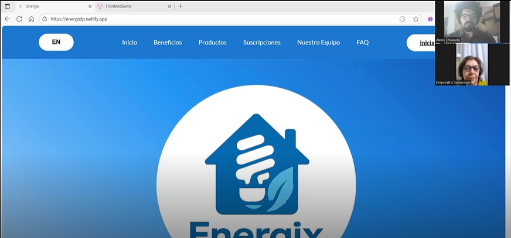

Inicia:00.00

Duración:10:07

Nombre: Emperatriz Sessarego

Edad: 57

Distrito: Jesús María
 
Resumen: La propietaria de vivienda Emperatriz regresa para ser presentada ante la página web junto a beneficios que ofrecemos y luego es redirigida hacia la aplicación web donde se le hizo un recurrido sobre las diferentes herramientas que ofrece la aplicación. Emperatriz resume su experiencia como agradeble, cree que la plataforma le será uitl al momento de controlar su consumo energético. Define la aplicación como fácile de enterder y navegar y concluye que si usaría la aplicación y la recomendaría a otros propietarios de vivienda.

**ENTREVISTA 2**

Foto de la entrevista
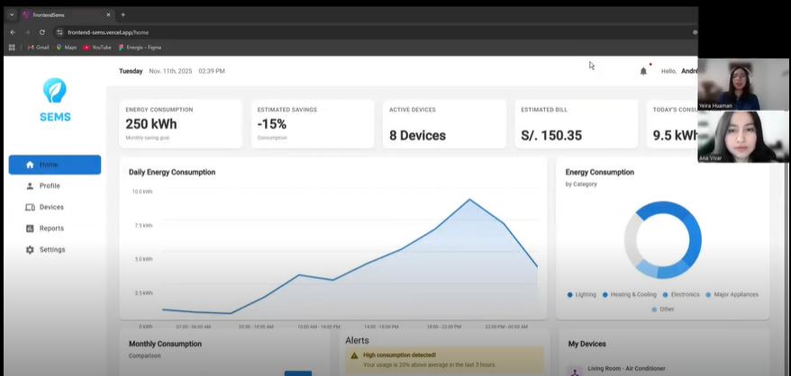
Inicia:00:00

Duración: 05:43

Nombre: Ana Vivar

Edad: 28 

Distrito: San Miguel 

Resumen: La propietaria de vivienda Ana Vivar evaluó la aplicación web y afirmó que sí estaría dispuesta a utilizarla, resaltando que le pareció intuitiva, clara y fácil de navegar. Destacó que los datos detallados sobre el consumo energético le serían muy útiles para optimizar el uso de energía en su hogar y reducir su factura eléctrica, y que el diseño de la plataforma transmite profesionalismo, con botones bien definidos y un dashboard especialmente valioso por la forma en que presenta la información. Además, mencionó que recomendaría la aplicación a amigos que, como ella, son propietarios de vivienda.

**Segmento objetivo: Estudiantes que alquilan**

**ENTREVISTA 1**

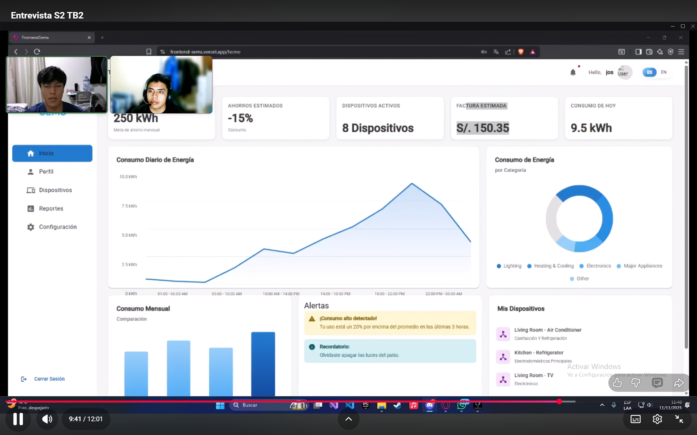

Inicia: 00:00

Duración: 

Nombre: Johnny Ricardo Mallqui Cueva

Edad: 19

Distrito: Chorrillos

Resumen: Johnny Mallqui (19 años) estudia en la UPC y alquila un cuarto en Chorrillos, se relaciaona a menudo con la tecnología ya que estudia ingeniería de Sistemas. Al probar nuestra herramienta nos comento que fue de su agrado y qeu si la usaria, mas que nada si esta se puede usar en un dispositivo movil ya que si una herramienta que solo esta disponible para laptop o PC, nos comento que no valdria la pena, en su caso si esta dispuesto a usarla, ya que al usar tantos dispositivos, seria una herramienta que facilite el ahorro de consumo energetico, tambien nos menciono que la aplicacion es intuitiva y que es muy facil de usar. 

**Entrevista 2**

Foto de la entrevista 
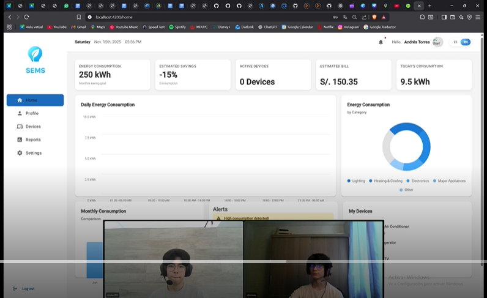
Inicia: 00:00

Duración: 04:21 

Nombre: Simón Gabriel Molina Chirinos

Edad: 19

Distrito: Pueblo Libre

Resumen:Simón es un estudiante que alquila un cuarto. Según sus propias palabras, la interfaz de la aplicación le parece amigable, ay que todo está bien distribuido y es intuitivo. Además, el diseño de la aplicación le resulta cómodo para entender los datos. Asmimismo, comprende de qué manera los datos se relacionan con sus gastos en sí. Menciona que las alertas de la aplicación le parecen útiles para identificar alguna anomalía en sus consumos. También, se siente motivado al ver que puede visualizar una estimación de ahorros. Le resulta útil el monitoreo constante, ya que puede corregir malos hábitos al momento. Además, considera que esta aplicación tendría un impacto positivo en cuanto al recibo mensual de luz. También, considera que lo más importante de esta aplicación es el apartado visual, ya que le ayuda a entender mejor los datos y gestionar su consumo. Asimismo, considera que los iconos de la aplicación podrían tener alguna breve explicación sobre su uso. Finalmente, el entrevistado declara que la aplicación le beneficiaría totalmente a mejorar sus hábitos y su consumo energético.

### 6.3.3. Evaluaciones según heurísticas

**Aplicación para evaluar:** Energix 

**Tareas a evaluar:**

El proceso de evaluación de usabilidad y funcionalidad se basó en el recorrido completo realizado por un usuario nuevo, abarcando las siguientes tareas principales:

* **Tarea 1: Registro e Inicio de Sesión (Onboarding):** Crear una cuenta nueva mediante el formulario de registro y completar la autenticación inicial para acceder al panel principal de la aplicación.
* **Tarea 2: Configuración y Gestión de Dispositivos y Ubicaciones:** Agregar electrodomésticos en la lista de dispositivos, asignándoles nombres personalizados, categorías y ubicaciones específicas (por ejemplo, "Habitación Juan", "Habitación María").
* **Tarea 3: Monitoreo Energético y Consulta del Dashboard:** Revisar indicadores numéricos de consumo y facturación estimada, analizar widget de ahorros y responder a las alertas de consumo inusual iniciales.
* **Tarea 4: Visualización y Descarga de Reportes:** Explorar tendencias de consumo semanal mediante gráficos de barra e intentar descargar el reporte mensual detallado en formato PDF.
* **Tarea 5: Suscripción a Planes Premium:** Navegar a la pantalla de planes, seleccionar la opción Premium e intentar completar la pasarela de pagos integrada.
* **Tarea 6: Configuración del Perfil y Ajuste de Alertas:** Modificar preferencias generales de la cuenta, cambiar o remover foto de perfil y editar el horario permitido para la recepción de alertas de consumo.
* **Tarea 7: Cierre de Sesión Seguro:** Salir de la cuenta activa utilizando la funcionalidad "Cerrar Sesión" en la barra de navegación lateral.

 

**ESCALA DE SEVERIDAD:**

*Los errores de usabilidad identificados fueron puntuados tomando en cuenta la escala de severidad de Jakob Nielsen:*

| Nivel | Descripción |
| :---: | :--- |
| **1** | **Problema superficial:** Puede ser fácilmente superado por el usuario o ocurre con muy poca frecuencia. No necesita ser arreglado a no ser que exista disponibilidad de tiempo. |
| **2** | **Problema menor:** Puede ocurrir un poco más frecuentemente o es un poco más difícil de superar para el usuario. Se le debería asignar una prioridad baja de resolución de cara al siguiente release. |
| **3** | **Problema mayor:** Ocurre frecuentemente o los usuarios no son capaces de resolverlos. Es importante que sean corregidos y se les debe asignar una prioridad alta. |
| **4** | **Problema muy grave:** Un error de gran impacto que impide al usuario continuar con el uso de la herramienta o rompe flujos principales de negocio. Es imperativo que sea corregido antes del lanzamiento. |

 

**TABLA RESUMEN:**

| # | Problema / Hallazgo Detectado | Escala de severidad | Heurística / Principio Violado |
| :---: | :--- | :---: | :--- |
| 1 | **Descarga de reportes rota:** El botón de descarga de reportes se queda bloqueado en "Descargando..." sin descargar ningún archivo ni permitir reintentos. | 4 | N1: Visibilidad del estado del sistema / N3: Control y libertad del usuario |
| 2 | **Bug de tildes en campos de texto:** Al intentar ingresar caracteres con tilde en los formularios (crear categoría o ubicación), la entrada se interrumpe y borra el texto redactado. | 3 | N5: Prevención de errores |
| 3 | **Indicador de notificaciones falsas (Campana):** El icono de campana muestra permanentemente un badge rojo de alerta activa, pero al hacer clic el modal indica "No tienes notificaciones". | 2 | N1: Visibilidad del estado del sistema |
| 4 | **UI estática al modificar horario de alertas:** Al guardar un nuevo horario, se muestra un mensaje toast de éxito pero la tarjeta de configuración sigue mostrando el horario por defecto (05:00 - 22:00). | 2 | N4: Consistencia y estándares / N1: Visibilidad del estado del sistema |

 

### Heurísticas y Recomendaciones:

#### PROBLEMA #1: Botón de descarga de reportes deshabilitado indefinidamente

* **Severidad:** 4
* **Heurística violada:** Usabilidad - Visibilidad del estado del sistema (Nielsen #1) / Control y libertad del usuario (Nielsen #3)
* **Problema:** Al hacer clic en el botón de "Descargar" en la sección de reportes, el texto cambia a "Descargando..." y el botón se deshabilita de manera indefinida. El sistema no inicia la descarga del archivo ni provee un mensaje de confirmación o de error, dejando al usuario bloqueado y sin saber si la acción está en curso o falló.

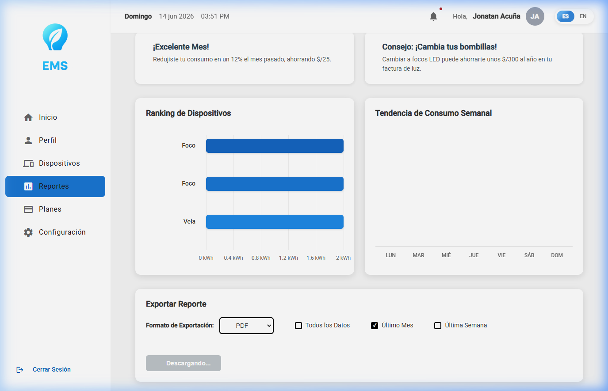

* **Recomendación:** Corregir el manejador de descarga en el frontend. Asegurar que al completarse la petición de descarga (o en caso de que ocurra una falla/timeout de la API), el estado local se restablezca a falso (`downloading = false`), habilitando nuevamente el botón para que el usuario pueda intentar la descarga otra vez. Adicionalmente, implementar un indicador de progreso visual o una notificación toast de descarga exitosa.

---

#### PROBLEMA #2: Bug de truncamiento al escribir vocales con tildes en formularios

* **Severidad:** 3
* **Heurística violada:** Usabilidad - Prevención de errores (Nielsen #5)
* **Problema:** Al intentar redactar textos que lleven vocales con tilde en los campos de los formularios (por ejemplo, al crear categorías o ubicaciones como "Habitación"), el cuadro de texto sufre un bug de renderizado e interrumpe la entrada, borrando la palabra a partir del carácter acentuado. Esto limita la libertad de entrada del usuario y le obliga a escribir con errores ortográficos.

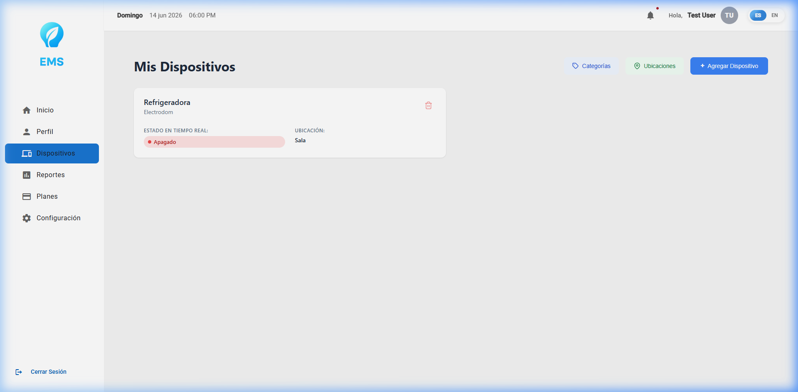

* **Recomendación:** Verificar el manejador de eventos del teclado (`keyup`, `keydown` o `input`) en los componentes de formulario en Angular. Asegurarse de que el regex o la máscara de validación de caracteres del backend y frontend admita la codificación UTF-8 para vocales acentuadas (`á`, `é`, `í`, `ó`, `ú`) y caracteres especiales en español (`ñ`, `Ñ`).

---

#### PROBLEMA #3: Indicador de notificaciones falsas activas (Campana)

* **Severidad:** 2
* **Heurística violada:** Usabilidad - Visibilidad del estado del sistema (Nielsen #1)
* **Problema:** El icono de la campana en la barra superior muestra un círculo rojo de notificación activa de forma permanente, pero al hacer clic, el modal indica "No tienes notificaciones". Esto frustra al usuario que busca limpiar sus alertas y genera una falsa sensación de urgencia o error.

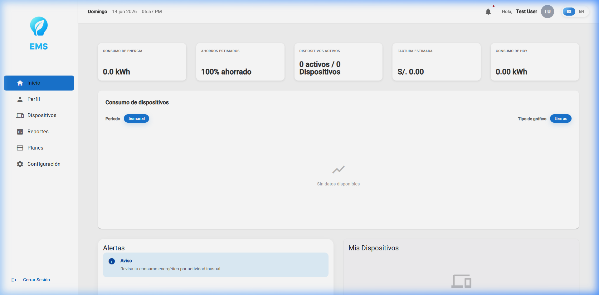

* **Recomendación:** Vincular de forma reactiva la visibilidad del círculo rojo (badge de notificación) al tamaño del array de notificaciones no leídas devuelto por la API. Si el número de notificaciones no leídas es `0`, el círculo rojo debe ocultarse automáticamente en la interfaz.

---

#### PROBLEMA #4: Falta de actualización visual del horario modificado en configuración

* **Severidad:** 2
* **Heurística violada:** Usabilidad - Visibilidad del estado del sistema (Nielsen #1) / Consistencia y estándares (Nielsen #4)
* **Problema:** Al modificar las horas de alertas en la pestaña de Configuración y presionar "Aceptar", el sistema muestra un mensaje emergente de éxito (toast) confirmando que el horario fue guardado. Sin embargo, la tarjeta informativa de la pantalla continúa mostrando el rango horario por defecto (`05:00 - 22:00`) en lugar de actualizarse con los datos recién ingresados, provocando una inconsistencia visual entre el mensaje y la pantalla.

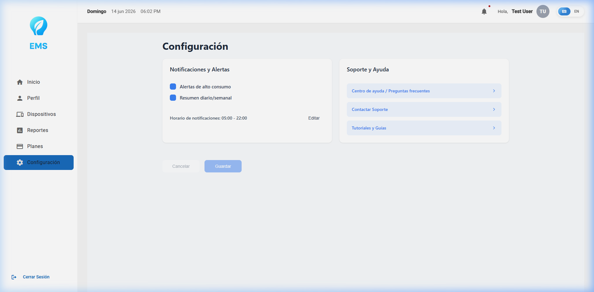

* **Recomendación:** En el componente de configuración (`settings`), al recibir la respuesta HTTP exitosa (200 OK) del backend, se debe actualizar el estado del modelo local que alimenta la visualización de la tarjeta con los nuevos valores ingresados en el formulario en lugar de conservar los valores iniciales.

## 6.4. Auditoría de Experiencias de Usuario.

### 6.4.1. Auditoría realizada.

#### 6.4.1.1. Información del grupo auditado.
**Aplicación para evaluar:** GeoPS 

#### 6.4.1.2. Contenido de auditoría realizada.

**Tareas a evaluar:**

El proceso de evaluación de usabilidad y funcionalidad se basó en el recorrido completo realizado por un usuario nuevo, abarcando las siguientes tareas principales:

* **Tarea 1: Activación de accesos principales:** Revisión de la respuesta y destino de los botones de conversión en la página de presentación.
* **Tarea 2: Accesibilidad en formularios de registro e ingreso:** Evaluación de la lectura de pantalla en las casillas de inicio de sesión y creación de cuentas.
* **Tarea 3: Consulta de enlaces legales e informativos:** Revisión de los accesos a los términos de servicio y políticas en el pie de página.
* **Tarea 4: Configuración inicial del idioma:** Validación de la consistencia del lenguaje al cargar la página por primera vez.
* **Tarea 5: Uso de filtros para organizar ofertas:** Operación con teclado y mouse de los menús desplegables de búsqueda de beneficios.
* **Tarea 6: Gestión de alertas y mensajes del sistema:** Revisión de las traducciones en los avisos de error dentro de la aplicación.
* **Tarea 7: Navegación por las secciones informativas:** Verificación de la claridad y destinos de las opciones del menú inferior.

No están incluidas en esta versión de la evaluación las siguientes tareas:
* Procesamiento de pagos o pasarela de pago (no se identificó implementación en el código evaluado).
* Notificaciones push en tiempo real (mencionadas en el copy del Landing Page, pero sin evidencia de implementación en geops-web/geops-api).
* Aplicación móvil nativa (fuera de alcance: solo se auditaron geops-web y geops-landing).
* Un backoffice/panel administrativo distinto al rol "Owner" (no se identificó una interfaz de administración separada en las rutas o componentes revisados).

 

**ESCALA DE SEVERIDAD:**

*Los errores de usabilidad identificados fueron puntuados tomando en cuenta la escala de severidad de Jakob Nielsen:*

| Nivel | Descripción |
| :---: | :--- |
| **1** | **Problema superficial:** Problema superficial: puede ser fácilmente superado por el usuario o ocurre con muy poca frecuencia. No necesita ser arreglado a no ser que exista disponibilidad de tiempo. |
| **2** | **Problema menor:** Problema menor: puede ocurrir un poco más frecuentemente o es un poco más difícil de superar para el usuario. Se le debería asignar una prioridad baja resolverlo de cara al siguiente release. |
| **3** | **Problema mayor:** Problema mayor: ocurre frecuentemente o los usuarios no son capaces de resolverlo. Es importante que sea corregido y se le debe asignar una prioridad alta. |
| **4** | **Problema muy grave:** Problema muy grave: un error de gran impacto que impide al usuario continuar con el uso de la herramienta. Es imperativo que sea corregido antes del lanzamiento. |

 

**TABLA RESUMEN:**

| # | Problema / Hallazgo Detectado | Escala de severidad | Heurística / Principio Violado |
| :---: | :--- | :---: | :--- |
| 1 | Los botones principales de la página de inicio no reaccionan al hacerles clic ni dirigen a ninguna parte. | 4 | Usabilidad: Visibilidad del estado del sistema / Control y libertad del usuario |
| 2 | Los textos que nombran los campos de ingreso y registro no están vinculados formalmente a sus casillas, lo que bloquea las herramientas de lectura de pantalla. | 4 | Diseño Inclusivo: Ofrecer una experiencia equivalente para todos |
| 3 | Los accesos en el pie de página hacia los términos legales e informativos están inactivos, y el manual legal existente no se encuentra conectado. | 4 | Arquitectura de Información: Facilidad de búsqueda / Credibilidad del sitio |
| 4 | La página de inicio arranca por defecto en inglés a pesar de estar configurada internamente en español, lo que genera una mezcla confusa de idiomas. | 3 | Usabilidad: Conexión entre el sistema y el mundo real / Consistencia |
| 5 | Los menús desplegables para filtrar ofertas no responden a la navegación con el teclado, obligando al uso exclusivo del mouse. | 3 | Diseño Inclusivo: Dar control al usuario (falta de accesibilidad por teclado) |
| 6 | Las alertas de error al escribir mal los datos en el formulario se muestran siempre en español, ignorando si el usuario cambió el idioma del sitio a inglés. | 3 | Usabilidad: Consistencia / Ayuda para reconocer y recuperarse de errores |
| 7 | Tres opciones diferentes en el menú del pie de página dirigen exactamente a la misma sección informativa, duplicando el contenido de forma confusa. | 2 | Tres opciones diferentes en el menú del pie de página dirigen exactamente a la misma sección informativa, duplicando el contenido de forma confusa. |

 

### Heurísticas y Recomendaciones:

#### PROBLEMA #1: CTAs primarios del Landing Page son enlaces muertos

* **Severidad:** 4
* **Heurística violada:** Usability: Visibilidad del estado del sistema / Control y libertad del usuario
* **Problema:** Comprobamos que los accesos principales de la página de presentación ("Iniciar sesión", "Crear cuenta gratis", "Explorar ahora" y "Registrar mi negocio") están desactivados. Al interactuar con ellos, la pantalla se desliza hacia arriba, dando la falsa impresión de que ocurrió un cambio, pero el visitante se queda en el mismo sitio. Consideramos que este es el error más crítico de la plataforma, ya que detiene el principal objetivo comercial: lograr que las personas y las empresas se registren.

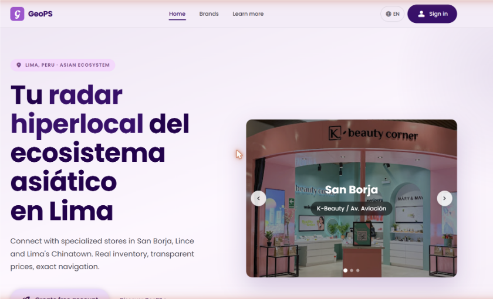

* **Recomendación:** Conectar de inmediato estos botones con los formularios reales de ingreso y registro de la aplicación web. Si estos accesos aún no están listos, sugerimos colocar una etiqueta visual de "Próximamente" para no frustrar las expectativas del público.

---

#### PROBLEMA #2: Labels no asociados a los inputs en Login y Registro

* **Severidad:** 4
* **Heurística violada:** Inclusive Design: Proporciona una experiencia comparable
* **Problema:** Descripción: Identificamos que en las pantallas de acceso y creación de cuentas, las etiquetas de texto que indican qué información ingresar (como "Correo" o "Contraseña") no tienen un vínculo técnico con sus respectivas casillas de respuesta. Para un usuario que depende de lectores de pantalla por temas de accesibilidad visual, el sistema anuncia los espacios vacíos sin explicar qué dato se debe colocar ahí. Esto detiene por completo el proceso de registro para este perfil de usuarios.

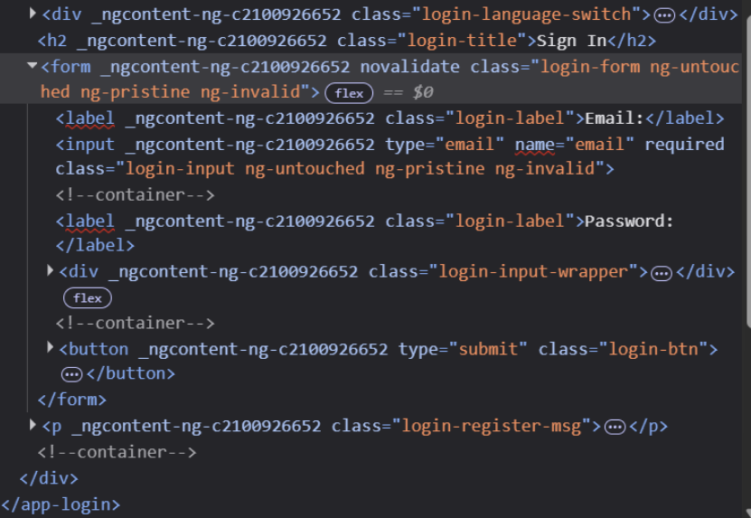

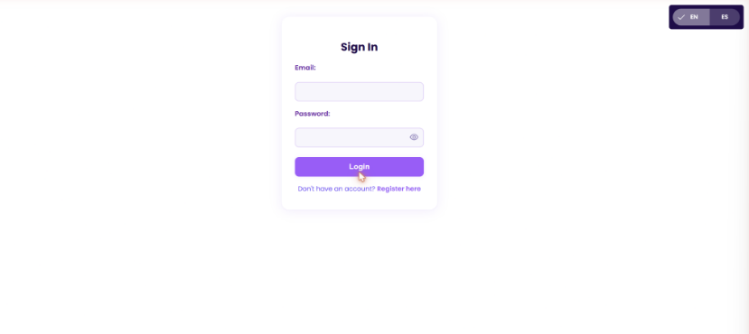

* **Recomendación:** Enlazar formalmente cada título con su casilla correspondiente. Notamos que los formularios del módulo de campañas sí tienen este problema resuelto, por lo que sugerimos replicar ese mismo diseño accesible en estas pantallas críticas.

---

#### PROBLEMA #3: Enlaces legales del footer muertos; el PDF de Términos y Condiciones nunca se referencia

* **Severidad:** 4
* **Heurística violada:** Information Architecture: Is it findable? / Is it credible?

* **Problema:** Los enlaces finales dirigidos a revisar los "Términos y Condiciones", las "Políticas de Privacidad" y las "Cookies" no realizan ninguna acción al hacerles clic. Aunque detectamos que el documento con los términos legales está guardado en el servidor del proyecto, no hay ninguna ruta visible que permita al usuario leerlo antes de registrarse. Esto afecta la confianza de los visitantes y expone a la plataforma a problemas de cumplimiento normativo.

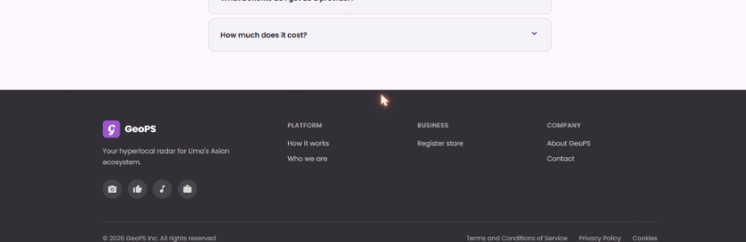

* **Recomendación:** Vincular el texto del pie de página directamente al documento en formato digital guardado y redactar versiones iniciales para las políticas de privacidad pendientes antes de abrir la plataforma al público general.

---

#### PROBLEMA #4: El Landing Page arranca siempre en inglés pese a declarar español

* **Severidad:** 3
* **Heurística violada:** Usability: Coincidencia entre el sistema y el mundo real / Consistencia y estándares
* **Problema:** El diseño base de la aplicación indica que el idioma principal debe ser el español y la mayoría de los textos están redactados en este idioma. Sin embargo, al abrir el sitio web por primera vez, el sistema fuerza la carga de los menús e instrucciones en inglés. Lo confuso es que el título de cabecera principal se queda fijo en español, entregando una interfaz con una mezcla desordenada de ambos idiomas que daña la primera impresión del público objetivo local.

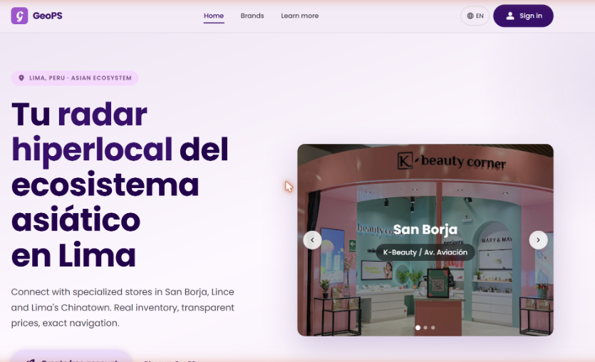

* **Recomendación:** Ajustar el arranque de la plataforma para que detecte de forma automática el idioma del navegador del usuario o respete el español configurado en la base. Asimismo, asegurar que los títulos principales se traduzcan correctamente en sincronía con el resto de la página.

---

#### PROBLEMA #5: Filtros de Ofertas construidos con div sin soporte de teclado

* **Severidad:** 3
* **Heurística violada:** Inclusive Design: Da control al usuario (falta de navegación por teclado)

* **Problema:** Al revisar la pantalla donde los clientes buscan ofertas por categoría, orden o ubicación, notamos que estos menús desplegables fueron creados de manera personalizada y solo responden a los clics del mouse. Si una persona intenta navegar por ellos utilizando únicamente las teclas de dirección o el tabulador, los filtros se saltan por completo y no se pueden abrir.

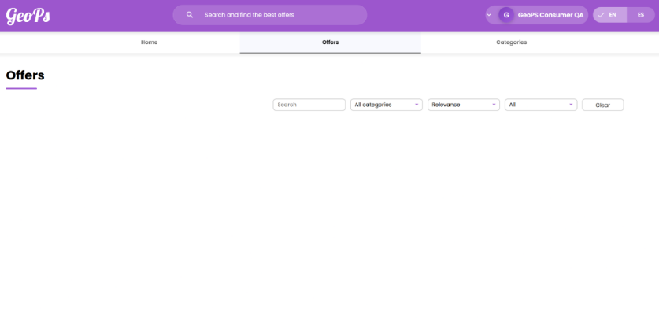

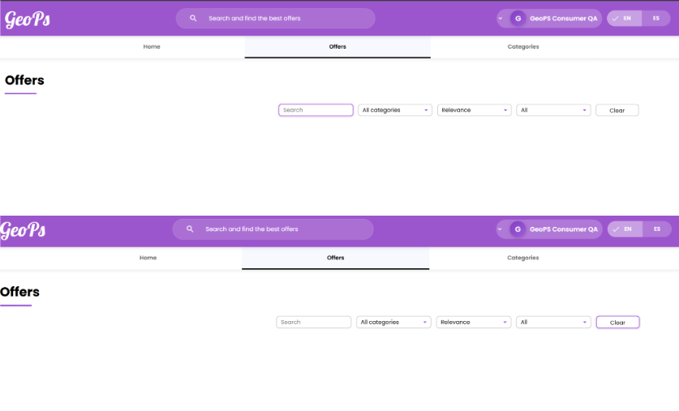

* **Recomendación:** Modificar estos controles para usar menús de selección estándar que ya heredan la accesibilidad nativa del sistema, o añadirles soporte para que respondan correctamente a las teclas de espacio, ingreso y escape.

---

#### PROBLEMA #6: Mensajes de error hardcodeados en español pese al selector de idioma

* **Severidad:** 3
* **Heurística violada:** Usability: Consistencia y estándares / Ayuda a reconocer, diagnosticar y recuperarse de errores
* **Problema:** La plataforma cuenta con un selector funcional para cambiar entre español e inglés. Sin embargo, si un usuario configura el sitio en inglés y comete un error al llenar sus datos (como escribir una dirección de correo inválida), el aviso de advertencia aparece de golpe en español. Esta falta de consistencia confunde al usuario en el momento exacto en el que requiere instrucciones claras para corregir sus datos.

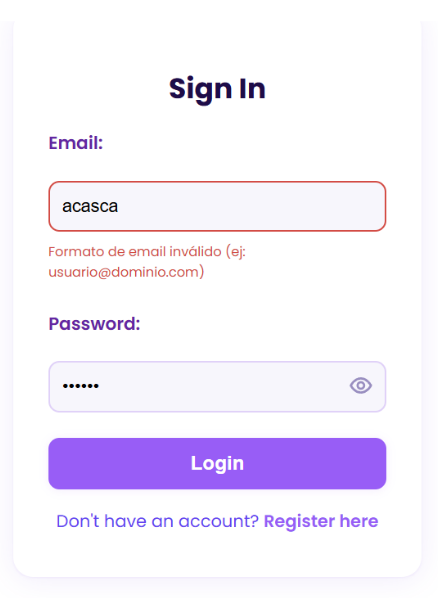

* **Recomendación:** Integrar estos avisos informativos y de validación al sistema general de traducción de la plataforma, asegurando que cambien de idioma al mismo tiempo que el resto de las etiquetas de texto.

---

#### PROBLEMA #7: Tres enlaces del footer con etiquetas distintas apuntan al mismo destino

* **Severidad:** 2
* **Heurística violada:** Information Architecture: Is it clear? / Is it controllable?
* **Problema:** En la parte inferior de la página de inicio, las opciones tituladas "Cómo funciona", "Quiénes somos" y "Sobre GeoPS" se muestran por separado dando a entender que contienen temas distintos. No obstante, los tres accesos llevan exactamente al mismo bloque de contenido enfocado solo en el funcionamiento de la herramienta. El usuario que busca datos sobre el equipo de trabajo o la historia de la empresa se queda sin respuesta.

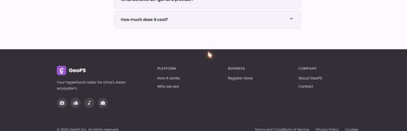

* **Recomendación:** Si la información corporativa aún no ha sido redactada, sugerimos retirar temporalmente los enlaces redundantes ("Quiénes somos" y "Sobre GeoPS") y conservar únicamente el acceso directo a la explicación operativa hasta que el contenido correspondiente esté listo.

---

