# Capítulo VI: Product Verification & Validation

## 6.1. Testing Suites & Validation

En esta sección se detalla la estrategia integral de pruebas diseñada para garantizar la calidad y fiabilidad del software. Este proceso abarca la validación aislada de las reglas de negocio a través de las pruebas unitarias, la correcta interacción entre los componentes y servicios mediante pruebas de integración, la alineación del desarrollo con los requerimientos del usuario utilizando Behavior-Driven Development, y la ejecución de flujos completos desde la perspectiva del cliente a través de las pruebas de sistema.

### 6.1.1. Core Entities Unit Tests.

Los Core Entities Unit Tests permiten validar el correcto funcionamiento de las entidades principales del sistema de manera aislada, asegurando que las reglas de negocio, validaciones y comportamientos esenciales se ejecuten correctamente. Estas pruebas son fundamentales para detectar errores tempranamente, mejorar la estabilidad del proyecto y facilitar el mantenimiento del software durante el desarrollo.

**User Profile Test**

**Dashboard Test**

**Device Test**

### 6.1.2. Core Integration Tests.

Los Controller Tests y Core Integration Tests son fundamentales para verificar el correcto funcionamiento de los endpoints y la interacción entre los distintos componentes del sistema, como servicios y bases de datos. Estas pruebas permiten validar respuestas, manejo de errores y códigos de estado, contribuyendo a desarrollar un software más estable, confiable y de calidad.

**Authentication Controller Test**

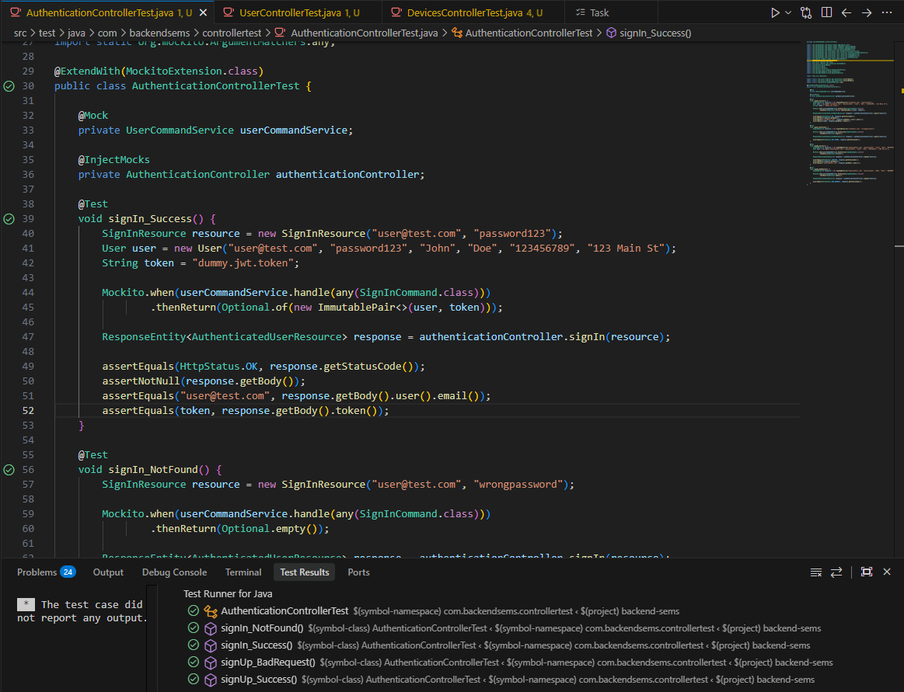

**User Controller Test**

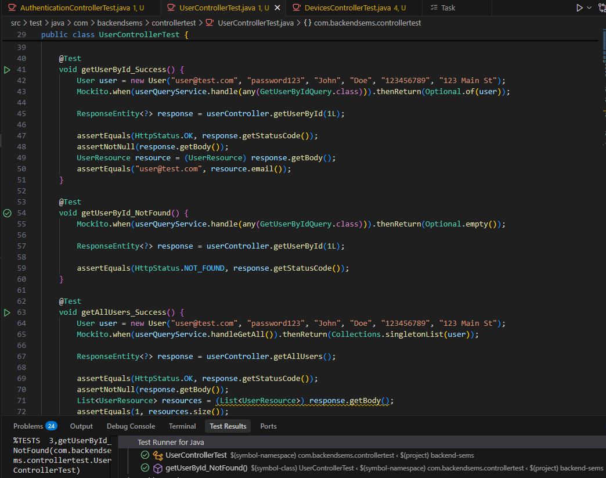

**Devices Controller Test**

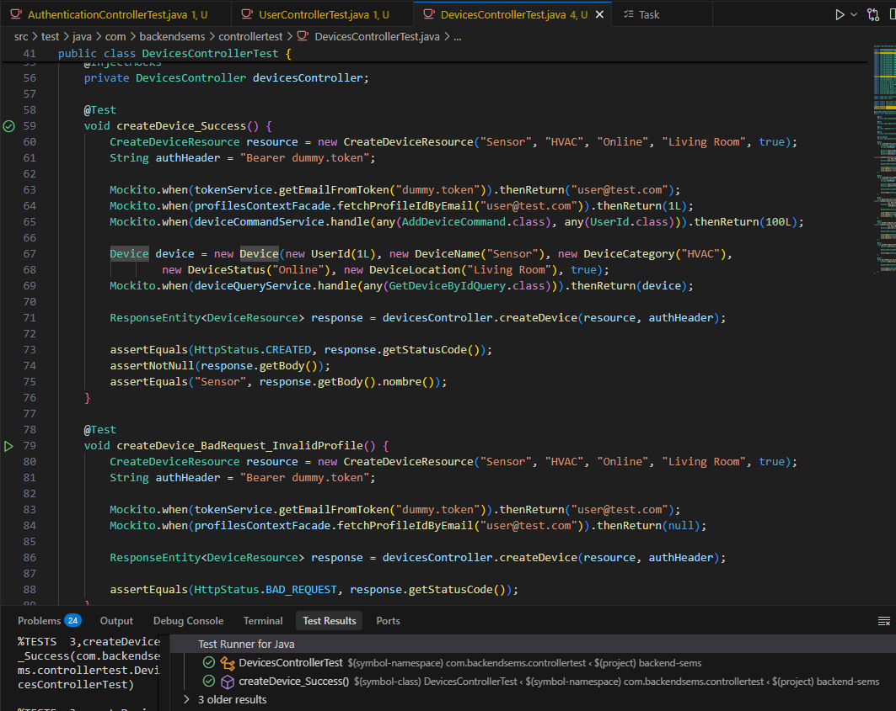

### 6.1.3. Core Behavior-Driven Development

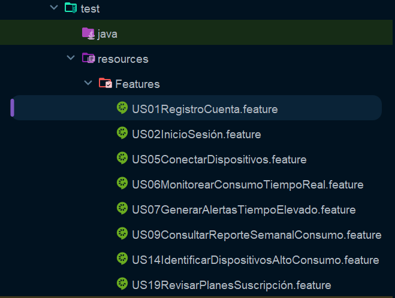

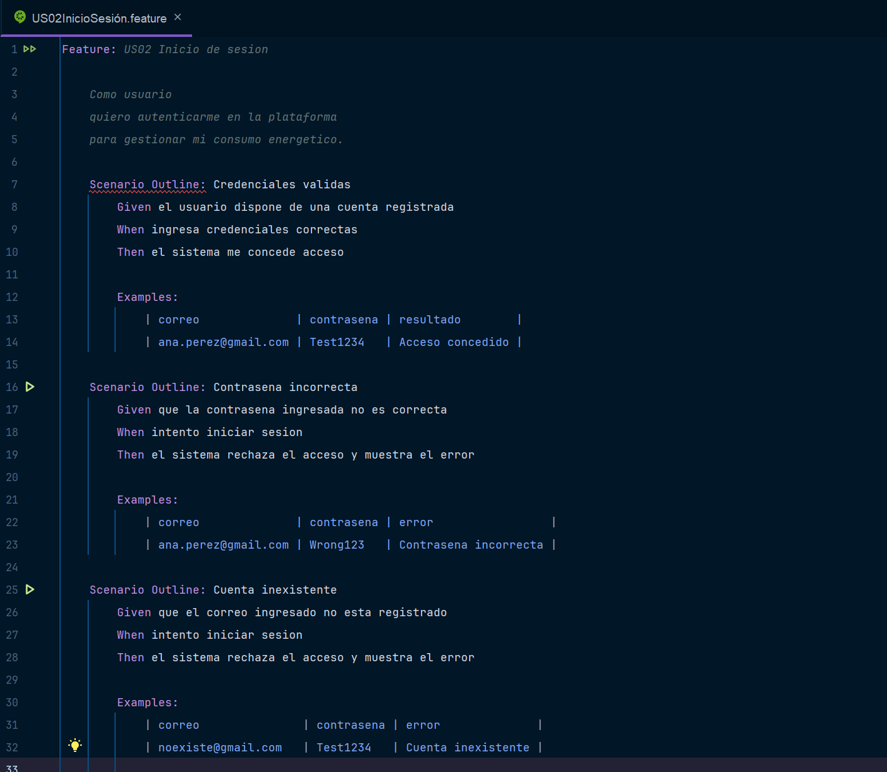

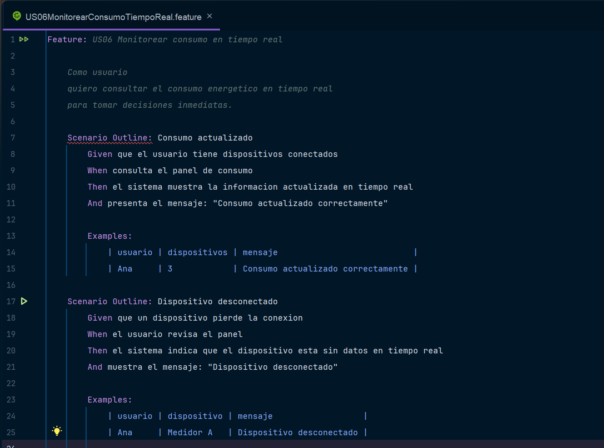

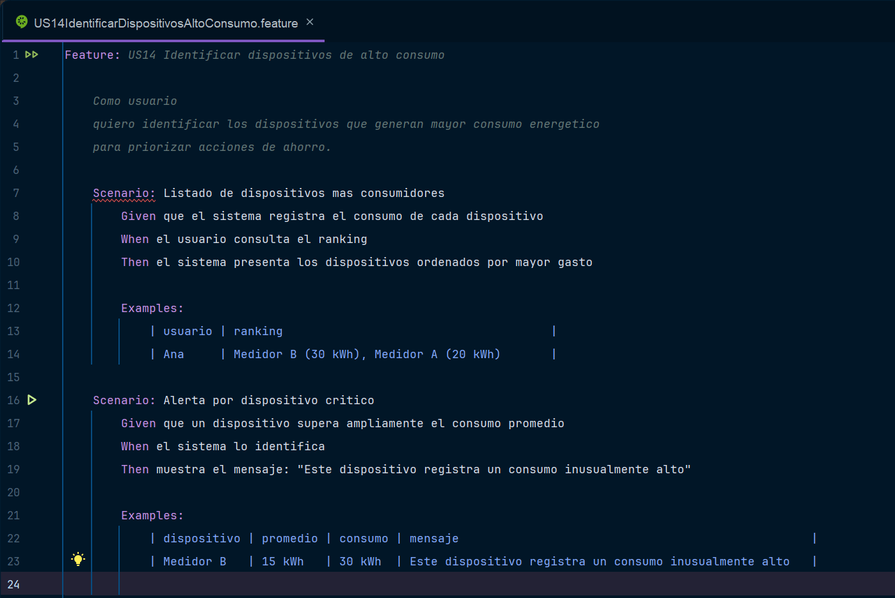

### 6.1.4. Core System Tests.

<table border="1px">
    <tbody>
        <tr>
            <td style="font-weight: bold;">US01</td>
            <td style="font-weight: bold;">Registro de cuenta</td>
            <td style="font-weight: bold;">Como usuario, quiero registrarme en la plataforma para acceder a todas las funcionalidades.</td>
        </tr>
    </tbody>
</table>

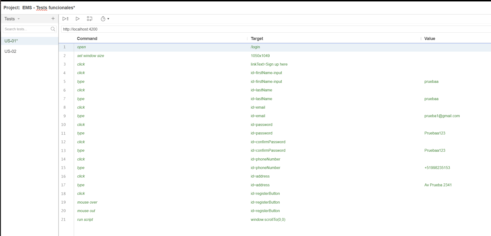

<table border="1px">
    <tbody>
        <tr>
            <td style="font-weight: bold;">US02</td>
            <td style="font-weight: bold;">Inicio de sesión</td>
            <td style="font-weight: bold;">Como usuario, quiero autenticarme en la plataforma para gestionar mi consumo energético.</td>
        </tr>
    </tbody>
</table>

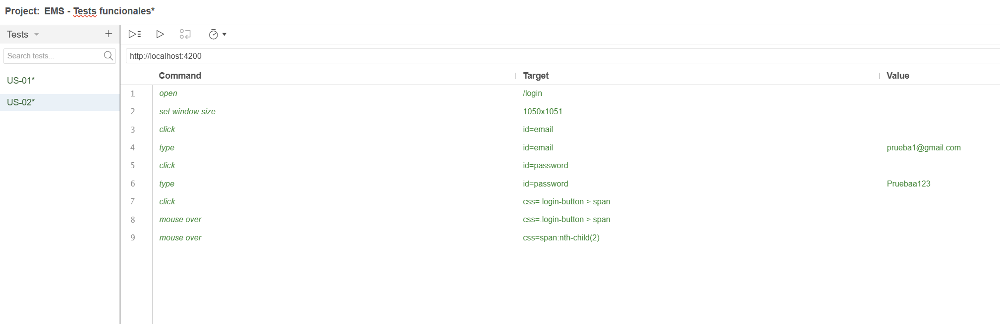

<table border="1px">
    <tbody>
        <tr>
            <td style="font-weight: bold;">US03</td>
            <td style="font-weight: bold;">Configuración de perfil inicial</td>
            <td style="font-weight: bold;">Como usuario, quiero registrar el tipo de vivienda y dispositivos básicos para personalizar mi experiencia.</td>
        </tr>
    </tbody>
</table>

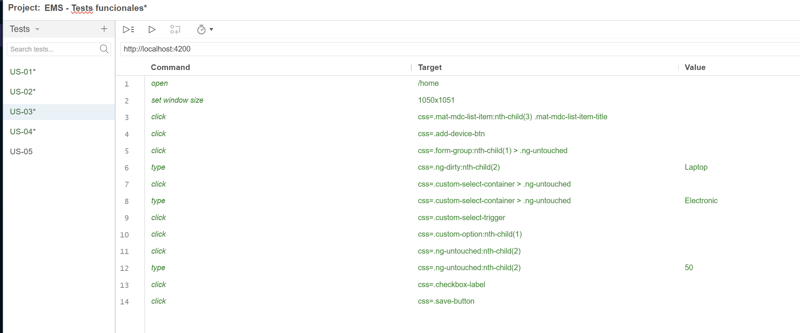

<table border="1px">
    <tbody>
        <tr>
            <td style="font-weight: bold;">US04</td>
            <td style="font-weight: bold;">Cerrar sesión de manera segura</td>
            <td style="font-weight: bold;">Como usuario, quiero cerrar mi sesión de forma segura para proteger mi información.</td>
        </tr>
    </tbody>
</table>

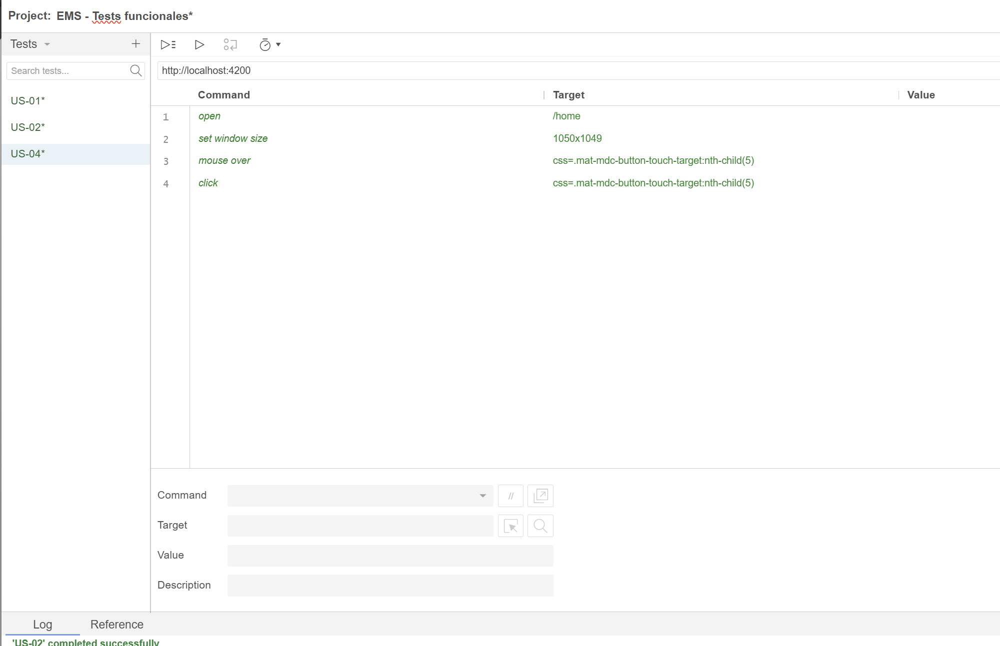

<table border="1px">
    <tbody>
        <tr>
            <td style="font-weight: bold;">US05</td>
            <td style="font-weight: bold;">Conectar dispositivos</td>
            <td style="font-weight: bold;">Como usuario, quiero vincular mis dispositivos eléctricos al sistema para supervisar su consumo.</td>
        </tr>
    </tbody>
</table>

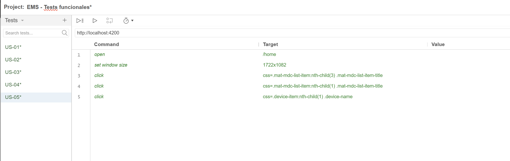

<table border="1px">
    <tbody>
        <tr>
            <td style="font-weight: bold;">US06</td>
            <td style="font-weight: bold;">Monitorear consumo en tiempo real</td>
            <td style="font-weight: bold;">Como usuario, quiero consultar el consumo energético en tiempo real para tomar decisiones inmediatas.</td>
        </tr>
    </tbody>
</table>

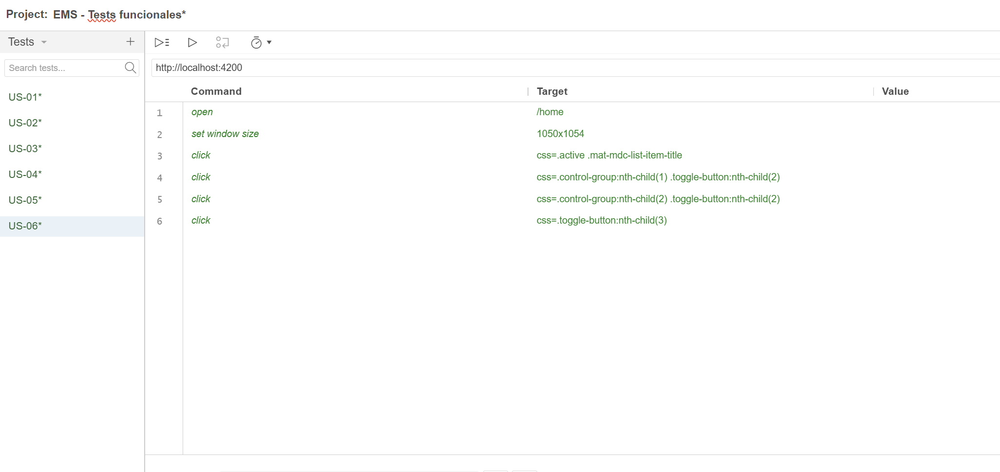

<table border="1px">
    <tbody>
        <tr>
            <td style="font-weight: bold;">US07</td>
            <td style="font-weight: bold;">Generar alertas de consumo elevado</td>
            <td style="font-weight: bold;">Como usuario, quiero recibir alertas automáticas cuando un dispositivo supere el consumo establecido como normal.</td>
        </tr>
    </tbody>
</table>

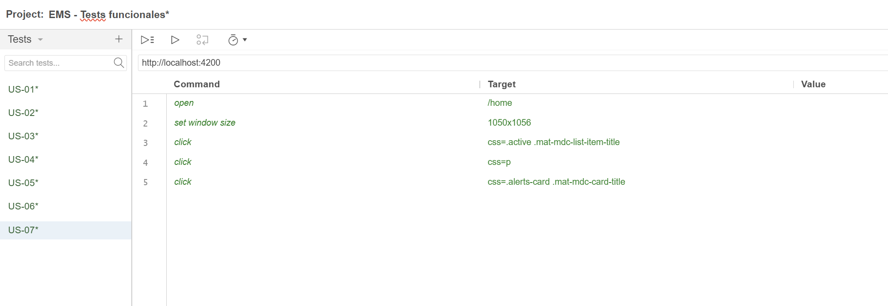

<table border="1px">
    <tbody>
        <tr>
            <td style="font-weight: bold;">US08</td>
            <td style="font-weight: bold;">Configurar umbrales de alerta personalizados</td>
            <td style="font-weight: bold;">Como usuario, quiero establecer mis propios límites de consumo para recibir notificaciones adaptadas a mis necesidades.</td>
        </tr>
    </tbody>
</table>

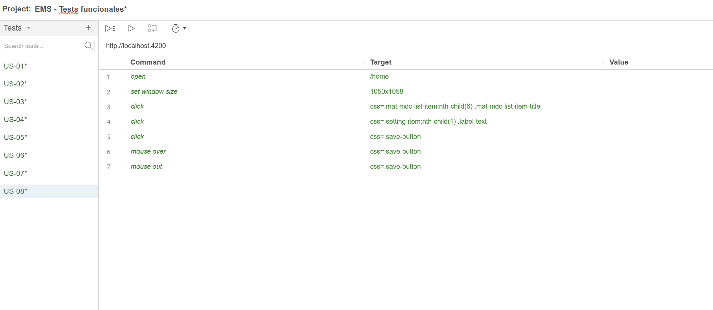

<table border="1px">
    <tbody>
        <tr>
            <td style="font-weight: bold;">US09</td>
            <td style="font-weight: bold;">Consultar reporte semanal de consumo</td>
            <td style="font-weight: bold;">Como usuario, quiero revisar reportes semanales para conocer mi gasto energético desglosado por dispositivo.</td>
        </tr>
    </tbody>
</table>

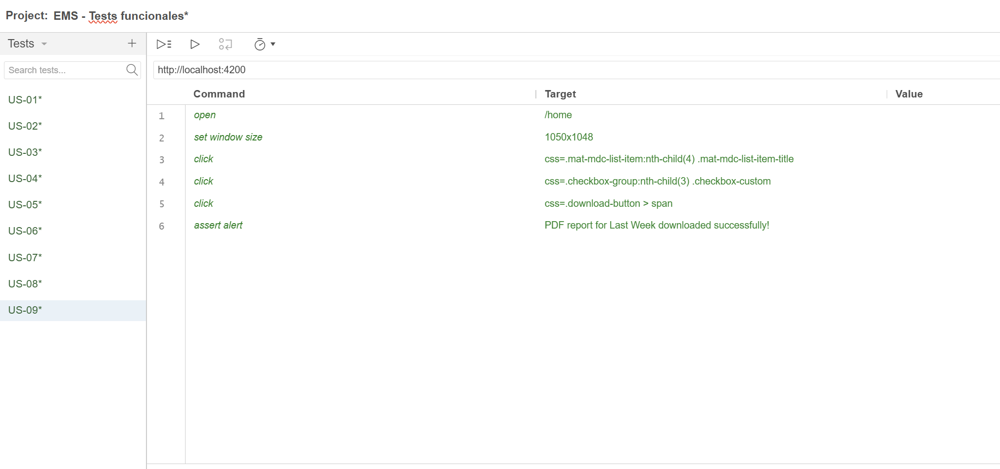

<table border="1px">
    <tbody>
        <tr>
            <td style="font-weight: bold;">US10</td>
            <td style="font-weight: bold;">Comparar consumo entre periodos</td>
            <td style="font-weight: bold;">Como usuario, quiero comparar mi consumo en semanas o meses distintos para identificar patrones de gasto.</td>
        </tr>
    </tbody>
</table>

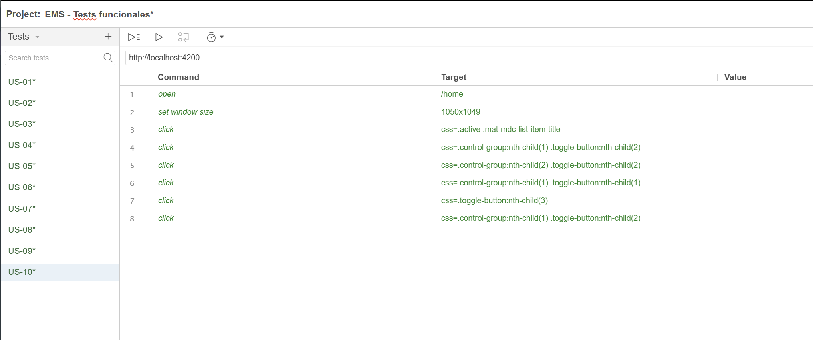

<table border="1px">
    <tbody>
        <tr>
            <td style="font-weight: bold;">US11</td>
            <td style="font-weight: bold;">Proyección de factura mensual</td>
            <td style="font-weight: bold;">Como usuario, quiero recibir una estimación de mi próxima factura de electricidad con base en mi consumo actual.</td>
        </tr>
    </tbody>
</table>

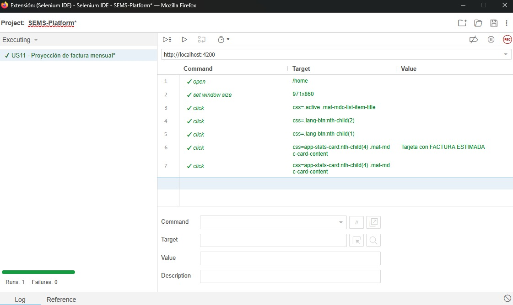

<table border="1px">
    <tbody>
        <tr>
            <td style="font-weight: bold;">US12</td>
            <td style="font-weight: bold;">Consultar historial de consumo mensual</td>
            <td style="font-weight: bold;">Como usuario, quiero consultar un historial de mi consumo mensual para identificar cambios en mi gasto energético.</td>
        </tr>
    </tbody>
</table>

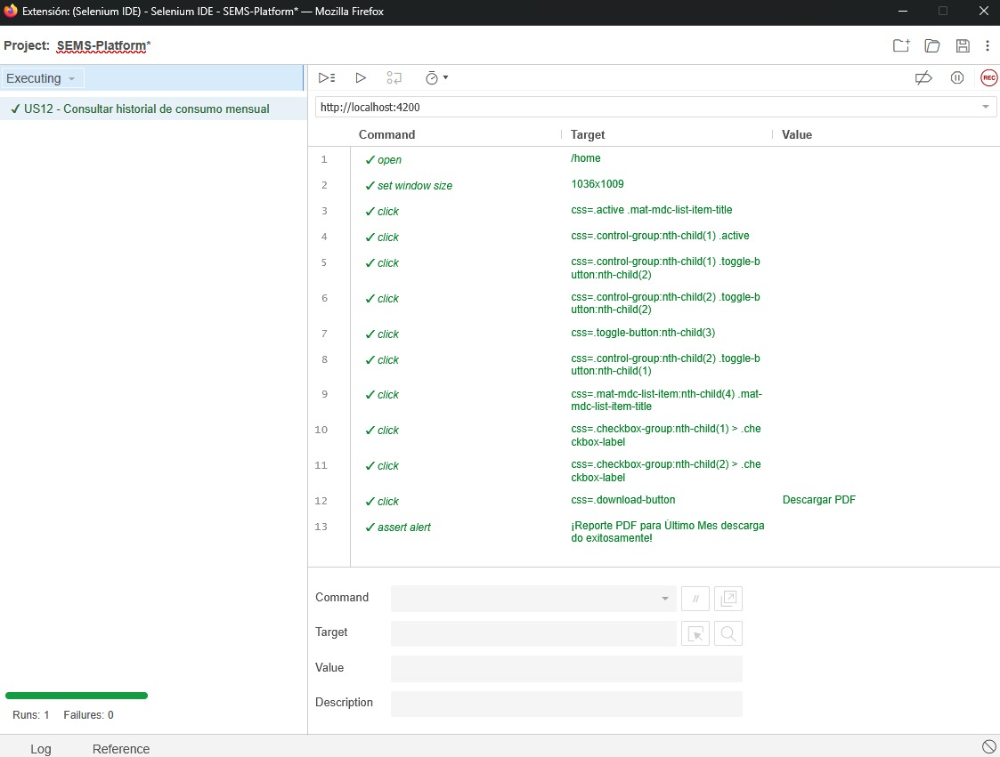

<table border="1px">
    <tbody>
        <tr>
            <td style="font-weight: bold;">US13</td>
            <td style="font-weight: bold;">Consultar centro de ayuda</td>
            <td style="font-weight: bold;">Como usuario, quiero acceder a un centro de ayuda con información y guías para resolver dudas comunes.</td>
        </tr>
    </tbody>
</table>

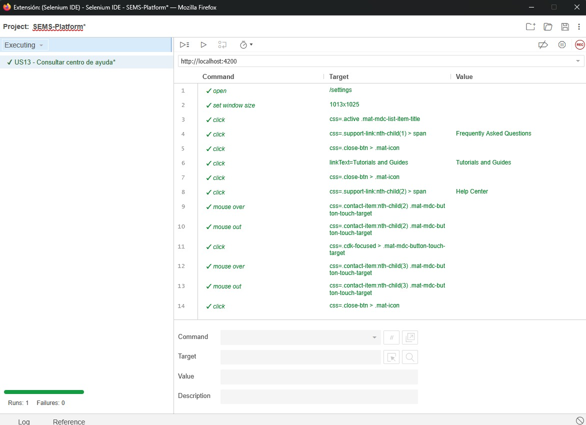

<table border="1px">
    <tbody>
        <tr>
            <td style="font-weight: bold;">US14</td>
            <td style="font-weight: bold;">Identificar dispositivos de alto consumo</td>
            <td style="font-weight: bold;">Como usuario, quiero identificar los dispositivos que generan mayor consumo energético para priorizar acciones de ahorro.</td>
        </tr>
    </tbody>
</table>

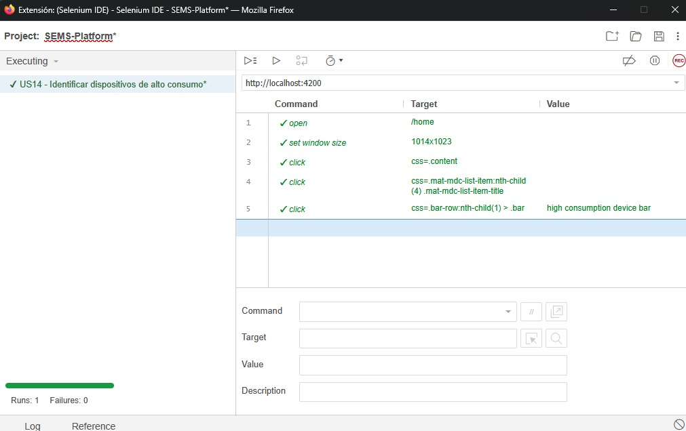

<table border="1px">
    <tbody>
        <tr>
            <td style="font-weight: bold;">US15</td>
            <td style="font-weight: bold;">Cambiar idioma de la plataforma</td>
            <td style="font-weight: bold;">Como usuario, quiero cambiar el idioma de la plataforma para comprender mejor la información según mi preferencia.</td>
        </tr>
    </tbody>
</table>

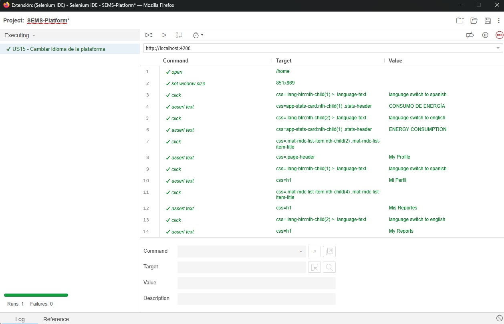

<table border="1px">
    <tbody>
        <tr>
            <td style="font-weight: bold;">US16</td>
            <td style="font-weight: bold;">Consultar noticias y consejos de ahorro energético</td>
            <td style="font-weight: bold;">Como usuario, quiero acceder a una sección con noticias y consejos para mantenerme informado y reducir mi consumo.</td>
        </tr>
    </tbody>
</table>

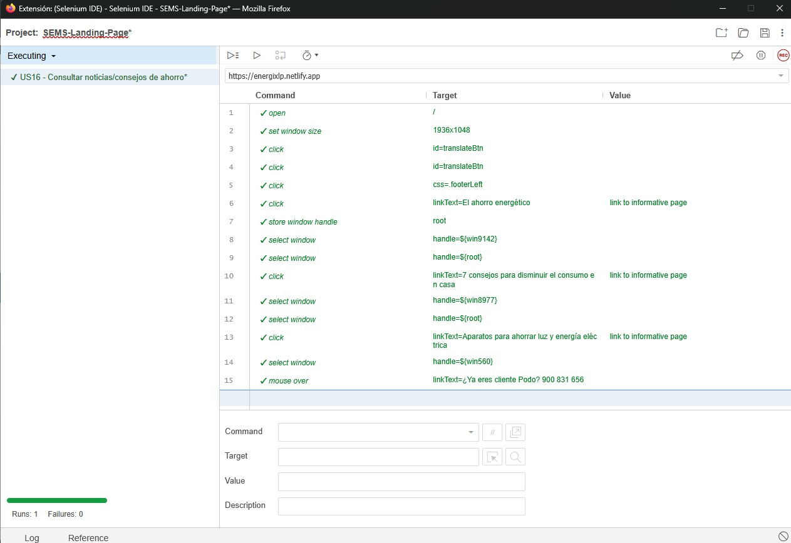

<table border="1px">
    <tbody>
        <tr>
            <td style="font-weight: bold;">US17</td>
            <td style="font-weight: bold;">Consultar la propuesta de valor</td>
            <td style="font-weight: bold;">Como visitante, quiero visualizar claramente la propuesta de valor de la plataforma para entender sus beneficios.</td>
        </tr>
    </tbody>
</table>

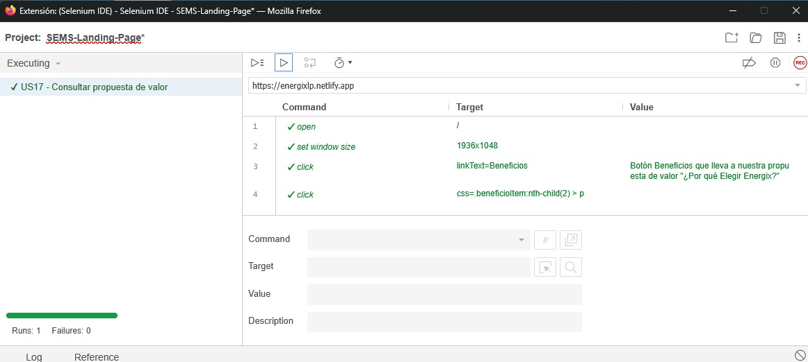

<table border="1px">
    <tbody>
        <tr>
            <td style="font-weight: bold;">US18</td>
            <td style="font-weight: bold;">Acceder a preguntas frecuentes (FAQ)</td>
            <td style="font-weight: bold;">Como visitante, quiero acceder a una sección de preguntas frecuentes para resolver mis dudas sin necesidad de reporte.</td>
        </tr>
    </tbody>
</table>

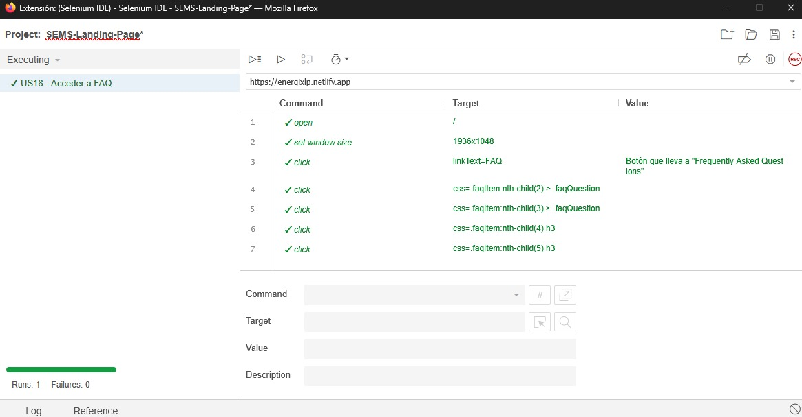

<table border="1px">
    <tbody>
        <tr>
            <td style="font-weight: bold;">US19</td>
            <td style="font-weight: bold;">Revisar planes de suscripción</td>
            <td style="font-weight: bold;">Como visitante, quiero revisar los planes de suscripción para comparar precios y beneficios antes de decidir.</td>
        </tr>
    </tbody>
</table>

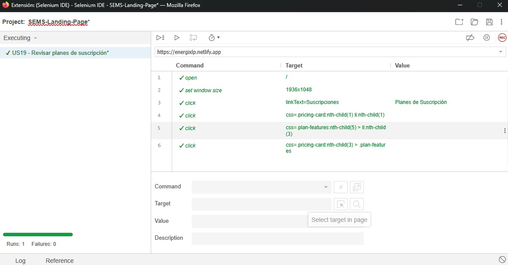

<table border="1px">
    <tbody>
        <tr>
            <td style="font-weight: bold;">US20</td>
            <td style="font-weight: bold;">Cambiar idioma</td>
            <td style="font-weight: bold;">Como visitante, quiero cambiar el idioma de la landing page entre español e inglés para entender mejor la información.</td>
        </tr>
    </tbody>
</table>

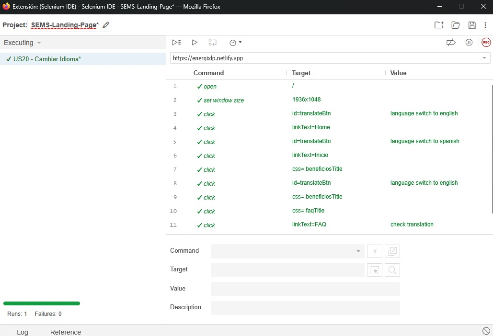

## 6.2. Static testing & Verification

En esta fase del proyecto **EnergixUPC**, se aplicaron técnicas de pruebas estáticas para asegurar la mantenibilidad, escalabilidad y seguridad del código fuente sin necesidad de ejecutar la aplicación. Esto nos permitió identificar y corregir defectos en etapas tempranas del ciclo de desarrollo.

### 6.2.1. Static Code Analysis

El análisis estático de código se realizó integrando herramientas automatizadas tanto en los entornos de desarrollo locales (IntelliJ IDEA y Visual Studio Code) como en el repositorio de GitHub.

#### 6.2.1.1. Coding standard & Code conventions

Para garantizar que el código escrito por todos los miembros del equipo mantenga un formato uniforme y sea fácil de leer, se establecieron y respetaron las siguientes convenciones de codificación según la tecnología:

* **Backend (Java / Spring Boot):**
    * Se siguieron las convenciones de codificación estándar de Java de Oracle y Google.
    * **Nomenclatura:** Se utilizó `PascalCase` para las clases e interfaces (ej. `DeviceConsumptionCalculationServiceImpl`), y `camelCase` para métodos y atributos (ej. `calculateConsumption`).
    * **Estructura:** Se respetó la arquitectura Hexagonal (Domain-Driven Design), separando estrictamente los paquetes en `domain`, `application`, `infrastructure` e `interfaces`.
    * **Herramientas:** Se empleó el formateador integrado de IntelliJ IDEA y SonarLint para validar el estilo en tiempo real.

* **Frontend (Angular / TypeScript):**
    * Se aplicó la guía de estilo oficial de Angular (Angular Style Guide).
    * **Nomenclatura:** Se utilizó `kebab-case` para los nombres de archivos y carpetas (ej. `device-list.component.ts`), `PascalCase` para las clases de los componentes y `camelCase` para variables y funciones.
    * **Herramientas:** Se configuró ESLint y Prettier a través de las extensiones de Visual Studio Code (detallado en `.vscode/extensions.json`) para un formateo automático al guardar los archivos.

> **Evidencia de Convenciones de Código:**
>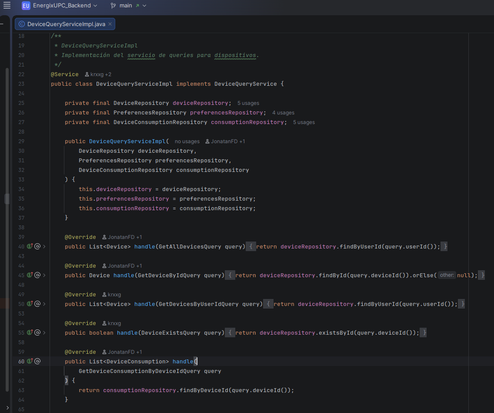
>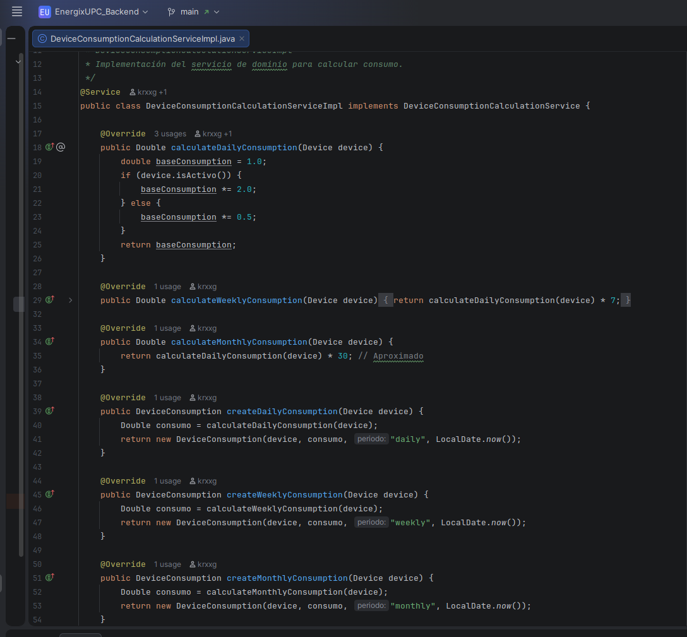
> 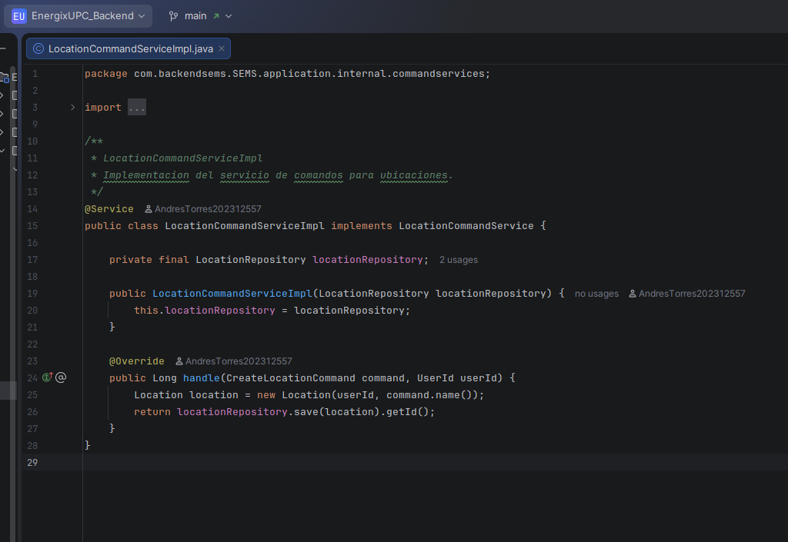
#### 6.2.1.2. Code Quality & Code Security

Para prevenir la acumulación de deuda técnica, "code smells" (malas prácticas) y vulnerabilidades de seguridad, el equipo implementó las siguientes estrategias:

* **Calidad de Código (Code Smells y Bugs Estáticos):** Se utilizó el motor de análisis estático para escanear los componentes del backend y frontend. Esto permitió detectar variables no utilizadas, dependencias circulares, y métodos con alta complejidad ciclomática. Además, la integración continua mediante GitHub Actions (definida en `.github/workflows/ci.yml` y `tests.yml`) asegura que el código pase un control mínimo antes de integrarse.
* **Seguridad y Dependencias (Vulnerabilidades):**
    Se habilitó **GitHub Dependabot** en el repositorio. Esta herramienta escaneó constantemente el archivo `pom.xml` (Backend) y `package.json` (Frontend) en busca de librerías de terceros desactualizadas o con vulnerabilidades públicas conocidas (CVEs), emitiendo alertas para su inmediata actualización.

> **Evidencia de Calidad y Seguridad:**
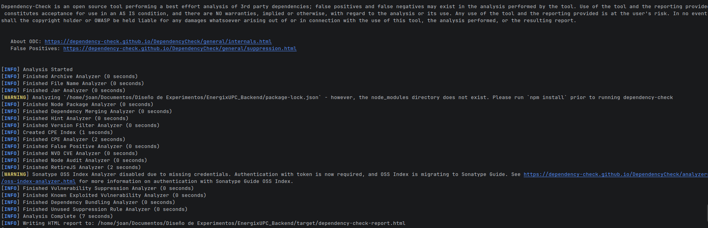
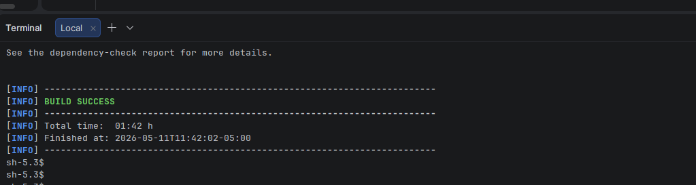

### 6.2.2. Reviews

El análisis estático no solo dependió de herramientas automatizadas, sino también de la revisión humana. Para ello, el equipo estableció un flujo de trabajo basado en **Peer Reviews (Revisiones de Pares)**.

**Proceso de Revisión (Pull Requests):**
1.  Ningún desarrollador tiene permitido hacer *commits* directamente a las ramas principales protegidas (`main` o `develop`).
2.  Todo el desarrollo de nuevas características o pruebas (como la rama `tests-2`) se realiza en ramas independientes.
3.  Al finalizar, se abre un **Pull Request (PR)** hacia la rama de integración (`develop`).
4.  Antes de realizar el *Merge*, el código debe ser revisado por al menos un compañero de equipo distinto al autor. El revisor comprueba la lógica de negocio, el cumplimiento de las convenciones y la correcta implementación de las pruebas (por ejemplo, validando los tests unitarios con JUnit y Mockito).
5.  Una vez aprobado y habiendo pasado los *workflows* de GitHub Actions, el código se integra.

Este proceso de revisión mitigó el riesgo de introducir errores de lógica que las herramientas automatizadas no pueden detectar, fomentando además la propiedad colectiva del código.

> **Evidencia de Revisión de Pares:**
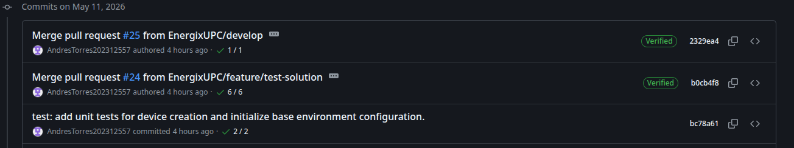
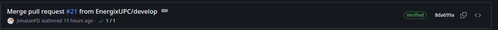
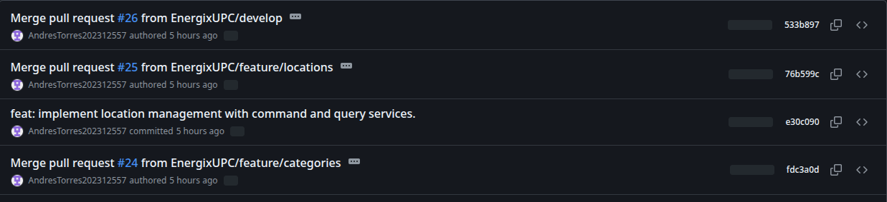
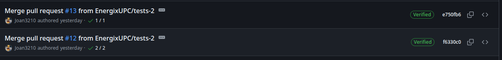
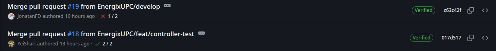

## 6.3. Validation Interviews

En esta sección se documenta el proceso de validación del prototipo de alta fidelidad y del Frontend implementado, recolectando retroalimentación cualitativa directamente de los usuarios finales (Segmento Objetivo).

### 6.3.1. Diseño de Entrevistas

Para estandarizar la recolección de datos, se diseñó una guía de entrevista semiestructurada enfocada en descubrir puntos de fricción dentro del sistema. 

* **Objetivo de la entrevista:** Validar la usabilidad de los flujos principales (Registro, Visualización del Dashboard de Consumo y Configuración de Preferencias de Dispositivos).
* **Perfil del entrevistado:** Personas responsables del pago de servicios básicos, jóvenes independizados (roommates) y padres de familia interesados en optimizar su consumo de energía eléctrica.
* **Formato:** Sesiones remotas y presenciales de 10-15 minutos utilizando la técnica de *Thinking Aloud* (Pensar en voz alta) mientras el usuario interactúa con la aplicación.

**Guía de Preguntas:**
1. Al ver la pantalla principal (Dashboard), ¿qué información es la primera que llama tu atención?
2. Por favor, intenta agregar un nuevo dispositivo (ej. "Laptop" o "Refrigeradora") a tu lista. ¿Te pareció intuitivo el proceso?
3. Revisa la sección de Reportes de Consumo. ¿Consideras que los gráficos son fáciles de interpretar para alguien que no es ingeniero?
4. ¿Encontraste alguna dificultad al intentar ver tus consumos pasados?
5. ¿Qué funcionalidad sientes que le falta a la plataforma para que la uses diariamente en tu hogar?

### 6.3.2. Registro de Entrevistas

A continuación, se presenta el resumen de las 4 sesiones de validación realizadas con el segmento objetivo.

| Entrevistado | Edad | Perfil | Fecha | Duración | Enlace a Grabación |
| :--- | :--- | :--- | :--- | :--- | :--- |
| Rocio Montesinos | 24 | Estudiante de Negocios Internacionales / Roommate | 14/05/2026 | 12 min | [Link de YouTube/Drive] |
| Carlos Mendoza | 35 | Padre de familia / Propietario de departamento | 12/05/2026 | 15 min | [Link de YouTube/Drive] |
| Luis Fernández | 28 | Trabajador Remoto / Inquilino | 13/05/2026 | 14 min | [Link de YouTube/Drive] |
| María Torres | 42 | Administradora de edificio residencial | 13/05/2026 | 18 min | [Link de YouTube/Drive] |

**Hallazgos Clave (Insights):**
* **Positivos:** Todos los usuarios destacaron la limpieza visual del Dashboard. El registro de dispositivos fue considerado rápido y sin fricciones técnicas. Los perfiles que comparten gastos (roommates) valoraron mucho poder ver qué dispositivo gasta más.
* **Oportunidades de Mejora:** Dos usuarios mencionaron que los gráficos de consumo "Semanal" y "Mensual" podrían confundirse si no se resalta más el filtro de fechas. Además, sugirieron incluir una opción para "dividir el recibo" entre las personas de la casa.

### 6.3.3. Evaluaciones según heurísticas

El sistema fue evaluado utilizando las **10 Heurísticas de Usabilidad de Jakob Nielsen**.

| Heurística de Nielsen | Evaluación en el Proyecto EnergixUPC | Estado |
| :--- | :--- | :--- |
| **1. Visibilidad del estado del sistema** | El sistema muestra *spinners* de carga visuales al cargar gráficos de consumo de la base de datos. | Cumple |
| **2. Relación entre el sistema y el mundo real** | Se usa terminología amigable (ej. "Ahorro", "Mis Dispositivos") en lugar de jerga técnica como "Kilovatios-hora". | Cumple  |
| **3. Control y libertad del usuario** | El usuario puede editar o eliminar dispositivos creados por error fácilmente mediante iconos de papelera. | Cumple  |
| **4. Consistencia y estándares** | Todo el sistema mantiene la misma tipografía y paleta de colores gracias a los componentes de Angular. | Cumple  |
| **5. Prevención de errores** | Los formularios tienen validación reactiva en tiempo real antes de permitir guardar un dispositivo. | Cumple  |

## 6.4. Auditoría de Experiencias de Usuario
### 6.4.1. Auditoría realizada.
#### 6.4.1.1. Información del grupo auditado.
#### 6.4.1.2. Cronograma de auditoría realizada.
#### 6.4.1.3. Contenido de auditoría realizada.
### 6.4.2. Auditoría recibida.
#### 6.4.2.1. Información del grupo auditor.
#### 6.4.2.2. Cronograma de auditoría recibida.
#### 6.4.2.3. Contenido de auditoría recibida.
#### 6.4.2.4. Resumen de modificaciones para subsanar hallazgos.
