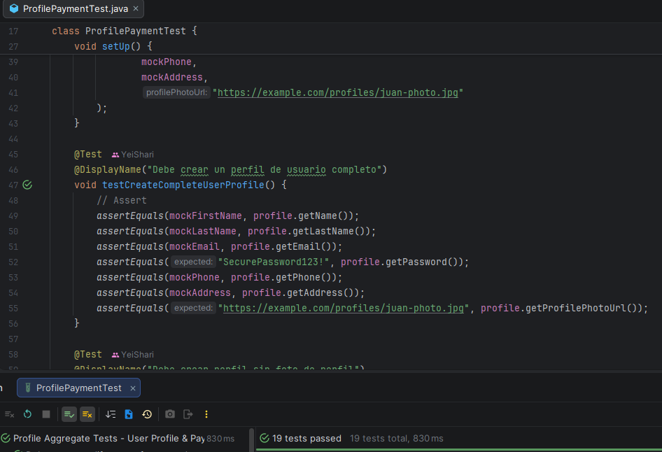
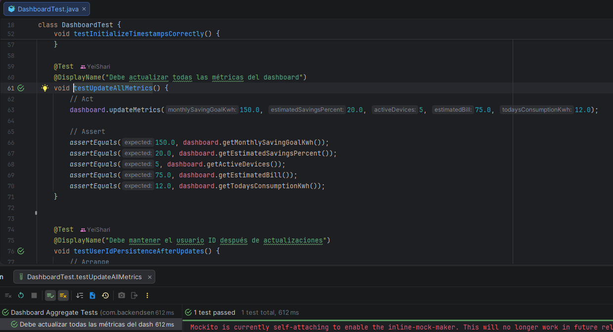
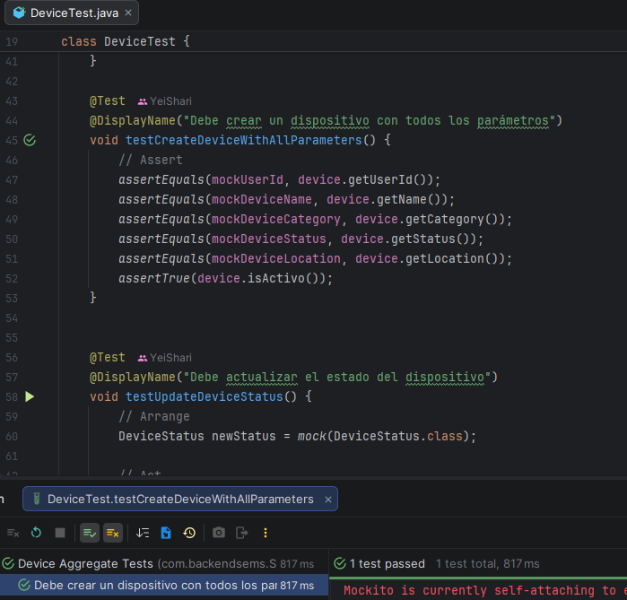

# Capítulo VI: Product Verification & Validation

## 6.1. Testing Suites & Validation
### 6.1.1. Core Entities Unit Tests.

Los Core Entities Unit Tests permiten validar el correcto funcionamiento de las entidades principales del sistema de manera aislada, asegurando que las reglas de negocio, validaciones y comportamientos esenciales se ejecuten correctamente. Estas pruebas son fundamentales para detectar errores tempranamente, mejorar la estabilidad del proyecto y facilitar el mantenimiento del software durante el desarrollo.

**User Profile Test**

**Dashboard Test**

**Device Test**

### 6.1.2. Core Integration Tests.
### 6.1.3. Core Behavior-Driven Development
### 6.1.4. Core System Tests.

<table border="1px">
    <tbody>
        <tr>
            <td style="font-weight: bold;">US01</td>
            <td style="font-weight: bold;">Registro de cuenta</td>
            <td style="font-weight: bold;">Como usuario, quiero registrarme en la plataforma para acceder a todas las funcionalidades.</td>
        </tr>
    </tbody>
</table>

<table border="1px">
    <tbody>
        <tr>
            <td style="font-weight: bold;">US02</td>
            <td style="font-weight: bold;">Inicio de sesión</td>
            <td style="font-weight: bold;">Como usuario, quiero autenticarme en la plataforma para gestionar mi consumo energético.</td>
        </tr>
    </tbody>
</table>

<table border="1px">
    <tbody>
        <tr>
            <td style="font-weight: bold;">US03</td>
            <td style="font-weight: bold;">Configuración de perfil inicial</td>
            <td style="font-weight: bold;">Como usuario, quiero registrar el tipo de vivienda y dispositivos básicos para personalizar mi experiencia.</td>
        </tr>
    </tbody>
</table>

<table border="1px">
    <tbody>
        <tr>
            <td style="font-weight: bold;">US04</td>
            <td style="font-weight: bold;">Cerrar sesión de manera segura</td>
            <td style="font-weight: bold;">Como usuario, quiero cerrar mi sesión de forma segura para proteger mi información.</td>
        </tr>
    </tbody>
</table>

<table border="1px">
    <tbody>
        <tr>
            <td style="font-weight: bold;">US05</td>
            <td style="font-weight: bold;">Conectar dispositivos</td>
            <td style="font-weight: bold;">Como usuario, quiero vincular mis dispositivos eléctricos al sistema para supervisar su consumo.</td>
        </tr>
    </tbody>
</table>

<table border="1px">
    <tbody>
        <tr>
            <td style="font-weight: bold;">US06</td>
            <td style="font-weight: bold;">Monitorear consumo en tiempo real</td>
            <td style="font-weight: bold;">Como usuario, quiero consultar el consumo energético en tiempo real para tomar decisiones inmediatas.</td>
        </tr>
    </tbody>
</table>

<table border="1px">
    <tbody>
        <tr>
            <td style="font-weight: bold;">US07</td>
            <td style="font-weight: bold;">Generar alertas de consumo elevado</td>
            <td style="font-weight: bold;">Como usuario, quiero recibir alertas automáticas cuando un dispositivo supere el consumo establecido como normal.</td>
        </tr>
    </tbody>
</table>

<table border="1px">
    <tbody>
        <tr>
            <td style="font-weight: bold;">US08</td>
            <td style="font-weight: bold;">Configurar umbrales de alerta personalizados</td>
            <td style="font-weight: bold;">Como usuario, quiero establecer mis propios límites de consumo para recibir notificaciones adaptadas a mis necesidades.</td>
        </tr>
    </tbody>
</table>

<table border="1px">
    <tbody>
        <tr>
            <td style="font-weight: bold;">US09</td>
            <td style="font-weight: bold;">Consultar reporte semanal de consumo</td>
            <td style="font-weight: bold;">Como usuario, quiero revisar reportes semanales para conocer mi gasto energético desglosado por dispositivo.</td>
        </tr>
    </tbody>
</table>

<table border="1px">
    <tbody>
        <tr>
            <td style="font-weight: bold;">US10</td>
            <td style="font-weight: bold;">Comparar consumo entre periodos</td>
            <td style="font-weight: bold;">Como usuario, quiero comparar mi consumo en semanas o meses distintos para identificar patrones de gasto.</td>
        </tr>
    </tbody>
</table>

<table border="1px">
    <tbody>
        <tr>
            <td style="font-weight: bold;">US11</td>
            <td style="font-weight: bold;">Proyección de factura mensual</td>
            <td style="font-weight: bold;">Como usuario, quiero recibir una estimación de mi próxima factura de electricidad con base en mi consumo actual.</td>
        </tr>
    </tbody>
</table>

<table border="1px">
    <tbody>
        <tr>
            <td style="font-weight: bold;">US12</td>
            <td style="font-weight: bold;">Consultar historial de consumo mensual</td>
            <td style="font-weight: bold;">Como usuario, quiero consultar un historial de mi consumo mensual para identificar cambios en mi gasto energético.</td>
        </tr>
    </tbody>
</table>

<table border="1px">
    <tbody>
        <tr>
            <td style="font-weight: bold;">US13</td>
            <td style="font-weight: bold;">Consultar centro de ayuda</td>
            <td style="font-weight: bold;">Como usuario, quiero acceder a un centro de ayuda con información y guías para resolver dudas comunes.</td>
        </tr>
    </tbody>
</table>

<table border="1px">
    <tbody>
        <tr>
            <td style="font-weight: bold;">US14</td>
            <td style="font-weight: bold;">Identificar dispositivos de alto consumo</td>
            <td style="font-weight: bold;">Como usuario, quiero identificar los dispositivos que generan mayor consumo energético para priorizar acciones de ahorro.</td>
        </tr>
    </tbody>
</table>

<table border="1px">
    <tbody>
        <tr>
            <td style="font-weight: bold;">US15</td>
            <td style="font-weight: bold;">Cambiar idioma de la plataforma</td>
            <td style="font-weight: bold;">Como usuario, quiero cambiar el idioma de la plataforma para comprender mejor la información según mi preferencia.</td>
        </tr>
    </tbody>
</table>

<table border="1px">
    <tbody>
        <tr>
            <td style="font-weight: bold;">US16</td>
            <td style="font-weight: bold;">Consultar noticias y consejos de ahorro energético</td>
            <td style="font-weight: bold;">Como usuario, quiero acceder a una sección con noticias y consejos para mantenerme informado y reducir mi consumo.</td>
        </tr>
    </tbody>
</table>

<table border="1px">
    <tbody>
        <tr>
            <td style="font-weight: bold;">US17</td>
            <td style="font-weight: bold;">Consultar la propuesta de valor</td>
            <td style="font-weight: bold;">Como visitante, quiero visualizar claramente la propuesta de valor de la plataforma para entender sus beneficios.</td>
        </tr>
    </tbody>
</table>

<table border="1px">
    <tbody>
        <tr>
            <td style="font-weight: bold;">US18</td>
            <td style="font-weight: bold;">Acceder a preguntas frecuentes (FAQ)</td>
            <td style="font-weight: bold;">Como visitante, quiero acceder a una sección de preguntas frecuentes para resolver mis dudas sin necesidad de reporte.</td>
        </tr>
    </tbody>
</table>

<table border="1px">
    <tbody>
        <tr>
            <td style="font-weight: bold;">US19</td>
            <td style="font-weight: bold;">Revisar planes de suscripción</td>
            <td style="font-weight: bold;">Como visitante, quiero revisar los planes de suscripción para comparar precios y beneficios antes de decidir.</td>
        </tr>
    </tbody>
</table>

<table border="1px">
    <tbody>
        <tr>
            <td style="font-weight: bold;">US20</td>
            <td style="font-weight: bold;">Cambiar idioma</td>
            <td style="font-weight: bold;">Como visitante, quiero cambiar el idioma de la landing page entre español e inglés para entender mejor la información.</td>
        </tr>
    </tbody>
</table>

## 6.2. Static testing & Verification
### 6.2.1. Static Code Analysis
#### 6.2.1.1. Coding standard & Code conventions.
#### 6.2.1.2. Code Quality & Code Security.
### 6.2.2. Reviews

## 6.3. Validation Interviews.
### 6.3.1. Diseño de Entrevistas.
### 6.3.2. Registro de Entrevistas.
### 6.3.3. Evaluaciones según heurísticas.

## 6.4. Auditoría de Experiencias de Usuario
### 6.4.1. Auditoría realizada.
#### 6.4.1.1. Información del grupo auditado.
#### 6.4.1.2. Cronograma de auditoría realizada.
#### 6.4.1.3. Contenido de auditoría realizada.
### 6.4.2. Auditoría recibida.
#### 6.4.2.1. Información del grupo auditor.
#### 6.4.2.2. Cronograma de auditoría recibida.
#### 6.4.2.3. Contenido de auditoría recibida.
#### 6.4.2.4. Resumen de modificaciones para subsanar hallazgos.
