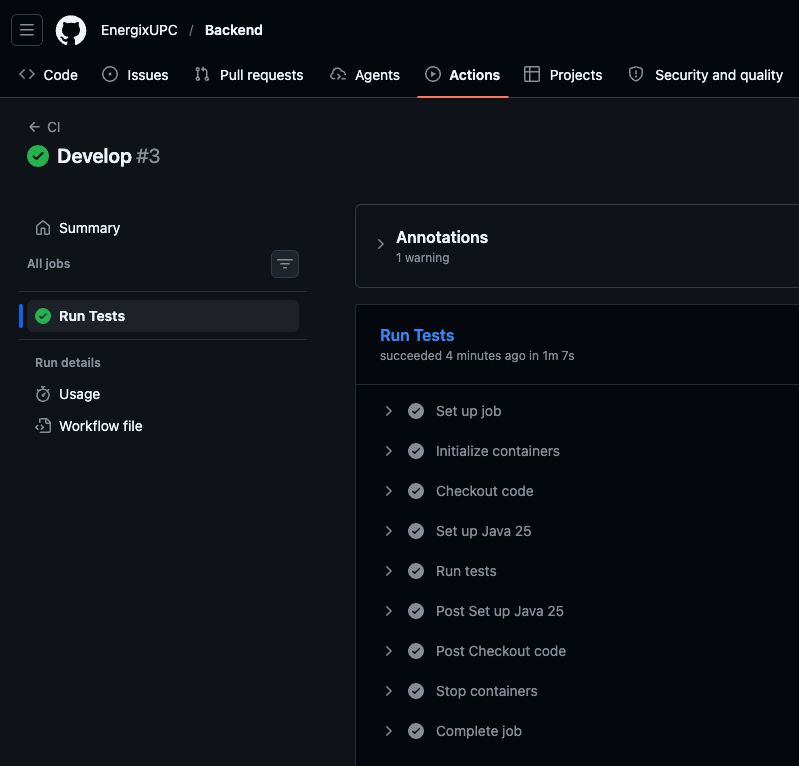
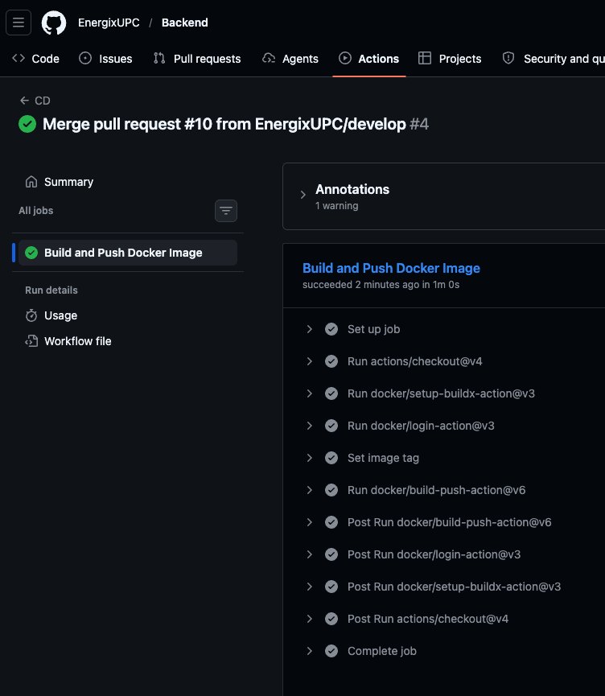
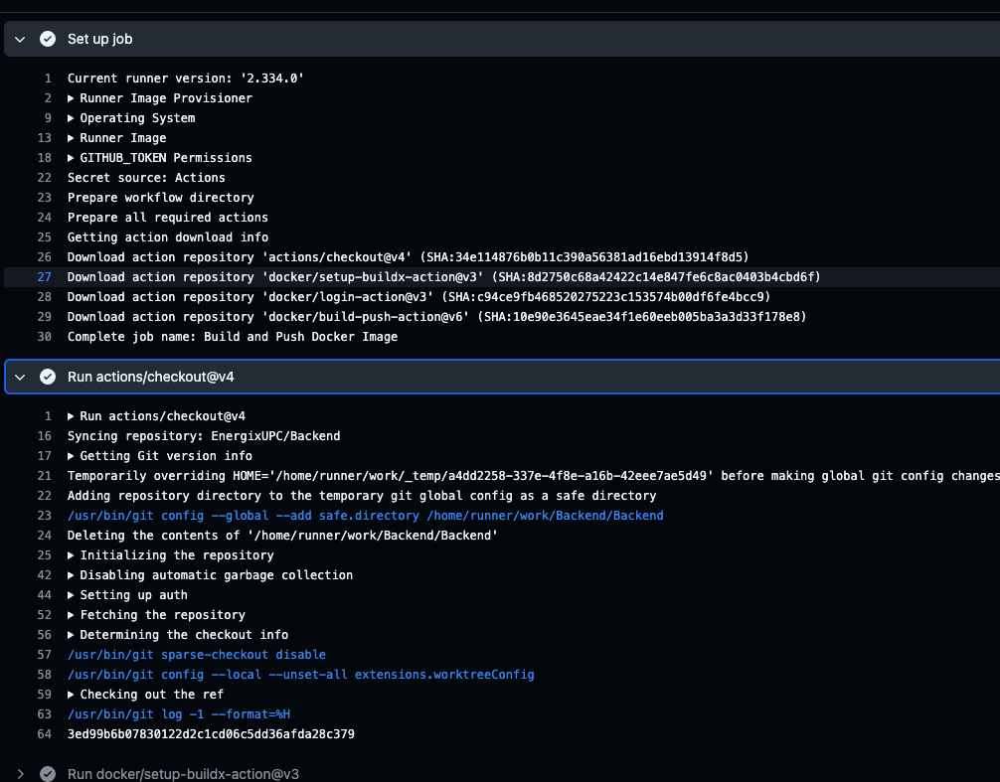
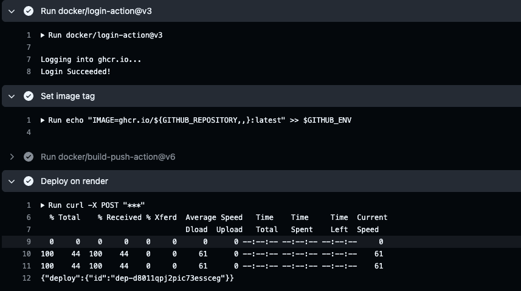
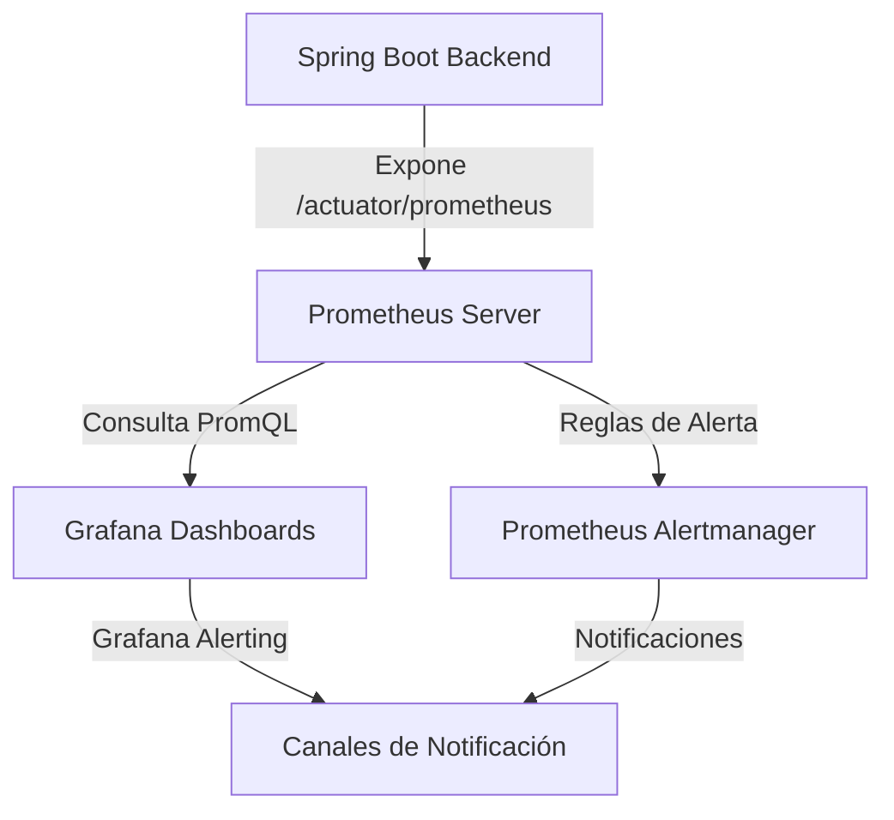

# Capítulo VII: DevOps Practices

## 7.1. Continuous Integration

### 7.1.1. Tools and Practices.

La Integración Continua (CI) es la práctica mediante la cual cada cambio introducido al código fuente es verificado de forma automática mediante la construcción del proyecto y la ejecución de un conjunto de pruebas automatizadas. Para el backend de la plataforma —desarrollado en Java 25 con Spring Boot— se utiliza **GitHub Actions** como plataforma de ejecución de pipelines. El pipeline de CI se dispara ante eventos de `push` y `pull_request` dirigidos a las ramas `main` y `develop`, garantizando que ningún cambio sea integrado sin pasar previamente por la suite de verificación automatizada.

A continuación se describen las herramientas y prácticas que componen la etapa de Integración Continua:

| Herramienta | Versión | Propósito en el proyecto |
|---|---|---|
| **GitHub Actions** | — | Plataforma de orquestación de pipelines CI/CD nativa de GitHub. Ejecuta los workflows definidos en `.github/workflows/` ante eventos de repositorio. |
| **actions/checkout** | v4 | Obtiene el código fuente del repositorio dentro del runner para su procesamiento. |
| **actions/setup-java** | v4 | Configura el entorno de ejecución Java 25 (distribución Temurin) con caché de dependencias Maven integrada. |
| **Java 25 (Temurin)** | 25 | JDK de distribución abierta adoptada como entorno de compilación y ejecución del backend Spring Boot. |
| **Apache Maven** | 3.9.11 | Herramienta de gestión y construcción del proyecto Java. Se ejecuta `mvn test -B` en modo no interactivo para compilar el código y ejecutar la suite de pruebas. |
| **JUnit 5** | 5.12.2 | Marco de pruebas unitarias para Java. Permite definir y ejecutar pruebas sobre entidades, servicios y componentes de forma aislada, validando su comportamiento individual. |
| **Mockito** | 5.17.0 | Marco de mocking para Java. Facilita el aislamiento de dependencias externas durante las pruebas unitarias, permitiendo simular el comportamiento de colaboradores sin instanciarlos realmente. |
| **Cucumber** | — | Herramienta de Behavior-Driven Development (BDD). Permite escribir escenarios de prueba en lenguaje Gherkin (`Given / When / Then`), legibles tanto por el equipo técnico como por stakeholders del negocio. Los escenarios describen el comportamiento esperado del sistema desde la perspectiva del usuario, asegurando que el desarrollo esté alineado con las necesidades del negocio. Crea y prueba ejemplos basados en cómo debería comportarse el sistema, garantizando que la implementación esté alineada con los requisitos del negocio. |
| **MySQL 8.4** | 8.4 | Sistema de gestión de base de datos relacional levantado como servicio dentro del runner de GitHub Actions. Las pruebas de integración se ejecutan contra una base de datos real —no simulada— para garantizar la fidelidad del comportamiento en un entorno equivalente a producción. |

**Prácticas adoptadas:**

- **Pipeline disparado por eventos de integración:** El workflow CI se ejecuta ante `push` a `main` o `develop`, y ante `pull_request` hacia dichas ramas, asegurando que todo código candidato a integrarse haya sido verificado.
- **GitFlow como modelo de ramificación:** Las ramas `main` (producción) y `develop` (integración) actúan como puntos de control del pipeline, en coherencia con el flujo GitFlow adoptado por el equipo.
- **Pruebas sobre infraestructura real:** El pipeline levanta un servicio MySQL 8.4 con health checks configurados (`mysqladmin ping`) antes de ejecutar los tests, garantizando que las pruebas de integración se ejecuten contra una base de datos operativa.
- **Fail-fast:** Si alguna prueba falla, el pipeline se detiene y la integración del cambio es bloqueada, protegiendo la integridad de las ramas principales.
- **BDD con Cucumber y Gherkin:** Los escenarios de comportamiento se definen en archivos `.feature` usando el lenguaje Gherkin. Cucumber traduce estos escenarios en pruebas ejecutables, creando un puente directo entre la especificación de negocio y la verificación técnica automatizada.

### 7.1.2. Build & Test Suite Pipeline Components.

A continuación se presentan las evidencias visuales del pipeline de construcción y suite de pruebas ejecutado mediante GitHub Actions.

**Pipeline CI — Build & Test**




## 7.2. Continuous Delivery

### 7.2.1. Tools and Practices.

La Entrega Continua (Continuous Delivery) extiende la Integración Continua al automatizar el empaquetado y publicación del artefacto de software, dejándolo en un estado siempre listo para ser desplegado. Para el backend de la plataforma, esta etapa consiste en la construcción de una imagen Docker y su publicación en el registro de contenedores **GitHub Container Registry (ghcr.io)**. El pipeline de CD se dispara exclusivamente ante `push` a la rama `main`, garantizando que únicamente el código integrado y verificado sea entregado como artefacto.

| Herramienta | Versión | Propósito en el proyecto |
|---|---|---|
| **GitHub Actions** | — | Plataforma de orquestación. Ejecuta el workflow CD de forma automática ante merges a `main`. |
| **actions/checkout** | v4 | Obtiene el código fuente para el proceso de construcción de la imagen. |
| **docker/login-action** | v3 | Autentica el runner de GitHub Actions con GitHub Container Registry usando el token `GITHUB_TOKEN`, sin necesidad de credenciales adicionales. |
| **docker/metadata-action** | v5 | Genera automáticamente las etiquetas (tags) y labels de la imagen Docker. Produce el tag `sha-<commit>` para trazabilidad y `latest` para referencia siempre actualizada. |
| **docker/build-push-action** | v6 | Construye la imagen Docker a partir del `Dockerfile` del repositorio y la publica directamente en `ghcr.io`. Integra soporte nativo para caché de capas. |
| **GitHub Container Registry (ghcr.io)** | — | Registro de contenedores privado asociado al repositorio. Almacena y distribuye las imágenes Docker producidas por el pipeline. |
| **GitHub Actions Cache (GHA Cache)** | — | Mecanismo de caché de capas Docker integrado en el runner (`cache-from: type=gha`, `cache-to: type=gha,mode=max`). Reduce significativamente el tiempo de construcción en ejecuciones sucesivas. |
| **Docker** | — | Motor de contenedores. La imagen construida encapsula el backend Spring Boot junto con todas sus dependencias en un artefacto reproducible e inmutable. |

**Prácticas adoptadas:**

- **Entrega automática al merge en `main`:** Cada vez que un cambio es integrado a la rama principal —habiendo superado previamente el pipeline de CI— se desencadena automáticamente la construcción y publicación de la imagen Docker.
- **Inmutabilidad del artefacto mediante tags por SHA:** Cada imagen publicada lleva el tag `sha-<commit>`, lo que permite trazar con exactitud qué commit originó cada artefacto y revertir a una versión anterior en caso necesario.
- **Tag `latest` como referencia de la versión actual:** Facilita el consumo de la imagen más reciente en entornos de despliegue sin necesidad de conocer el SHA específico.
- **Optimización mediante caché de capas Docker:** El uso de `type=gha` como backend de caché reutiliza las capas de la imagen entre ejecuciones, reduciendo los tiempos de entrega.
- **Separación de responsabilidades CI/CD:** El pipeline CI valida la calidad del código; el pipeline CD empaqueta y entrega el artefacto. Ambos son workflows independientes y complementarios.
- **Principio del menor privilegio:** El pipeline CD utiliza `GITHUB_TOKEN` con permisos mínimos necesarios (`contents: read`, `packages: write`), sin exponer credenciales adicionales.

### 7.2.2. Stages Deployment Pipeline Components.

A continuación se presentan las evidencias visuales del pipeline de entrega continua, incluyendo la construcción y publicación de la imagen Docker en GitHub Container Registry.

**Pipeline CD — Build & Push Docker Image**



## 7.3. Continuous deployment

### 7.3.1. Tools and Practices.

El Despliegue Continuo (Continuous Deployment) representa la etapa final del pipeline DevOps, en la cual el artefacto verificado y entregado es desplegado de forma automatizada en el entorno de producción. En la arquitectura adoptada, la imagen Docker publicada en `ghcr.io` —con tag `latest` y trazabilidad por SHA de commit— constituye el único artefacto que llega al entorno productivo. El despliegue se realiza extrayendo dicha imagen desde el registro y ejecutándola en el entorno de producción, garantizando que lo que se prueba en CI es exactamente lo que se despliega.

| Herramienta | Versión | Propósito en el proyecto |
|---|---|---|
| **GitHub Container Registry (ghcr.io)** | — | Fuente única de verdad para la imagen Docker lista para producción. El entorno de producción extrae la imagen desde este registro. |
| **Docker** | — | Motor de contenedores en el servidor de producción. Ejecuta la imagen del backend Spring Boot de forma aislada y reproducible. |
| **GitHub Actions** | — | Orquesta el flujo completo: desde el push a `main`, pasando por la verificación en CI, hasta la construcción y publicación de la imagen en CD, dejando el artefacto listo para despliegue. |
| **Imagen Docker (`sha-<commit>` / `latest`)** | — | Artefacto inmutable que encapsula el backend Spring Boot con Java 25. Su tag SHA garantiza la trazabilidad exacta entre el commit en el repositorio y la versión desplegada en producción. |

**Prácticas adoptadas:**

- **Pipeline como única vía de entrega a producción:** Ningún artefacto llega al entorno productivo fuera del flujo automatizado CI → CD → Producción. Esto elimina despliegues manuales inconsistentes.
- **Trazabilidad commit-a-producción:** El tag `sha-<commit>` de la imagen Docker permite identificar con precisión qué estado exacto del código se encuentra ejecutándose en producción en cualquier momento.
- **Rollback controlado:** Ante un fallo en producción, es posible revertir al tag SHA inmediatamente anterior sin necesidad de recompilar el código, ya que las imágenes permanecen disponibles en el registro.
- **Entorno de producción alineado con CI:** La imagen desplegada en producción es el mismo artefacto construido a partir del código que superó las pruebas unitarias, de integración y BDD en el pipeline CI. Esto elimina la brecha entre el entorno de pruebas y el entorno productivo.
- **Separación de ramas por ambiente:** La rama `main` representa el estado de producción. La rama `develop` es el entorno de integración. Solo lo que llega a `main` activa el pipeline de despliegue.

### 7.3.2. Production Deployment Pipeline Components.

A continuación se presentan las evidencias visuales del pipeline de despliegue continuo a producción, incluyendo la extracción de la imagen desde ghcr.io y su ejecución en el entorno productivo.

El procesos se realiza con el siguiente Github Action

```yml
name: CD

on:
  push:
    branches: [main]

jobs:
  build-and-push:
    name: Build and Push Docker Image
    runs-on: ubuntu-latest
    permissions:
      contents: read
      packages: write

    steps:
      - uses: actions/checkout@v4

      - uses: docker/setup-buildx-action@v3

      - uses: docker/login-action@v3
        with:
          registry: ghcr.io
          username: ${{ github.actor }}
          password: ${{ secrets.GITHUB_TOKEN }}

      - name: Set image tag
        run: echo "IMAGE=ghcr.io/${GITHUB_REPOSITORY,,}:latest" >> $GITHUB_ENV

      - uses: docker/build-push-action@v6
        with:
          context: .
          push: true
          tags: ${{ env.IMAGE }}

      - name: Deploy on render
        run: curl -X POST "https://api.render.com/deploy/srv-d7vtn9hj2pic73eqaflg?key=KVHJR4sUpWA"
```






> Notar que se usa secret configurado en Github para hacer el deploy del servicio en Render

## 7.4. Continuous Monitoring

La Monitorización Continua (Continuous Monitoring) es la práctica mediante la cual se supervisa de manera constante el rendimiento, la disponibilidad, la calidad y el comportamiento de la aplicación tanto en producción como en etapas previas del ciclo de vida del desarrollo de software. Esto permite identificar cuellos de botella, regresiones de rendimiento y fallos de servicio en tiempo real, facilitando una respuesta rápida y basada en datos.

### 7.4.1. Tools and Practices

A continuación se describen las herramientas y prácticas que componen la etapa de Monitorización Continua para garantizar la calidad del sistema, la experiencia de usuario y la integridad de las interfaces:

| Herramienta | Versión | Propósito en el proyecto |
|---|---|---|
| **k6** | v0.51.0 | Herramienta moderna de código abierto para pruebas de carga y estrés. Escrita en Go y programable en JavaScript, permite simular flujos de usuario complejos y validar el rendimiento de los endpoints bajo escenarios de alta concurrencia. |
| **Google Analytics (GA4)** | v4 | Plataforma de analítica web que permite monitorear de manera pasiva y en tiempo real la experiencia del usuario (RUM), registrando flujos de navegación, eventos personalizados, tasas de conversión y métricas de interacción en el frontend. |
| **Newman (Postman CLI)** | v6.1.3 | Ejecutor de línea de comandos para colecciones de Postman. Permite automatizar pruebas funcionales y de contrato sobre las APIs del sistema en entornos locales y pipelines de integración. |
| **Better Stack (Uptime)** | — | Herramienta de monitoreo activo que sondea de forma continua la disponibilidad (uptime) y tiempos de respuesta de las APIs desde múltiples nodos externos, generando alertas inmediatas ante incidentes de inactividad. |

**Prácticas adoptadas:**

- **Testing de Carga y Estrés Automatizado:** Definición de scripts declarativos en **k6** para modelar picos de tráfico (stress testing) y carga sostenida (load testing), ejecutándolos de forma programada para identificar cuellos de botella en la base de datos o en el procesamiento del backend antes de realizar pasos a producción.
- **Monitoreo de Experiencia de Usuario basado en Datos (RUM):** Configuración de flujos y eventos clave en **Google Analytics** para entender la interacción real de los usuarios, medir la tasa de rebote ante incrementos de latencia visual y detectar fricciones en los recorridos dentro de la aplicación.
- **Monitoreo de APIs de Dos Niveles:**
  - *A nivel funcional:* Integración de **Newman** en el pipeline de CI/CD para ejecutar validaciones completas sobre los endpoints de la API ante cada despliegue, asegurando que no existan regresiones en los contratos de datos.
  - *A nivel de disponibilidad:* Configuración de pings HTTPS en **Better Stack** para vigilar constantemente que el backend Spring Boot responda correctamente y en menos de un umbral establecido (ej. 500ms).

### 7.4.2. Monitoring Pipeline Components

En esta sección se detallan los componentes encargados de medir y asegurar la calidad visual y el rendimiento técnico de la interfaz de usuario en la web:

**Lighthouse:**
Es una herramienta automatizada de código abierto desarrollada por Google para auditar la calidad de las páginas web. En el ciclo de vida del proyecto se utiliza de las siguientes maneras:
- **Auditoría de Calidad Multidimensional:** Evalúa el rendimiento (Performance), la accesibilidad (Accessibility), las mejores prácticas de desarrollo (Best Practices) y el SEO.
- **Core Web Vitals:** Mide métricas críticas para la experiencia del usuario de Google, tales como el *Largest Contentful Paint* (LCP - velocidad de carga percibida), *First Input Delay* (FID - interactividad) y *Cumulative Layout Shift* (CLS - estabilidad visual).
- **Lighthouse CI (LHCI):** Integrado en el pipeline de CI/CD, permite ejecutar auditorías automatizadas contra entornos temporales de prueba. Si el puntaje de rendimiento o accesibilidad de una pull request desciende por debajo de un umbral establecido (por ejemplo, < 90/100), el pipeline se bloquea, impidiendo regresiones de rendimiento en producción.

**Catchpoint:**
Es una plataforma avanzada de monitoreo de la experiencia digital (DEM) que permite un análisis más dinámico y profundo que las pruebas locales:
- **Monitoreo Sintético Global (Synthetic Monitoring):** Realiza pruebas simuladas de manera continua y programada desde múltiples nodos geográficos distribuidos por todo el mundo. Esto ayuda a evaluar cómo la infraestructura de red, la CDN, la resolución DNS y los tiempos de handshake SSL impactan la calidad visual y el tiempo de carga de la página para usuarios reales en diferentes países.
- **Monitoreo de Usuario Real (RUM):** Recopila y analiza de manera pasiva el rendimiento de la página directamente desde los navegadores de los usuarios reales que visitan el sitio. Proporciona datos detallados sobre la carga de la página bajo condiciones de red y dispositivos reales.
- **Diagnóstico y Aislamiento de Errores:** Permite rastrear la cascada de carga de archivos (scripts, imágenes, estilos) e identificar qué recursos de terceros o fallos de red causan latencias elevadas o bloqueos en la interfaz del usuario.

### 7.4.3. Alerting Pipeline Components

El núcleo de la monitorización de infraestructura y servicios del backend se construye sobre **Prometheus** y **Grafana**, ofreciendo una solución robusta de recolección de métricas, visualización en tiempo real y disparo de alertas ante anomalías operativas.



**Prometheus (Recolección y Almacenamiento):**
- **Modelo Pull:** Prometheus funciona mediante un modelo basado en "pull" (extracción), realizando peticiones HTTP de forma periódica al endpoint `/actuator/prometheus` expuesto por el backend de Spring Boot (gracias a la biblioteca Micrometer).
- **Métricas de Series Temporales:** Almacena y procesa métricas clave como el uso de memoria de la JVM, consumo de CPU, estado del pool de conexiones de la base de datos (HikariCP), y tasas de peticiones HTTP agrupadas por código de estado y ruta.
- **Reglas de Alerta en Prometheus:** Se configuran reglas escritas en PromQL (Prometheus Query Language) para detectar comportamientos anómalos (por ejemplo, si la tasa de errores HTTP 5xx supera el 5% durante más de 2 minutos, o si el espacio en disco es inferior al 10%). Cuando se cumple la condición, Prometheus cambia el estado de la alerta a `Firing`.

**Grafana (Visualización e Instrumentación):**
- **Paneles de Control Dinámicos:** Se conecta a Prometheus como origen de datos para construir dashboards en tiempo real que permiten al equipo técnico visualizar la salud del sistema de un vistazo.
- **Grafana Alerting:** Además de la visualización, Grafana permite definir alertas directamente sobre los gráficos del dashboard, estableciendo umbrales visuales que, al ser sobrepasados (por ejemplo, latencia del percentil 95 superior a 800ms), activan notificaciones automáticas.

**Prometheus Alertmanager (Gestión de Alertas):**
- Es el componente encargado de recibir las alertas crudas generadas por Prometheus.
- **Deduplicación y Agrupación:** Silencia y agrupa alertas similares (por ejemplo, múltiples alertas de caída de nodos del mismo microservicio) para evitar la fatiga por alertas en el equipo.
- **Enrutamiento Inteligente:** Dirige las alertas a los canales apropiados según su severidad (e.g., alertas críticas a localizadores/PagerDuty y alertas de advertencia a canales de mensajería).

### 7.4.4. Notification Pipeline Components.

La integración de las herramientas de automatización de pipelines como **Jenkins** con sistemas de comunicación en tiempo real es fundamental para mantener una cultura DevOps transparente y responder rápidamente a cualquier incidente en los procesos de compilación, prueba y despliegue.

**Mecanismos de Integración en Jenkins:**
- **Jenkins Plugins:** Jenkins cuenta con una amplia biblioteca de plugins oficiales para conectarse con plataformas como **Slack**, **Microsoft Teams**, **Discord**, servidores de correo electrónico (SMTP) y Webhooks genéricos.
- **Configuración de Webhooks Entrantes:** Se configuran Webhooks en la plataforma de destino (por ejemplo, un canal de Slack `#devops-alerts`) y se asocian en las credenciales y configuración global de Jenkins.

**Flujo de Notificaciones y Reglas de Estado:**
Dentro de los pipelines declarativos (`Jenkinsfile`), se definen bloques `post` de ejecución para evaluar el resultado del build y enviar notificaciones personalizadas según el estado de los indicadores clave del proceso:

- **post { failure { ... } } (Notificación ante Fallos):** Se activa de forma inmediata si la compilación falla, si una prueba unitaria, de integración o BDD (Cucumber) no pasa, o si el análisis de calidad de código falla. Se envía un mensaje al canal del equipo detallando el commit autor del cambio, la rama, el número de ejecución en Jenkins y un enlace directo a los logs del error.
- **post { changed { ... } } (Notificación de Cambio de Estado):** Notifica al equipo cuando el estado de una compilación cambia de exitoso a fallido (o viceversa), permitiendo identificar rápidamente cuándo se rompió la rama de desarrollo y cuándo fue restaurada.
- **post { success { ... } } (Confirmación de Despliegue):** Envía una notificación de éxito cuando la imagen Docker ha sido subida correctamente a producción o al entorno de pruebas, informando que una nueva versión estable está operativa.

```groovy
pipeline {
    agent any
    stages {
        stage('Build & Test') {
            steps {
                sh 'mvn clean test'
            }
        }
        stage('Deploy') {
            steps {
                sh './deploy-script.sh'
            }
        }
    }
    post {
        always {
            // Envía resumen de pruebas de forma general
            junit '**/target/surefire-reports/*.xml'
        }
        success {
            slackSend(channel: '#devops-deployments',
                      color: '#00FF00',
                      message: "¡Pipeline Exitoso! Proyecto desplegado con éxito. Build #${env.BUILD_NUMBER} (${env.BUILD_URL})")
        }
        failure {
            slackSend(channel: '#devops-alerts',
                      color: '#FF0000',
                      message: "❌ ¡ALERTA! El pipeline falló en la etapa de compilación/pruebas. Build #${env.BUILD_NUMBER} (${env.BUILD_URL})")
        }
    }
}
```

Esta integración asegura un ciclo de retroalimentación ultrarrápido (*feedback loop*), garantizando que los desarrolladores estén al tanto de cualquier fallo a los pocos segundos de haber realizado un `git push`, optimizando el tiempo medio de reparación (MTTR).
