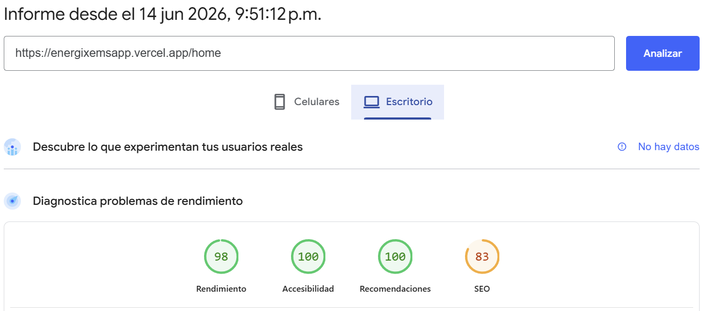
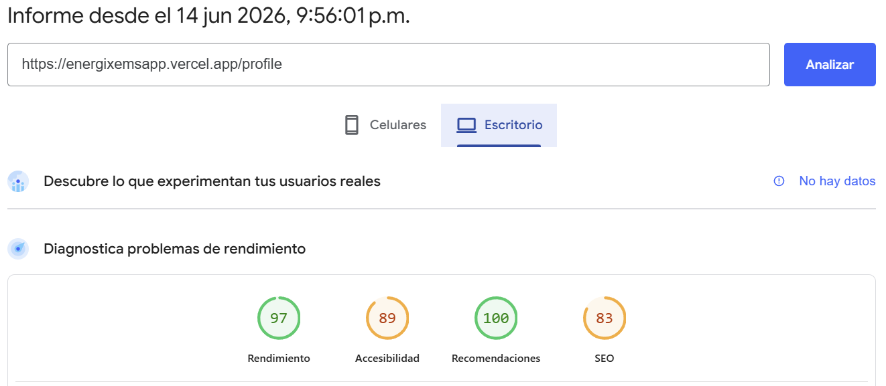
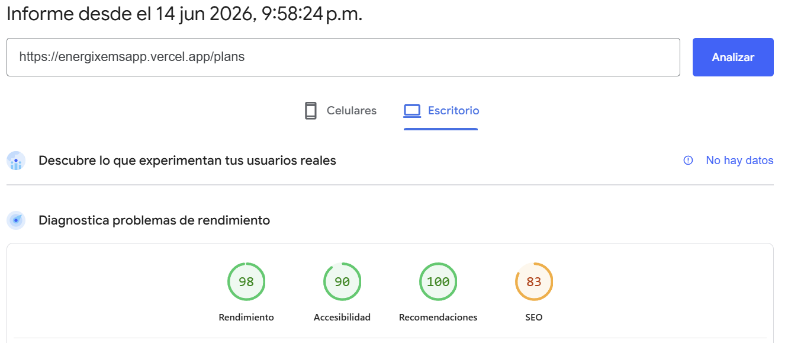
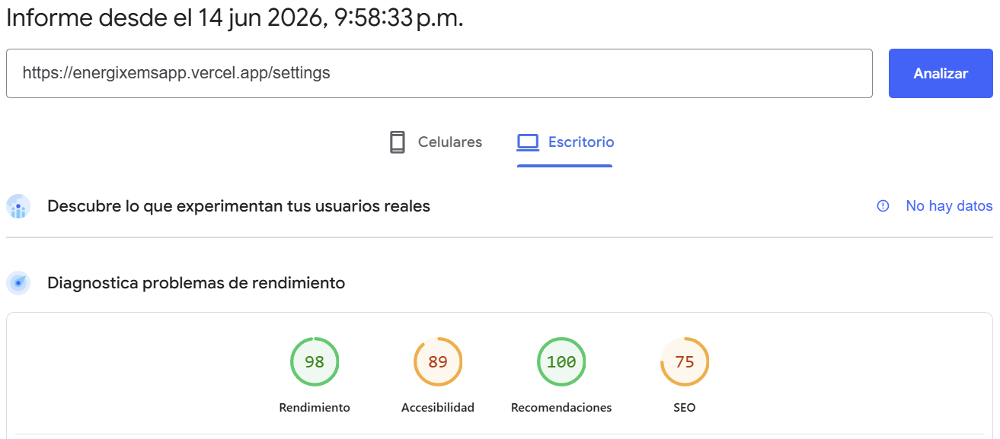
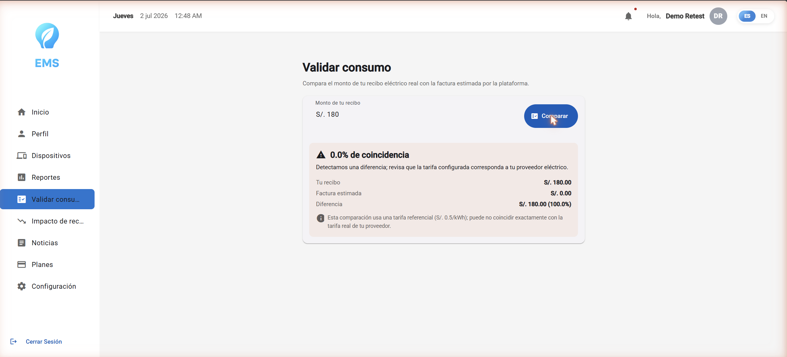
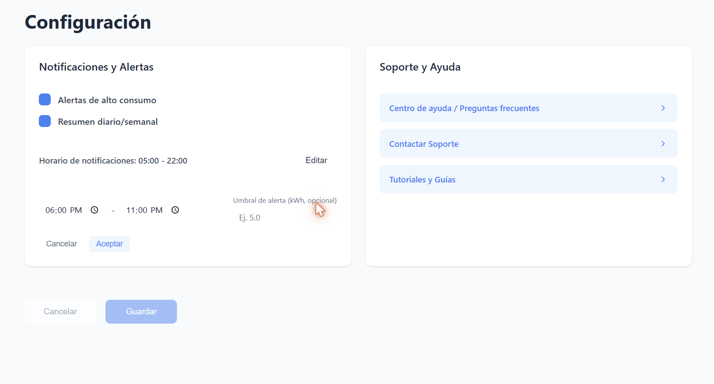

# Capítulo VIII: Experiment-Driven Development

## 8.1. Experiment Planning
### 8.1.1. As-Is Summary.

Actualmente, la solución propuesta EMS (Energy Management System) se encuentra en una fase inicial de validación basada en supuestos derivados del enfoque Lean UX. La plataforma busca optimizar el consumo energético mediante monitoreo en tiempo real, alertas inteligentes y recomendaciones personalizadas.

En el estado actual, se identifican las siguientes condiciones:

- Los usuarios no cuentan con visibilidad detallada del consumo energético por dispositivo, limitándose a información mensual agregada.
- Existe una baja conciencia sobre hábitos de consumo energético eficiente.
- No se ha validado si los usuarios perciben valor suficiente en soluciones tecnológicas para gestionar su consumo.
- Se desconoce el nivel de disposición a pagar por una solución de monitoreo energético.

Asimismo, se identifican riesgos importantes:

- Resistencia a la adopción por la necesidad de instalar hardware.
- Baja comprensión de métricas energéticas (kWh, consumo por circuito).
- Posible percepción de complejidad del dashboard.
- Desconfianza en la precisión de medición del EMS.

Por ello, se requiere validar estas hipótesis mediante experimentación estructurada, permitiendo tomar decisiones basadas en evidencia.

### 8.1.2. Raw Material: Assumptions, Knowledge Gaps, Ideas, Claims.

**Assumptions:**

- Se asume que los usuarios desean reducir su consumo energético para disminuir costos.
- Se asume que los usuarios están dispuestos a utilizar tecnología para monitorear su consumo.
- Se asume que las alertas en tiempo real pueden influir en el comportamiento del usuario.
- Se asume que las recomendaciones personalizadas generan cambios en los hábitos de consumo.
- Se asume que los usuarios aceptarán un modelo de suscripción.
- Se asume que la instalación del hardware no representa una barrera significativa.

**Knowledge Gaps:**

- Falta información sobre la disposición real de los usuarios a pagar por el servicio.
- Se desconoce qué nivel de ahorro es percibido como significativo.
- No se tiene claridad sobre la facilidad de uso del sistema para usuarios no técnicos.
- Se requiere validar la confianza en los datos proporcionados por el sistema.
- No se conoce el impacto real de las alertas en el comportamiento del usuario.
- Falta evidencia sobre qué funcionalidades son realmente críticas para el usuario.

**Ideas:**

- Implementar encuestas y entrevistas para validar percepciones del usuario.
- Desarrollar una versión demo sin hardware para reducir fricción inicial.
- Implementar una prueba gratuita para evaluar conversión a usuarios pagos.
- Incorporar visualización de ahorro estimado en tiempo real.
- Analizar soluciones similares en el mercado para identificar mejores prácticas.

**Claims:**

- Se afirma que el monitoreo en tiempo real puede reducir el consumo energético.
- Se sostiene que las alertas inteligentes generan cambios en el comportamiento.
- Se afirma que la visualización de datos incrementa la conciencia energética.
- Se sostiene que el valor del ahorro supera el costo del servicio.
- Se afirma que la personalización mejora la retención de usuarios.

### 8.1.3. Experiment-Ready Questions.

| ID | Question                                                                      | Confidence                                            | Risk                        | Impact                                     | Interest            | Total Score |
| -- | ----------------------------------------------------------------------------- | ----------------------------------------------------- | --------------------------- | ------------------------------------------ | ------------------- | ----------- |
| Q1 | ¿La instalación del smart meter reduce la adopción del sistema?               | 8 - Alta fricción percibida por instalación eléctrica | 8 - Alto riesgo de abandono | 10 - Impacto crítico en adquisición        | 9 - Muy relevante   | 35          |
| Q2 | ¿Los usuarios confían en los datos generados por el EMS?                      | 7 - Confianza variable en IoT                         | 7 - Riesgo alto de rechazo  | 10 - Impacto crítico en adopción           | 9 - Alta relevancia | 33          |
| Q3 | ¿Las recomendaciones personalizadas generan reducción de consumo energético?  | 8 - Basado en analítica de datos                      | 6 - Riesgo medio            | 10 - Impacto directo en valor del producto | 9 - Muy relevante   | 33          |
| Q4 | ¿Las alertas de consumo en tiempo real modifican el uso de electrodomésticos? | 8 - Evidencia en apps similares                       | 5 - Riesgo medio            | 9 - Impacto en comportamiento del usuario  | 9 - Muy relevante   | 31          |
| Q5 | ¿Los usuarios entienden el consumo mostrado en kWh y gráficos del EMS?        | 7 - Basado en diseño UX                               | 6 - Riesgo de incomprensión | 9 - Impacto en uso del sistema             | 8 - Alto interés    | 30          |
| Q6 | ¿Un modo demo sin hardware incrementa la intención de uso?                    | 7 - Reduce fricción inicial                           | 4 - Bajo riesgo             | 8 - Impacto en adquisición                 | 8 - Interés alto    | 27          |

### 8.1.4. Question Backlog

| Prioridad (1,2,3,5,8) | ID | Pregunta                                                                      |
| --------------------- | -- | ----------------------------------------------------------------------------- |
| 1                     | Q1 | ¿La instalación del smart meter reduce la adopción del sistema?               |
| 1                     | Q2 | ¿Los usuarios confían en los datos generados por el EMS?                      |
| 2                     | Q3 | ¿Las recomendaciones personalizadas generan reducción de consumo energético?  |
| 3                     | Q4 | ¿Las alertas de consumo en tiempo real modifican el uso de electrodomésticos? |
| 5                     | Q5 | ¿Los usuarios entienden el consumo mostrado en kWh y gráficos del EMS?        |
| 5                     | Q6 | ¿Un modo demo sin hardware incrementa la intención de uso?                    |

### 8.1.5. Experiment Cards

| ID | Question                                                                      | Why                                                                                                                                           | What                                                                                             | Hypothesis                                                                            |
| -- | ----------------------------------------------------------------------------- | --------------------------------------------------------------------------------------------------------------------------------------------- | ------------------------------------------------------------------------------------------------ | ------------------------------------------------------------------------------------- |
| Q1 | ¿La instalación del smart meter reduce la adopción del sistema?               | El smart meter requiere intervención en el sistema eléctrico del hogar, lo cual puede generar rechazo por percepción de riesgo o complejidad. | Realizar test A/B: (A) flujo con instalación obligatoria, (B) acceso a demo sin hardware.        | Se espera que la versión sin hardware incremente la tasa de registro en al menos 25%. |
| Q2 | ¿Los usuarios confían en los datos generados por el EMS?                      | La confianza en la medición es clave para que el usuario tome decisiones basadas en los datos del sistema.                                    | Comparar datos del EMS con recibos eléctricos reales y aplicar encuestas de percepción.          | Se espera que al menos el 70% de usuarios confíe en los datos mostrados.              |
| Q3 | ¿Las recomendaciones personalizadas generan reducción de consumo energético?  | Las recomendaciones son el principal valor agregado del EMS frente a soluciones tradicionales.                                                | Mostrar recomendaciones basadas en patrones de consumo y medir cambios en consumo real.          | Se espera una reducción del consumo total en al menos 20%.                            |
| Q4 | ¿Las alertas de consumo en tiempo real modifican el uso de electrodomésticos? | Las alertas buscan intervenir directamente en el comportamiento del usuario en momentos críticos de consumo.                                  | Enviar alertas cuando se detecten picos de consumo y medir comportamiento posterior.             | Se espera una reducción del 15% en consumo en horas pico.                             |
| Q5 | ¿Los usuarios entienden el consumo mostrado en kWh y gráficos del EMS?        | Si el usuario no entiende los datos, no puede tomar decisiones informadas.                                                                    | Realizar pruebas de usabilidad donde los usuarios interpreten consumo actual, histórico y picos. | Se espera que el 80% de usuarios interprete correctamente los datos sin asistencia.   |
| Q6 | ¿Un modo demo sin hardware incrementa la intención de uso?                    | Reducir la fricción inicial puede mejorar significativamente la captación de usuarios.                                                        | Implementar demo interactivo con datos simulados accesible desde web/app.                        | Se espera un incremento del 30% en la tasa de registro.                               |

## 8.2. Experiment Design
### 8.2.1. Hypotheses.

| | **Hypothesis** |
| :--- | :--- |
| **Question** | ¿La instalación del smart meter reduce la adopción del sistema? |
| **Belief** | Creemos que ofrecer una alternativa sin la instalación física de un smart meter aumentará la adopción inicial, ya que se reduce la fricción y la percepción de riesgo por parte del usuario. |
| **Hypothesis** | La implementación de un flujo de registro que incluya una versión demo sin hardware incrementará la tasa de registro de nuevos usuarios en al menos un 25% en comparación con el flujo que exige la instalación obligatoria. |
| **Null Hypothesis** | La opción de un modo demo sin hardware no tendrá un impacto significativo en la tasa de registro de nuevos usuarios. |

| | **Hypothesis** |
| :--- | :--- |
| **Question** | ¿Los usuarios confían en los datos generados por el EMS? |
| **Belief** | Creemos que la transparencia y la validación de los datos son fundamentales para que los usuarios confíen en el sistema y lo utilicen para tomar decisiones sobre su consumo energético. |
| **Hypothesis** | Al comparar los datos del EMS con los recibos eléctricos de los usuarios y demostrar su precisión, al menos el 70% de los usuarios manifestará un alto nivel de confianza en la información proporcionada por el sistema. |
| **Null Hypothesis** | Menos del 70% de los usuarios confiará en los datos mostrados por el EMS, incluso después de la validación con sus recibos eléctricos. |

| | **Hypothesis** |
| :--- | :--- |
| **Question** | ¿Las recomendaciones personalizadas generan reducción de consumo energético? |
| **Belief** | Creemos que proporcionar recomendaciones de ahorro personalizadas y accionables, basadas en los patrones de consumo del usuario, es el principal generador de valor del producto. |
| **Hypothesis** | La implementación de recomendaciones personalizadas basadas en el análisis de patrones de consumo logrará una reducción del consumo energético total de al menos un 20% entre los usuarios que las sigan. |
| **Null Hypothesis** | Las recomendaciones personalizadas no generarán una reducción estadísticamente significativa en el consumo energético de los usuarios. |

| | **Hypothesis** |
| :--- | :--- |
| **Question** | ¿Las alertas de consumo en tiempo real modifican el uso de electrodomésticos? |
| **Belief** | Creemos que las notificaciones instantáneas sobre picos de consumo pueden influir en el comportamiento del usuario en el momento preciso, fomentando un uso más eficiente de la energía. |
| **Hypothesis** | El envío de alertas en tiempo real cuando se detecten picos de consumo provocará una reducción de al menos un 15% en el consumo de energía durante las horas pico. |
| **Null Hypothesis** | Las alertas en tiempo real sobre picos de consumo no modificarán significativamente los hábitos de uso de electrodomésticos ni el consumo en horas pico. |

| | **Hypothesis** |
| :--- | :--- |
| **Question** | ¿Los usuarios entienden el consumo mostrado en kWh y gráficos del EMS? |
| **Belief** | Creemos que una interfaz de usuario clara e intuitiva es crucial para que los usuarios, independientemente de su conocimiento técnico, puedan interpretar los datos de consumo y actuar en consecuencia. |
| **Hypothesis** | Tras realizar pruebas de usabilidad, se espera que al menos el 80% de los usuarios pueda interpretar correctamente los datos de consumo actual, histórico y picos que se muestran en el dashboard sin necesidad de asistencia. |
| **Null Hypothesis** | Menos del 80% de los usuarios podrá interpretar correctamente los datos presentados en el dashboard, indicando problemas de usabilidad y comprensión. |

| | **Hypothesis** |
| :--- | :--- |
| **Question** | ¿Un modo demo sin hardware incrementa la intención de uso? |
| **Belief** | Creemos que permitir a los usuarios explorar las funcionalidades del sistema con datos simulados, sin el compromiso de una instalación, aumentará el interés y la probabilidad de que se registren. |
| **Hypothesis** | La implementación de un modo demo interactivo y accesible desde la web o la aplicación resultará en un incremento del 30% en la tasa de registro de usuarios. |
| **Null Hypothesis** | La disponibilidad de un modo demo no tendrá un impacto significativo en la tasa de registro de nuevos usuarios. |

### 8.2.2. Domain Business Metrics

| Métrica | Descripción | Fórmula de Cálculo | Técnica de Recolección | Meta Deseada |
| :--- | :--- | :--- | :--- | :--- |
| **Tasa de Registro de Usuarios** | Mide el porcentaje de visitantes que completan el proceso de registro. Es un indicador clave de la adquisición de usuarios y la efectividad de la propuesta de valor inicial. | (Número de Usuarios Registrados / Número de Visitantes Únicos) * 100 | Análisis de logs del servidor y plataforma de analítica web/móvil. | Incrementar en un 25-30% |
| **Nivel de Confianza del Usuario** | Evalúa la percepción de los usuarios sobre la precisión y fiabilidad de los datos proporcionados por el sistema EMS. Es fundamental para la retención y el uso continuado de la plataforma. | (Número de Usuarios que califican la confianza como "Alta" o "Muy Alta" / Número Total de Encuestados) * 100 | Encuestas de satisfacción y percepción post-validación de datos. | ≥ 70% |
| **Reducción de Consumo Energético** | Mide la disminución porcentual del consumo de energía (en kWh) de los usuarios activos. Es la métrica principal que demuestra el valor económico y ecológico del producto. | ((Consumo Anterior - Consumo Actual) / Consumo Anterior) * 100 | Datos de consumo recopilados por el sistema EMS a lo largo del tiempo. | ≥ 20% |
| **Reducción de Consumo en Horas Pico** | Mide el cambio en el comportamiento del usuario, específicamente la reducción del consumo durante los períodos de mayor demanda energética. Impacta directamente en la estabilidad de la red y en costos. | ((Consumo en Pico Anterior - Consumo en Pico Actual) / Consumo en Pico Anterior) * 100 | Análisis de datos de consumo del EMS, segmentado por franjas horarias. | ≥ 15% |
| **Tasa de Éxito en Tareas de Usabilidad** | Mide el porcentaje de usuarios que pueden completar tareas clave dentro de la plataforma sin asistencia. Indica la facilidad de uso y la claridad de la interfaz. | (Número de Usuarios que completan la tarea con éxito / Número Total de Usuarios en la prueba) * 100 | Pruebas de usabilidad moderadas y no moderadas. | ≥ 80% |

### 8.2.3. Measures.

| Question | Measure |
| :--- | :--- |
| ¿La instalación del smart meter reduce la adopción del sistema? | Medir y comparar la tasa de conversión de registros entre el grupo de usuarios al que se le ofrece un modo demo (sin hardware) y el grupo al que se le exige la instalación del smart meter. |

| Question | Measure |
| :--- | :--- |
| ¿Los usuarios confían en los datos generados por el EMS? | Realizar encuestas de satisfacción y confianza antes y después de mostrar a los usuarios una comparativa entre los datos del EMS y sus recibos de electricidad. Se medirá el porcentaje de usuarios que califiquen la precisión como "alta" o "muy alta". |

| Question | Measure |
| :--- | :--- |
| ¿Las recomendaciones personalizadas generan reducción de consumo energético? | Analizar el consumo energético (en kWh) de un grupo de usuarios antes y después de la implementación de las recomendaciones personalizadas. Se comparará con un grupo de control que no reciba dichas recomendaciones para aislar el impacto. |

| Question | Measure |
| :--- | :--- |
| ¿Las alertas de consumo en tiempo real modifican el uso de electrodomésticos? | Monitorear y comparar el consumo de energía durante las horas pico para los usuarios que reciben alertas en tiempo real frente a los que no. Se medirá la variación porcentual del consumo en esos períodos. |

| Question | Measure |
| :--- | :--- |
| ¿Los usuarios entienden el consumo mostrado en kWh y gráficos del EMS? | Registrar la tasa de éxito y el tiempo empleado por los usuarios para completar tareas específicas en pruebas de usabilidad, como "identificar el dispositivo de mayor consumo del último mes". Se medirá el porcentaje de usuarios que completen las tareas correctamente sin ayuda. |

| Question | Measure |
| :--- | :--- |
| ¿Un modo demo sin hardware incrementa la intención de uso? | Medir la tasa de clics en el botón de "Registro" o "Probar ahora" en la página de destino. Se comparará la tasa de conversión de la versión que promociona el modo demo interactivo frente a la que no lo hace. |

### 8.2.4. Conditions.

| Question | Condición Experimental | Condición de Control |
| :--- | :--- | :--- |
| ¿La instalación del smart meter reduce la adopción del sistema? | Se espera un incremento de al menos el 25% en la tasa de registro para el grupo de usuarios expuesto al flujo con modo demo (sin hardware). | No se observará una diferencia estadísticamente significativa en la tasa de registro entre el grupo con modo demo y el grupo con instalación obligatoria. |

| Question | Condición Experimental | Condición de Control |
| :--- | :--- | :--- |
| ¿Los usuarios confían en los datos generados por el EMS? | Al menos el 70% de los usuarios expresará un alto nivel de confianza en los datos del EMS después de la validación con sus recibos eléctricos. | Menos del 70% de los usuarios mostrará confianza en los datos del EMS, indicando que la validación no fue suficiente para generar credibilidad. |

| Question | Condición Experimental | Condición de Control |
| :--- | :--- | :--- |
| ¿Las recomendaciones personalizadas generan reducción de consumo energético? | El grupo de usuarios que recibe recomendaciones personalizadas mostrará una reducción de consumo energético de al menos un 20% en comparación con el grupo de control. | No habrá una diferencia estadísticamente significativa en el consumo energético entre el grupo que recibe recomendaciones y el grupo de control. |

| Question | Condición Experimental | Condición de Control |
| :--- | :--- | :--- |
| ¿Las alertas de consumo en tiempo real modifican el uso de electrodomésticos? | Se registrará una reducción del consumo en horas pico de al menos un 15% para el grupo de usuarios que recibe alertas en tiempo real. | El consumo en horas pico no variará significativamente para el grupo que recibe alertas en comparación con el grupo que no las recibe. |

| Question | Condición Experimental | Condición de Control |
| :--- | :--- | :--- |
| ¿Los usuarios entienden el consumo mostrado en kWh y gráficos del EMS? | Al menos el 80% de los usuarios completará con éxito las tareas de interpretación de datos en las pruebas de usabilidad sin requerir asistencia. | Menos del 80% de los usuarios logrará completar las tareas de interpretación de datos, señalando problemas en la claridad de la interfaz. |

| Question | Condición Experimental | Condición de Control |
| :--- | :--- | :--- |
| ¿Un modo demo sin hardware incrementa la intención de uso? | Se observará un aumento del 30% en la tasa de registro para la versión de la página que promociona el modo demo interactivo. | No habrá una diferencia significativa en la tasa de registro entre la versión con promoción del modo demo y la versión sin ella. |

### 8.2.5. Scale Calculations and Decisions.

Este enfoque utiliza métricas para evaluar el cumplimiento de las hipótesis del proyecto. Cada hipótesis se asocia con un indicador de éxito que determina si el resultado es **desfavorable**, **aceptable**, **ideal** o **excelente**.

- **Desfavorable**: La métrica no alcanza el umbral mínimo esperado, lo que indica que la hipótesis probablemente sea incorrecta y requiere una revisión o un pivote.
- **Aceptable**: La métrica se encuentra en un rango que, si bien no es el ideal, muestra un impacto positivo y justifica la implementación.
- **Ideal**: La métrica alcanza el objetivo principal definido en la hipótesis, confirmando el supuesto.
- **Excelente**: La métrica supera significativamente el objetivo ideal (generalmente en un 25% o más), lo que indica un éxito rotundo y una fuerte validación de la hipótesis.

Este marco permite tomar decisiones basadas en datos para validar, ajustar o descartar las hipótesis del proyecto de manera estructurada.

| Scale Calculation | Decision | Factor          |              |          |               |
| :--- | :--- |:----------------|:-------------|:---------|:--------------|
| | | **Desfavorable** | **Aceptable** | **Ideal** | **Excelente** |
| **Q1:** Creemos que ofrecer una alternativa sin instalación de hardware aumentará la adopción. Sabremos que esto es cierto cuando observemos un incremento de al menos el **25%** en la tasa de registro. | Implementar un flujo de registro con una opción de "Modo Demo" para reducir la fricción inicial y permitir a los usuarios explorar la aplicación sin compromiso. |                 |              |          |               |
| **Q2:** Creemos que la transparencia sobre la precisión de los datos genera confianza. Sabremos que esto es cierto cuando al menos el **70%** de los usuarios manifieste un alto nivel de confianza. | Integrar una sección de validación de datos donde los usuarios puedan comparar las mediciones del EMS con sus recibos de electricidad, junto con testimonios y sellos de confianza. |                 |              |          |               |
| **Q3:** Creemos que las recomendaciones personalizadas son un generador de valor clave. Sabremos que esto es cierto cuando observemos una reducción del consumo de al menos un **20%**. | Desarrollar un motor de recomendaciones que analice patrones de consumo y sugiera acciones de ahorro específicas y fáciles de implementar para el usuario. |                 |              |          |               |
| **Q4:** Creemos que las alertas en tiempo real influyen en el comportamiento del usuario. Sabremos que esto es cierto cuando observemos una reducción del **15%** en el consumo durante horas pico. | Implementar un sistema de notificaciones push que alerte a los usuarios sobre picos de consumo inesperados, ofreciendo la opción de apagar dispositivos de forma remota. |                 |              |          |               |
| **Q5:** Creemos que una interfaz clara es crucial para la toma de decisiones. Sabremos que esto es cierto cuando al menos el **80%** de los usuarios interprete los datos correctamente. | Diseñar un dashboard visual e intuitivo, utilizando gráficos claros y un lenguaje sencillo para representar el consumo en kWh, su equivalencia en moneda local y comparativas. |                 |              |          |               |
| **Q6:** Creemos que un modo demo sin compromiso aumenta el registro. Sabremos que esto es cierto cuando observemos un incremento del **30%** en la tasa de registro. | Crear un landing page y campañas de marketing que destaquen la disponibilidad de un modo demo interactivo para atraer a usuarios que aún no están listos para comprar el hardware. |                 |              |          |               |

### 8.2.6. Methods Selection.

| Herramienta | Google Analytics | Catchpoint | RedLine13 | Lighthouse |
| :--- | :--- | :--- | :--- | :--- |
| **Precio** | Plan gratuito robusto con opciones de pago (Google Analytics 360). | Basado en suscripción, con pruebas gratuitas. Orientado al mercado empresarial. | Gratuito con limitaciones, con planes de pago para mayor capacidad. | Totalmente gratuito y de código abierto, integrado en las herramientas de desarrollo de Chrome. |
| **Capacidad de Análisis** | Análisis exhaustivo de métricas de adquisición, comportamiento y conversión de usuarios. Ideal para A/B testing y seguimiento de objetivos. | Monitoreo exhaustivo del rendimiento web y la experiencia de usuario desde múltiples ubicaciones geográficas (monitoreo sintético y real). | Análisis orientado a pruebas de carga y rendimiento del backend. Simula un gran número de usuarios para medir la respuesta del servidor. | Análisis orientado a la experiencia de usuario en el lado del cliente. Mide métricas clave de rendimiento, accesibilidad, PWA y SEO. |
| **Sencillez** | Curva de aprendizaje media. La interfaz es potente pero puede ser compleja para nuevos usuarios. Requiere configuración para mediciones personalizadas. | Interfaz avanzada y detallada. Requiere conocimientos técnicos para configurar y analizar los monitores de rendimiento. | Relativamente sencillo para iniciar pruebas de carga básicas, pero la interpretación de resultados requiere conocimientos de rendimiento. | Muy sencillo de usar. Genera un informe resumido y fácil de entender con puntuaciones y recomendaciones claras. |
| **Ventajas** | Excelente para entender el comportamiento del usuario en el sitio, medir tasas de conversión (ej. registros) y realizar segmentación de audiencia. Amplia integración. | Ideal para garantizar la disponibilidad y el rendimiento global de la aplicación, detectando problemas antes de que afecten a los usuarios. | Permite simular tráfico masivo para validar la escalabilidad y robustez de la infraestructura del servidor bajo condiciones de estrés. | Óptimo para auditorías rápidas y mejoras en el frontend. Proporciona acciones concretas para optimizar la velocidad de carga y la accesibilidad. |

### 8.2.7. Data Analytics: Goals, KPIs and Metrics Selection.

Siguiendo el principio de seleccionar la "cosa más simple y útil", se ha elegido **Lighthouse** como el método principal para la evaluación de los experimentos. Esta herramienta, al ser gratuita y estar integrada en el navegador, representa la forma más sencilla y directa de obtener retroalimentación sobre la calidad de la experiencia del usuario. Para la hipótesis sobre la comprensión de los datos (Q5), Lighthouse es fundamental, ya que sus auditorías de accesibilidad y rendimiento aseguran que la interfaz no presente barreras técnicas que impidan la correcta interpretación de los gráficos y cifras. Aunque no mide directamente la conversión, garantiza que la plataforma base sobre la que se ejecutan las pruebas A/B (Q1, Q6) sea performante y accesible, eliminando variables que podrían contaminar los resultados. Su enfoque en métricas claras y accionables lo convierte en la herramienta más eficiente para validar la calidad del front-end de manera rápida y sin costo.

### 8.2.8. Web and Mobile Tracking Plan.

Para Energix, nuestro objetivo es validar las hipótesis sobre la adopción, confianza y comportamiento del usuario para optimizar el consumo energético. A medida que ejecutemos los experimentos definidos, estableceremos un plan de seguimiento exhaustivo que nos permitirá evaluar de manera efectiva los resultados.

El monitoreo de las funcionalidades experimentales se llevará a cabo en dos etapas clave:

**1. Implementación Inicial**

Durante esta fase, nos enfocaremos en el lanzamiento de los experimentos (pruebas A/B, encuestas, demos) y en la recolección de datos iniciales para establecer una línea base de rendimiento y comportamiento.

**Recopilación de Datos:**

*   **Métricas de Uso:** Se recopilarán datos sobre el uso de la aplicación, incluyendo el número de registros (para Q1 y Q6), la duración de las sesiones y la frecuencia de uso del dashboard.
*   **Interacciones de los Usuarios:** Se registrarán las interacciones de los usuarios con las funcionalidades clave, como clics en las recomendaciones personalizadas (para Q3), visualización de alertas de consumo (para Q4) y tiempo dedicado a interpretar los gráficos (para Q5).
*   **Feedback de Usuarios:** A través de encuestas y pruebas de usabilidad, se recogerán opiniones sobre la confianza en los datos del sistema (para Q2) y la claridad de la interfaz (para Q5).

**Análisis Comparativo:**

Se compararán los datos obtenidos durante esta fase con los grupos de control definidos. Por ejemplo, se analizará la tasa de registro del grupo con acceso al modo demo frente al grupo sin él (Q1, Q6) para evaluar el impacto inmediato.

**2. Seguimiento Continuo**

Después de la implementación inicial, se establecerá un proceso continuo de seguimiento para evaluar el rendimiento a largo plazo y realizar ajustes según sea necesario.

**Recopilación de Datos:**

*   **Métricas en Tiempo Real:** Se implementarán herramientas de análisis para monitorear el comportamiento de los usuarios en tiempo real, lo que permitirá identificar tendencias y patrones de consumo energético (Q3, Q4).
*   **Segmentación de Usuarios:** Los datos se segmentarán por tipo de usuario (ej. los que siguen recomendaciones vs. los que no) para entender mejor cómo cada grupo interactúa con la plataforma y cuál es el impacto real en su consumo.
*   **Tasa de Retención:** Se medirá la tasa de retención de usuarios a lo largo del tiempo para evaluar si las funcionalidades (recomendaciones, alertas) son efectivas en mantener a los usuarios comprometidos con la plataforma.

**Evaluación y Ajustes:**

*   **Informes Periódicos:** Se generarán informes semanales que resuman los hallazgos de los experimentos, incluyendo recomendaciones para validar o refutar las hipótesis.
*   **Iteración Basada en Datos:** Se realizarán ajustes en la plataforma basados en los datos recopilados y en el feedback de los usuarios, asegurando que Energix evolucione para satisfacer mejor las necesidades de sus usuarios y cumplir su objetivo de ahorro energético.

Este enfoque asegurará que Energix continúe evolucionando en función de los datos y permita tomar decisiones informadas para mejorar la experiencia del usuario y la efectividad de la plataforma.

## 8.3. Experimentation
### 8.3.1. To-Be User Stories.

Las siguientes historias de usuario fueron diseñadas a partir de las hipótesis planteadas en la sección 8.2.1, traduciendo cada pregunta de experimentación (Q1-Q6) en una funcionalidad concreta a implementar en la plataforma.

| User Story ID | Título | Descripción | Criterios de Aceptación | Relacionado con (Epic ID) |
| :--- | :--- | :--- | :--- | :--- |
| **US20** | Activar modo demo sin hardware | Como usuario potencial, quiero acceder a un modo demo sin necesidad de instalar un smart meter físico, para conocer la plataforma antes de comprometerme con la instalación. | **Escenario 1: Acceso al modo demo** **Given** que el usuario visualiza la opción "Probar sin instalación" **When** hace clic en el botón correspondiente **Then** el sistema le otorga acceso a un dashboard con datos simulados de consumo **And** muestra el mensaje: "Estás explorando una demo con datos de ejemplo"  **Escenario 2: Conversión de demo a cuenta real** **Given** que el usuario está usando el modo demo **When** decide continuar y registrarse con datos reales **Then** el sistema migra su sesión a una cuenta activa **And** muestra el mensaje: "Tu cuenta ha sido activada correctamente" | EP02 |
| **US21** | Validar precisión de datos del EMS | Como usuario, quiero comparar el consumo mostrado por la plataforma con mi recibo eléctrico real, para confiar en la exactitud de la información que recibo. | **Escenario 1: Carga de recibo para comparación** **Given** que el usuario tiene un recibo eléctrico del mes **When** sube una foto o ingresa el monto de su recibo en la sección "Validar consumo" **Then** el sistema compara el valor con el consumo registrado en la plataforma **And** muestra el porcentaje de coincidencia entre ambos valores  **Escenario 2: Discrepancia detectada** **Given** que existe una diferencia significativa entre el recibo y los datos del sistema **When** se completa la comparación **Then** el sistema muestra el mensaje: "Detectamos una diferencia, revisa la calibración de tus dispositivos" | EP04 |
| **US22** | Medir impacto de recomendaciones personalizadas | Como usuario, quiero ver el ahorro de consumo logrado tras aplicar las recomendaciones personalizadas, para confirmar el valor real que me brinda la plataforma. | **Escenario 1: Comparación antes/después** **Given** que el usuario ha recibido recomendaciones de ahorro **When** consulta la sección "Impacto de mis recomendaciones" **Then** el sistema muestra el porcentaje de reducción de consumo respecto al periodo anterior  **Escenario 2: Sin reducción significativa** **Given** que el usuario aplicó recomendaciones pero no redujo su consumo **When** revisa el reporte de impacto **Then** el sistema muestra el mensaje: "Aún no se detecta una reducción significativa, sigue aplicando las recomendaciones" | EP07 |
| **US23** | Configurar alertas en horas pico | Como usuario, quiero recibir alertas específicas durante las horas de mayor demanda eléctrica, para modificar mi uso de electrodomésticos en esos momentos. | **Escenario 1: Activación de alertas en hora pico** **Given** que el usuario configura su horario de hora pico **When** un dispositivo está en uso durante ese rango horario **Then** el sistema envía una alerta indicando el sobrecosto potencial **And** muestra el mensaje: "Estás consumiendo en horario pico, considera posponer el uso"  **Escenario 2: Resumen de consumo en hora pico** **Given** que finalizó el día **When** el usuario consulta su resumen diario **Then** el sistema muestra el porcentaje de consumo registrado durante las horas pico | EP03 |
| **US24** | Acceder a tutorial interactivo de interpretación de datos | Como usuario, quiero un tutorial interactivo que me explique cómo leer los gráficos en kWh y el consumo histórico, para tomar decisiones informadas sin confusión. | **Escenario 1: Primer acceso al dashboard** **Given** que el usuario ingresa por primera vez al panel de consumo **When** el sistema detecta que no ha completado el tutorial **Then** muestra una guía paso a paso explicando cada gráfico y métrica  **Escenario 2: Reintentar tutorial** **Given** que el usuario desea repasar la explicación **When** selecciona "Ver tutorial" desde el centro de ayuda **Then** el sistema vuelve a desplegar la guía interactiva | EP02 |
| **US25** | Probar la plataforma desde la Landing Page | Como visitante, quiero acceder a un botón de "Probar ahora" en la landing page, para conocer la plataforma sin necesidad de registrarme con datos reales. | **Escenario 1: Clic en "Probar ahora"** **Given** que el visitante se encuentra en la Landing Page **When** hace clic en el botón "Probar ahora" **Then** el sistema lo redirige al modo demo sin solicitar registro previo  **Escenario 2: Conversión desde la demo** **Given** que el visitante exploró el modo demo desde la landing **When** decide registrarse **Then** el sistema lo dirige al formulario de registro con sus datos de prueba precargados | EP10 |

### 8.3.2. To-Be Product Backlog
| # Orden | User Story ID | Título | Story Points (1 / 2 / 3 / 5 / 8) |
| :--- | :--- | :--- | :--- |
| 1 | US20 | Activar modo demo sin hardware | 5 |
| 2 | US21 | Validar precisión de datos del EMS | 5 |
| 3 | US22 | Medir impacto de recomendaciones personalizadas | 5 |
| 4 | US23 | Configurar alertas en horas pico | 3 |
| 5 | US24 | Acceder a tutorial interactivo de interpretación de datos | 3 |
| 6 | US25 | Probar la plataforma desde la Landing Page | 2 |
### 8.3.3. Pipeline-supported, Experiment-Driven To-Be Software Platform Lifecycle

#### 8.3.3.1. To-Be Sprint Backlogs

Cada una de las To-Be User Stories definidas en la sección 8.3.1 (US20–US25) fue descompuesta en work items/tasks concretos y planificada dentro del Sprint de experimentación. La estimación de cada tarea (en Story Points) suma exactamente los puntos asignados a su historia en el To-Be Product Backlog (sección 8.3.2), garantizando la trazabilidad entre la hipótesis, la historia y el trabajo ejecutado. Cada historia fue asignada a un integrante del equipo como responsable, permitiendo un desarrollo paralelo de los seis experimentos planteados.

**Sprint 1 — Experimentación (To-Be)**

| User Story ID | User Story Title | Task ID | Task Title | Description | Estimation (Story Points) | Assigned To | Status (To-do / In-Process / To-Review / Done) |
| :--- | :--- | :--- | :--- | :--- | :---: | :--- | :--- |
| **US20** | Activar modo demo sin hardware | TK01 | Diseñar interfaz del modo demo | Construir el dashboard de demostración con datos simulados de consumo y el mensaje "Estás explorando una demo con datos de ejemplo". | 3 | Jonatan Acuña | Done |
| **US23** | Configurar alertas en horas pico | TK07 | Configurar y disparar alertas en hora pico | Permitir definir el rango horario pico y enviar la alerta de sobrecosto durante el uso de dispositivos. | 2 | Antonio Duran | Done |
| **US24** | Acceder a tutorial interactivo de interpretación de datos | TK09 | Desarrollar tutorial interactivo paso a paso | Guía que explica los gráficos en kWh y el consumo histórico en el primer acceso al dashboard. | 2 | Yeira Huaman | Done |
|  |  | TK10 | Habilitar reintento del tutorial | Opción "Ver tutorial" en el centro de ayuda para volver a desplegar la guía interactiva. | 1 | Yeira Huaman | Done |
| **US25** | Probar la plataforma desde la Landing Page | TK11 | Implementar botón "Probar ahora" | Añadir el botón en la Landing Page que redirige al modo demo sin solicitar registro previo. | 1 | Joan Teves | Done |
|  |  | TK12 | Precargar datos de prueba en el registro | Dirigir al formulario de registro con los datos de la demo precargados al convertir la sesión. | 1 | Joan Teves | Done |

**Total del Sprint:** 23 Story Points (US20: 5 · US21: 5 · US22: 5 · US23: 3 · US24: 3 · US25: 2).

#### 8.3.3.2. Implemented To-Be Landing Page Evidence

**US25 — Probar la plataforma desde la Landing Page**

El botón "Probar ahora" en la Landing Page redirige al visitante al modo demo del Frontend sin solicitar registro previo, cumpliendo el escenario 1 de US25.

#### 8.3.3.3. Implemented To-Be Frontend-Web Application Evidence

**US20 — Activar modo demo sin hardware**

La ruta pública `/demo` muestra un dashboard con datos de consumo simulados y el aviso "Estás explorando una demo con datos de ejemplo. Crea una cuenta para conectar tus propios dispositivos.", sin requerir sesión iniciada.

**US21 — Validar precisión de datos del EMS**

En "Validar consumo" el usuario ingresa el monto de su recibo eléctrico y el sistema lo compara contra la factura estimada por la plataforma, mostrando el porcentaje de coincidencia y el mensaje de discrepancia cuando corresponde.

**US22 — Medir impacto de recomendaciones personalizadas**

"Impacto de mis recomendaciones" compara el consumo del periodo actual contra el periodo anterior como aproximación al efecto de las recomendaciones aplicadas, mostrando el mensaje correspondiente cuando aún no hay una reducción significativa.

**US23 — Configurar alertas en horas pico**

Desde "Configuración" el usuario define el rango horario de hora pico (y un umbral de alerta opcional) usado para disparar las notificaciones de sobrecosto durante ese horario.

**US24 — Acceder a tutorial interactivo de interpretación de datos**

El tutorial se despliega automáticamente en el primer acceso al dashboard y puede volver a abrirse en cualquier momento desde "Tutoriales y Guías" en el centro de ayuda.

**US25 — Probar la plataforma desde la Landing Page (conversión de demo a cuenta real)**

Al hacer clic en "Crear cuenta" desde la demo, el formulario de registro muestra un resumen de la sesión simulada (consumo semanal y ahorro potencial) antes de que el visitante complete sus datos reales.

#### 8.3.3.4. Implemented To-Be RESTful API and/or Serverless Backend Evidence
#### 8.3.3.5. Team Collaboration Insights

### 8.3.4. To-Be Validation Interviews
#### 8.3.4.1. Diseño de Entrevistas.
#### 8.3.4.2. Registro de Entrevistas.

## 8.4. Experiment Aftermath & Analysis
### 8.4.1. Analysis and Interpretation of Results
### 8.4.2. Re-scored and Re-prioritized Question Backlog

## 8.5. Continuous Learning
### 8.5.1. Shareback Session Artifacts: Learning Workflow

## 8.6. To-Be Software Platform Pre-launch
### 8.6.1. About-the-Product Intro Video
