<div align="center" style="text-align: center;">

<h3>Universidad Peruana de Ciencias Aplicadas</h3>
<h4>Facultad de Ingeniería</h4>
<h4>Carrera de Ingeniería de Software</h4>
<h4>Periodo 202610</h4>
<h4>1ASI0732 Diseño de Experimentos de Ingeniería de Software</h4>
<h4>NRC 12305</h4>
<h4>Docente: Noriega Melendez, Julio Manuel </h4>
<h4>Informe de Trabajo Final</h4>
<h4>Startup: Energix</h4>
<h4>Producto: Smart Energy Management System (SEMS)</h4>

<br>

<h2 style="text-align: center;">Integrantes:</h2>

<table style="margin: 0 auto; text-align: center;">
  <thead>
    <tr>
      <th>Código</th>
      <th>Nombre</th>
    </tr>
  </thead>
  <tbody>
    <tr>
      <td>U202210513</td>
      <td>Huaman Olivos, Yeira Shari</td>
    </tr>
    <tr>
      <td>U202312557</td>
      <td>Torres Lavandera, Andrés Rodrigo</td>
    </tr>
    <tr>
      <td>U20211b995</td>
      <td>Acuña Corahua, Jonatan Ariel</td>
    </tr>
    <tr>
      <td>U202319950</td>
      <td>Meza Solórzano, Didier Sebastian</td>
    </tr>
    <tr>
      <td>U202215721</td>
      <td>Duran Díaz, Antonio Rodrigo</td>
    </tr>
    <tr>
      <td>U2021107303</td>
      <td>Teves Samaniego, Joan Fernando</td>
    </tr>
  </tbody>
</table>

<br>
<h4 style="text-align: center;">Abril 2026</h4>

</div>

<div style="page-break-after: always;"></div>


## Registro de Versiones del Informe

| Fecha | Autor | Mensaje del commit (Traducción + Referencia al Documento) |
| --- | --- | --- |
| 2026-04-24 | Jonatan Acuña | Creación inicial de la estructura del informe de proyecto en Markdown. |
| 2026-04-25 | Duran Díaz, Antonio Rodrigo | Reorganización de carpetas para el **Capítulo V: Software Configuration Management**.|
| 2026-04-25 | Duran Díaz, Antonio Rodrigo | Adición de archivos .gitkeep para conservar directorios base de assets del informe.|
| 2026-04-25 | Duran Díaz, Antonio Rodrigo | Adición de la sección de Análisis Competitivo y FODA para el **Capítulo II: Análisis competitivo (2.1.1)**.|
| 2026-04-26 | Duran Díaz, Antonio Rodrigo | Adición de las secciones de Análisis Competitivo, Entrevistas y Needfinding correspondientes al **Capítulo II: Requirements Elicitation & Analysis**.|
| 2026-04-26 | Duran Díaz, Antonio Rodrigo | Adición de recursos visuales para el UX y Análisis Competitivo en el **Capítulo II: Requirements Elicitation & Analysis**.|
| 2026-04-26 | Duran Díaz, Antonio Rodrigo | Adición de Empathy Mapping, As-Is Scenarios y Ubiquitous Language con sus respectivas imágenes para el **Capítulo II (2.3.4, 2.3.5, 2.4)**.|
| 2026-04-26 | Duran Díaz, Antonio Rodrigo | Refactorización de la matriz de tareas a formato de tabla HTML para el **Capítulo II: User Task Matrix (2.3.2)**.|
| 2026-04-26 | Huaman Olivos, Yeira Shari | Adición de la configuración del entorno para el **Capítulo V: Software Development Environment Configuration (5.1.1)**.|
| 2026-04-26 | Huaman Olivos, Yeira Shari | Adición de la guía de estilos y convenciones de código para el **Capítulo V: Source Code Style Guide & Conventions (5.1.3)**.|
| 2026-04-26 | Huaman Olivos, Yeira Shari | Adición de la configuración de despliegue de software para el **Capítulo V: Software Deployment Configuration (5.1.4)**.|
| 2026-04-26 | Teves Samaniego, Joan Fernando | Adición de la información y estructura base del **Capítulo IV: Product Design**.|
| 2026-04-26 | Teves Samaniego, Joan Fernando | Carga de recursos visuales e imágenes correspondientes al **Capítulo IV: Product Design**.|
| 2026-04-26 | Teves Samaniego, Joan Fernando | Actualización y edición del archivo Markdown del **Capítulo IV: Product Design**.|
| 2026-04-27 | Torres Lavandera, Andrés Rodrigo | Redacción y adición de las historias de usuario para el **Capítulo III: User Stories (3.2)**.|
| 2026-04-27 | Torres Lavandera, Andrés Rodrigo | Adición de la tabla del backlog de producto para el **Capítulo III: Product Backlog (3.3)**.|
| 2026-04-27 | Torres Lavandera, Andrés Rodrigo | Adición del mapeo de impacto para el **Capítulo III: Impact Mapping (3.4)**.|
| 2026-04-27 | Duran Díaz, Antonio Rodrigo | Refactorización de la sección de entrevistas para el **Capítulo II: Entrevistas (2.2)**.|
| 2026-04-27 | Jonatan Acuña | Adición de recursos visuales y logos para el **Capítulo I: Introducción**.|
| 2026-04-27 | Jonatan Acuña | Implementación de la plantilla inicial para la sección de la **Carátula**.|
| 2026-04-27 | Jonatan Acuña | Redacción del **Capítulo I: Introducción**, dejando pendiente la sección de Startup Profile y perfiles de integrantes.|
| 2026-04-27 | Huaman Olivos, Yeira Shari | Adición de la sección de gestión de código fuente para el **Capítulo V: Source Code Management (5.1.2)**.|
| 2026-04-27 | Torres Lavandera, Andrés Rodrigo | Actualización y corrección de criterios en las historias de usuario del **Capítulo III: User Stories (3.2)**.|
| 2026-04-27 | Huaman Olivos, Yeira Shari | Adición del backlog correspondiente a la iteración 1 para el **Capítulo V: Sprint Backlogs (5.2.1)**.|
| 2026-04-27 | Duran Díaz, Antonio Rodrigo | Mejoras y refactorización en el formato de la **Carátula**.|
| 2026-04-27 | Duran Díaz, Antonio Rodrigo | Adición del cuadro resumen de la sección **Student Outcome (ABET - EAC)**.|
| 2026-04-27 | Torres Lavandera, Andrés Rodrigo | Adición del mapeo de escenarios futuros para el **Capítulo III: To-Be Scenario Mapping (3.1)**.|
| 2026-04-27 | Jonatan Acuña | Adición de múltiples recursos visuales complementarios al informe general. |
| 2026-04-27 | Jonatan Acuña | Adición de la información del equipo en la sección **Capítulo I: Perfiles de integrantes del equipo (1.1.2)**.|
| 2026-04-27 | Jonatan Acuña | Corrección general de faltas ortográficas en el informe. |
| 2026-04-27 | Jonatan Acuña | Reducción y ajuste del alcance del proyecto en el **Capítulo I: Antecedentes y problemática (1.2.1)**.|
| 2026-04-27 | Jonatan Acuña | Eliminación de archivos generales o secciones en desuso del repositorio. |
| 2026-04-28 | Meza Solórzano, Didier Sebastian | Carga de archivos y código de implementación al repositorio del informe. |
| 2026-04-28 | Meza Solórzano, Didier Sebastian | Adición de capturas como evidencia de avance de la Landing Page para el **Capítulo V: Implemented Landing Page Evidence (5.2.2)**.|
| 2026-04-28 | Meza Solórzano, Didier Sebastian | Redacción y enlace de URL para la sección del **Capítulo V: Implemented Landing Page Evidence (5.2.2)**.|
| 2026-04-28 | Meza Solórzano, Didier Sebastian | Actualización de las capturas de pantalla de la Landing Page en el **Capítulo V: Implemented Landing Page Evidence (5.2.2)**.|
| 2026-04-29 | Meza Solórzano, Didier Sebastian | Adición de capturas de la UI de la aplicación web para el **Capítulo V: Implemented Frontend-Web Application Evidence (5.2.3)**.|
| 2026-04-29 | Meza Solórzano, Didier Sebastian | Adición de los términos legales en la sección **Capítulo V: Acuerdo de Servicio - SaaS (5.2.4)**.|
| 2026-04-29 | Meza Solórzano, Didier Sebastian | Adición de evidencias de implementación de módulos de backend para el **Capítulo V: Implemented RESTful API Evidence (5.2.6)**.|
| 2026-04-29 | Meza Solórzano, Didier Sebastian | Adición de documentación de endpoints integrados con Swagger para el **Capítulo V: RESTful API documentation (5.2.7)**.|
| 2026-04-29 | Meza Solórzano, Didier Sebastian | Adición de estadísticas y contribución del equipo en backend/frontend para el **Capítulo V: Team Collaboration Insights (5.2.8)**.|
| 2026-04-29 | Torres Lavandera, Andrés Rodrigo | Actualización general del **Capítulo III: Product Backlog (3.3)**.|
| 2026-04-29 | Torres Lavandera, Andrés Rodrigo | Actualización de filas y estimaciones en la tabla del **Capítulo III: Product Backlog (3.3)**.|
| 2026-05-09 | Jonatan Acuña | Creación e inicio de redacción de la sección principal del **Capítulo VII: DevOps Practices**.|
| 2026-05-09 | Jonatan Acuña | Adición de capturas de los pipelines de CI/CD para el **Capítulo VII: DevOps Practices (7.1.2, 7.2.2, 7.3.2)**.|
| 2026-05-10 | Jonatan Acuña | Mejora y explicación de la documentación para el pipeline en el **Capítulo VII: Continuous Delivery (7.2)**.|
| 2026-05-10 | Huaman Olivos, Yeira Shari | Redacción e inserción de código de pruebas unitarias para el **Capítulo VI: Core Entities Unit Tests (6.1.1)**.|
| 2026-05-10 | Torres Lavandera, Andrés Rodrigo | Adición de pruebas de sistema para el **Capítulo VI: Core System Tests (6.1.4)**.|
| 2026-05-10 | Torres Lavandera, Andrés Rodrigo | Actualización del código de pruebas de sistema para el **Capítulo VI: Core System Tests (6.1.4)**.|
| 2026-05-10 | Huaman Olivos, Yeira Shari | Adición de pruebas de integración para el **Capítulo VI: Core Integration Tests (6.1.2)**.|
| 2026-05-10 | Torres Lavandera, Andrés Rodrigo | Actualización y refactorización en el **Capítulo VI: Core Entities Unit Tests (6.1.1)**.|
| 2026-05-10 | Torres Lavandera, Andrés Rodrigo | Adición de pruebas basadas en comportamiento de usuario para el **Capítulo VI: Core Behavior-Driven Development (6.1.3)**.|
| 2026-05-10 | Torres Lavandera, Andrés Rodrigo | Creación del apartado y estructura general del **Capítulo VI: Testing Suites & Validation (6.1)**.|
| 2026-05-10 | Jonatan Acuña | Adición de las conclusiones del proyecto para la sección final del documento **Conclusiones y recomendaciones**.|


</div>

## Project Report Collaboration Insights

**Link de la organización:** https://github.com/EnergixUPC

**Link del Repositorio del Informe:** https://github.com/EnergixUPC/Reporte

### Reporte de Colaboración para la Entrega del TB1

En esta primera el equipo llevó a cabo diversas actividades correspondiente a la Parte 1: As-Is Software Project.
Con el fin de evidenciar los avances realizados y demostrar la participación activa de todos los miembros del equipo en la elaboración del informe, se presentan a continuación las capturas obtenidas desde los analíticos de colaboración del repositorio GitHub del proyecto.

## Contributors
En la sección de Contributors se puede visualizar la participación individual de cada integrante del equipo en la redacción del informe correspondiente a esta primera entrega. El registro muestra la cantidad de commits efectuados por cada miembro, así como el número de adiciones y eliminaciones realizadas en el documento, reflejando el nivel de contribución y trabajo colaborativo del grupo.

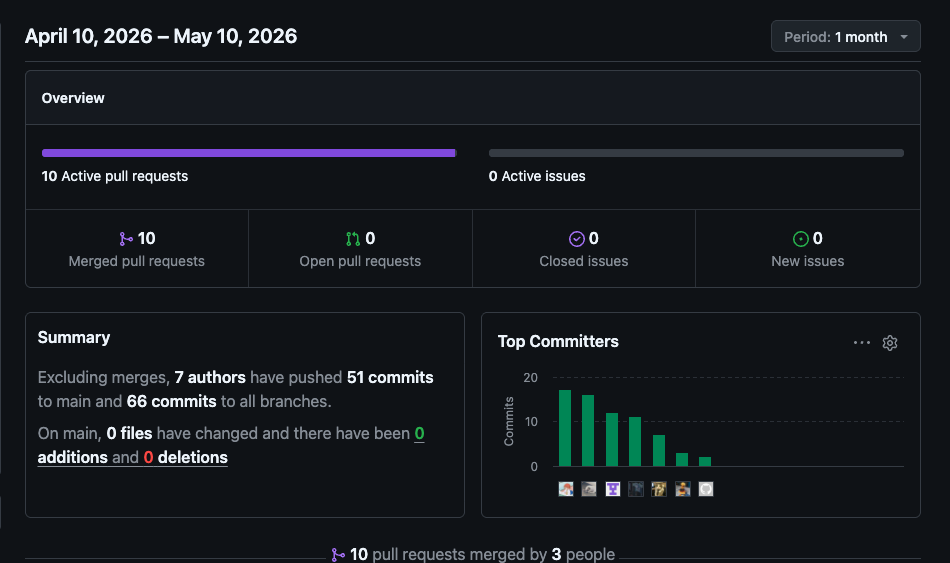


## Contenido (Tabla de contenidos)
- [Student Outcome](#student-outcome)
- Part I: As-Is Software Project
- [Capítulo I: Introducción](#capitulo-i-introduccion)
  - [1.1. Startup Profile](#11-startup-profile)
    - [1.1.1. Descripción de la Startup](#111-descripción-de-la-startup)
    - [1.1.2. Perfiles de integrantes del equipo](#112-perfiles-de-integrantes-del-equipo)
- [1.2. Solution Profile](#12-solution-profile)
    - [1.2.1. Antecedentes y problemática](#121-antecedentes-y-problemática)
    - [1.2.2. Lean UX Process](#122-lean-ux-process)
      - [1.2.2.1. Lean UX Problem Statements](#1221-lean-ux-problem-statements)
      - [1.2.2.2. Lean UX Assumptions](#1222-lean-ux-assumptions)
      - [1.2.2.3. Lean UX Hypothesis Statements](#1223-lean-ux-hypothesis-statements)
      - [1.2.2.4. Lean UX Canvas](#1224-lean-ux-canvas)
  - [1.3. Segmentos Objetivo](#13-segmentos-objetivo)

- [Capítulo II: Requirements Elicitation & Analysis](#capitulo-ii-requirements-elicitation--analysis)
  - [2.1. Competidores](#21-competidores)
    - [2.1.1. Análisis competitivo](#211-análisis-competitivo)
    - [2.1.2. Estrategias y tácticas frente a competidores](#212-estrategias-y-tácticas-frente-a-competidores)
  - [2.2. Entrevistas](#22-entrevistas)
    - [2.2.1. Diseño de entrevistas](#221-diseño-de-entrevistas)
    - [2.2.2. Registro de entrevistas](#222-registro-de-entrevistas)
    - [2.2.3. Análisis de entrevistas](#223-análisis-de-entrevistas)
  - [2.3. Needfinding](#23-needfinding)
    - [2.3.1. User Personas](#231-user-personas)
    - [2.3.2. User Task Matrix](#232-user-task-matrix)
    - [2.3.3. User Journey Mapping](#233-user-journey-mapping)
    - [2.3.4. Empathy Mapping](#234-empathy-mapping)
    - [2.3.5 As-is Scenario Mapping](#235-as-is-scenario-mapping)
  - [2.4. Ubiquitous Language](#24-ubiquitous-language)

- [Capítulo III: Requirements Specification](#capitulo-iii-requirements-specification)
    - [3.1. To-Be Scenario Mapping](#31-to-be-scenario-mapping)
    - [3.2. User Stories](#31-user-stories)
    - [3.3. Product Backlog](#33-product-backlog)
    - [3.4. Impact Mapping](#32-impact-mapping)
    
- [Capítulo IV: Product Design](#capitulo-iv-product-design)
  - [4.1. Style Guidelines](#41-style-guidelines)
    - [4.1.1. General Style Guidelines](#411-general-style-guidelines)
    - [4.1.2. Web Style Guidelines](#412-web-style-guidelines)
    - [4.1.3. Mobile Style Guidelines](#413-mobile-style-guidelines)
      - [4.1.3.1. iOS Mobile Style Guidelines](#4131-ios-mobile-style-guidelines)
      - [4.1.3.2. Android Mobile Style Guidelines](#4132-android-mobile-style-guidelines)
  - [4.2. Information Architecture](#42-information-architecture)
    - [4.2.1. Organization Systems](#421-organization-systems)
    - [4.2.2. Labeling Systems](#422-labeling-systems)
    - [4.2.3. SEO Tags and Meta Tags](#423-seo-tags-and-meta-tags)
    - [4.2.4. Searching Systems](#424-searching-systems)
    - [4.2.5. Navigation Systems](#425-navigation-systems)
  - [4.3. Landing Page UI Design](#43-landing-page-ui-design)
    - [4.3.1. Landing Page Wireframe](#431-landing-page-wireframe)
    - [4.3.2. Landing Page Mock-up](#432-landing-page-mock-up)
  - [4.4. Mobile Applications UX/UI Design](#44-mobile-applications-uxui-design)
    - [4.4.1. Mobile Applications Wireframes](#441-mobile-applications-wireframes)
    - [4.4.2. Mobile Applications Wireflow Diagrams](#442-mobile-applications-wireflow-diagrams)
    - [4.4.3. Mobile Applications Mock-ups](#443-mobile-applications-mock-ups)
    - [4.4.4. Mobile Applications User Flow Diagrams](#444-mobile-applications-user-flow-diagrams)
  - [4.5. Mobile Applications Prototyping](#45-mobile-applications-prototyping)
    - [4.5.1. Android Mobile Applications Prototyping](#451-android-mobile-applications-prototyping)
    - [4.5.2. iOS Mobile Applications Prototyping](#452-ios-mobile-applications-prototyping)
  - [4.6. Web Applications UX/UI Design](#46-web-applications-uxui-design)
    - [4.6.1. Web Applications Wireframes](#461-web-applications-wireframes)
    - [4.6.2. Web Applications Wireflow Diagrams](#462-web-applications-wireflow-diagrams)
    - [4.6.3. Web Applications Mock-ups](#463-web-applications-mock-ups)
    - [4.6.4. Web Applications User Flow Diagrams](#464-web-applications-user-flow-diagrams)
  - [4.7. Web Applications Prototyping](#47-web-applications-prototyping)
  - [4.8. Domain-Driven Software Architecture](#48-domain-driven-software-architecture)
    - [4.8.1. Software Architecture Context Diagram](#481-software-architecture-context-diagram)
    - [4.8.2. Software Architecture Container Diagrams](#482-software-architecture-container-diagrams)
    - [4.8.3. Software Architecture Components Diagrams](#483-software-architecture-components-diagrams)
  - [4.9. Software Object-Oriented Design](#49-software-object-oriented-design)
    - [4.9.1. Class Diagrams](#491-class-diagrams)
    - [4.9.2. Class Dictionary](#492-class-dictionary)
  - [4.10. Database Design](#410-database-design)
    - [4.10.1. Relational/Non-Relational Database Diagram](#4101-relationalnon-relational-database-diagram)

- [Capítulo V: Product Implementation](#capitulo-v-product-implementation)
  - [5.1. Software Configuration Management](#51-software-configuration-management)
    - [5.1.1. Software Development Environment Configuration](#511-software-development-environment-configuration)
    - [5.1.2. Source Code Management](#512-source-code-management)
    - [5.1.3. Source Code Style Guide & Conventions](#513-source-code-style-guide--conventions)
    - [5.1.4. Software Deployment Configuration](#514-software-deployment-configuration)
  - [5.2. Product Implementation & Deployment](#52-product-implementation--deployment)
    - [5.2.1. Sprint Backlogs](#521-sprint-backlogs)
    - [5.2.2. Implemented Landing Page Evidence](#522-implemented-landing-page-evidence)
    - [5.2.3. Implemented Frontend-Web Application Evidence](#523-implemented-frontend-web-application-evidence)
    - [5.2.4. Acuerdo de Servicio - SaaS](#524-acuerdo-de-servicio---saas)
    - [5.2.5. Implemented Native-Mobile Application Evidence](#525-implemented-native-mobile-application-evidence)
    - [5.2.6. Implemented RESTful API and/or Serverless Backend Evidence](#526-implemented-restful-api-andor-serverless-backend-evidence)
    - [5.2.7. RESTful API documentation](#527-restful-api-documentation)
    - [5.2.8. Team Collaboration Insights](#528-team-collaboration-insights)
  - [5.3. Video About-the-Product](#53-video-about-the-product)

- Part II: Verification, Validation & Pipeline
  - [Capítulo VI: Product Verification & Validation](./Capitulo_6_Product_Verification_Validation/README.md)
    - 6.1. Testing Suites & Validation
      - 6.1.1. Core Entities Unit Tests.
      - 6.1.2. Core Integration Tests.
      - 6.1.3. Core Behavior-Driven Development
      - 6.1.4. Core System Tests.
    - 6.2. Static testing & Verification
      - 6.2.1. Static Code Analysis
        - 6.2.1.1. Coding standard & Code conventions.
        - 6.2.1.2. Code Quality & Code Security.
      - 6.2.2. Reviews
    - 6.3. Validation Interviews.
      - 6.3.1. Diseño de Entrevistas.
      - 6.3.2. Registro de Entrevistas.
      - 6.3.3. Evaluaciones según heurísticas.
    - 6.4. Auditoría de Experiencias de Usuario
      - 6.4.1. Auditoría realizada.
        - 6.4.1.1. Información del grupo auditado.
        - 6.4.1.2. Cronograma de auditoría realizada.
        - 6.4.1.3. Contenido de auditoría realizada.
      - 6.4.2. Auditoría recibida.
        - 6.4.2.1. Información del grupo auditor.
        - 6.4.2.2. Cronograma de auditoría recibida.
        - 6.4.2.3. Contenido de auditoría recibida.
        - 6.4.2.4. Resumen de modificaciones para subsanar hallazgos.
  - [Capítulo VII: DevOps Practices](./Capitulo_7_DevOps_Practices/README.md)
    - 7.1. Continuous Integration
      - 7.1.1. Tools and Practices.
      - 7.1.2. Build & Test Suite Pipeline Components.
    - 7.2. Continuous Delivery
      - 7.2.1. Tools and Practices.
      - 7.2.2. Stages Deployment Pipeline Components.
    - 7.3. Continuous deployment
      - 7.3.1. Tools and Practices.
      - 7.3.2. Production Deployment Pipeline Components.
    - 7.4. Continuous Monitoring
      - 7.4.1. Tools and Practices
      - 7.4.2. Monitoring Pipeline Components
      - 7.4.3. Alerting Pipeline Components
      - 7.4.4. Notification Pipeline Components.
- Part III: Experiment-Driven Lifecycle
  - [Capítulo VIII: Experiment-Driven Development](./Capitulo_8_Experiment_Driven_Development/README.md)
    - 8.1. Experiment Planning
      - 8.1.1. As-Is Summary.
      - 8.1.2. Raw Material: Assumptions, Knowledge Gaps, Ideas, Claims.
      - 8.1.3. Experiment-Ready Questions.
      - 8.1.4. Question Backlog.
      - 8.1.5. Experiment Cards.
    - 8.2. Experiment Design
      - 8.2.1. Hypotheses.
      - 8.2.2. Domain Business Metrics
      - 8.2.3. Measures.
      - 8.2.4. Conditions.
      - 8.2.5. Scale Calculations and Decisions.
      - 8.2.6. Methods Selection.
      - 8.2.7. Data Analytics: Goals, KPIs and Metrics Selection.
      - 8.2.8. Web and Mobile Tracking Plan.
    - 8.3. Experimentation
      - 8.3.1. To-Be User Stories.
      - 8.3.2. To-Be Product Backlog
      - 8.3.3. Pipeline-supported, Experiment-Driven To-Be Software Platform Lifecycle
        - 8.3.3.1. To-Be Sprint Backlogs
        - 8.3.3.2. Implemented To-Be Landing Page Evidence
        - 8.3.3.3. Implemented To-Be Frontend-Web Application Evidence
        - 8.3.3.4. Implemented To-Be Native-Mobile Application Evidence
        - 8.3.3.5. Implemented To-Be RESTful API and/or Serverless Backend Evidence
        - 8.3.3.6. Team Collaboration Insights
      - 8.3.4. To-Be Validation Interviews
        - 8.3.4.1. Diseño de Entrevistas.
        - 8.3.4.2. Registro de Entrevistas.
    - 8.4. Experiment Aftermath & Analysis
      - 8.4.1. Analysis and Interpretation of Results
      - 8.4.2. Re-scored and Re-prioritized Question Backlog
    - 8.5. Continuous Learning
      - 8.5.1. Shareback Session Artifacts: Learning Workflow
    - 8.6. To-Be Software Platform Pre-launch
      - 8.6.1. About-the-Product Intro Video
- [Conclusiones](./Conclusiones/README.md)
- [Video App Validation](#video-app-validation)
- [Video About-the-Team](#video-about-the-team)
- [Bibliografía](#bibliografia)
- [Anexos](#anexos)

---

## Student Outcome
El curso contribuye al cumplimiento del Student Outcome ABET: 
**ABET – EAC - Student Outcome 4**
Criterio: *La capacidad de reconocer responsabilidades éticas y profesionales en situaciones de ingeniería y hacer juicios informados, que deben considerar el impacto de las soluciones de ingeniería en contextos globales, económicos, ambientales y sociales*.

En el siguiente cuadro se describe las acciones realizadas y enunciados de conclusiones por parte del grupo, que permiten sustentar el haber alcanzado el logro del ABET – EAC - Student Outcome 4. 

| **Criterio específico** | **Acciones realizadas** | **Conclusiones** |
|--------------------------|-------------------------|------------------|
| **Reconoce responsabilidad ética y profesional en situaciones de ingeniería de software** | **Huaman Olivos, Yeira Shari**<br>**TP1**<br> - Estableció las convenciones de código y estándares de calidad mediante pruebas unitarias y de integración, garantizando la fiabilidad y profesionalismo del software.<br><br>**TF1**<br> - Estructuró el Experiment Planning del Capítulo VIII (supuestos, knowledge gaps, ideas, claims y tarjetas de experimento) con rigurosidad metodológica, asegurando que las decisiones del producto se sustenten en evidencia y no en suposiciones.<br><br>**Torres Lavandera, Andrés Rodrigo**<br>**TP1**<br>- Definió historias de usuario y criterios de aceptación orientados a la transparencia y la calidad mediante pruebas automatizadas y BDD.<br><br>**TF1**<br>- Definió las hipótesis y el diseño experimental del Capítulo VIII, estableciendo condiciones y métricas de forma transparente para validar los supuestos del negocio de manera responsable.<br><br>**Acuña Corahua, Jonatan Ariel**<br>**TP1**<br>- Configuró los pipelines de entrega y despliegue continuo (CI/CD), asegurando el versionamiento del código y un desarrollo profesional seguro y rastreable.<br><br>**TF1**<br>- Documentó el ciclo de vida To-Be soportado por pipelines (8.3.3), consolidando sprint backlogs y evidencias de despliegue con trazabilidad y rigor profesional.<br><br>**Meza Solórzano, Didier Sebastian**<br>**TP1**<br>- Redactó el Acuerdo de Servicio SaaS y la documentación formal de la API (Swagger), promoviendo la transparencia legal y ética en el uso de la plataforma.<br><br>**TF1**<br>- Redactó las historias de usuario y el backlog de producto To-Be (8.3.1, 8.3.2), garantizando criterios de aceptación claros y una priorización responsable del trabajo del equipo.<br><br>**Duran Díaz, Antonio Rodrigo**<br>**TP1**<br>- Durante el desarrollo del informe consideré la importancia de usar la información de manera responsable y ética durante la recolección de datos en las entrevistas.<br><br>**TF1**<br>- Diseñando y registrando las entrevistas de validación To-Be (8.3.4) procuré cuidar en todo momento el trato ético y responsable de la información brindada por los entrevistados.<br><br>**Teves Samaniego, Joan Fernando**<br>**TP1**<br>- Diseñó la arquitectura de la información asegurándose de proveer una interfaz accesible y guiada por estándares de diseño profesional y ético. <br><br>**TF1**<br>- Diseñó el flujo de aprendizaje continuo y los artefactos de la sesión de shareback (8.5), documentando el prototipo en Figma con estándares profesionales de claridad y formato. | El equipo de desarrollo ha demostrado su compromiso con la responsabilidad técnica y ética, fomentando la calidad del código, asegurando la confiabilidad a través de testing automatizado y garantizando la transparencia del servicio mediante una adecuada documentación legal y técnica. |
| **Emite juicios informados considerando el impacto de las soluciones de ingeniería de software en contextos globales, económicos, ambientales y sociales** | **Huaman Olivos, Yeira Shari**<br>**TP1**<br> - Evaluó herramientas de despliegue y repositorios, promoviendo la eficiencia técnica para el ahorro de recursos en un contexto tecnológico.<br><br>**TF1**<br> - Analizó e interpretó los resultados de los experimentos y re-priorizó el backlog de preguntas (8.4), evidenciando el valor económico y social de aprender de forma continua antes de invertir recursos en el producto.<br><br>**Torres Lavandera, Andrés Rodrigo**<br>**TP1**<br>- Realizó un mapeo de impacto y escenarios "To-Be" evaluando las implicaciones sociales y las mejoras de calidad de vida que proporcionará la solución.<br><br>**TF1**<br>- Elaboró el video de presentación About-the-Product (8.6.1), comunicando de manera clara y honesta el valor de la solución hacia usuarios y stakeholders en distintos contextos.<br><br>**Acuña Corahua, Jonatan Ariel**<br>**TP1**<br>- Contextualizó el proyecto definiendo el perfil del startup y el modelo de solución, analizando el contexto social que originó la oportunidad en el mercado.<br><br>**TF1**<br>- Actualizó la evidencia de implementación de la Landing Page y el Frontend-Web To-Be, reflejando cómo las mejoras iterativas impactan la accesibilidad digital de los usuarios.<br><br>**Meza Solórzano, Didier Sebastian**<br>**TP1**<br>- Implementó y documentó las interfaces web, demostrando el impacto directo de la plataforma para mejorar el acceso digital de los usuarios en diversos sectores sociales.<br><br>**TF1**<br>- Actualizó el backlog de producto To-Be considerando el impacto de las nuevas funcionalidades en la experiencia y accesibilidad de los usuarios finales.<br><br>**Duran Díaz, Antonio Rodrigo**<br>**TP1**<br>- Participando con el avance del informe se analizó cómo la solución propuesta puede influir en los usuarios y su entorno de manera positiva, mediante el análisis de competidores.<br><br>**TF1**<br>- Recopilando los testimonios de los segmentos entrevistados en las validaciones To-Be (8.3.4) se evidenció cómo la solución puede generar un impacto social positivo en los hábitos de consumo energético de los usuarios.<br><br>**Teves Samaniego, Joan Fernando**<br>**TP1**<br>- Desarrolló el diseño del producto enfocándose en proporcionar interfaces inclusivas que faciliten el acceso tecnológico en contextos diversos. <br><br>**TF1**<br>- Desarrolló los artefactos de la sesión de aprendizaje continuo (8.5), evidenciando cómo compartir conocimiento de forma abierta fortalece el impacto social y colaborativo del equipo. | El grupo ha evidenciado la capacidad de dimensionar el impacto social, económico y global de la plataforma Energix, respaldando sus decisiones en análisis de mercado, diseño inclusivo y en el despliegue de soluciones accesibles y escalables que resuelven problemas reales y mejoran el entorno de los usuarios. |


# Part I: As-Is Software Project

# Capítulo I: Introducción

## 1.1. Startup Profile
### 1.1.1. Descripción de la Startup
Somos Energix, un Startup conformado por estudiantes de la Universidad Peruana de Ciencias Aplicadas (UPC) con el objetivo de crear una plataforma que contribuya a la optimización del consumo energético y que genere un impacto positivo en la economía de hogares en zonas residenciales de Lima, Perú, que cuentan con acceso a electricidad y múltiples artefactos electrónicos.
Nuestra misión es contribuir a la reducción de costos energéticos mediante el uso de Energix Manager. Para lograrlo, ofrecemos una solución integral que proporciona a los usuarios informes semanales detallados sobre el consumo de energía, alertas automatizadas cuando un dispositivo presenta un uso excesivo, y herramientas de monitoreo en tiempo real que les permiten supervisar el comportamiento energético de cada uno de sus electrodomésticos y equipos electrónicos.

- Misión: Nuestra misión es desarrollar una herramienta que ayude a las personas a monitorear, entender y optimizar su consumo energético, promoviendo hábitos responsables que beneficien a su economía.
- Visión: Nuestra visión es ser reconocidos como una plataforma líder en gestión energética para hogares, ofreciendo soluciones inteligentes que permitan a las personas tomar el control de su consumo energético y reducir sus gastos.

- Logo de la Startup:

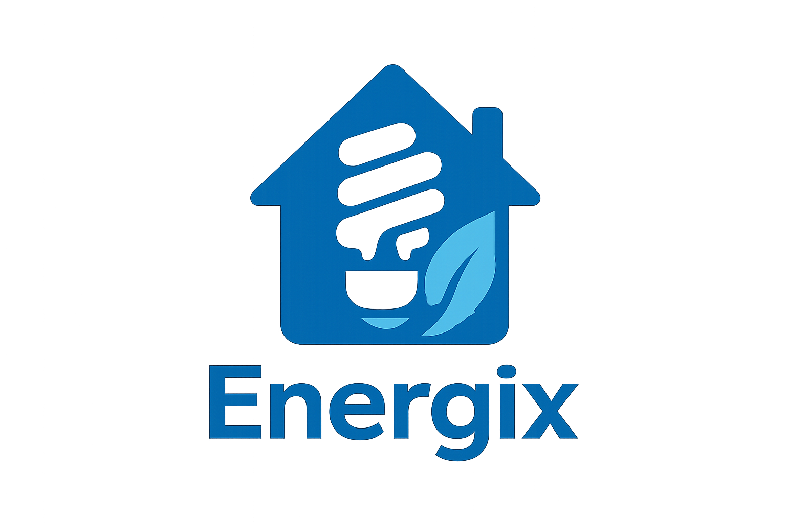

### 1.1.2. Perfiles de integrantes del equipo

| Nombre                                                            | Descripción                                                                                                                                                                                                                                                                                                                                                                                                                                                                                                                                                                                                |
|-------------------------------------------------------------------|------------------------------------------------------------------------------------------------------------------------------------------------------------------------------------------------------------------------------------------------------------------------------------------------------------------------------------------------------------------------------------------------------------------------------------------------------------------------------------------------------------------------------------------------------------------------------------------------------------|
| Yeira Shari         | Mi nombre es Yeira Shari Huaman Olivos y tengo 20 años. Actualmente, curso el 5to ciclo de la carrera Ingeniería de Software en la Universidad Peruana de Ciencias Aplicadas, donde me he desarrollado como una persona responsable, participativa y con una gran pasión por el trabajo en equipo. En este proyecto, mi objetivo es contribuir con mis conocimientos y habilidades técnicas en lenguajes como C++, Python, CSS, HTML, SQL, así como en el uso de Figma, para alcanzar los objetivos del equipo.                                                                                            |
| Jonatan Acuña        | Soy estudiante de la carrera de Ingeniería de Software en la UPC. Me gustó la carrera tras aprender desarrollo web y desde entonces, sigo aprendiendo para mejorar mis habilidades cada vez más. Me gusta aprender sobre las nuevas tecnologías de la web, jugar videojuegos y de vez en cuando salir en bicicleta. |
|  Didier Meza      | Soy estudiante de Ingeniería de Software en 7mo ciclo, con conocimientos en desarrollo backend y frontend. Manejo tecnologías como C + +, JavaScript, HTML y frameworks modernos, aplicando buenas prácticas como programación orientada a objetos, Clean Architecture & Domain-Driven Design (DDD). Me adapto con facilidad al trabajo en equipo y tengo una fuerte orientación a resultados. Aportó al equipo proponiendo soluciones prácticas, optimizando procesos y enfocándome en generar valor para el usuario final.                                                                      |
  |  Antonio Duran          | Soy estudiante de la carrera de Ingeniería de Software en la Universidad Peruana de Ciencias Aplicadas. En este proyecto espero seguir mejorando mis habilidades y conocimientos, además de lograr un buen desempeño en el trabajo grupal                                                                                                                                                                                          |
|  Andrés Rodrigo | Mi nombre es Andrés Torres, actualmente tengo 19 años y estoy cursando el sexto ciclo de la carrera Ingeniería de Software en la Universidad Peruana de Ciencias Aplicadas. Considero que tengo buen nivel en el lenguaje de programación de C++ y un nivel básico en Python. Además, soy un alumno responsable y que aporta en los trabajos grupales. Estoy totalmente dispuesto a colaborar con mi grupo para realizar un muy buen trabajo de curso.                                                                                                                                                     |
|  Joan Teves                      | Soy estudiante de ciclos superiores de Ingeniería de Software en la UPC. Me destaco como desarrollador full-stack con amplia experiencia en frameworks como Vue.js, Astro, Django y FastAPI. Actualmente formo parte de Huawei como practicante pre-profesional en el rol de SEC Trainee. En este proyecto, busco aportar mi visión técnica y arquitectónica para desarrollar una solución robusta y escalable.                                                                                                                                                                                                                                                                                                                                                             |


## 1.2. Solution Profile

En este punto del informe, se presentará información detallada sobre nuestro producto de software, incluyendo su nombre, descripción y el modelo de monetización.

__Product Name__: Nuestro producto se llamará “SEMS”, un nombre compuesto por cuatro palabras en inglés: "Smart Energy Management System" (Sistema de gestión de energía inteligente). Esta combinación refleja claramente el propósito principal de la plataforma: ofrecer un sistema eficiente y accesible para el monitoreo y control del consumo de energía en el hogar.

__Product Description__: SEMS es una plataforma que permite a los usuarios controlar y reducir su consumo energético de manera inteligente. A través de un medidor inteligente que se conecta a los dispositivos del hogar, SEMS realiza un seguimiento en tiempo real del consumo de energía, emite alertas cuando se detectan picos de consumo, proporciona recomendaciones personalizadas y permite apagar dispositivos que estén utilizando más energía de lo necesario.

__Monetización__:  
SEMS funciona mediante un modelo de suscripción mensual o anual. Se ofrecen tres planes diseñados para adaptarse a diferentes necesidades y niveles de control del consumo energético en el hogar:

- **Suscripción Básica**:  
  Dirigido a usuarios que desean comenzar a monitorear su consumo de energía sin funciones avanzadas.
    - Seguimiento básico del consumo energético en tiempo real
    - Alertas de consumo elevado en dispositivos conectados
    - Recomendaciones generales para optimizar el uso de energía
    - Acceso a un panel web básico para visualizar el desempeño energético del hogar


- **Suscripción Premium**:  
  Pensado para usuarios que desean tener un control más detallado y un enfoque proactivo para el ahorro energético. Incluye todo lo del Plan Básico, más:
    - Reportes detallados de consumo energético por dispositivo
    - Alertas avanzadas con recomendaciones personalizadas para cada dispositivo
    - Función para apagar dispositivos automáticamente si el consumo es excesivo
    - Acceso a un panel web con estadísticas avanzadas y tendencias del consumo
    - Soporte técnico prioritario


- **Suscripción Anual**:  
  Pensado para aquellos usuarios que desean comprometerse con un control energético constante durante todo el año, con todas las funciones premium más beneficios adicionales:
    - Todo lo del Plan Premium
    - Descuentos exclusivos en servicios adicionales de optimización energética
    - Asesoría personalizada para mejorar la eficiencia energética del hogar
    - Acceso anticipado a nuevas características y actualizaciones del sistema
    - Recordatorios periódicos sobre el rendimiento energético y recomendaciones de mejoras

### 1.2.1 Antecedentes y problemática
En las ultimas décadas, el crecimiento poblacional y el aumento de dispositivos electrónicos en los hogares han generado un incremento significativo en la demanda energética. Según el informe World Energy Outlook 2023 de la Agencia Internacional de Energía (IEA).

En Perú, el Ministerio de Energía y Minas indicó en su boletín estadístico 2022 que el consumo residencial alcanzó el 28.6% del total de electricidad nacional, siendo los electrodomésticos, sistemas de iluminación y aparatos conectados permanentemente a la red los principales responsables de dicho gasto, impactando negativamente al medio ambiente y a la economía familiar.

En los hogares, muchas veces no se cuentan con información clara sobre cuánta energía consume cada artefacto, lo que dificulta tomar desiciones para reducir el gasto. A esto se suma la falta de hábitos de consumo eficiente, como el uso de focos LED o la desconexión de equipos en reposo. Además, la mayoría de usuarios solo conoce su consumo mediante el recibo mensual.

Frente a esta problemática, surge Energix, una plataforma que brinda a los usuarios informes personalizados, alertas automáticas ante consumos inusuales y monitoreo en tiempo real, permitíendoles gestionar de manera efectiva el usuo energético de cada uno de sus dispositivos.

| Elemento | Descripción |
|----------|-------------|
| **Who (Quién)**   | Los principales afectados son los usuarios residenciales, entre ellos se encuentran amas de casa encargadas de la administración del hogar, propietarios con múltiples dispositivos electrónicos o inteligentes, y estudiantes que alquilan habitaciones y deben controlar sus gastos. Todos comparten la necesidad de tener mayor control y visibilidad sobre el uso de la energía.     |
| **What (Qué)**   | El problema del uso ineficiente de energía en los hogares, ocasionado por la falta de información específica sobre el consumo de cada dispositivo, hábitos pocos sostenibles y la carencia de herramientas que permitan un control inmediato, lo que se traduce en mayores gastos mensuales.     |
| **Where (Dónde)**   | La problemática se presenta principalmente en zonas residenciales de Lima, Perú, en hogares con acceso a servicios de electricidad y múltiples dispositivos, donde muchos no cuentan con herramientas para gestionar su consumo eléctrico.     |
| **When (Cuándo)**   | En un contexto actual de creciente demanda energética en el ámbito doméstico, impulsada por la digitalización del estilo de vida y la incorporación constante de nuevos dispositivos tecnológicos en el hogar.     |
| **Why (Por qué)**   | Muchos usuarios y familias no cuentan con medios para identificar qué aparatos generan mayor consumo, lo que dificulta la toma de decisiones informadas.     |
| **How (Cómo)**   | Mediante una plataforma digital que permite monitorear en tiempo real el uso energético de cada equipo, generar alertas ante consumos elevados y entregar reportes semanales que orientan al usuario hacia un uso más eficiente.     |
| **How Much (Cuánto)**   | El uso eficiente de la energía permite reducir entre un 20% y 30% el gasto mensual de electricidad. En zonas con mayor dependencia de dispositivos electrónicos, el impacto económico puede ser aún mayor, contribuyendo además a la reducción de emisiones y a una gestión más responsable de recursos.     |

### 1.2.2 Lean UX Process.

Nuestro proceso Lean UX está diseñado para optimizar la eficiencia en el desarrollo de productos, priorizando principios clave como la validación constante, el pensamiento analítico y la acción ágil. Siguiendo esta filosofía, hemos estructurado un enfoque propio de Lean UX compuesto por cuatro elementos fundamentales: identificación de problemas, formulación de suposiciones, creación de hipótesis y el desarrollo de un lienzo estratégico.

#### 1.2.2.1. Lean UX Problem Statements.

Nuestra página web está diseñada para ayudar a los usuarios a controlar y reducir el consumo de energía eléctrica en sus hogares, promoviendo así el ahorro y una mayor eficiencia energética. En un contexto donde el aumento de las tarifas eléctricas y la preocupación por el impacto ambiental son cada vez más relevantes, muchas personas enfrentan dificultades para monitorear su consumo de manera efectiva. Además, muchas veces no tienen acceso a herramientas intuitivas que les permitan tomar decisiones informadas sobre cómo optimizar el uso de energía.

Energix es una startup que ofrece una solución innovadora para monitorear el consumo energético del hogar en tiempo real. Nuestra plataforma incluye un medidor inteligente que realiza un seguimiento constante de los picos y caídas de energía, emitiendo alertas, proporcionando recomendaciones personalizadas y permitiendo a los usuarios apagar dispositivos que consumen demasiada energía. Además, los usuarios podrán acceder a un panel web donde podrán visualizar de manera clara y sencilla el desempeño energético de su hogar.

El desafío principal que enfrentamos es lograr que nuestros usuarios confíen en Energix como una solución eficaz y fácil de usar, integrando la tecnología en su vida diaria de forma que no sea percibida como complicada o intrusiva. Aunque nuestra solución es precisa y ofrece un gran potencial para reducir el consumo y los costos, muchos usuarios pueden sentirse desconectados de la tecnología o dudar de su utilidad en la práctica, especialmente al tratarse de un área tan sensible como el control de consumo energético en el hogar.

¿Cómo podríamos lograr que nuestros usuarios confíen en Energix como una herramienta intuitiva, accesible y efectiva para reducir el consumo de energía eléctrica, ayudándoles a ahorrar de forma constante?

#### 1.2.2.2. Lean UX Assumptions.

### Business Assumptions

- Creemos que nuestros usuarios tienen la necesidad de:
  obtener información y herramientas para reducir su consumo de energía eléctrica y, como resultado, disminuir el costo de sus facturas. Buscan una forma simple y efectiva de gestionar el uso de energía en su hogar.

- Estas necesidades se pueden satisfacer con:
  una plataforma digital que ofrezca monitoreo en tiempo real del consumo energético de los dispositivos del hogar, recomendaciones personalizadas para optimizar el gasto y alertas sobre consumos anómalos.

- Nuestros usuarios iniciales son (o serán):
  propietarios o inquilinos de viviendas (casas o apartamentos) en zonas residenciales de Lima, Perú, con acceso estable a electricidad, múltiples dispositivos y a internet, que estén interesados en ser más sostenibles y, sobre todo, en ahorrar dinero en sus facturas de electricidad.

- El valor principal que un usuario quiere obtener de nuestro servicio es:
  tranquilidad y control financiero al tener la certeza de que están optimizando su consumo de energía y maximizando sus ahorros.

- Los usuarios también pueden obtener estos beneficios adicionales:
  mejor comprensión de sus hábitos de consumo, reducción de su huella de carbono, consejos para seleccionar electrodomésticos eficientes y mayor consciencia sobre el impacto de sus decisiones diarias.

- Adquiriremos a la mayoría de nuestros usuarios a través de:
  estrategias de marketing digital en redes sociales, colaboraciones con empresas de servicios públicos, blogs y comunidades online enfocadas en ahorro y sostenibilidad, y campañas de contenido educativo sobre ahorro energético.

- Ganaremos dinero mediante:
  un modelo de negocio de suscripción mensual o anual para el acceso a la plataforma de monitoreo y análisis, y la venta de dispositivos de hardware para la medición de consumo.

- Nuestra competencia principal en el mercado será:
  aplicaciones genéricas de seguimiento de gastos o dispositivos de automatización del hogar que no se centran exclusivamente en el ahorro energético.

- Les superaremos debido a:
  nuestra propuesta de valor enfocada en la solución integral del ahorro energético, que combina el monitoreo detallado, recomendaciones inteligentes y la visualización de los ahorros económicos en tiempo real.

- El mayor riesgo para nuestro producto es:
  la percepción inicial de que el ahorro no justifica el costo del servicio (baja tasa de conversión de la prueba gratuita) o la dificultad para convencer a los usuarios de que instalen el hardware necesario para la medición.

### User Assumptions

- ¿Quién es el usuario?
  propietarios e inquilinos de viviendas en zonas residenciales de Lima, Perú, provistos de acceso a luz y dispositivos, con facturas eléctricas elevadas, preocupados por el constante aumento de costos energéticos y que buscan reducir gastos domésticos de manera práctica y tecnológica.

- ¿Dónde encaja nuestro producto en su vida?
  se integra en su rutina doméstica diaria como una herramienta de control financiero que les permite monitorear en tiempo real el gasto eléctrico y tomar decisiones inmediatas sobre el uso de electrodomésticos para maximizar ahorros.

- ¿Qué problemas resuelve nuestro producto?
  facturas eléctricas sorpresivamente altas, desconocimiento sobre cuáles electrodomésticos gastan más, falta de control sobre el consumo energético del hogar y dificultad para establecer hábitos de ahorro efectivos.

- ¿Cuándo y cómo se utiliza nuestro producto?
  se utiliza diariamente para revisar consumos actuales, antes de usar electrodomésticos de alto consumo, al recibir alertas de gastos anómalos y mensualmente para evaluar ahorros logrados y planificar estrategias futuras.

- ¿Qué características son importantes?
  dashboard de consumo en tiempo real, alertas automáticas de gastos elevados, recomendaciones personalizadas de ahorro, histórico de consumo por dispositivo, cálculos de costo por uso y comparativas mensuales.

- ¿Cómo debería verse y comportarse nuestro producto?
  interfaz simple e intuitiva con gráficos claros de consumo, navegación rápida y notificaciones no intrusivas pero efectivas para promover el ahorro.

- El valor principal que un usuario quiere obtener es:
  reducción tangible en sus facturas de electricidad, con la seguridad de tener control total sobre sus gastos energéticos y la capacidad de optimizar el consumo sin afectar su calidad de vida.

- Los usuarios también pueden obtener estos beneficios adicionales:
  mayor educación sobre eficiencia energética, contribución al cuidado del medio ambiente, mejor presupuesto familiar mensual y empoderamiento tecnológico para gestionar recursos domésticos.

- El mayor riesgo para el usuario es:
  que el costo del sistema no se compense con los ahorros generados, que sea demasiado complicado de instalar o usar, o que las recomendaciones no sean efectivas para su estilo de vida específico.

### User Outcomes

- Ahorro económico tangible y predecible: Los usuarios podrán reducir sus facturas eléctricas de manera consistente, obteniendo un control financiero real sobre sus gastos energéticos desde su dispositivo móvil.

- Monitoreo inteligente y preventivo: Los propietarios podrán identificar patrones de consumo ineficientes antes de que impacten significativamente en sus facturas, evitando sorpresas económicas desagradables.

- Educación energética personalizada: Recibirán recomendaciones específicas adaptadas a sus hábitos de consumo y tipo de vivienda, facilitando la adopción de prácticas de ahorro más efectivas.

- Educación energética personalizada: Recibirán recomendaciones específicas adaptadas a sus hábitos de consumo y tipo de vivienda, facilitando la adopción de prácticas de ahorro más efectivas.

### Business Outcomes

- Conversión de prueba gratuita a planes pagos: Se espera que al menos un 25% de los usuarios que inicien la prueba gratuita se conviertan en suscriptores del plan premium tras 30 días de uso y evidenciar ahorros reales en sus facturas.

- Retención de usuarios a largo plazo: Mantener una tasa de retención del 70% de los suscriptores activos durante el primer trimestre, mediante la mejora continua de la plataforma y la incorporación de nuevas funcionalidades basadas en feedback.

- Posicionamiento como plataforma confiable de ahorro energético: Que el 85% de los usuarios activos afirmen que han reducido sus facturas eléctricas y recomendarían el servicio a otros propietarios preocupados por sus gastos energéticos.

- Alianzas con empresas de servicios públicos y retailers de electrodomésticos: Alcanzar al menos 8 alianzas estratégicas en los primeros seis meses, que permitan expandir el alcance y ofrecer descuentos en dispositivos eficientes a través de la plataforma.

### Features Assumptions

- Monitoreo en tiempo real del consumo energético
- Dashboard interactivo con gráficos de consumo por dispositivo
- Alertas automáticas cuando se detecten picos de consumo anómalos
- Seguimiento de costos por hora y proyecciones de factura mensual
- Recomendaciones inteligentes de ahorro
- Consejos personalizados basados en patrones de uso específicos
- Sugerencias de horarios óptimos para usar electrodomésticos de alto consumo
- Comparativas de eficiencia entre diferentes dispositivos del hogar
- Análisis y reportes detallados
- Histórico de consumo con tendencias mensuales y anuales
- Gráficos de ahorros logrados y potencial de optimización
- Reportes exportables para análisis personal o profesional
- Gestión inteligente de dispositivos
- Identificación automática de electrodomésticos conectados
- Control remoto básico de dispositivos compatibles
- Programación de encendido y apagado según tarifas eléctricas

#### 1.2.2.3. Lean UX Hypothesis Statements.

- Creemos que lograremos una mayor adopción inicial y retención de usuarios si ofrecemos una prueba gratuita de 30 días con acceso parcial a las funcionalidades del sistema de monitoreo. Al permitir que los propietarios exploren el valor del ahorro energético real sin compromiso, validando la efectividad antes de la suscripción, se aumentará la conversión a planes pagos al demostrar reducciones tangibles en sus facturas.

- Creemos que aumentaremos la satisfacción del usuario y reduciremos las cancelaciones si los planes están claramente diferenciados y alineados con las necesidades reales de cada tipo de hogar (apartamentos pequeños, casas familiares, viviendas con alto consumo, etc.). Mediante análisis del comportamiento de consumo y entrevistas, se podrán ajustar las funcionalidades y alertas de cada plan para maximizar su percepción de valor económico.

- Creemos que fortaleceremos la confianza de los usuarios y la credibilidad de la plataforma si se muestran claramente las certificaciones del sistema, datos de precisión del monitoreo y testimonios verificables de ahorros reales. Al mejorar la transparencia y accesibilidad de esta información técnica, se facilitará la toma de decisiones informadas y se reducirá la fricción en la adopción del servicio.

- Creemos que aumentaremos la fidelidad y el uso recurrente si personalizamos las recomendaciones de ahorro según los patrones específicos de consumo de cada hogar. A través de algoritmos de aprendizaje automático y alertas contextuales inteligentes, se puede generar una experiencia percibida como relevante y efectiva para cada usuario individual.

- Creemos que incrementaremos la conversión al plan premium si destacamos el beneficio del análisis avanzado y las proyecciones de ahorro a largo plazo como elementos diferenciales críticos para la optimización financiera. Esto se validará mediante pruebas A/B con mensajes de valor enfocados en control de gastos, tranquilidad financiera y maximización del ahorro energético.

- Creemos que lograremos una expansión sostenida de nuestra base de usuarios si se implementan campañas de marketing específicas dirigidas a comunidades residenciales, redes sociales de ahorro doméstico y colaboraciones con empresas de servicios públicos. Con estas acciones y medición de tasas de adquisición, se podrá ajustar la estrategia para optimizar el retorno por canal y mejorar la conversión entre usuarios conscientes del gasto energético.

#### 1.2.2.4. Lean UX Canvas.

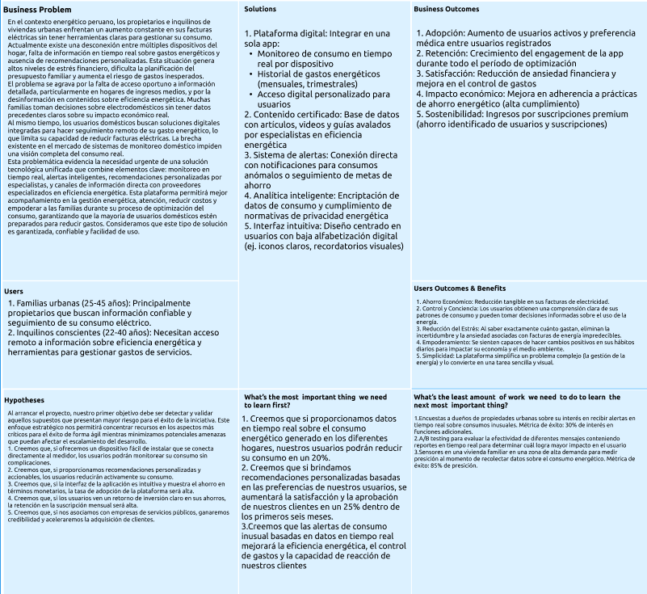

## 1.3. Segmentos objetivos.

|                               | Segmento 1                                                                                                                                                                                                                                                                                                      | Segmento 2                                                                                                                                                                                                                                                   |
|-------------------------------|-----------------------------------------------------------------------------------------------------------------------------------------------------------------------------------------------------------------------------------------------------------------------------------------------------------------|--------------------------------------------------------------------------------------------------------------------------------------------------------------------------------------------------------------------------------------------------------------|
| **Variables**                 | **Propietarios de Vivienda**                                                                                                                                                                                                                                                                                    | **Estudiantes que alquilan**                                                                                                                                                                                                                                 |
| **Geográfica**                | Ubicación: Zonas residenciales de Lima, Perú, con acceso a luz y múltiples dispositivos en el hogar. Tipo de residencia: Casas unifamiliares, condominios o departamentos de propiedad.                                                                                                                  | Ubicación: Zonas residenciales de Lima, Perú, cerca de sus centros de estudio, con acceso a luz y dispositivos. Tipo de residencia: Departamentos, estudios o casas compartidas en alquiler.                                                                                                                                     |
| **Demográfica**               | Edad: 28-65 años. Ingresos: Medios a altos. Tienen el capital disponible para invertir en dispositivos inteligentes y tecnologías sotenibles. Nivel educativo: Estudios universitarios o superiores. Estructura familiar: Familias con hijos o parejas que buscan optimizar los costos del hogar a largo plazo. | Edad: 18-25 años. Ingresos: Limitados o nulos, dependientes de becas, trabajos a tiempo parcial o el apoyo familiar. Nivel educativo: Actualmente cursando estudios superiores. Estructura familiar: Viven solos o comparten vivienda con otros estudiantes. |
| **Psicológica**               | Valoran el control, la sostenibilidad y la inversión a largo plazo. Buscan soluciones tecnológicas que aumenten el valor de su propiedad y les den un contrar total sobre sus finanzas y su impacto ambiental.                                                                                                  | Su principal motivación es el ahorro inmediato debido a un presupuesto limitado. Priorizan la practicidad y las soluciones que les ayuden a reducir sus gatos mensuales sin complicaciones.                                                                  |
| **Función de comportamiento** | Son usuarios proactivos y analíticos que utilizan la tecnología para obtener datos detallados, optimizar el uso de energía y tomar decisiones inteligentes. Su lealtad se basa en la eficacia y precisión del producto.                                                                                         | Son usuarios reactivos que buscan soluciones rápidas. Utilizan la información para hacer cambios sencillos y ver resultados director en sus facturas de luz. La lealtad que demuestren depende de lo fácil que sea la aplicación y el ahoro que perciban.    |

# Capítulo II: Requirements Elicitation & Analysis

## 2.1. Competidores.

Llevaremos a cabo este analisis competitivo, para poder darnos cuenta de nuestras ventajas y desventajas dentro del mercado con competidores que cuentan con un modelo de negocio similiar o parecido al nuestro.

## Lupbak
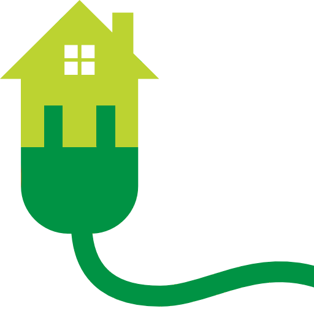

LupBak es una plataforma que convierte hogares en entornos energéticamente inteligentes. Utiliza sensores conectados para monitorear el consumo de energía de los dispositivos del hogar en tiempo real. La plataforma ofrece recomendaciones personalizadas para optimizar el uso de energía y reducir costos.

---

## Refoss


Refoss ofrece dispositivos de monitoreo de energía para el hogar, como medidores inteligentes que permiten rastrear el uso de energía en tiempo real. La aplicación asociada proporciona análisis detallados y alertas sobre el consumo, ayudando a los usuarios a identificar áreas de mejora.

---

## Espacios Inteligentes Perú
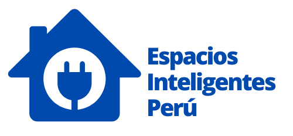

Espacios Inteligentes Perú es una plataforma que se especializa en la implementación de soluciones de automatización del hogar, incluyendo el control de energía. Ofrecen servicios de instalación y configuración de dispositivos inteligentes que permiten a los usuarios controlar y monitorear el consumo energético de su hogar.

---
### 2.1.1. Análisis competitivo.

<table border="1px">
        <thead>
            <th colspan="11">Competitive Analysis Landscepe</th>
        </thead>
        <tbody>
            <tr>
                <td rowspan="2" colspan="2">¿Por qué llevar a
                    cabo este análisis?</td>
            </tr>
            <tr>
                <td colspan="9">Identificar fortalezas, debilidades y oportunidades de diferenciación en el mercado de monitoreo energético doméstico, para posicionar estratégicamente Energix y maximizar su ventaja competitiva.</td> 
            </tr>
            <tr>
                <tr>
                    <td colspan="3"></td>
                    <td colspan="2"><br>Energix</td>
                    <td colspan="2"><br>LupBak</td>
                    <td colspan="2"><br>Refoss</td>
                    <td colspan="2"><br>Espacios Inteligentes Perú</td>
                </tr>
            </tr>
            <tr>
                <td rowspan="2" colspan="1">Perfil</td>
                <td colspan="2">Overview</td>
                <td colspan="2">Startup peruana que ofrece monitoreo energético en tiempo real con medidor inteligente, alertas automáticas y control remoto de dispositivos.</td>
                <td colspan="2">Plataforma que convierte hogares en entornos energéticamente inteligentes usando sensores conectados.</td>
                <td colspan="2">Proveedor de medidores inteligentes con aplicación para análisis detallados del consumo energético.</td>
                <td colspan="2">Empresa peruana especializada en automatización del hogar con servicios de instalación profesional.</td>
            </tr>
            <tr>
                <td colspan="2"> Ventaja competitiva <br></br> ¿Qué valor ofrece a los clientes?</td>
                <td colspan="2">• Enfoque en ahorro económico directo (20-30%)<br>• Control remoto de dispositivos<br>• Interfaz simple y amigable<br>• Alertas predictivas</td>
                <td colspan="2">• Ecosistema completo de sensores<br>• Automatización integral del hogar<br>• Recomendaciones personalizadas avanzadas</td>
                <td colspan="2">• Análisis técnicos detallados<br>• Precisión en mediciones<br>• Enfoque en datos granulares</td>
                <td colspan="2">• Conocimiento del mercado local<br>• Servicios profesionales de instalación<br>• Soporte técnico presencial</td>
            </tr>
            <tr>
                <td rowspan="2" colspan="1">Perfil de Marketing</td>
                <td colspan="2">Mercado Objetivo</td>
                <td colspan="2">Amas de casa, propietarios con múltiples dispositivos, estudiantes que alquilan (usuarios conscientes del gasto).</td>
                <td colspan="2">Propietarios de viviendas interesados en hogar inteligente completo</td>
                <td colspan="2">Usuarios técnicos que buscan datos detallados de consumo</td>
                <td colspan="2">Propietarios de viviendas premium que buscan automatización completa</td>
            </tr>
            <tr>
                <td colspan="2">Estrategia de Marketing</td>
                <td colspan="2"> • Enfoque en ahorro económico<br>• Marketing digital dirigido<br>• Demostraciones de ROI<br>• Testimonios de usuarios</td>
                <td colspan="2">• Marketing de hogar inteligente<br>• Enfoque en innovación tecnológica<br>• Partnerships con fabricantes</td>
                <td colspan="2"> • Marketing técnico especializado<br>• Comunidades de usuarios tech<br>• Contenido educativo técnico</td>
                <td colspan="2">• Marketing local B2B y B2C<br>• Showrooms físicos<br>• Referencias y recomendaciones</td>
            </tr>
            <tr>
                <td rowspan="3" colspan="1">Perfil de Producto</td>
                <td colspan="2">Producto & Servicio</td>
                <td colspan="2">• Medidor inteligente<br>• Plataforma web de monitoreo<br>• Alertas automáticas<br>• Control remoto de dispositivos<br>• Reportes semanales</td>
                <td colspan="2"> • Múltiples sensores conectados<br>• Plataforma de automatización<br>• Recomendaciones IA<br>• Integración con otros dispositivos</td>
                <td colspan="2"> • Medidores inteligentes<br>• Aplicación móvil<br>• Análisis detallados<br>• Sistema de alertas</td>
                <td colspan="2">• Dispositivos de automatización<br>• Servicios de instalación<br>• Configuración personalizada<br>• Soporte técnico</td>
            </tr>
            <tr>
                <td colspan="2">Precio & Costos  </td>
                <td colspan="2">Modelo freemium con suscripción mensual para funciones avanzadas (estimado: S/50-80/mes)</td>
                <td colspan="2">Inversión inicial alta por múltiples sensores + suscripción mensual</td>
                <td colspan="2">Costo del medidor + aplicación gratuita o premium</td>
                <td colspan="2">Costo de dispositivos + instalación profesional + mantenimiento</td>
            </tr>
            <tr>
                <td colspan="2">Canales de distribucion (web y/o Movil)</td>
                <td colspan="2">• Plataforma web propia<br>• App móvil<br>• Tiendas online<br>• Instalación autoguiada</td>
                <td colspan="2">• Plataforma web<br>• App móvil<br>• Retailers especializados<br>• E-commerce</td>
                <td colspan="2">• Tiendas especializadas<br>• E-commerce<br>• Distribuidores técnicos</td>
                <td colspan="2">• Venta directa<br>• Showrooms físicos<br>• Instaladores certificados<br>• Website corporativo</td>
            </tr>
            <tr>
                <td rowspan="5">Analisis SWOT</td>
                <td colspan="10">Realice esto para su startup y sus competidores. Sus fortalezas deberían apoyar sus
                    oportunidades y contribuir a lo que ustedes definen como su posible ventaja
                    competitiva</td>
            </tr>
            <tr>
                <td colspan="2">Fortalezas</td>
                <td colspan="2">• Enfoque específico en ahorro económico<br>• Interfaz simple y amigable<br>• Control remoto de dispositivos<br>• Enfoque Lean UX<br>• Conocimiento del mercado peruano</td>
                <td colspan="2">• Ecosistema completo de sensores<br>• Tecnología avanzada<br>• Recomendaciones personalizadas<br>• Marca establecida</td>
                <td colspan="2">• Precisión técnica<br>• Análisis detallados<br>• Experiencia en medidores<br>• Base de usuarios técnicos</td>
                <td colspan="2">• Presencia local establecida<br>• Servicios profesionales<br>• Conocimiento del mercado peruano<br>• Red de instaladores</td>
            </tr>
            <tr>
                <td colspan="2">Debilidades</td>
                <td colspan="2">• Startup nueva sin track record<br>• Recursos limitados<br>• Dependencia de adopción tecnológica<br>• Necesidad de validación en mercado</td>
                <td colspan="2"> • Mayor complejidad de uso<br>• Costo inicial alto<br>• Puede ser percibido como complicado</td>
                <td colspan="2">• Enfoque muy técnico<br>• Barrera de entrada para usuarios básicos<br>• Menos enfoque en UX</td>
                <td colspan="2">• Costos altos de instalación<br>• Dependencia de servicios presenciales<br>• Menor escalabilidad</td>
            </tr>
            <tr>
                <td colspan="2">Oportunidades</td>
                <td colspan="2">• Creciente conciencia sobre ahorro energético<br>• Aumento de tarifas eléctricas<br>• Digitalización acelerada<br>• Mercado peruano sin líder claro<br>• Segmento de usuarios conscientes del gasto</td>
                <td colspan="2">• Expansión a mercados emergentes<br>• Integración con más dispositivos IoT<br>• Partnerships estratégicos</td>
                <td colspan="2">• Simplificación de interfaz<br>• Expansión a mercado residencial masivo<br>• Reducción de costos</td>
                <td colspan="2">• Expansión nacional<br>• Digitalización de servicios<br>• Partnerships con constructoras</td>
            </tr>
            <tr>
                <td colspan="2">Amenazas</td>
                <td colspan="2">• Competidores con mayor capital<br>• Resistencia al cambio tecnológico<br>• Regulaciones energéticas cambiantes<br>• Entrada de grandes tech companies</td>
                <td colspan="2">• Competencia de gigantes tecnológicos<br>• Commoditización de sensores IoT<br>• Cambios en estándares de conectividad</td>
                <td colspan="2">• Nuevas tecnologías disruptivas<br>• Competencia de soluciones más simples<br>• Cambios regulatorios</td>
                <td colspan="2">• Digitalización del mercado<br>• Competencia de soluciones DIY<br>• Reducción de márgenes por competencia</td>
            </tr>
        </tbody>
    </table>

### 2.1.2. Estrategias y tácticas frente a competidores.


### Control remoto de dispositivos
**• Estrategia:** Posicionar la capacidad de apagar dispositivos remotamente como diferenciador clave.  
**• Táctica:** Demostrar control inmediato desde cualquier ubicación.

### Monitoreo en tiempo real con alertas
**• Estrategia:** Usar el seguimiento constante de picos y caídas de energía para generar valor inmediato.  
**• Táctica:** Alertas automáticas ante consumos inusuales como ventaja sobre soluciones pasivas.

### Simplicidad de instalación
**• Estrategia:** Contrastar la facilidad de uso de un medidor inteligente vs. soluciones complejas del mercado.  
**• Táctica:** Instalación inmediata sin técnicos ni configuraciones complicadas.

### Informes personalizados semanales
**• Estrategia:** Diferenciarse con reportes orientados a decisiones vs. solo datos técnicos.  
**• Táctica:** Información procesada que guía hacia uso más eficiente.

### Reducción comprobada del 20-30%
**• Estrategia:** Usar el dato documentado de ahorro como promesa cuantificable.  
**• Táctica:** Comunicar porcentaje específico de reducción en gasto mensual vs. promesas vagas de la competencia.

### Enfoque en el mercado peruano
**• Estrategia:** Aprovechar conocimiento local del contexto de consumo residencial (28.6% del total nacional).  
**• Táctica:** Solución adaptada específicamente a patrones de uso en hogares peruanos.

## 2.2. Entrevistas.

Las entrevistas estarán dirigidas a propietarios de vivienda y estudiantes que alquilan, con el objetivo de comprender sus necesidades específicas en el acceso a información sobre arrendamientos, condiciones de vivienda, mantenimiento y servicios, así como conocer más sobre sus gastos.

### 2.2.1. Diseño de entrevistas.


#### Entrevista Segmento #1: Propietarios de Vivienda

1. ¿Podría contarnos acerca de su ocupación y su situación de vivienda?
2. ¿Qué tan importante es para usted la eficiencia energética en su hogar?
3. ¿Ha implementado alguna tecnología o sistema para monitorear el consumo eléctrico?
4. ¿Cuáles son los principales desafíos o frustraciones que enfrenta con la gestión de su gasto energético?
5. ¿Qué dispositivos o electrodomésticos considera que consumen más energía en su hogar?
6. ¿Qué marcas de dispositivos inteligentes prefiere y por qué?
7. ¿Con qué frecuencia revisa su factura de luz y qué decisiones toma a partir de ella?
8. Si existiera una solución para la gestión de energía, ¿qué funcionalidades serían indispensables para usted?
9. ¿Le resultaría valioso recibir alertas sobre un consumo inusual o elevado?
10. ¿Considera que una herramienta de monitoreo podría ayudarle a optimizar sus gastos a largo plazo?
11. ¿Cómo describiría su disposición a probar nuevas tecnologías para la gestión del hogar?
12. ¿Qué tipo de información le daría la confianza para invertir en una solución de este tipo?
13. ¿Qué lo motivaría a adoptar una nueva tecnología para el hogar, más allá del ahorro económico?
14. ¿De qué manera prefiere informarse sobre nuevas soluciones tecnológicas para el hogar?
15. ¿Estaría dispuesto a adquirir un servicio que le ofreciera este tipo de reportes y control sobre su consumo?


#### Entrevista Segmento #2: Estudiantes que alquilan

1. ¿Podría compartir su edad y la carrera que está estudiando?
2. ¿Cómo describe su situación actual en cuanto a vivienda?
3. ¿Cómo gestiona su presupuesto mensual, incluyendo los gastos de servicios?
4. ¿Qué tan consciente es del consumo de energía en su hogar?
5. ¿Ha intentado reducir su gasto de luz? Si es así, ¿qué métodos utilizó?
6. ¿Qué tipo de frustraciones o sorpresas ha tenido con la factura de electricidad?
7. ¿Qué marcas de dispositivos inteligentes prefiere y por qué?
8. Si tuviera una herramienta para ver su consumo, ¿qué tipo de información le gustaría que le mostrara?
9. ¿Cree que las alertas de consumo podrían ayudarle a controlar mejor sus gastos?
10. ¿Cómo podría una aplicación de gestión de energía encajar en su rutina diaria?
11. ¿Qué criterios son clave para usted al elegir una aplicación que lo ayude a monitorear y gestionar su ahorro energético en el hogar?
12. ¿Qué tan dispuesto estaría a cambiar sus hábitos para lograr un ahorro de luz?
13. ¿Estaría dispuesto a adquirir un servicio que le ofreciera este tipo de reportes y control sobre su consumo energético?
##

### 2.2.2. Registro de entrevistas.


Esta sección se dedica a la documentación sistemática de cada entrevista con los segmentos objetivo. Se organiza la información para presentar el perfil de cada entrevistado, junto con sus respuestas directas y los hallazgos más significativos. Este registro es crucial para comprender la perspectiva del usuario y validar las hipótesis iniciales del proyecto.

Link del Video: https://shorturl.at/l63Qm

**ENTREVISTAS SEGMENTO OBJETIVO 1: PROPIETARIOS DE VIVIENDA**

**ENTREVISTA 1**


Inicia: 0 minutos y 0 segundos

Duración: 5 minutos y 24 segundos

Nombre: Yusnury Hilda Vivar Olivos

Edad: 28 años

Distrito: San Miguel

Resumen: Yusnury Vivar trabaja en el área receptivo de una agencia de viajes y vive en una casa propia con su familia. Considera muy importante la eficiencia energética y en su hogar aplican prácticas como apagar luces, usar focos LED y desconectar cargadores. Aunque solo revisa su recibo de luz a fin de mes, reconoce que electrodomésticos como la refrigeradora, lavadora/secadora y computadoras elevan su consumo. Le interesan marcas como Xiaomi, TP-Link y Amazon Alexa por su accesibilidad y compatibilidad. Le gustaría una solución que le ofrezca reportes claros por aparato y que sea fácil de usar, con soporte y garantía de ahorro, ya que estaría dispuesta a adoptar nuevas tecnologías que aporten comodidad, control y cuidado del medio ambiente.

Información extra:

* Dispositivos:
    + iPhone (uso constante).
    + Computadora y laptop (para trabajo).

* Personalidad:

    + Tiene alta disposición a innovar y probar nuevas tecnologías para el hogar.
    + Su motivación va más allá del ahorro económico: le interesa el cuidado del medio ambiente, la comodidad y la modernidad.

**ENTREVISTA 2**


Inicia:  5 minutos y 24 segundos

Duración:  3 minutos y 42 segundos

Nombre: Augusta Sessarego

Edad:  54

Distrito: Jesús María

Resumen: Augusta Sessarego(54) trabaja como secretaria en una agencia de salud, vive en su casa con su hijo y una mascota. Ella considera de suma importancia tener una eficiencia sobre el consumo energético en su vivienda, en estos últimos meses ha estado aplicando prátcias como desenchufar aparatos que no se usen y usar regularmentes dispositivos para que no consuman demasiada energía. Cada mes ella revisa su recibo de luz solo una vez que normalmente son los 30 o 31, según su experiencia los electrodomésticos como la terma, el microondas, y la refrigeradora son los que más consumo energía por día. Del mismo modo no es una persona que se fije en las marcas de dispositivos simplemente se deja llevar por el precio y calidad aunque si afirma haberse comprado un Amazon Alexa. Por último si le gustaria una solución que le ofrezca reportes díarios de su consumo energético para así poder optimizar por dispositivo la cantidad de energía generada en su vivienda.

Información extra:

* Dispositivos:
    + Android (uso constante).
    + Computadora y laptop (para trabajo).

* Personalidad:
    + Le gusta comprar nuevas cosas que le ayuden en el día a día en su hogar.
    + Su motivación para ahorrar va más alla de lo económico, si no le gustaría poder reducir su huella de carbono para contribuir al cuidado del medio ambiente.

**ENTREVISTA 3**


Inicia: 9 minutos y 17 segundos

Duración: 7 minutos y 5 segundos

Nombre: Moisés de la Cruz

Edad: 29

Distrito: Chorrillos

Resumen:El entrevistado señaló que en su empresa textil controlan el consumo de energia de forma manual, leyendo el medidor al inicio y fin de mes. Han tenido problemas con facturas excesivamente altas. , Considera que el uso eficiente de energia en su modelo de negocio es muy importante. Considera útil una app con alertas semanales y de fácil uso, especialmente para que sus padres también la puedan manejar.

Información extra:

* Dispositivos:
    + iPhone (uso constante).
    + MacBooks (para trabajo).
    + Navegador Chrome (uso constante).
* Personalidad:
    + Alta disposición a innovar y probar nuevas tecnologías para el hogar y para su familia.
    + Su motivación va más allá del ahorro económico: le interesa modernizar el ambiente en el cual convive con su familia.

**ENTREVISTAS SEGMENTO OBJETIVO 2: ESTUDIANTES QUE ALQUILAN**

**ENTREVISTA 1**


Inicia: 16 minutos y 23 segundos

Duración: 3 minutos y 32 segundos

Nombre: Johnny Ricardo Mallqui Cueva

Edad: 19

Distrito: Chorrillos

Resumen: Johnny Mallqui (19 años) estudia en la UPC y alquila un cuarto en Chorrillos, se relaciaona a menudo con la tecnología ya que estudia ingeniería de Sistemas. Nos comento que tiene un presupuesto mensual, incluyendo alquiler y servicios. Aunque ha intentado reducir su gasto de energía electrica apagando luces y desconectando dispositivos, a menudo se sorprende con facturas altas. Le gustaría una aplicación que le muestre su consumo en tiempo real con los picos altos y bajos, que le envíe alertas para evitar sorpresas y estaría dispuesto a cambiar sus hábitos para tratar ahorrar más.

Información extra:

* Dispositivos:
    + Samsung (uso constante).
    + Computadora (para estudios).
* Personalidad:
    + Carrera: Ingeniería de Sistemas.
    + Estresado por las facturas elevadas, quiere reducir ese gasto.
    + Prefiere una plataforma en la cual pueda monitorear el consumo de energía.

**ENTREVISTA 2**


Inicia: 19 minutos y 55 segundos

Duración: 4 minutos y 6 segundos

Nombre: Stephano José Espinoza Cueva

Edad: 20

Distrito: La Victoria

Resumen: Stephano Espinoza (20 años) estudia en la UPC y alquila un departamento en La Victoria con amigos, se encuentra cursando la carrera de ingenieria de Software con sus amigos, cuya carrera esta relaciona con un ambiente tecnólogico. Ellos se dividen los gastos, pero a veces se sorprenden con facturas elevadas. El nos comenta que, como medidas para reducir los gastos, desconectan dispositivos, no usan frecuentemente dispositivos de alto consumo y tratan de usar luces LED. A él gustaría una aplicación que le envíe alertas para estar prevenido si es un dispositivo esta consumiendo demasiada energía, que a traves del consumo genere un historial con un balance para darle un feedback con posibles sugerencias.

Información extra:

* Dispositivos:
    + iPhone (uso constante).
    + Computadora y laptop (para estudios).

* Personalidad:
    + Carrera: Ingeniería de Software.
    + Preocupado por el consumo excesivo de energía en su departamento.
    + Prefiere una aplicación que le alerte cuando hay un consumo excesivo y que le de consejos de mejora.


**ENTREVISTA 3**


Inicia: 24 minutos y 2 segundos

Duración: 2 minutos y 8 segundos

Nombre: Simón Gabriel Molina Chirinos

Edad: 19

Distrito: Pueblo Libre

Resumen: Simón Molina es un estudiante de 19 años que alquila un cuarto para estar más cerca de la universidad. Usualmente, calcula sus ingresos y gastos con el objetivo de no gastar de más. Él, considera que es muy consciente con respecto a su consumo energético. Además, que ha inentado reducir sus gastos energéticos mediante evitar dejar encendidas las luces o enchufados los electrodomésticos. Hay veces en las que su factura varía más a pesar de casi no cambiar su consumo. Prefiere dispositivos inteligentes que sean fáciles de utilizar y no sean tan caros. Le gustaría tener información sobre cuánto gasta diariamente y qué dispositivo consume más energía. Asimismo, considera que las alertas de consumo son muy útiles para el ahorro energético. También, menciona que está buscando una aplicación fácil de usar y que realmente ayude a ahorrar. Finalmente, menciona que está interesado en un producto que brinde confianza al momento de ahorrar energía y que sea accesible monetariamente.

Información extra:
* Dispositivos:
    + Samsung (uso constante).
    + Computadora y laptop (para estudios).

* Personalidad:
    + Carrera: Ingeniería de Sistemas.
    + Se preocupa por su consumo energético.
    + Busca una aplicación barata que resuelva su problema energético.

### 2.2.3. Análisis de entrevistas.


| **Segmento**                 | **Características Objetivas Comunes** | **Características Subjetivas Comunes** |
|------------------------------|---------------------------------------|-----------------------------------------|
| **Propietarios de vivienda** | - Viven en casa propia y conviven con familia (hijos, padres o pareja).<br>- Aplican prácticas básicas de ahorro energético (apagar luces, desenchufar, focos LED).<br>- Revisan la factura de luz solo al final de mes.<br>- Identifican electrodomésticos de alto consumo (refrigeradora, terma, lavadora, microondas, computadoras).<br>- Interés en dispositivos inteligentes (Xiaomi, TP-Link, Amazon Alexa), aunque algunos priorizan precio/calidad.<br>- Dispuestos a adoptar nuevas tecnologías que aporten comodidad, control y eficiencia. | - Valoran la eficiencia energética tanto para ahorrar dinero como para cuidar el ambiente.<br>- Frustración por no contar con información clara en tiempo real (solo factura mensual).<br>- Desean reportes detallados por aparato o con frecuencia diaria/semanal.<br>- Prefieren soluciones fáciles de usar y accesibles para toda la familia.<br>- Buscan herramientas confiables, con soporte técnico y garantía de ahorro. |
| **Estudiantes que alquilan** | - Jóvenes universitarios (19–20 años) que alquilan cuartos o departamentos, algunos con roomates.<br>- Manejan un presupuesto limitado que incluye alquiler y servicios.<br>- Intentan reducir el gasto eléctrico apagando luces, desenchufando dispositivos y usando focos LED.<br>- Han tenido facturas elevadas o variables sin explicación clara.<br>- Son usuarios frecuentes de tecnología y aplicaciones móviles. | - Quieren tener control real de su consumo energético para evitar sorpresas.<br>- Valoran que las soluciones sean simples, claras y económicas.<br>- Consideran útiles las alertas de consumo para prevenir excesos.<br>- Buscan información detallada (reportes diarios, historial, picos de consumo).<br>- Están dispuestos a cambiar hábitos si la herramienta demuestra un ahorro real. |

## 2.3. Needfinding.

Utilizando la información recolectada, hemos realizado un análisis de las necesidades de los usuarios, que nos permitirá identificar y priorizar las funcionalidades que se incluirán en la plataforma. El resultado es la elaboración de los arquetipos User Persona, que representan a los usuarios finales de la plataforma, el User Task Matrix, User Journey Maps, Empathy Mapping y As-Is Scenario Mapping.

### 2.3.1. User Personas.

En esta sección del documento, se presentarán perfiles ficticios que representan a los grupos de interés intrevistados. La información proporcionada incluye datos demográficos, rasgos de personalidad, motivaciones, preferencias, metas, desafíos y comportamientos típicos. Estos detalles están basados en las entrevistas realizadas previamente. Se han utilizado herramientas de UXPressia para facilitar la elaboración de estos perfiles
#
- **User Persona para Propietarios**
La "User Person" de Jane Smith representa a propietarios de vivienda que desean tener una herramienta que les ayude a optimizar su consumo de energía en sus hogares. Jane es una secretaria de 35 años, motivado por las nuevas tecnologías y la rapidez de la evolución de estas mismas las cuales le ayudarán en su desempeño como secretaria. Las frustraciones que presenta son el elevado monto de la factura que recibe cada mes debido al alto consumo energético que genera día a día y el no tener una herramienta que le ayude a optimizar este consumo. 
    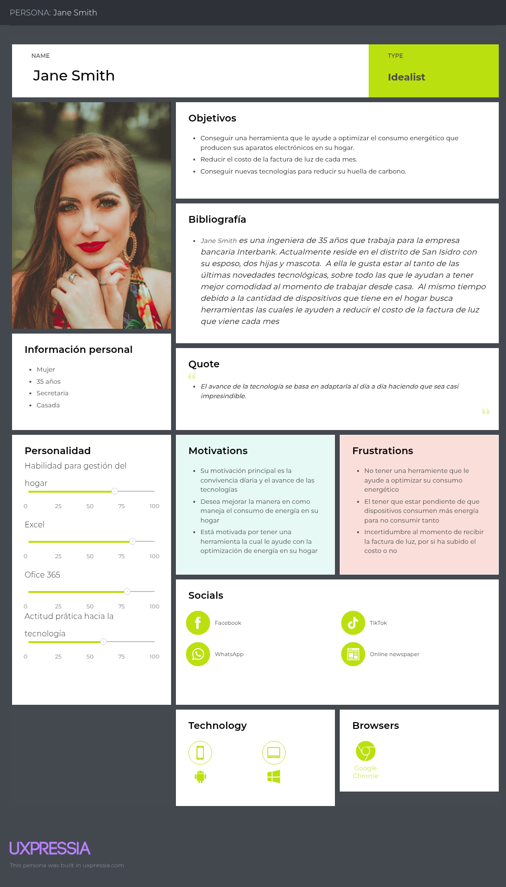
#
- **User Persona para Estudiantes**

  La "User Person" de Marío Nuñez representa a los estudiantes que alquilan viviendas. Interesados en reducir su consumo energético para poder ahorrar dinero para sus demás necesidades. Marío Nuñez de 20 años es un estudiante de la carrera de ingenieria de software, utiliza herrameientas tecnológicas de modernas debido a que su carre lo demanda. Sus motivaciones son poder disminuir el consumo energético generado cada mes. Sus frustaciones son los elevados costos de la factura de luz lo que le obliga a gastar de más del preosupuesto que tenía para el mes.
    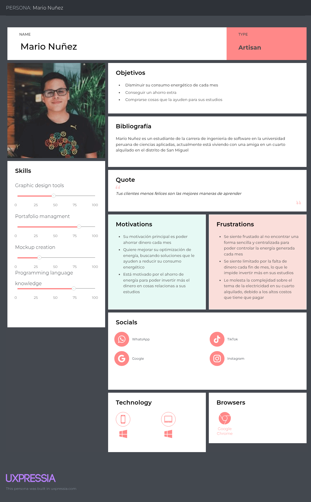


### 2.3.2. User Task Matrix.

Para el desarrollo del proyecto, se ha compilado un User Task Matrix, el cual resume las actividades esenciales de los dos grupos de personas investigados. Este recurso sirve para identificar las acciones principales de cada tipo de usuario, además de evaluar la periodicidad y la importancia que cada uno le atribuye. El conocimiento extraído de este análisis es crucial para definir las prioridades en el diseño de la herramienta digital, lo que asegura que su concepción esté alineada con las exigencias auténticas de los usuarios.

<table border="1">
    <thead>
        <tr>
            <th rowspan="2">N°</th>
            <th rowspan="2">Task Matrix</th>
            <th colspan="2">Jane Smith</th>
            <th colspan="2">Mario Núñez</th>
        </tr>
        <tr>
            <th>Frequency</th>
            <th>Importance</th>
            <th>Frequency</th>
            <th>Importance</th>
        </tr>
    </thead>
    <tbody>
        <tr>
            <td>1</td>
            <td>Registrarse y configurar cuenta</td>
            <td>Once</td>
            <td>High</td>
            <td>Once</td>
            <td>High</td>
        </tr>
        <tr>
            <td>2</td>
            <td>Conectar dispositivos</td>
            <td>Often</td>
            <td>High</td>
            <td>Sometimes</td>
            <td>High</td>
        </tr>
        <tr>
            <td>3</td>
            <td>Revisar consumo en tiempo real</td>
            <td>Always</td>
            <td>High</td>
            <td>Always</td>
            <td>High</td>
        </tr>
        <tr>
            <td>4</td>
            <td>Recibir alertas de consumo elevado</td>
            <td>Always</td>
            <td>High</td>
            <td>Sometimes</td>
            <td>High</td>
        </tr>
        <tr>
            <td>5</td>
            <td>Apagar dispositivos a distancia</td>
            <td>Sometimes</td>
            <td>High</td>
            <td>Sometimes</td>
            <td>Medium</td>
        </tr>
        <tr>
            <td>6</td>
            <td>Consultar reportes semanales</td>
            <td>Often</td>
            <td>High</td>
            <td>Sometimes</td>
            <td>High</td>
        </tr>
        <tr>
            <td>7</td>
            <td>Establecer metas de ahorro</td>
            <td>Sometimes</td>
            <td>High</td>
            <td>Always</td>
            <td>High</td>
        </tr>
        <tr>
            <td>8</td>
            <td>Comparar consumo entre periodos</td>
            <td>Sometimes</td>
            <td>High</td>
            <td>Sometimes</td>
            <td>Medium</td>
        </tr>
        <tr>
            <td>9</td>
            <td>Seguir recomendaciones personalizadas</td>
            <td>Often</td>
            <td>High</td>
            <td>Sometimes</td>
            <td>High</td>
        </tr>
        <tr>
            <td>10</td>
            <td>Compartir resultados</td>
            <td>Rarely</td>
            <td>Medium</td>
            <td>Rarely</td>
            <td>Medium</td>
        </tr>
        <tr>
            <td>11</td>
            <td>Programar encendido/apagado automático de dispositivos</td>
            <td>Sometimes</td>
            <td>High</td>
            <td>Rarely</td>
            <td>Medium</td>
        </tr>
        <tr>
            <td>12</td>
            <td>Acceder desde diferentes dispositivos</td>
            <td>Often</td>
            <td>High</td>
            <td>Always</td>
            <td>High</td>
        </tr>
        <tr>
            <td>13</td>
            <td>Acceder a asesoría personalizada para mejorar la eficiencia energética de su hogar</td>
            <td>Rarely</td>
            <td>High</td>
            <td>Rarely</td>
            <td>Medium</td>
        </tr>
        <tr>
            <td>14</td>
            <td>Recibir proyecciones de la factura mensual con base en consumo actual</td>
            <td>Often</td>
            <td>High</td>
            <td>Sometimes</td>
            <td>High</td>
        </tr>
    </tbody>
</table>

El análisis del User Task Matrix revela tareas que resultan altamente frecuentes y relevantes para cada segmento objetivo:

* Tareas con mayor frecuencia e importancia en ambos segmentos:

    + Para propietarios de vivienda (Jane Smith): revisar el consumo en tiempo real, recibir alertas de picos energéticos y consultar reportes semanales son acciones fundamentales, realizadas con alta frecuencia y consideradas de máxima importancia.

    + Para estudiantes que alquilan (Mario Núñez): revisar el consumo en tiempo real, recibir recordatorios de desconexión de cargadores y dividir el consumo con compañeros destacan como las más relevantes, ya que se alinean directamente con su necesidad de ahorro inmediato.


* Diferencias clave entre segmentos:

    + Los propietarios valoran tareas más estratégicas, como programar encendido/apagado automático, recibir proyecciones de la factura mensual y acceder a asesoría personalizada, pues buscan optimización detallada y control financiero a largo plazo.

    + Los estudiantes, en cambio, priorizan tareas prácticas y rápidas, como compartir resultados con compañeros, recibir recordatorios simples y comparar su consumo con otros usuarios similares, motivados principalmente por un presupuesto limitado y la simplicidad.


* Coincidencias entre segmentos:

    + Ambos grupos consideran de gran importancia la visualización del consumo en tiempo real y la recepción de alertas sobre gastos elevados.

    + También coinciden en el valor de las recomendaciones personalizadas, aunque los propietarios las aplican de manera más analítica, mientras que los estudiantes las usan de forma más básica.

Este análisis permite enfocar el diseño de la plataforma en torno a las tareas más críticas de cada grupo: control avanzado y planificación para propietarios, y ahorro inmediato y facilidad de uso para estudiantes, lo que facilita priorizar funcionalidades en el backlog y asegurar que cada segmento perciba un alto valor en el sistema.

### 2.3.3. User Journey Mapping.

Con el propósito de profundizar en la comprensión de los perfiles de usuario y su relación con el consumo energético, se elaboraron Customer Journey Maps mediante la herramienta UXPressia. Esta dinámica permitió representar de forma clara el camino que recorren los usuarios desde que detectan una necesidad hasta la valoración final de la solución, identificando tanto sus motivaciones como los obstáculos que enfrentan.

El análisis se enfocó en dos perfiles representativos:

1. Jane Smith, ingeniera y propietaria de vivienda interesada en soluciones confiables que le permitan gestionar el consumo energético de toda su familia.

1. Mario Núñez, estudiante universitario que alquila un cuarto y busca herramientas simples y económicas para reducir el gasto en electricidad.

Cada Journey Map contempla:

- Las etapas principales del recorrido (conciencia, búsqueda, adopción, uso y evaluación).

- Los objetivos específicos en cada fase.

- Los procesos y canales empleados por los usuarios.

- Las emociones que experimentan, expresadas mediante un sistema visual de sentimientos.

- Los puntos de fricción y las oportunidades de mejora detectadas.

El uso de UXPressia facilitó plasmar de manera visual y ordenada estas experiencias, aportando una mirada empática que enriquece la toma de decisiones. Gracias a este ejercicio, se pudo comprender mejor las diferencias entre estudiantes y propietarios, y orientar el diseño de soluciones más útiles, accesibles y alineadas con sus necesidades reales.

**Segmento objetivo #1: Propietarios de Vivienda**

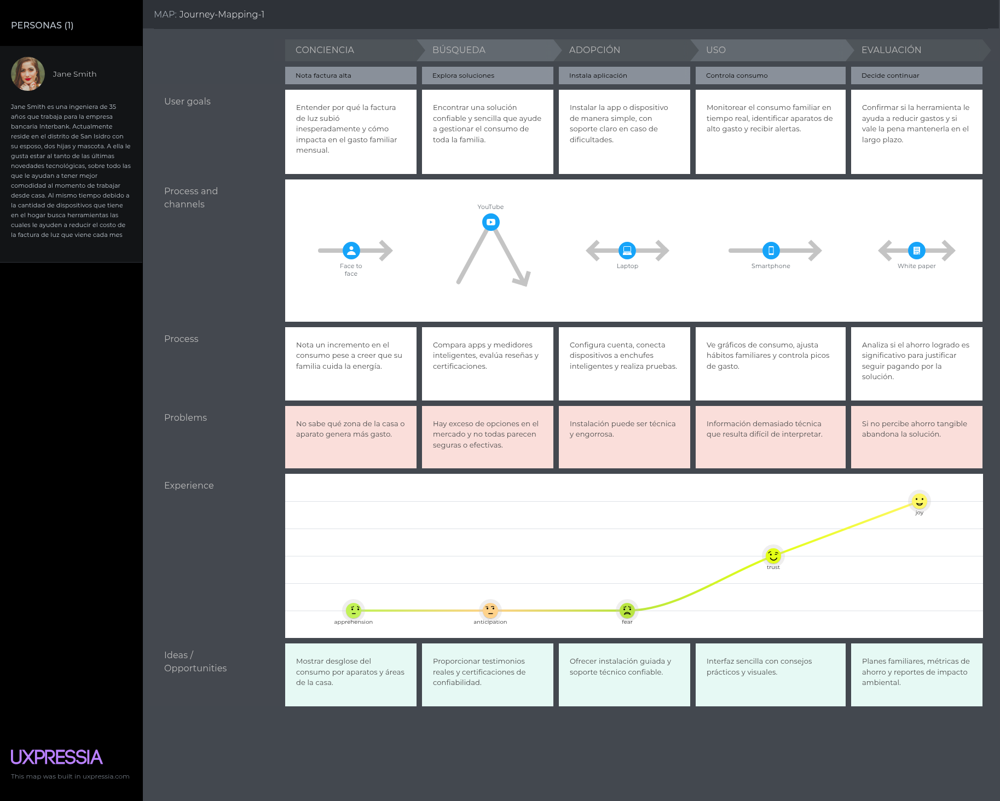

**Segmento objetivo #2: Estudiantes que alquilan**

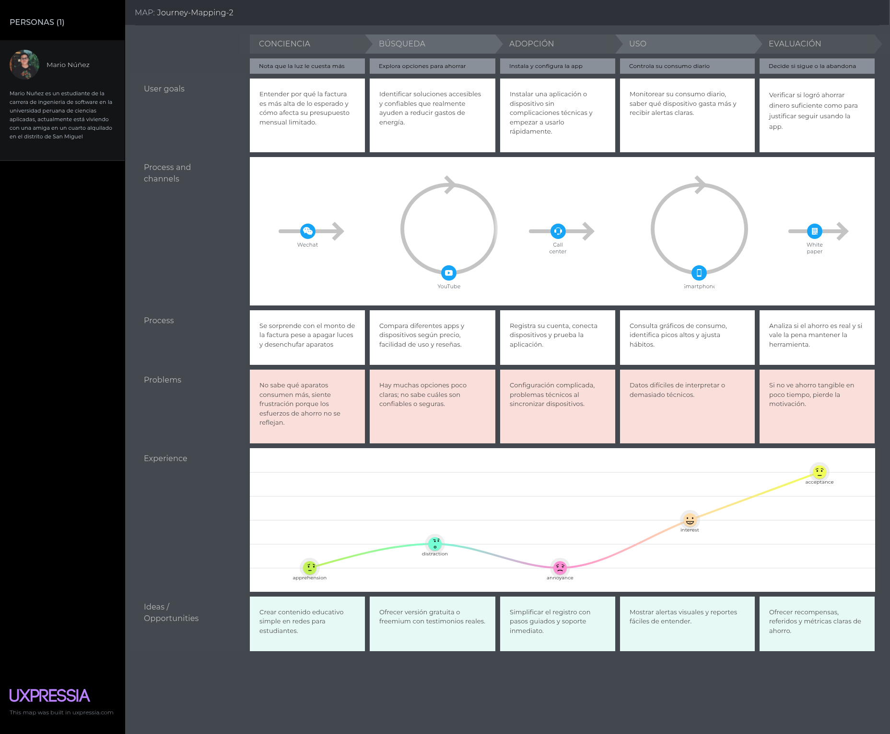

### 2.3.4. Empathy Mapping.

En esta sección, se desarrollaron los Empathy Maps de cada segmento objetivo. Se utilizó una plantilla 
de UXPressia que contiene los apartados que debe tener el Empathy Map junto a preguntas que se 
respondieron conforme a lo identificado de nuestro segmento objetivo para desarrollar este artefacto.

**Segmento objetivo #1: Propietarios de Vivienda**

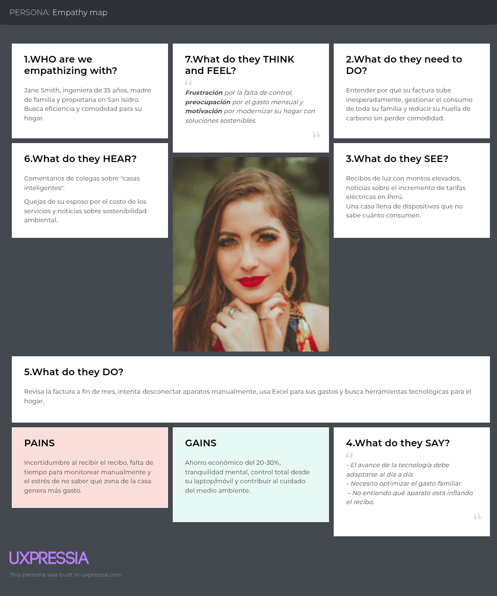

**Segmento objetivo #2: Estudiantes que alquilan**

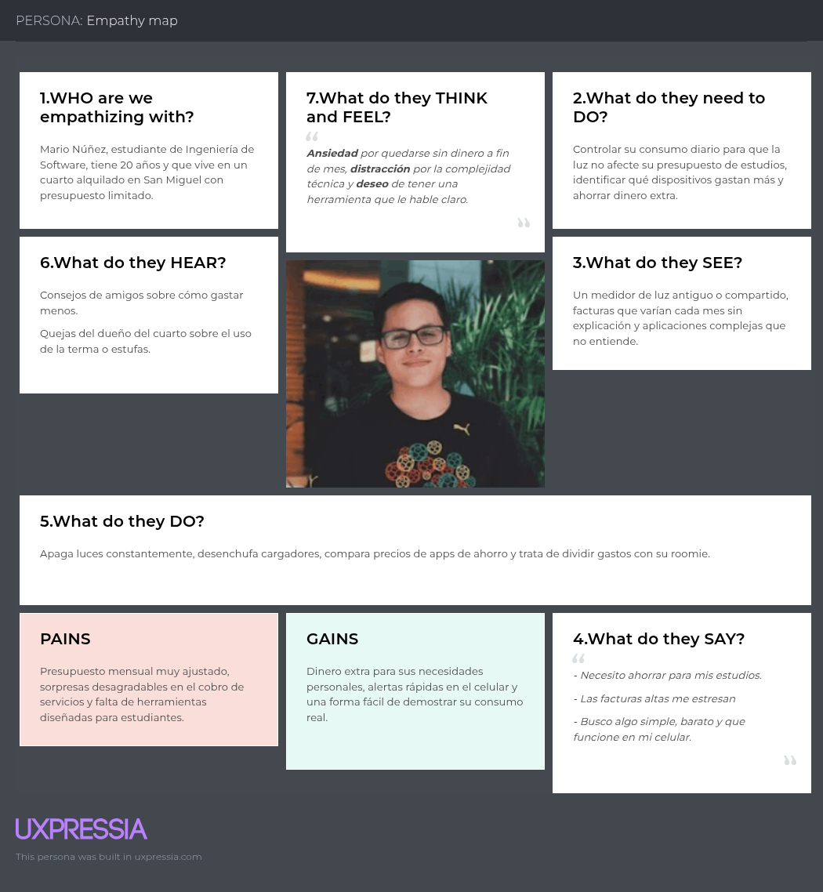

### 2.3.5. As-is Scenario Mapping.

**Segmento objetivo #1: Propietarios de Vivienda**

<table border="1px">
    <thead>
        <tr>
            <th colspan="5">As-is Scenario Mapping: Jane Smith (Gestión Familiar Tradicional)</th>
        </tr>
    </thead>
    <tbody>
        <tr>
            <td style="font-weight: bold;">Phases</td>
            <td style="font-weight: bold;">Notar incremento del gasto (Recepción del recibo)</td>
            <td style="font-weight: bold;">Búsqueda de culpables (Inspección)</td>
            <td style="font-weight: bold;">Intervención manual</td>
            <td style="font-weight: bold;">Evaluación de resultados</td>
        </tr>
        <tr>
            <td style="font-weight: bold;">Doing</td>
            <td>Recibe el recibo de luz y nota que el monto excede el presupuesto habitual.</td>
            <td>Hace un recorrido por toda la casa después del trabajo buscando posibles electrodomésticos causantes. Revisa si la terma se quedó encendida, si las niñas dejaron el televisor o las computadoras prendidas, e interroga a su esposo.</td>
            <td>Comienza a desconectar manualmente electrodomésticos en stand-by. Establece reglas de la casa estrictas sobre apagar luces y limita los horarios de uso de la lavadora y la terma eléctrica.</td>
            <td>Espera ansiosamente los 30 días para el cierre de facturación. Recibe el nuevo recibo y saca cuentas para comparar el monto ahorrado versus todo el tiempo y esfuerzo invertido en el mes.</td>
        </tr>
        <tr>
            <td style="font-weight: bold;">Thinking</td>
            <td>"¿Por qué el monto de este mes ha subido si nuestra rutina familiar, el teletrabajo y los horarios de las niñas han sido exactamente los mismos?"</td>
            <td>"Seguro alguien dejó la terma encendida todo el día o las computadoras del trabajo remoto están consumiendo de más. El problema es que es imposible saberlo a simple vista."</td>
            <td>"Es agotador tener que estar detrás de toda mi familia como si fuera un policía de la energía. Ojalá este nivel de estrés y esfuerzo diario sirva para bajar la cuenta a fin de mes."</td>
            <td>"Tanto sacrificio, tantas llamadas de atención en casa, y el ahorro final fue mínimo. Definitivamente necesito una herramienta tecnológica que automatice todo esto, no puedo seguir así."</td>
        </tr>
        <tr>
            <td style="font-weight: bold;">Feeling</td>
            <td>Preocupación inicial, sorpresa desagradable y molestia por la alteración de su presupuesto mensual.</td>
            <td>Frustración por no tener datos claros, incertidumbre al no saber qué aparato es el verdadero problema en la casa.</td>
            <td>Estrés por la carga mental, cansancio por la supervisión constante y tensión por posibles discusiones familiares.</td>
            <td>Decepción total, resignación ante un problema que parece inmanejable y sensación de haber perdido el tiempo.</td>
        </tr>
    </tbody>
</table>

**Segmento objetivo #2: Estudiantes que alquilan**

<table border="1px">
    <thead>
        <tr>
            <th colspan="5">As-is Scenario Mapping: Mario Núñez (Supervivencia Presupuestaria)</th>
        </tr>
    </thead>
    <tbody>
        <tr>
            <td style="font-weight: bold;">Phases</td>
            <td style="font-weight: bold;">Sorpresa del mes</td>
            <td style="font-weight: bold;">Investigación técnica</td>
            <td style="font-weight: bold;">Prácticas extremas</td>
            <td style="font-weight: bold;">Revisión de billetera</td>
        </tr>
        <tr>
            <td style="font-weight: bold;">Doing</td>
            <td>Revisa la aplicación de su banco para ver sus finanzas. Se da cuenta de que el pago fraccionado de la luz junto con su compañera de cuarto es excesivamente alto y descuadra totalmente sus finanzas.</td>
            <td>Entra a YouTube, foros de tecnología y Google buscando "cuántos watts consume una laptop encendida" o "aparatos que gastan más luz". Intenta calcular manualmente su consumo diario.</td>
            <td>Toma medidas drásticas: deja de usar el microondas, se queda estudiando hasta tarde en la biblioteca de la universidad para no gastar luz, y desconecta absolutamente todo al salir de su cuarto.</td>
            <td>Llega el siguiente recibo. Se sienta con su compañera de cuarto a dividir el gasto nuevamente y comprueba si los sacrificios extremos del mes valieron la pena.</td>
        </tr>
        <tr>
            <td style="font-weight: bold;">Thinking</td>
            <td>"Esto no puede ser, si pago esta cantidad ahora me quedaré muy corto para los pasajes y los materiales de la universidad. ¿De dónde salió un cobro tan alto si casi no estamos aquí?"</td>
            <td>"Hay demasiada información y fórmulas en internet. Ninguna me dice exactamente qué es lo que está gastando tanta luz específicamente en mi cuarto."</td>
            <td>"Es súper incómodo y limitante vivir de esta manera, ya ni disfruto estar en mi propio cuarto, pero no tengo otra opción si no quiero gastar más a fin de mes."</td>
            <td>"Viví a oscuras y desconectado todo el mes, sacrifiqué mi comodidad por completo y el recibo bajó poquísimo. Tiene que haber una forma de saber en tiempo real en qué estoy gastando."</td>
        </tr>
        <tr>
            <td style="font-weight: bold;">Feeling</td>
            <td>Ansiedad inmediata, susto financiero y mucha preocupación por no llegar a fin de mes con su dinero.</td>
            <td>Confusión por el exceso de información técnica, frustración por no hallar respuestas claras e impotencia.</td>
            <td>Incomodidad, fastidio continuo.</td>
            <td>Desmotivación, sensación de esfuerzo inútil y resignación forzada ante un gasto ciego.</td>
        </tr>
    </tbody>
</table>

## 2.4. Ubiquitous Language.

- **SEMS**: Nombre del producto compuesto por cuatros palabras en inglés: "Smart" (Inteligente), "Energy"(Energía), "Management"(Gestión), "System"(Sistema).

- **Suscripción**: Un pago asociado a la funcionalidad de **SEMS** que ofrece tres planes diseñados para adaptarse a diferentes necesidades y niveles de consumo.

- **Monitoreo en tiempo real**: Información actualizda instantáneamente sobre los consumos energéticos de las diferentes viviendas.

- **Dashboard interactivo**: Herramienta visual de gestión de información que muestra gráficos del consumo de cada dispositivo.

- **Histórico de consumo**: Un registro del total de consumo generado por el usuario, que incluye detalles como fecha, hora, dispositivos registrados y total de consumo.

- **Control remoto básico**: Herramienta que permitirá al usuario poder controlar los dispositivos registrados en la base de datos.

- **Backend**: Infraestuctura que aloja y gestiona los datos de la apliacación, incluyendo la disponibilidad de espacios y la información de los usuarios.

- **Interfaz de usuario(UI)**: Parte visual de la aplicación con la que los usuarios interactúan para realizar monitoreos, recibir alertas y notifiaciones y controlar sus dispositivos.

- **Usuario**: Persona que utiliza la aplicación para monitoerar, gestionar su consumo y controlar sus dispositivos.

- **Alertas de consumo inusual**: Alertas enviadas,en tiempo real, al usuario para informarles sobre picos inusuales de consumo de energía detectados.

- **Recomendaciones inteligentes**: Notificaciones personalizadas hacia el usuario brindándoles consejos únicos para que optimizar sus consumos energéticos. 

# Capítulo III: Requirements Specification

## 3.1. To-Be Scenario Mapping.

**Segmento objetivo #1: Propietarios de Vivienda**

<table border="1px">
    <tbody>
        <tr>
            <td style="font-weight: bold;">Phases</td>
            <td style="font-weight: bold;">Notar incremento del gasto (Recepción del recibo)</td>
            <td style="font-weight: bold;">Búsqueda de culpables (Inspección)</td>
            <td style="font-weight: bold;">Intervención manual</td>
            <td style="font-weight: bold;">Evaluación de resultados</td>
        </tr>
        <tr>
            <td style="font-weight: bold;">Doing</td>
            <td>Recibe una alerta automática por consumo elevado y consulta la proyección de factura mensual para notar que el gasto está aumentando antes de finalizar el periodo.</td>
            <td>Ingresa al sistema y revisa el panel de consumo en tiempo real y el ranking de dispositivos de alto consumo para identificar qué electrodoméstico genera el incremento.</td>
            <td>Configura umbrales personalizados para ese dispositivo y solicita asesoría personalizada en eficiencia energética para reducir el gasto en el hogar.</td>
            <td>Consulta el reporte semanal y compara el consumo entre periodos para verificar si el consumo disminuyó respecto a la semana anterior.</td>
        </tr>
        <tr>
            <td style="font-weight: bold;">Thinking</td>
            <td>“Qué bueno que la plataforma me avisó antes de que llegue el recibo final. Ahora puedo actuar rápido.”</td>
            <td>“Ahora sé exactamente qué dispositivo está consumiendo más energía.”</td>
            <td>“Debo ajustar mis límites y seguir las recomendaciones para ahorrar.”</td>
            <td>“El ahorro ya es visible y puedo comprobar si las acciones funcionaron.”</td>
        </tr>
        <tr>
            <td style="font-weight: bold;">Feeling</td>
            <td>Tranquilidad, control</td>
            <td>Confianza, alivio</td>
            <td>Determinación, comodidad</td>
            <td>Satisfacción, motivación</td>
        </tr>
    </tbody>
</table>

**Segmento objetivo #2: Estudiantes que alquilan**

<table border="1px">
    <tbody>
        <tr>
            <td style="font-weight: bold;">Phases</td>
            <td style="font-weight: bold;">Sorpresa del mes</td>
            <td style="font-weight: bold;">Investigación técnica</td>
            <td style="font-weight: bold;">Prácticas extremas</td>
            <td style="font-weight: bold;">Revisión de billetera</td>
        </tr>
        <tr>
            <td style="font-weight: bold;">Doing</td>
            <td>Consulta la proyección de factura mensual y nota que el monto estimado es mayor al esperado para su presupuesto.</td>
            <td>Revisa el consumo en tiempo real y el historial mensual para identificar qué dispositivos del cuarto o departamento consumen más energía.</td>
            <td>Configura alertas personalizadas y revisa consejos de ahorro energético en la sección de noticias y recomendaciones.</td>
            <td>Compara el consumo entre semanas y revisa el historial actualizado para comprobar si logró reducir el gasto.</td>
        </tr>
        <tr>
            <td style="font-weight: bold;">Thinking</td>
            <td>“Mi próximo recibo podría salirse de mi presupuesto.”</td>
            <td>“Necesito identificar rápido qué está consumiendo más.”</td>
            <td>“Voy a seguir los consejos y configurar alertas para evitar excesos.”</td>
            <td>“Espero que mis cambios realmente reduzcan el gasto.”</td>
        </tr>
        <tr>
            <td style="font-weight: bold;">Feeling</td>
            <td>Preocupación, urgencia</td>
            <td>Curiosidad, análisis</td>
            <td>Enfoque, esperanza</td>
            <td>Alivio, satisfacción</td>
        </tr>
    </tbody>
</table>


## 3.2. User Stories.

En el desarrollo de la plataforma se definieron nueve épicas que abarcan todo el recorrido del usuario: desde registrarse y gestionar su cuenta, recibir alertas, analizar reportes y optimizar su consumo energético.

Estas épicas se diseñaron tomando como base Domain-Driven Design (DDD), lo que permitió dividir el sistema en bounded contexts claros y funcionales. Gracias a esto, cada parte de la plataforma tiene responsabilidades bien definidas y puede crecer de manera independiente y escalable.

Las User Stories fueron redactadas siguiendo principios de User Experience (UX) y apoyadas en una arquitectura REST, lo que asegura que la interacción de los usuarios sea sencilla y fluida, al mismo tiempo que la parte técnica se mantiene ordenada y lista para integrarse con servicios distribuidos.

Cada User Story combina dos perspectivas:

* Una visión funcional, que explica lo que necesita el usuario y el valor que obtiene.

* Una visión técnica, con criterios de aceptación escritos en formato Dado–Cuando–Entonces, lo que facilita probar cada caso de uso y garantizar su cumplimiento.

Con este enfoque, las User Stories cubren áreas clave como la seguridad de cuentas, las alertas y notificaciones, los reportes y proyecciones, las herramientas de ahorro y la experiencia en la página de inicio.

| StoryID | Title                                              | Description                                                                                                                               | Acceptance Criteria                                                                                                                                                                                                                                                                                                                                                                                                                                                                                                                                                                                                               | Epic |
|---------|----------------------------------------------------|-------------------------------------------------------------------------------------------------------------------------------------------|-----------------------------------------------------------------------------------------------------------------------------------------------------------------------------------------------------------------------------------------------------------------------------------------------------------------------------------------------------------------------------------------------------------------------------------------------------------------------------------------------------------------------------------------------------------------------------------------------------------------------------------|------|
| US01    | Registro de cuenta                                 | Como usuario, quiero registrarme en la plataforma para acceder a todas las funcionalidades.                                               | Escenario 1: Registro válido<br><br>Dado que no dispongo de una cuenta<br>Cuando confirmo mi registro con datos completos y válidos<br>Entonces el sistema crea mi cuenta y la habilita<br><br><br><br>Escenario 2: Datos inválidos<br><br>Dado que ingreso datos incompletos o incorrectos<br>Cuando intento registrarme<br>Entonces el sistema rechaza el registro e informa los errores<br><br><br><br>Escenario 3: Correo duplicado<br><br>Dado que un correo ya está registrado<br>Cuando intento usarlo para crear otra cuenta<br>Entonces el sistema rechaza el proceso                                                    | EP01 |
| US02    | Inicio de sesión                                   | Como usuario, quiero autenticarme en la plataforma para gestionar mi consumo energético.                                                  | Escenario 1: Credenciales válidas<br><br>Dado que dispongo de una cuenta registrada<br>Cuando ingreso credenciales correctas<br>Entonces el sistema me concede acceso<br><br><br><br>Escenario 2: Contraseña incorrecta<br><br>Dado que la contraseña ingresada no es correcta<br>Cuando intento iniciar sesión<br>Entonces el sistema rechaza el acceso y muestra el error<br><br><br><br>Escenario 3: Cuenta inexistente<br><br>Dado que el correo ingresado no está registrado<br>Cuando intento iniciar sesión<br>Entonces el sistema rechaza el acceso y muestra el error                                                    | EP01 |
| US03    | Cerrar sesión de manera segura                     | Como usuario, quiero cerrar mi sesión de forma segura para proteger mi información.                                                       | Escenario 1: Cierre de sesión manual<br><br>Dado que el usuario tiene una sesión activa<br>Cuando solicita cerrar sesión<br>Entonces el sistema finaliza la sesión actual<br>Y muestra el mensaje: "Has cerrado sesión correctamente."<br><br><br><br>Escenario 2: Cierre de sesión automático por inactividad<br><br>Dado que el usuario permanece inactivo por un periodo prolongado<br>Cuando se supera el tiempo límite definido<br>Entonces el sistema cierra la sesión automáticamente                                                                                                                                      | EP01 |
| US04    | Conectar dispositivos                              | Como usuario, quiero vincular mis dispositivos eléctricos al sistema para supervisar su consumo.                                          | Escenario 1: Dispositivo detectado<br><br>Dado que dispongo de un dispositivo compatible<br>Cuando solicito conectarlo<br>Entonces el sistema lo vincula exitosamente<br><br><br><br>Escenario 2: Dispositivo no compatible<br><br>Dado que el dispositivo no es compatible<br>Cuando intento conectarlo<br>Entonces el sistema rechaza la conexión y muestra el error                                                                                                                                                                                                                                                            | EP02 |
| US05    | Monitorear consumo en tiempo real                  | Como usuario, quiero consultar el consumo energético en tiempo real para tomar decisiones inmediatas.                                     | Escenario 1: Consumo actualizado<br><br>Dado que el usuario tiene dispositivos conectados<br>Cuando consulta el panel de consumo<br>Entonces el sistema muestra la información actualizada en tiempo real<br>Y presenta el mensaje: "Consumo actualizado correctamente"<br><br><br><br>Escenario 2: Dispositivo desconectado<br><br>Dado que un dispositivo pierde la conexión<br>Cuando el usuario revisa el panel<br>Entonces el sistema indica que el dispositivo está sin datos en tiempo real<br>Y muestra el mensaje: "Dispositivo desconectado"                                                                            | EP02 |
| US06    | Generar alertas de consumo elevado                 | Como usuario, quiero recibir alertas automáticas cuando un dispositivo supere el consumo establecido como normal.                         | Escenario 1: Envío de alerta por exceso de consumo<br><br>Dado que un dispositivo supera un umbral definido<br>Cuando ocurre este exceso de consumo<br>Entonces el sistema envía una alerta inmediata al usuario<br>Y muestra el mensaje: "Alerta: consumo elevado detectado"<br><br><br><br>Escenario 2: Registro de alerta en historial<br><br>Dado que se genera una alerta por exceso de consumo<br>Cuando el usuario consulta el historial de notificaciones<br>Entonces el sistema muestra la alerta registrada con fecha y hora<br>Y acompaña la entrada con el texto: "Historial de alertas actualizado"                  | EP03 |
| US07    | Configurar umbrales de alerta personalizados       | Como usuario, quiero establecer mis propios límites de consumo para recibir notificaciones adaptadas a mis necesidades                    | Escenario 1: Generación de alerta personalizada<br><br>Dado que el usuario define un límite de consumo<br>Cuando un dispositivo lo supera<br>Entonces el sistema genera la alerta según la configuración establecida<br>Y muestra el mensaje: "Tu dispositivo ha superado el límite configurado"<br><br><br><br>Escenario 2: Restablecimiento de valores por defecto<br><br>Dado que el usuario modifica los umbrales de consumo<br>Cuando solicita restablecer la configuración<br>Entonces el sistema aplica nuevamente los valores predeterminados<br>Y confirma con el mensaje: "Se han restablecido los valores por defecto" | EP03 |
| US08    | Consultar reporte semanal de consumo               | Como usuario, quiero revisar reportes semanales para conocer mi gasto energético desglosado por dispositivo.                              | Escenario 1: Generación automática del reporte<br><br>Dado que finalizó una semana de uso<br>Cuando el usuario consulta su informe<br>Entonces el sistema presenta el consumo total y el detalle por dispositivo<br><br><br><br>Escenario 2: Descarga del reporte en PDF<br><br>Dado que el usuario consulta su informe semanal<br>Cuando solicita la descarga<br>Entonces el sistema genera el reporte en formato PDF<br>Y confirma con el mensaje: "Tu reporte se ha descargado correctamente"                                                                                                                                  | EP04 |
| US09    | Comparar consumo entre periodos                    | Como usuario con plan premium, quiero comparar mi consumo en semanas o meses distintos para identificar patrones de gasto.                | Escenario 1: Comparación entre semanas<br><br>Dado que el usuario selecciona dos periodos de tiempo<br>Cuando solicita la comparación<br>Entonces el sistema muestra las diferencias en porcentajes y gráficos<br><br><br><br>Escenario 2: Comparación entre meses<br><br>Dado que el usuario selecciona dos meses específicos<br>Cuando genera la comparación<br>Entonces el sistema presenta los resultados en formato visual                                                                                                                                                                                                   | EP04 |
| US10    | Proyección de gasto mensual                        | Como usuario, quiero recibir una estimación de mi próximo gasto de electricidad con base en mi consumo actual.                            | Escenario 1: Proyección de factura activa<br><br>Dado que el sistema tiene acumulado el consumo actual<br>Cuando el usuario solicita la proyección<br>Entonces el sistema muestra el monto estimado de la próxima factura<br>Y presenta el mensaje: "Este es el monto estimado de tu próxima factura"<br><br><br><br>Escenario 2: Consumo insuficiente para proyección<br><br>Dado que el usuario recién comenzó a registrar su consumo<br>Cuando solicita una proyección<br>Entonces el sistema indica que no hay datos suficientes<br>Y muestra el mensaje: "No es posible calcular la proyección con los datos actuales"       | EP04 |
| US11    | Consultar historial de consumo mensual             | Como usuario, quiero consultar un historial de mi consumo mensual para identificar cambios en mi gasto energético.                        | Escenario 1: Visualización de historial<br><br>Dado que el usuario tiene consumos registrados en meses anteriores<br>Cuando accede a la sección de historial<br>Entonces el sistema muestra el consumo por cada mes<br><br><br><br>Escenario 2: Descarga de historial<br><br>Dado que el usuario consulta el historial mensual<br>Cuando solicita la descarga<br>Entonces el sistema genera un archivo en formato PDF                                                                                                                                                                                                             | EP04 |
| US12    | Consultar centro de ayuda                          | Como usuario, quiero acceder a un centro de ayuda con información y guías para resolver dudas comunes.                                    | Escenario 1: Acceso al centro de ayuda<br><br>Dado que el usuario selecciona la opción de ayuda<br>Cuando entra al apartado<br>Entonces el sistema muestra artículos y guías disponibles<br><br><br><br>Escenario 2: Búsqueda dentro del centro de ayuda<br><br>Dado que el usuario necesita resolver una duda específica<br>Cuando introduce una palabra clave en la búsqueda<br>Entonces el sistema lista los artículos relacionados                                                                                                                                                                                            | EP06 |
| US13    | Identificar dispositivos de alto consumo           | Como usuario, quiero identificar los dispositivos que generan mayor consumo energético para priorizar acciones de ahorro.                 | Escenario 1: Listado de dispositivos más consumidores<br><br>Dado que el sistema registra el consumo de cada dispositivo<br>Cuando el usuario consulta el ranking<br>Entonces el sistema presenta los dispositivos ordenados por mayor gasto<br><br><br><br>Escenario 2: Alerta por dispositivo crítico<br><br>Dado que un dispositivo supera ampliamente el consumo promedio<br>Cuando el sistema lo identifica<br>Entonces muestra el mensaje: "Este dispositivo registra un consumo inusualmente alto"                                                                                                                         | EP07 |
| US14    | Cambiar idioma de la plataforma                    | Como usuario, quiero cambiar el idioma de la plataforma entre español e inglés para comprender mejor la información según mi preferencia. | Escenario 1: Selección de idioma<br><br>Dado que el usuario se encuentra en la plataforma<br>Cuando selecciona un idioma disponible<br>Entonces el sistema actualiza el contenido a ese idioma<br>Y muestra el mensaje: "Idioma cambiado correctamente"<br><br><br><br>Escenario 2: Persistencia de idioma<br><br>Dado que el usuario seleccionó un idioma previamente<br>Cuando vuelve a iniciar sesión<br>Entonces el sistema mantiene la configuración del idioma elegido                                                                                                                                                      | EP09 |
| US15    | Consultar noticias y consejos de ahorro energético | Como usuario, quiero acceder a una sección con noticias y consejos para mantenerme informado y reducir mi consumo.                        | Escenario 1: Visualizar sección de noticias<br><br>Dado que el usuario accede a la plataforma<br>Cuando entra en la sección de noticias<br>Entonces el sistema muestra artículos informativos y consejos de ahorro<br><br><br><br>Escenario 2: Acceder a detalle de noticia<br><br>Dado que el usuario selecciona un artículo específico<br>Cuando abre la publicación<br>Entonces el sistema presenta el contenido completo                                                                                                                                                                                                      | EP09 |
| US16    | Consultar la propuesta de valor                    | Como visitante, quiero visualizar claramente la propuesta de valor de la plataforma para entender sus beneficios.                         | Escenario 1: Acceso a la propuesta de valor<br><br>Dado que el visitante accede a la landing page<br>Cuando visualiza la sección principal<br>Entonces el sistema muestra un encabezado con un mensaje sobre gestión inteligente de energía<br><br><br><br>Escenario 2: Revisión de beneficios<br><br>Dado que el visitante se encuentra en la propuesta de valor<br>Cuando revisa el contenido<br>Entonces el sistema presenta un conjunto de beneficios que incluyen ahorro, monitoreo, sostenibilidad, soporte y alertas                                                                                                       | EP10 |
| US17    | Acceder a preguntas frecuentes (FAQ)               | Como visitante, quiero acceder a una sección de preguntas frecuentes para resolver mis dudas sin necesidad de reporte.                    | Escenario 1: Visualización de FAQ<br><br>Dado que el visitante accede a la sección de preguntas frecuentes<br>Cuando carga la página<br>Entonces el sistema muestra una lista con las dudas más comunes de los usuarios<br><br><br><br>Escenario 2: Acceso a respuestas<br><br>Dado que el visitante selecciona una pregunta<br>Cuando consulta la información<br>Entonces el sistema despliega una respuesta breve que explica la funcionalidad o el servicio asociado                                                                                                                                                           | EP10 |
| US18    | Revisar planes de suscripción                      | Como visitante, quiero revisar los planes de suscripción para comparar precios y beneficios antes de decidir.                             | Escenario 1: Acceso a planes de suscripción<br><br>Dado que el visitante accede a la sección de suscripciones<br>Cuando revisa el contenido<br>Entonces el sistema muestra diferentes planes con precios y beneficios<br><br><br><br>Escenario 2: Comparación de planes<br><br>Dado que el visitante analiza las opciones<br>Cuando compara los planes<br>Entonces el sistema destaca las diferencias principales entre los niveles básico, intermedio y avanzado                                                                                                                                                                 | EP10 |
| US19    | Cambiar idioma                                     | Como visitante, quiero cambiar el idioma de la landing page entre español e inglés para entender mejor la información                     | Escenario 1: Traducción completa a inglés<br><br>Dado que el visitante accede a la Landing Page<br>Cuando selecciona el idioma inglés<br>Entonces el sistema presenta todos los textos de la página en inglés<br><br><br><br>Escenario 2: Traducción completa a español<br><br>Dado que el visitante accede a la Landing Page<br>Cuando selecciona el idioma español<br>Entonces el sistema muestra de forma consistente todo el contenido en español                                                                                                                                                                             | EP10 |

## 3.3. Product Backlog.

| # Orden | User Story Id | Título                                             | Descripción                                                                                                                               | Story Points (1 / 2 / 3 / 5 / 8) |
|---------|---------------|----------------------------------------------------|-------------------------------------------------------------------------------------------------------------------------------------------|----------------------------------|
| 1       | US01          | Registro de cuenta                                 | Como usuario, quiero registrarme en la plataforma para acceder a todas las funcionalidades.                                               | 3                                |
| 2       | US02          | Inicio de sesión                                   | Como usuario, quiero autenticarme en la plataforma para gestionar mi consumo energético.                                                  | 2                                |
| 3       | US03          | Cerrar sesión de manera segura                     | Como usuario, quiero cerrar mi sesión de forma segura para proteger mi información.                                                       | 1                                |
| 4       | US04          | Conectar dispositivos                              | Como usuario, quiero vincular mis dispositivos eléctricos al sistema para supervisar su consumo.                                          | 5                                |
| 5       | US05          | Monitorear consumo en tiempo real                  | Como usuario, quiero consultar el consumo energético en tiempo real para tomar decisiones inmediatas.                                     | 5                                |
| 6       | US06          | Generar alertas de consumo elevado                 | Como usuario, quiero recibir alertas automáticas cuando un dispositivo supere el consumo establecido como normal.                         | 3                                |
| 7       | US07          | Configurar umbrales de alerta personalizados       | Como usuario, quiero establecer mis propios límites de consumo para recibir notificaciones adaptadas a mis necesidades.                   | 3                                |
| 8       | US08          | Consultar reporte semanal de consumo               | Como usuario, quiero revisar reportes semanales para conocer mi gasto energético desglosado por dispositivo.                              | 2                                |
| 9       | US09          | Comparar consumo entre periodos                    | Como usuario con plan premium, quiero comparar mi consumo en semanas o meses distintos para identificar patrones de gasto.                | 3                                |
| 10      | US10          | Proyección de gasto mensual                        | Como usuario, quiero recibir una estimación de mi próximo gasto de electricidad con base en mi consumo actual.                            | 2                                |
| 11      | US11          | Consultar historial de consumo mensual             | Como usuario, quiero consultar un historial de mi consumo mensual para identificar cambios en mi gasto energético.                        | 2                                |
| 12      | US12          | Consultar centro de ayuda                          | Como usuario, quiero acceder a un centro de ayuda con información y guías para resolver dudas comunes.                                    | 1                                |
| 13      | US13          | Identificar dispositivos de alto consumo           | Como usuario, quiero identificar los dispositivos que generan mayor consumo energético para priorizar acciones de ahorro.                 | 2                                |
| 14      | US14          | Cambiar idioma de la plataforma                    | Como usuario, quiero cambiar el idioma de la plataforma entre español e inglés para comprender mejor la información según mi preferencia. | 2                                |
| 15      | US15          | Consultar noticias y consejos de ahorro energético | Como usuario, quiero acceder a una sección con noticias y consejos para mantenerme informado y reducir mi consumo.                        | 1                                |
| 16      | US16          | Consultar la propuesta de valor                    | Como visitante, quiero visualizar claramente la propuesta de valor de la plataforma para entender sus beneficios.                         | 2                                |
| 17      | US17          | Acceder a preguntas frecuentes (FAQ)               | Como visitante, quiero acceder a una sección de preguntas frecuentes para resolver mis dudas sin necesidad de reporte.                    | 3                                |
| 18      | US18          | Revisar planes de suscripción                      | Como visitante, quiero revisar los planes de suscripción para comparar precios y beneficios antes de decidir.                             | 5                                |
| 19      | US19          | Cambiar idioma                                     | Como visitante, quiero cambiar el idioma de la landing page entre español e inglés para entender mejor la información.                    | 5                                |

## 3.4. Impact Mapping.


# Capítulo IV: Product Design

## 4.1. Style Guidelines.

En esta seccion se establecen las bases con las que realizaremos y organizaremos la presentacion de nuestro proyecto. Se incluyen los General Style Guidelines y los Web Style Guidelines.

### 4.1.1. General Style Guidelines.
- En esta sección se detallarán las desiciones fundamentales y las referencias visuales utilizadas para definir aspectos principales del proyecto como los siguiente: Branding, tipografía, colores, spacing y tonos de comunicación.
- - Branding
- - - El nombre completo de nuestro servicio es "Smart Energix Manager".
- - - Para el dominio web y la aplicación, así como para ser más memorables se utilizará el nombre corto "Energix".
- - - El logo representa de forma directa y moderna la combinación de un hogar familiar de color azul con la silueta de un foco ahorrador junto a una hoja, superpuesto en el centro del marcador. Esta combinación visual comunica de manera clara la idea de optimizar el consumo energético en los hogares y reducir el impacto ambiental.    
      
- - Tipografía
- - - La tipografía principal seleccionada es Lato. Esta fuente fue elegida por su clásiscas proporciones, sobretodo en las mayúsculas dando así harmonía y elegancia a las oraciones motrando contemporaneidad sin ser abrumador.
- - - Tamaños:
- - - - Móvil: Títulos 50px, cuerpo y sibtítulos 20px.
- - - - Web: Títulos 50px, cuerpo y subtítulos 50px.
- - Colores
- - - Utilizaremos la siguiente paleta de colores:
        
- - - - Este azul moderno, representa confianza y presición para la navegación, Se usará en la parte del encabezado guiando al usuario de forma clara. Evocando la fiabilidad de las herrameintas establecidad.  #0277BD
- - - - Este tono de azul más claro, llamado "Alice Blue", representa frecusra y tranquilidad. Se usará en la parte inferior de la página web, dandole una la sensación al usuario de paz y pureza. #E1F5FE
- - - - Este gris cálido simple simboliza el punto neutro e imparcial representando comodidad y claridad. Se usará tanto en los botones de acción como en los subtítulos del pié de página. #808080
- - - - Este blanco básico representa la simpliciad e igualdad. Se utilizará en el fondo principal de la página web. #FFFFFF
- - - - Este negro original manifiesta elegancia a la vez que autorizad y sobresalta entre los demás. Será utilizado en los títulos de la parte de suscripciones y de la app móvil. #000000
- - Spacing
- - - El espacio en el diseño de Energix se enfocará en proporcionar una experiencia visual clara y accesible para el usuario, reflejando así los principios de claridad y orden. Del mismo modo se utilizrán márgenes amplios para resaltar elementos claves, como botones, imágenes y títulos, permitiendo una navegación fluida y amigable.
- - - Los títulos y subtítulos contarán con un espaciado vertical generoso, haciendo fácil la lectura y la jerarquización de la información. Los botones e íconos tendrán márgenes precisos para asegurar la consistencia.
- - Tonos de comunicación
- - - El tono de comunicación de Energix será amigable, cercano y orientado al usuario. Buscamos establecer una genuina conexión, utilizando un lenguaje claro y conciso, utilizando un lenaguaje claro y accesible, evitando así técnicismos innecesarios. Nuestra comunicación será positiva y alentadora, enfocándose en resaltar los beneficios que ofrecemos. Por último se priorizará la empatía y la comprensión de las necesidades del Usuario, ofreciendo ayuda y soporte de manera oportuna y efectiva. Queremos que el usuario se sienta valorado y escuchado en cada interacción

### 4.1.2. Web Style Guidelines.

Esta sección detalla los lineamientos visuales para los componentes de la landing page de Energix, con el objetivo de garantizar una identidad visual coherente, moderna y centrada en la eficiencia energética y la tecnología.

**Botones:**
- **Botones Principales:**
    - **Color de fondo:** Azul oscuro corporativo (#0D47A1).
    - **Color de texto:** Blanco puro (#FFFFFF) para un contraste óptimo.
    -  **Tipografía:** Sans-serif, peso medio, centrado.
    -  **Forma:** Rectangular con esquinas ligeramente redondeadas.

**Tono comunicacional:**
- Directo, profesional y decisivo. Invita al usuario a realizar acciones clave como "Suscribirse".

**Botones Secundarios:**
- **Color de fondo:** Blanco (#FFFFFF) o rojo para acciones específicas (#DC3545).
- **Color de texto:** Negro (#000000) o blanco, según el fondo.
- **Forma:** Esquinas redondeadas, estilo cápsula o rectangular.
- **Tono comunicacional:** Ofrece acciones alternativas de forma clara y visible, sin competir con el CTA principal.

**Header**
- **Texto:** Texto blanco (#FFFFFF) sobre un fondo azul (#02A9F4). Los botones de "EN" e "Inicia Sesión" utilizan texto azul sobre fondo blanco (#FFFFFF) para crear un llamado a la acción claro.
- **Tipografía:** Sans-serif, con un tamaño de 16px para los enlaces del menú de navegación.
- **Estilo:** Enlaces sin subrayado, con una alineación limpia y espaciado generoso entre elementos para una fácil navegación.
- **Tono:** Moderno, profesional y claro, transmitiendo confianza y facilidad de uso.

**Footer:**
- **Fondo:** Se utiliza un fondo blanco (#FFFFFF) para delimitar claramente el final de la página.
- **Texto:**
    - Sobre fondo blanco: Texto en negro (#000000) y gris (#555555).
- **Estructura:** Organizado en columnas para agrupar enlaces de interés, información de contacto y redes sociales.
- **Íconos:** Estilo lineal y simple, en color negro o blanco.
- **Tono:** Informativo, ordenado y profesional. Proporciona un cierre limpio y funcional a la experiencia de navegación.

**Secciones**
- **Fondo:** Predominan los fondos blancos (#FFFFFF) y azules claros (#E1F5FE) para las tarjetas y el contenido principal, creando un diseño limpio y espacioso. Se utilizan azules más oscuros (#0D47A1, #02A9F4) para cabeceras, pies de página y secciones destacadas, generando contraste.
- **Bordes:** Bordes consistentemente redondeados en tarjetas, botones y elementos de la interfaz para una apariencia suave y moderna.
- **Tono:** Profesional, tecnológico y limpio, con un uso generoso del espacio en blanco para facilitar la lectura.

**Iconografía**
- **Estilo:** Lineal y minimalista. Los iconos son simples, claros y fácilmente reconocibles (p. ej., redes sociales, signos de suma, marcas de verificación).
- **Colores:** Principalmente monocromáticos en negro (#000000) o blanco (#FFFFFF) para una máxima legibilidad. En secciones específicas, se utiliza el azul principal (#1A73E8) para dar énfasis.
- **Tono:** Funcional y coherente, asegurando que los iconos apoyen el contenido sin distraer.

**Paleta de Colores Principal**
- **Azules:**
    - **#0D47A1 (Azul oscuro):** Usado en CTAs y elementos de énfasis. Transmite confianza y seriedad.
    - **#02A9F4 (Azul cian):** Utilizado en fondos de tarjetas y secciones destacadas. Aporta un toque tecnológico y fresco.
    - **#E1F5FE (Azul claro):** Para fondos sutiles y estados hover.
- **Neutros:**
    - **#FFFFFF (Blanco):** Color principal para fondos y texto sobre fondos oscuros. Aporta limpieza y espacio.
    - **#000000 (Negro):** Para textos principales, fondos de footer y elementos de alto contraste.
    - **#555555 (Gris oscuro):** Para textos secundarios y detalles.
- **Acentos:**
    - **#DC3545 (Rojo):** Reservado para acciones de cancelación o advertencia.

**Tono Comunicacional General**
- **Profesional y Tecnológico:** El lenguaje y el diseño reflejan una marca experta en soluciones de energía.
- **Claro y Directo:** La comunicación es concisa, facilitando al usuario la comprensión de los beneficios y el uso del sistema.
- **Confiable y Eficiente:** Transmite seguridad y resalta el ahorro y la sostenibilidad como valores clave.

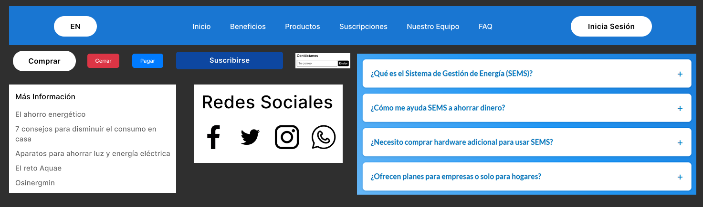
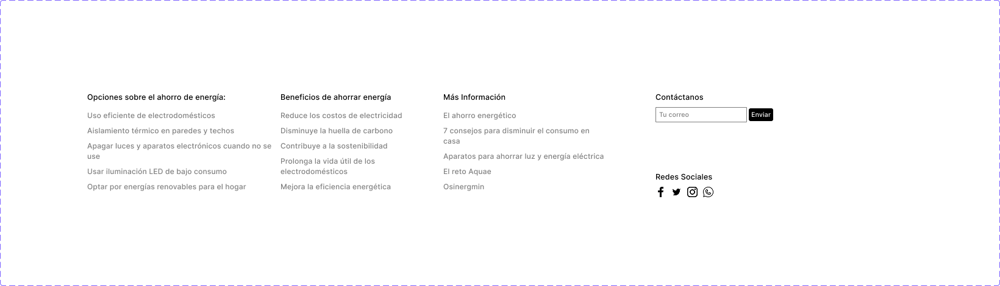
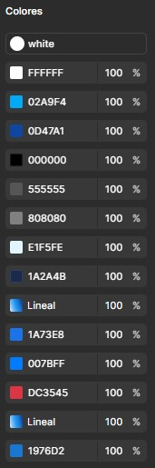

### 4.1.3. Mobile Style Guidelines.

**No aplica.** El alcance del producto Energix (Smart Energy Management System) comprende Landing Page, Web Application y RESTful API; no contempla el desarrollo de una aplicación móvil nativa en esta fase del proyecto, por lo que no se definen guías de estilo específicas para plataformas móviles.

#### 4.1.3.1. iOS Mobile Style Guidelines.

No aplica (ver 4.1.3).

#### 4.1.3.2. Android Mobile Style Guidelines.

No aplica (ver 4.1.3).

## 4.2. Information Architecture.

En esta seccion mostramos las decisiones de Arquitectura de Informacion para organizar el contenido de nuestra aplicacion de tal manera que los usuarios puedan tener una experiencia eficiente. Se incluyen las secciones de Organization Systems, Labeling Systems, Navigation Systems y Searching Systems.

### 4.2.1. Organization Systems.

Aplicación web:
Dentro de la app, el sistema de organización se basa en un menú lateral que agrupa las funciones principales (Dashboard, ../..s, Consumo, Configuración, Perfil). Esto permite que el usuario mantenga un control claro de su progreso y pueda acceder rápidamente a las herramientas según sus metas.

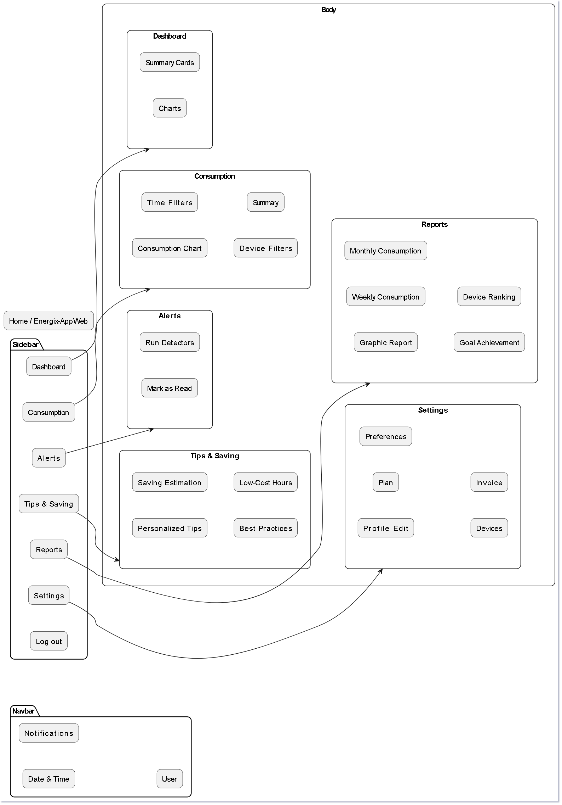

### 4.2.2. Labeling Systems.

Al acceder a la plataforma web de Energix, los usuarios pueden explorar los servicios, productos y planes de suscripción. La página está diseñada para informar sobre los beneficios de la gestión energética inteligente y convertir visitantes en clientes.

**Navbar (Menú Principal):**

- **"Inicio"**: Redirige a la sección principal de bienvenida de la página.
- **"Beneficios"**: Muestra las ventajas clave del sistema, como el ahorro y el monitoreo.
- **"Productos"**: Presenta el hardware disponible, como el "Enchufe Inteligente".
- **"Suscripciones"**: Detalla los diferentes planes de pago (Básico, Premium, Anual).
- **"Nuestro Equipo"**: Presenta a los miembros del equipo detrás de Energix.
- **"FAQ"**: Lleva a la sección de preguntas frecuentes.
- **"EN/ES":** Botón para alternar el idioma de la página entre inglés y español.
- **"Iniciar Sesión"**: Botón para que los usuarios registrados accedan a la plataforma SEMS.

**Secciones Principales:**

- **"¡Energix tiene la solución!"**: Encabezado principal de bienvenida que capta la atención del usuario.
- **"¿Por qué Elegir Energix?"**: Sección que detalla las características principales: "Ahorro Energético", "Monitoreo en Tiempo Real", "Cuidado del Medio Ambiente", "Soporte Técnico", "Alertas Personalizadas" y "Acceso a SEMS".
- **"Productos"**: Presentación de 5 prodcutos que pueden ayudarte en la tarea de ahorrar y de alientan a la acción de "Comprar".
- **"Suscripciones"**: Tabla comparativa de los planes "Básico", "Premium" y "Anual", cada uno con un botón de "Suscribirse".
- **"About The Team"**: Describe la "Misión", "Visión" y "Valores" de la Startup.
- **"Nuestro Equipo"**: Muestra los perfiles de los integrantes del proyecto.
- **"Preguntas Frecuentes"**: Área interactiva para resolver las dudas más comunes de los usuarios.

**Formulario de Suscripción (Footer):**

- **"Tu correo"**: Campo para que el usuario ingrese su dirección de email.
- **"Enviar"**: Botón para suscribirse al boletín o solicitar información.

**Pie de Página:**

- **"Opciones sobre el ahorro de energía"**: Enlaces a artículos o guías sobre eficiencia energética.
- **"Beneficios de ahorrar energía"**: Acceso rápido a información sobre las ventajas económicas y ecológicas.
- **"Más información"**: Enlaces a recursos externos y temas de interés relacionados.
- **"Contáctanos"**: Sección con el formulario de suscripción por correo.
- **"Redes Sociales"**: Iconos que enlazan a los perfiles sociales de la empresa.

### 4.2.3. SEO Tags and Meta Tags
- Los SEO Tag y Meta Tags ayudarán a que la página estática y la aplicación web sea posible de analizar fácilmente y se pueda gestionar de manera eficiente y optima.

- **Charset:** Define la codificación de caracteres del documento:
  ```html 
  <meta charset="UTF-8" />
  ```
- **Compatibilidad IE: Asegura compatibilidad con versiones de Internet Explorer:**
  ```html 
  <meta http-equiv="X-UA-Compatible" content="IE=edge" />
  ```
- **Viewport:** Controla cómo se muestra la página en dispositivos móviles:
  ```html 
  <meta name="viewport" content="width=device-width, initial-scale=1.0" />
  ```
- **Título:** El título actual de la página:
  ```html 
  <title>Energix</title>
  ```

### 4.2.4. Searching Systems.

El sistema de búsqueda en Energix se centra en evitar la sobrecarga de información y en ayudar al usuario a localizar rápidamente los datos que necesita.

Opciones de búsqueda ofrecidas

Barra de búsqueda global: disponible en la Navbar para encontrar dispositivos, ../..s o alertas de forma directa.

Filtros específicos por módulo:

Consumo: filtros por tiempo (diario, semanal, mensual) y por dispositivo.

../..s: filtros por tipo de ../.. (semanal, mensual, cumplimiento de metas, ranking de dispositivos).

Alertas: filtros por estado (leídas/no leídas, activas/inactivas).

Consejos & Ahorro: filtros por categoría (buenas prácticas, estimación de ahorro, horarios de menor costo).

Visualización de los resultados de búsqueda

Los resultados se mostrarán en listas o gráficos, dependiendo del contexto:

En Consumo: los gráficos se actualizan dinámicamente según los filtros aplicados.

En ../..s: los ../..s filtrados aparecen en lista y pueden abrirse individualmente.

En Alertas: las alertas se muestran en un listado reducido según los criterios de búsqueda.

Resaltado de coincidencias: las palabras clave buscadas se destacan para facilitar la identificación de información relevante.

### 4.2.5. Navigation Systems.

El sistema de navegación en Energix está diseñado para guiar al usuario de forma intuitiva tanto en la Landing Page como en la Aplicación Web, asegurando que logre sus objetivos de manera eficiente.

#### Navegación en la Landing Page

Una barra de navegación superior con secciones principales: Inicio, Características, Planes, Contacto.

Botones de llamada a la acción (CTA) ubicados estratégicamente para llevar al usuario hacia el registro, inicio de sesión o exploración de funciones.

Estructura de desplazamiento (scrolling) con enlaces ancla para moverse entre secciones (ejemplo: beneficios, precios, testimonios).

#### Navegación en la Aplicación Web

Un sidebar fijo con los módulos clave: Dashboard, Consumo, Alertas, Consejos & Ahorro, ../..s, Configuración, Cerrar sesión.

Enlaces contextuales dentro de cada módulo para profundizar en funciones (ejemplo: en Consumo → filtros por dispositivo o por tiempo).

Una barra superior (Navbar) con accesos rápidos a Notificaciones, Fecha y Hora, Perfil de Usuario.

Estructura jerárquica clara: Sidebar (categorías principales) → Body (contenido detallado).

## 4.3. Landing Page UI Design.

El diseño de la landing page de Energix se ha concebido para ofrecer una experiencia visual atractiva y funcional, alineada con los objetivos de la plataforma. La estructura de la página está organizada en secciones claras que guían al usuario a través de la propuesta de valor, los productos y las opciones de suscripción. Cada sección ha sido diseñada con un enfoque en la usabilidad y la estética, utilizando una paleta de colores coherente y una tipografía legible que refuerza la identidad de la marca.

### 4.3.1. Landing Page Wireframe.
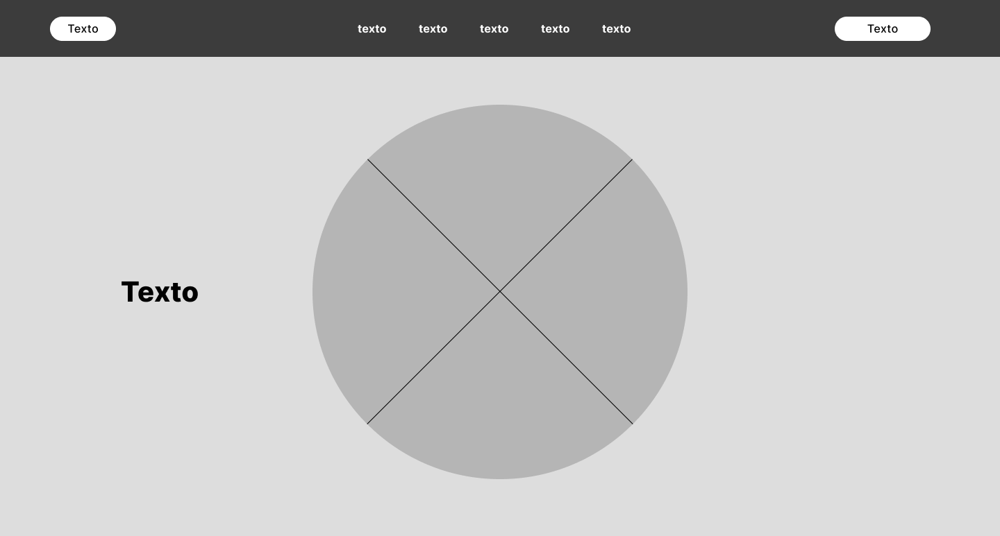
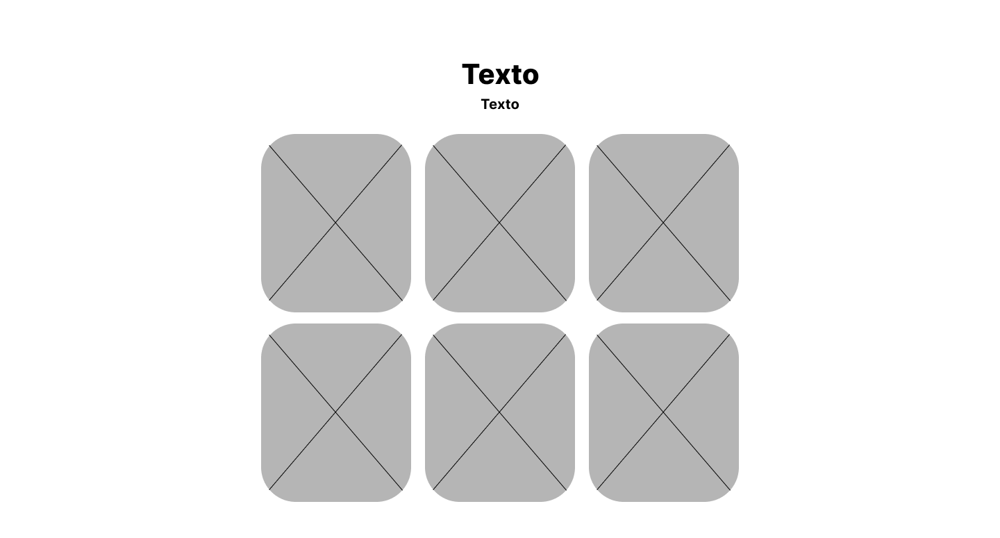

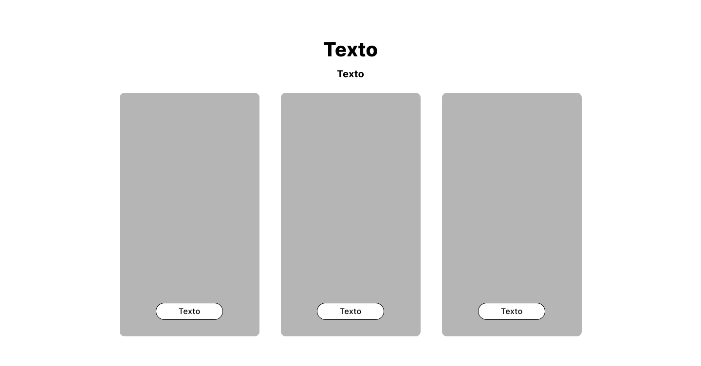
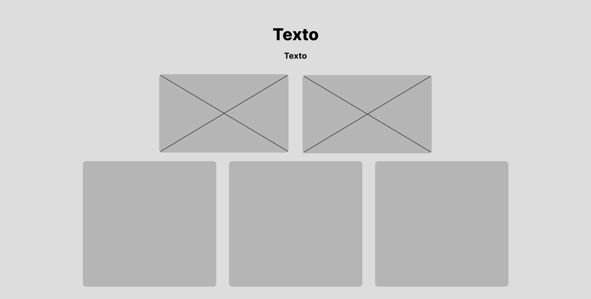
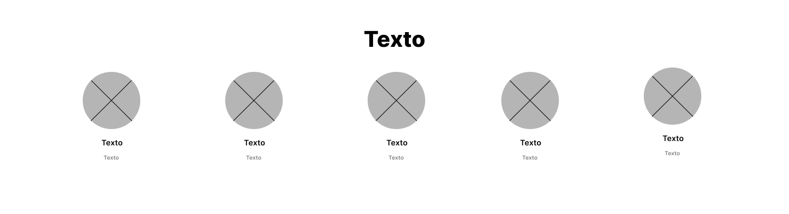
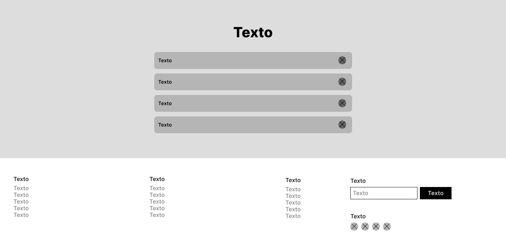

### 4.3.2. Landing Page Mock-up.


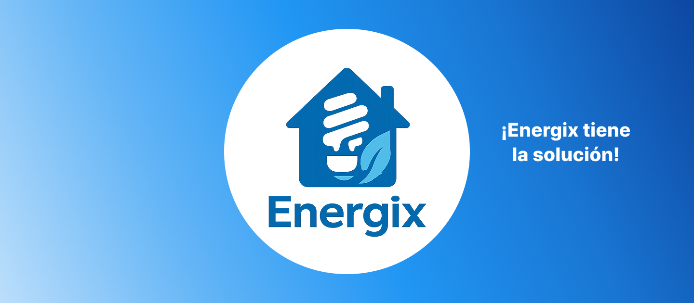
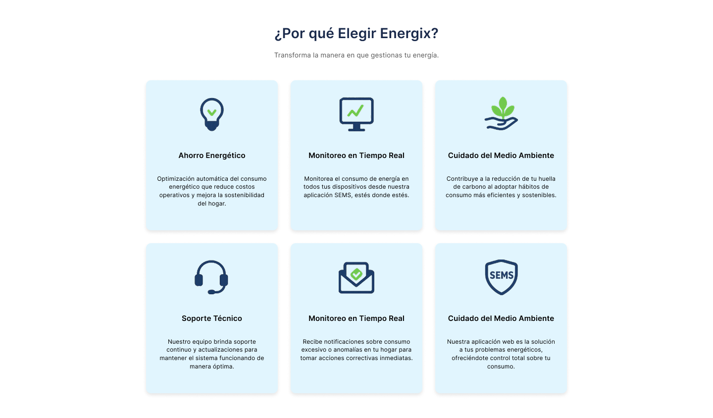
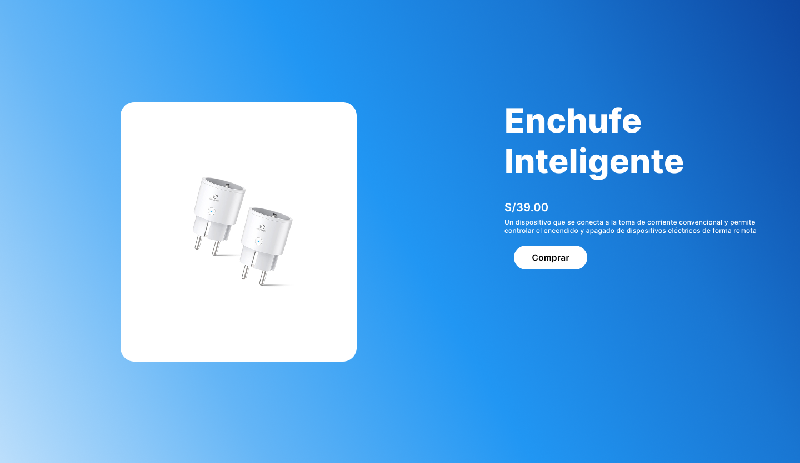
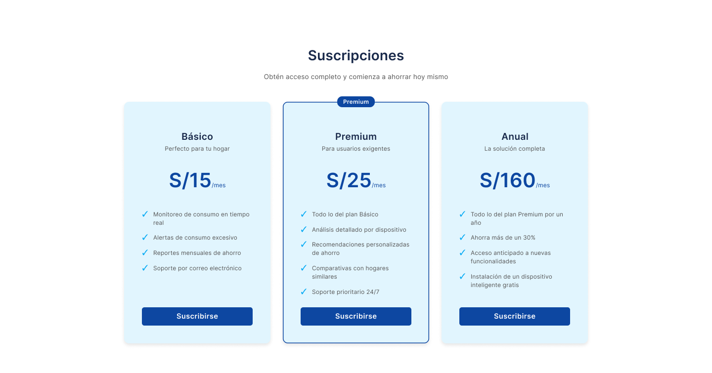
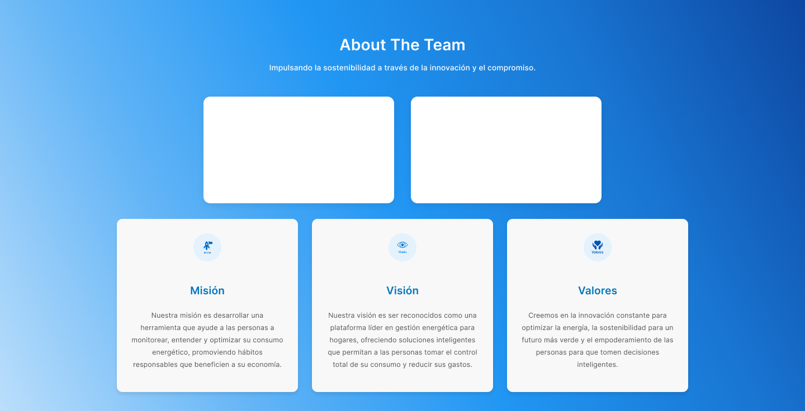
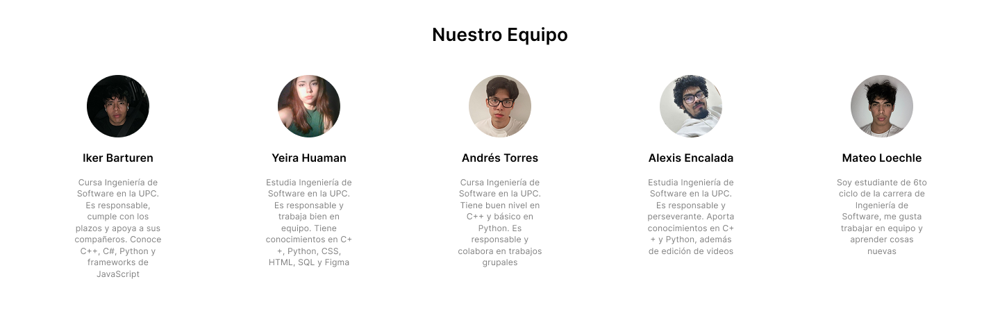
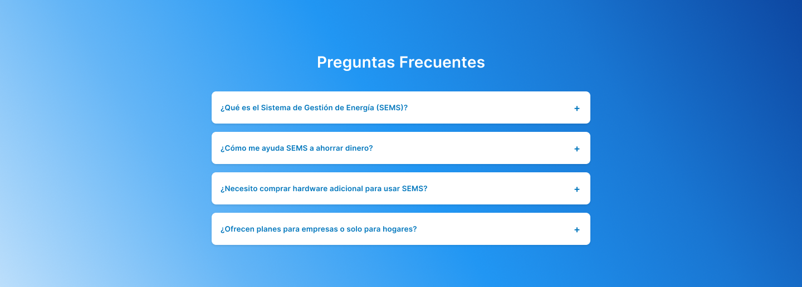
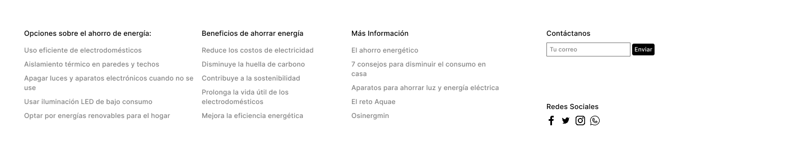

## 4.4. Mobile Applications UX/UI Design.

**No aplica.** El alcance del producto Energix (Smart Energy Management System) comprende Landing Page, Web Application y RESTful API; no contempla el desarrollo de una aplicación móvil nativa en esta fase del proyecto. Por ello no se elaboran wireframes, wireflow diagrams, mock-ups ni user flow diagrams para aplicaciones móviles.

### 4.4.1. Mobile Applications Wireframes.

No aplica (ver 4.4).

### 4.4.2. Mobile Applications Wireflow Diagrams.

No aplica (ver 4.4).

### 4.4.3. Mobile Applications Mock-ups.

No aplica (ver 4.4).

### 4.4.4. Mobile Applications User Flow Diagrams.

No aplica (ver 4.4).

## 4.5. Mobile Applications Prototyping.

**No aplica.** Al no contemplarse una aplicación móvil nativa en el alcance de Energix (ver 4.4), no se elaboran prototipos para Android ni iOS.

### 4.5.1. Android Mobile Applications Prototyping.

No aplica (ver 4.5).

### 4.5.2. iOS Mobile Applications Prototyping.

No aplica (ver 4.5).

## 4.6. Web Applications UX/UI Design.

La sección de Diseño UX/UI se centra en la arquitectura de la información, el diseño de la interfaz y la experiencia de usuario para las aplicaciones web de la solución Energix. Esta etapa abarca la creación de vistas funcionales y flujos de interacción completos, asegurando una experiencia intuitiva y centrada en el usuario.

Se elaboraron wireframes detallados para la versión de escritorio, definiendo la disposición de elementos en pantallas clave como el Dashboard principal, los ../..s de Consumo, la Gestión de Dispositivos y la Configuración de Preferencias. A partir de estos esquemas de baja fidelidad, se diseñaron los mockups de alta fidelidad, alineados con un sistema visual consistente que respeta los principios de simplicidad y claridad.

Los componentes y la navegación fueron organizados siguiendo flujos de usuario validados para garantizar que cada acción tenga un propósito claro dentro del recorrido del usuario. La estructura y las interacciones fueron pensadas para ofrecer una experiencia inclusiva, aplicando criterios de accesibilidad (a11y) y soporte para la visualización de datos en diferentes formatos. En los próximos sprints, se desarrollarán de manera progresiva las vistas, integrando las funcionalidades de monitoreo de energía en tiempo real y permitiendo la validación de las interacciones más importantes del sistema.

### 4.6.1. Web Applications Wireframes.

La fase de diseño de wireframes se ha enfocado en la creación meticulosa de la arquitectura visual y la experiencia de usuario para la solución digital de gestión de energía. Cada una de las vistas ha sido concebida como un componente fundamental que, al unirse, forma los flujos de interacción del usuario de manera fluida y lógica. Estos esquemas de baja fidelidad no solo definen la disposición de los elementos, sino que también establecen la jerarquía de la información, asegurando que cada acción y dato tengan un propósito claro. Son la estructura del producto, validando la funcionalidad y la navegación antes de proceder al diseño de alta fidelidad.


- Login: La puerta de entrada a la plataforma se presenta con un diseño minimalista y enfocado. La vista se centra en los campos de Username/Email y Password, que permiten al usuario autenticarse de forma segura. La progresión en este flujo es lineal y clara, guiando al usuario del ingreso de credenciales al botón principal de "Log in", con una opción secundaria para acceder a través de "Log in with Google".

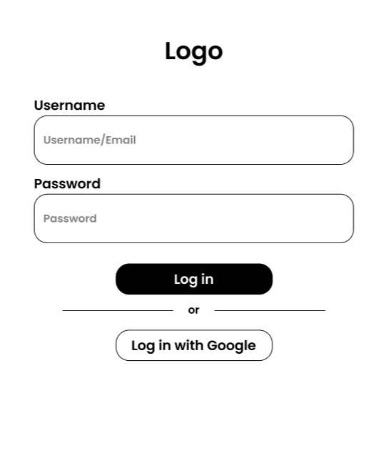


- Dashboard: Esta es la vista central de la aplicación y la primera que el usuario ve después de iniciar sesión. Se estructura como un panel de control con múltiples tarjetas que ofrecen un resumen del consumo de energía y las alertas clave. La información se presenta de forma progresiva, desde un resumen general hasta visualizaciones más detalladas como gráficos de línea, que muestran el consumo en diferentes períodos y por categoría. La sección de alertas y una lista de dispositivos ofrecen una vista de alto nivel y un acceso rápido a la información más importante.

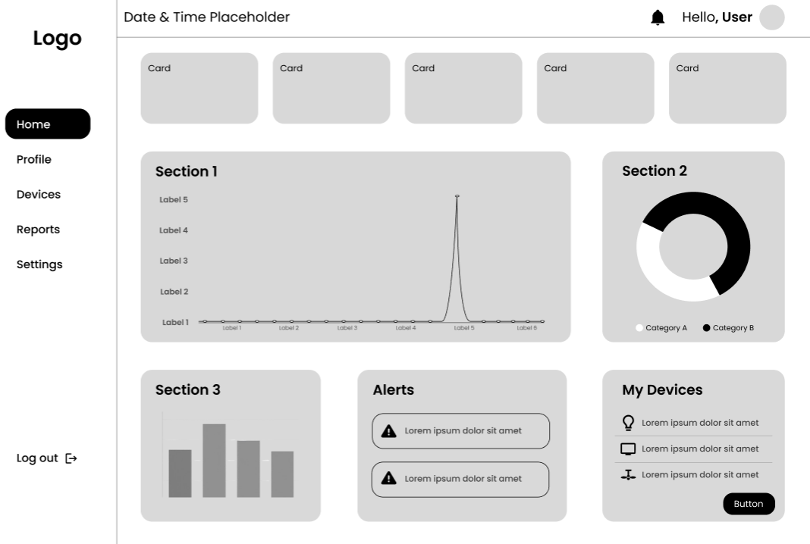


- Notifications (Pop-up): Este elemento es una ventana emergente que se superpone a la pantalla principal. Muestra una lista de mensajes y alertas importantes para el usuario, como alertas de alto consumo o recordatorios, asegurando que la información crítica sea visible de inmediato sin tener que navegar a otra sección.

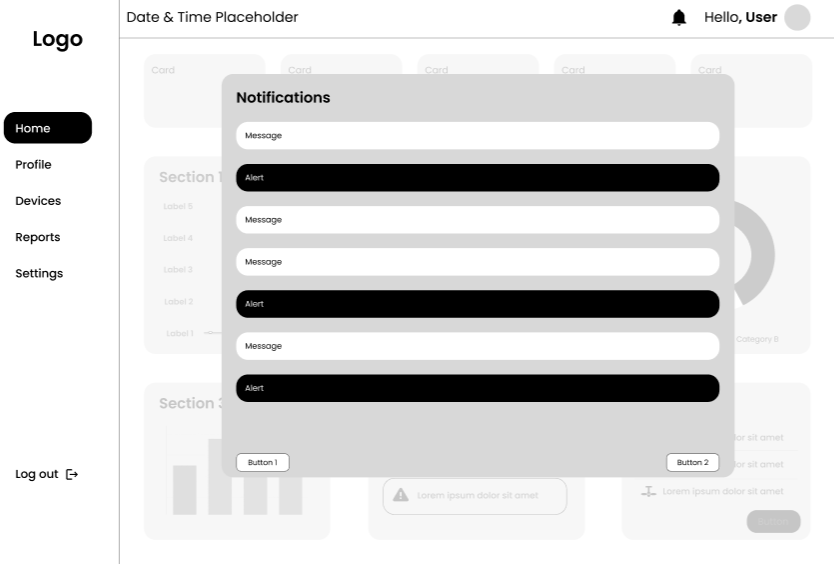


- Profile: Diseñada para la gestión de datos personales, esta pantalla presenta una estructura clara y organizada. Los campos para First Name, Last Name, Email, Linked Adress y Number permiten al usuario mantener su información actualizada. El flujo de interacción es directo, centrado en el ingreso y la edición de datos. Se utiliza una progresión visual para la foto de perfil, mostrando un espacio para la imagen y un botón para cargarla, asegurando que el usuario pueda personalizar su cuenta.

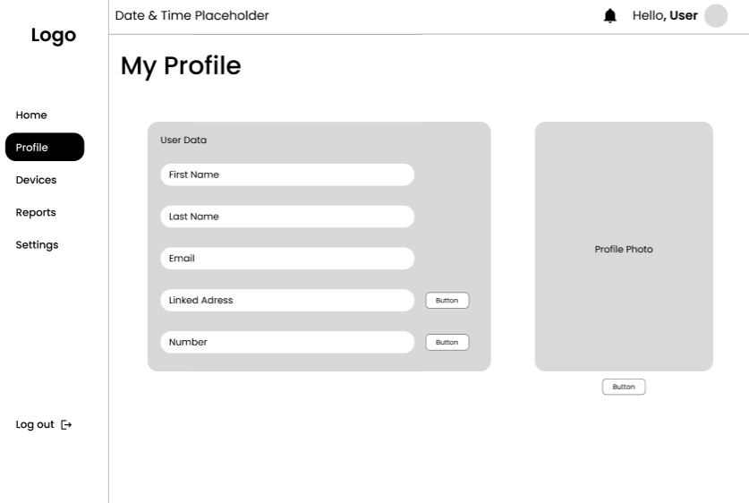


- Devices: La visualización se presenta como una tabla lineal y detallada, donde cada dispositivo conectado al sistema ocupa su propia fila. Se utiliza una estructura consistente que permite al usuario explorar el estado de cada dispositivo de un vistazo. Las columnas desglosan información clave como el nombre y categoría del dispositivo, su estado en tiempo real (indicando si está encendido o apagado), la última vez que registró actividad, un historial de alertas y el consumo de energía acumulado.

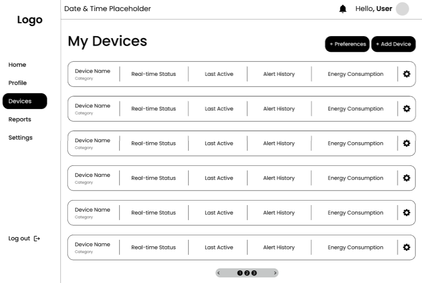


- Preferences: Esta vista está diseñada para que el usuario personalice su experiencia de monitoreo. Se estructura como una matriz de opciones de "checkbox" donde cada una corresponde a una categoría o función de seguimiento. El diseño fomenta la selección múltiple, permitiendo al usuario decidir de forma granular qué datos desea que la aplicación recolecte y muestre. Los botones en la parte inferior de la pantalla actúan como controles para aplicar o descartar los cambios realizados en las preferencias, cerrando un ciclo de interacción claro y seguro.

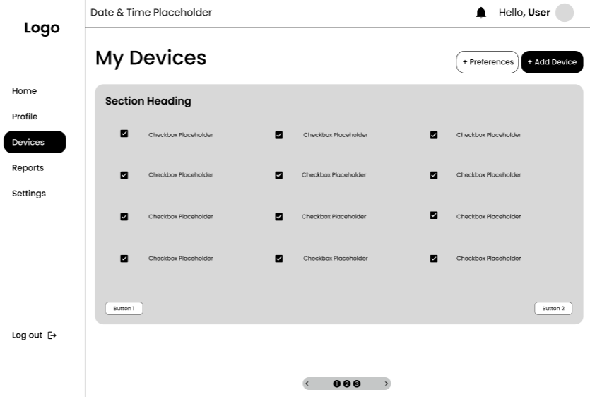


- Reports: La pantalla de ../..s es el centro de análisis de la aplicación. Incluye un gráfico de barras para el ranking de dispositivos que consumen más energía, mostrando el consumo total en kilovatios-hora (kWh). También presenta un gráfico de tendencias de consumo semanal, un resumen con datos clave y una sección para exportar o descargar ../..s.

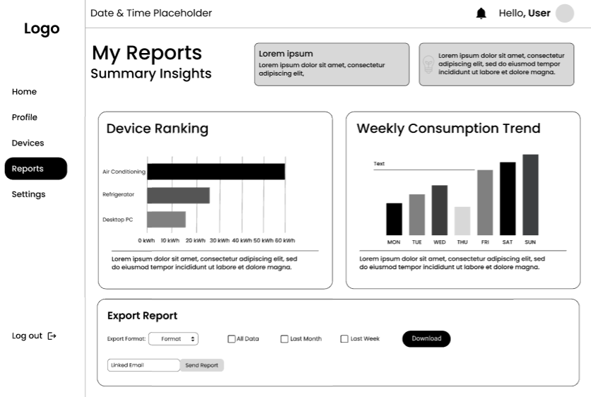


- Settings: Esta vista consolida diversas opciones de configuración en secciones claras y modulares. Se presenta un flujo de interacción centrado en el usuario, permitiéndole gestionar desde las automatizaciones de ahorro (Automatic Saving Mode) con interruptores de encendido y apagado (toggles), hasta las notificaciones y ../..s personalizados. También ofrece acceso directo a secciones de ayuda y soporte (Support and Help) y opciones para gestionar la seguridad y la privacidad de la cuenta (Security and Privacy). El diseño organiza la información de manera lógica y progresiva para que el usuario pueda encontrar y ajustar fácilmente cualquier configuración.

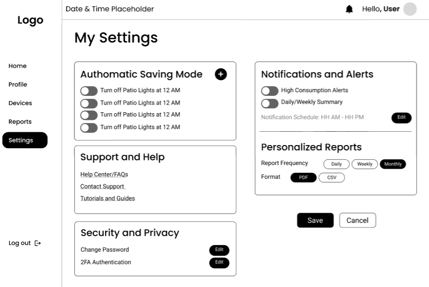

### 4.6.2. Web Applications Wireflow Diagrams.

- User goal 1: Iniciar sesión para poder obversar el dashboard informativo

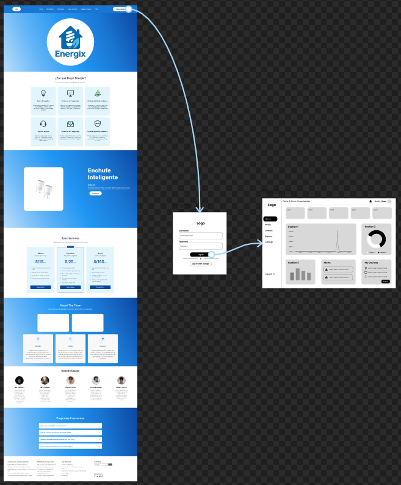

- User goal 2: Entrar al dashboard informativo para luego entrar en la opción de ../..s y descargar mi ../.. generado a lo largo del mes


- User goal 3: Estabelcer preferencias para todos los dispositivos que tengo configurados en la aplicación y guargar configuraciones predeterminadas

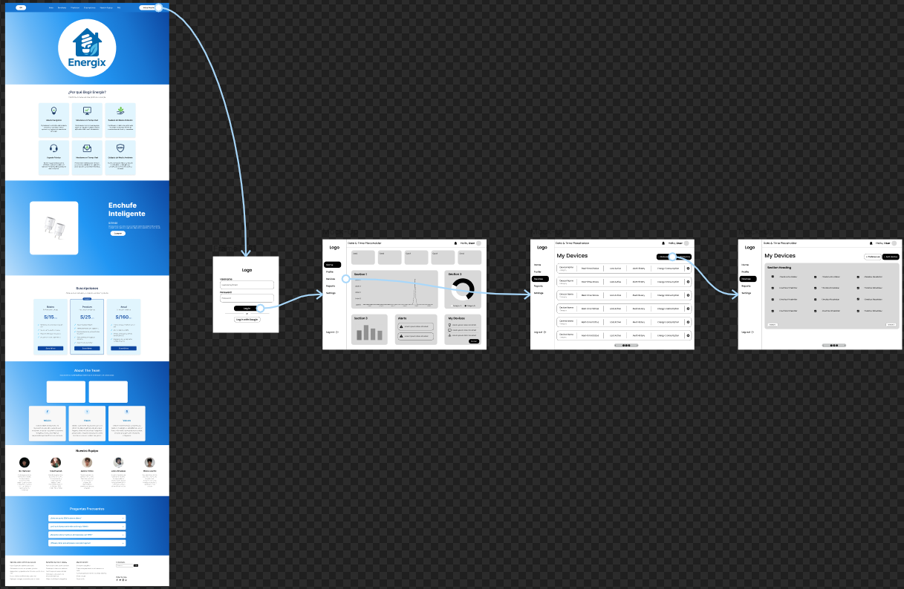

- User goal 4: Entrar al dashboard interactivo para luego ir a la opción de perfil y poder modificar sus datos

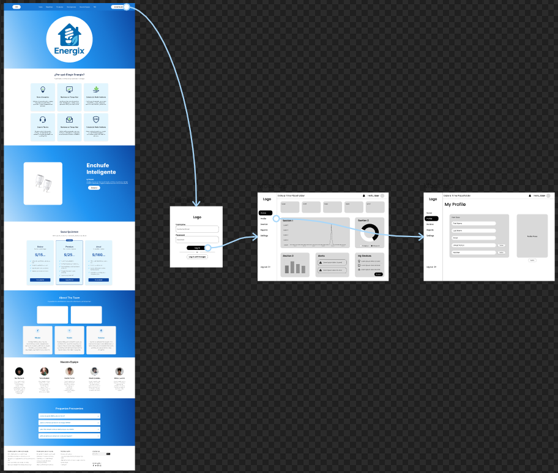

- Happy y Unhappy paths de cada User goal:
- **User goal 1**:
- - (Happy path) El usuario entra a la landing page y encuentra el botón de Iniciar sesión, como ya tiene una cuenta ingresa sus credenciales y son validadas por el sistema, una vez todo correcto es redirigido al dashboard informativo donde podrá interactuar con las diferentes herrameintas disponibles.
- - (Unhappy path) El usuario entra a la landing page y presiona el botón de Inicar sesión, ingresa sus credenciales pero son incorrectas por lo que el sistema le manda un mensaje de error que dice "Correo o contraseña incorrectos", por lo que no será redirigido al dashboard informativo.
- **User goal 2**:
- - (Happy path) El usuario accede al landing page y hace click en Iniciar Sesión, ingresa con sus credenciales y tras una validación es redirigido al dashboard informativo. Navega por el menú lateral y hace click en la opción de ../..s donde visualiza el panel con la información de su consumo de mes, cumplimiento de metas, ranking de dispositivos y ahorro acumulado, entonces el usuario presiona el botón para descarga la información en formato PDF y Excel, luego aparece un mensaje diciendo "../.. descargado exito" con la opción de visualizar el ../...
- - (Unhappy path) El usuario accede al landing page y hace click en Iniciar Sesión, ingresa con sus credenciales y tras una validación es redirigido al dashboard informativo. Navega por el menú lateral y hace click en la opción de ../..s, al momento de entrar no le aparecerá ninguna información disponible por lo que el sistema le dará un mensaje diciendo "Error al momento de cargar la información", del mismo modo si presiona el botón de descargar el sistema le dirá "Error al momento de descargar intente más tarde", por lo que el usuario no podrá visualizar su información ni descargarla.
- **User goal 3**:
- - (Happy path) El usuario accede al landing page y hace click en Iniciar Sesión. Desde el dashboard selecciona la opción Device que está disponible, en esta pantalla luego accede a la opción "Preference" donde puede establecer límites de consumo energético y horarios de funcionamiento. Una vez que completa la configuración y hace clic en "Save Preference", el sistema valida los parámetros y se guarda los cambios aplicados al dispositivo.
- - (Unhappy path) El usuario accede al landing page y hace click en Iniciar Sesión. Desde el dashboard selecciona la opción Device que está disponible, en esta pantalla luego accede a la opción "Preference" y accede a su configuración para establecer límites de consumo energético. Después de completar todos los campos necesarios y hacer clic en "Save Preference", ocurre un error interno en el sistema de gestión de dispositivos. No se muestra ningún mensaje de confirmación y la configuración no se aplica correctamente, impidiendo que el usuario personalice las reglas de automatización para optimizar el consumo energético del dispositivo.
- **User goal 4**:
- - (Happy path) El usuario navega por la landing page, entra al dashboard informativo mediante el botón Iniciar Sesión, luego de la validación entra al dashboard y hace click en la opción de Profile, donde puede visualizar correctamente sus datos personales, información de contacto y configuraciones de la cuenta.
- - (Unhappy path) El usuario navega por la landing page, entra al dashboard informativo mediante el botón Iniciar Sesión, luego de la validación entra al dashboard y hace click en la opción de Consumo, al momemto de entar el usuario no podrá visualizar los datos completos, estarán imcompletos o desactualizados en los indicadores principales, por lo que no podrá visualizar la información detallada.
- - (Unhappy path) El usuario navega por la landing page, entra al dashboard informativo mediante el botón Iniciar Sesión, luego de la validación entra al dashboard y hace click en la opción de Profile. Al momento de ingresar, el usuario no podrá visualizar sus datos completos; la información estará incompleta o desactualizada, por lo que no podrá revisar correctamente sus datos personales ni realizar ajustes en su perfil.

### 4.6.3. Web Applications Mock-ups.

El diseño de mockups representa la fase de alta fidelidad de la solución, donde la interfaz se concibe con elementos visuales, tipografía y colores definitivos. Esta etapa transforma los wireframes en una experiencia de usuario tangible y estilizada.

Se ha priorizado una estética limpia y moderna para cada vista, utilizando una paleta de colores que guía la atención del usuario hacia las métricas y acciones más importantes. Desde el Dashboard con sus gráficos informativos, pasando por la visualización tabular de "Mis Dispositivos", hasta los ajustes detallados de "Preferencias", cada pantalla ha sido diseñada para ser funcionalmente intuitiva y visualmente atractiva.

La coherencia visual entre todos los mockups asegura un sistema de diseño unificado, facilitando la navegación y reforzando la marca de la solución. El resultado es una interfaz que no solo muestra datos, sino que cuenta una historia de consumo y ahorro de energía de manera clara y directa.

- Login: Esta vista propone una interfaz minimalista y funcional diseñada para la autenticación del usuario. Se presenta con campos de entrada estilizados para el correo electrónico y la contraseña, centrando la atención en el proceso de acceso. Se prioriza la usabilidad al incluir un botón de “Log in with Google” como alternativa, agilizando el flujo de autenticación para quienes prefieren esta opción.

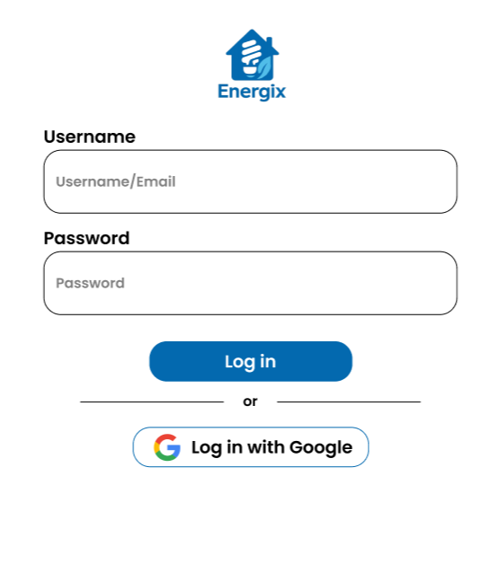

- Dashboard: El dashboard se concibe como el centro de mando de la plataforma, proporcionando un resumen visual y detallado del consumo energético. En la parte superior, se muestra un conjunto de tarjetas de indicadores clave (KPIs) con métricas esenciales como el consumo de energía, los ahorros estimados y la factura estimada. El espacio principal es dominado por gráficos que desglosan el consumo diario y por categorías, facilitando una rápida comprensión de los patrones de uso. Las notificaciones de alertas se integran de manera prominente, asegurando que la información crítica no pase desapercibida.

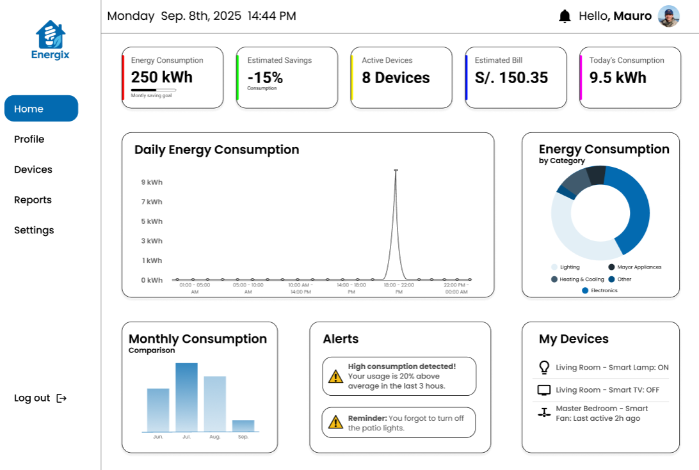

- Notifications (Pop-up): Este componente es un elemento de notificación de alta prioridad que se superpone a la pantalla principal, diseñado para alertar al usuario de forma inmediata. Se utiliza una jerarquía visual para distinguir entre mensajes de logros, como “Goal Achievement”, y alertas de consumo elevado. Se prioriza la inmediatez y la claridad de la información, asegurando que el usuario pueda tomar acciones rápidas cuando sea necesario.

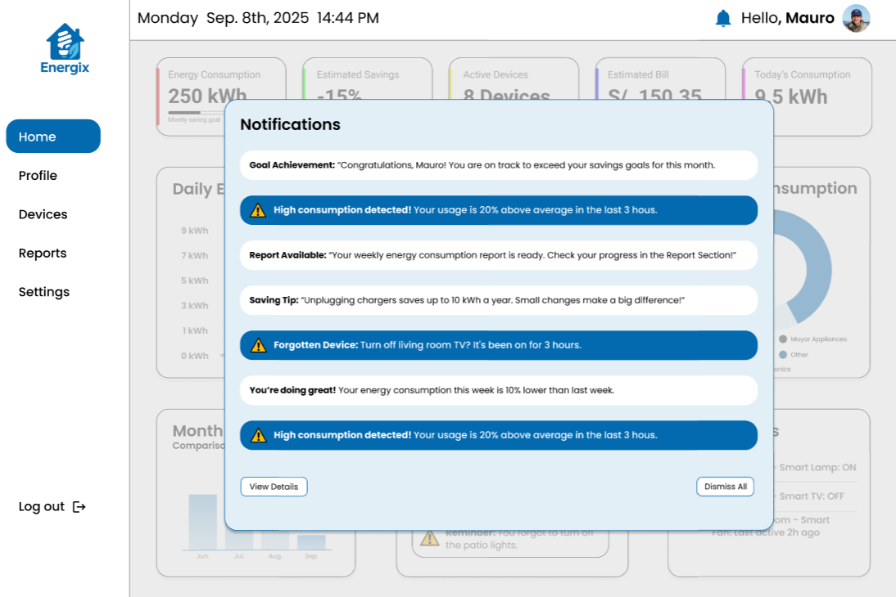

- Profile: La sección de perfil presenta una arquitectura clara y editable para la gestión de datos personales. Se muestra una estructura con campos prellenados para la información del usuario, cada uno acompañado de un botón de “Edit”, lo que otorga al usuario el control para actualizar su información. Un espacio dedicado a la foto de perfil refuerza la personalización de la cuenta, priorizando la capacidad de adaptación y el control del usuario sobre sus propios datos.

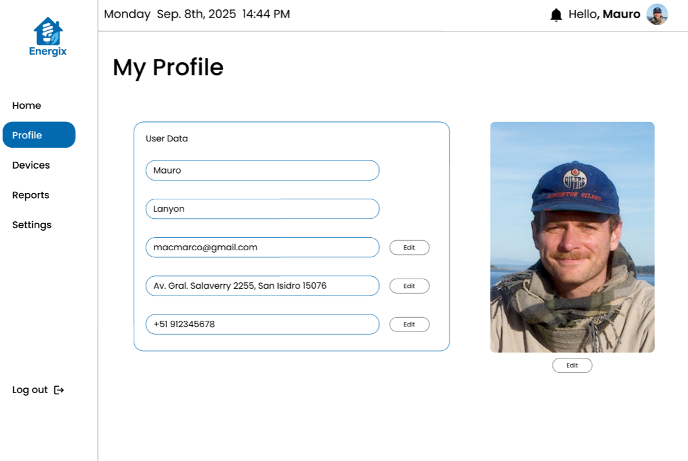

- Devices: Esta pantalla está diseñada para el monitoreo detallado y estructurado de los dispositivos conectados. Se utiliza un formato de tabla para presentar de forma organizada el estado en tiempo real, la última actividad registrada, el historial de alertas y el consumo de energía. La interfaz prioriza la transparencia y la accesibilidad de los datos, permitiendo al usuario obtener una visión completa del rendimiento de cada dispositivo.

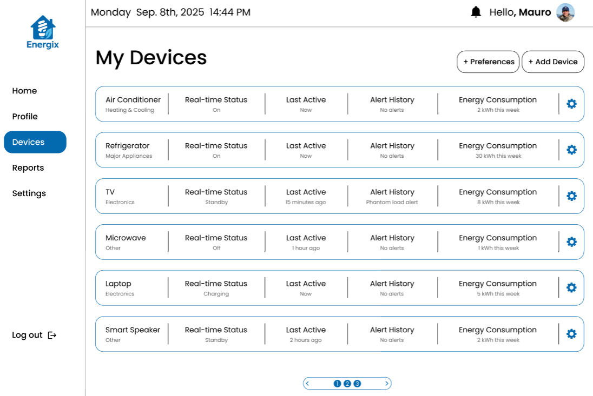

- Preferences: Este mockup profundiza en el control granular que el usuario tiene sobre el sistema de monitoreo. La interfaz se presenta como una matriz de opciones de "checkbox" que permiten al usuario activar o desactivar el seguimiento para diversas categorías de dispositivos y tipos de alertas. Esta vista prioriza la personalización, invitando al usuario a definir exactamente qué datos desea que la aplicación recolecte y qué notificaciones desea recibir.

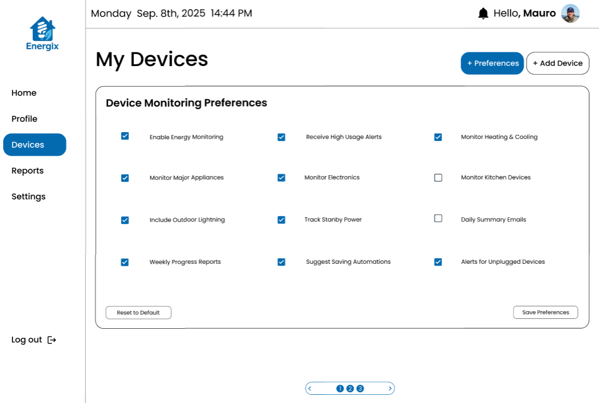

- Reports: La sección de ../..s se enfoca en la visualización y el análisis de datos históricos. Dos gráficos de barras de alta fidelidad, "Device Ranking" y "Weekly Consumption Trend", dominan la vista, facilitando la identificación de los mayores consumidores y la comparación de patrones de uso semanales. La funcionalidad de "Export Report" permite al usuario descargar sus datos en formatos PDF o CSV, lo cual es fundamental para el análisis externo y el registro personal.

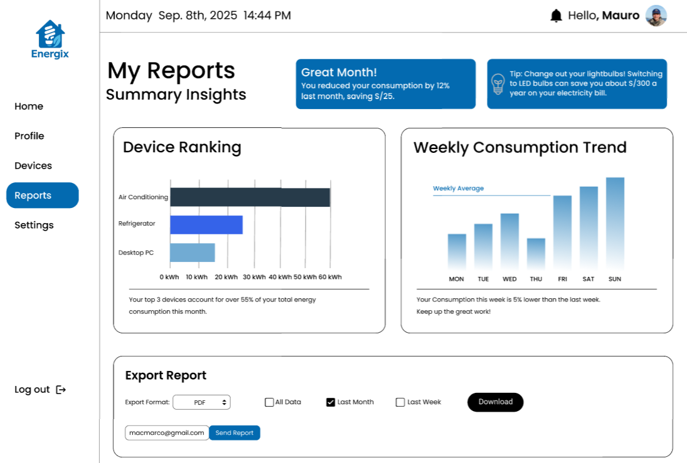

- Settings: Este mockup de configuraciones presenta una arquitectura modular que consolida todas las opciones de personalización del sistema. Se muestra de manera clara la sección “Automatic Saving Mode”, que permite la creación de reglas de automatización, y “Notifications and Alerts”, donde el usuario puede definir qué notificaciones desea recibir. El diseño de la interfaz prioriza la organización y el acceso intuitivo, garantizando que el usuario pueda ajustar cada aspecto de la plataforma de manera eficiente.

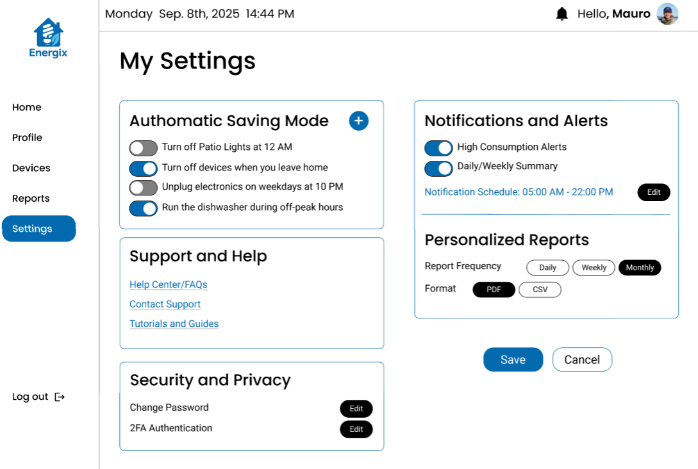

### 4.6.4. Web Applications User Flow Diagrams.

- User goal 1: Iniciar sesión para poder obversar el dashboard informativo

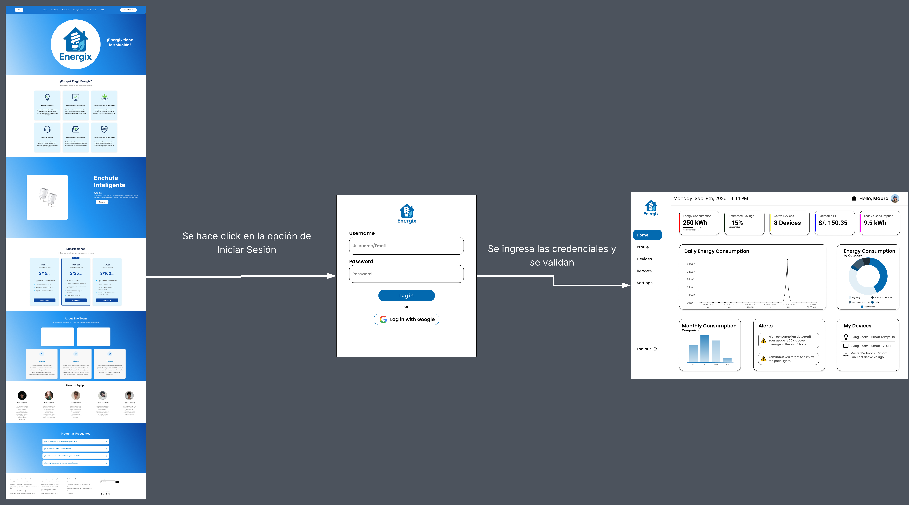

- User goal 2: Entrar al dashboard informativo para luego entrar en la opción de ../..s y descargar mi ../.. generado a lo largo del mes

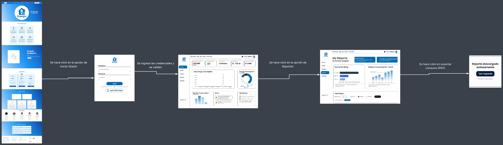

- User goal 3: Comprar un producto desde la página principal rellenando información del medio de pago elegido.

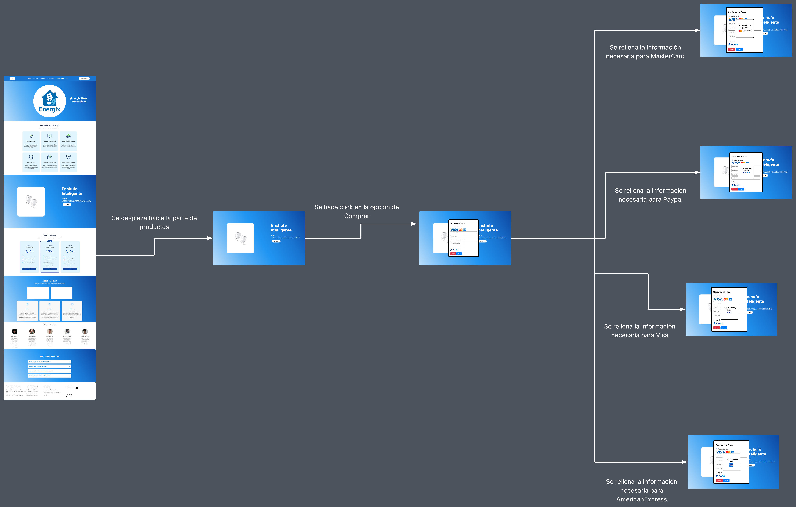

- User goal 4: Entrar al dashboard interactivo para luego ir a la opción de perfil y poder modificar sus datos.

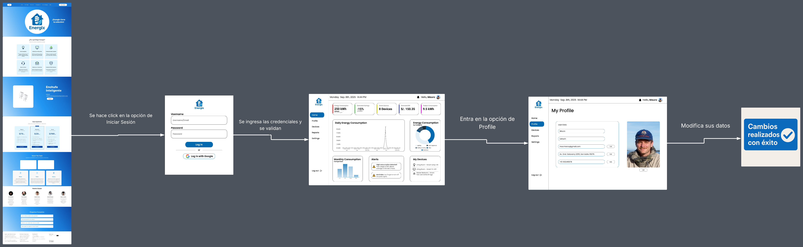

- Happy y Unhappy paths de cada User goal:
- **User goal 1**:
- - (Happy path) El usuario entra a la landing page y encuentra el botón de Iniciar sesión, como ya tiene una cuenta ingresa sus credenciales y son validadas por el sistema, una vez todo correcto es redirigido al dashboard informativo donde podrá interactuar con las diferentes herrameintas disponibles.
- - (Unhappy path) El usuario entra a la landing page y presiona el botón de Inicar sesión, ingresa sus credenciales pero son incorrectas por lo que el sistema le manda un mensaje de error que dice "Correo o contraseña incorrectos", por lo que no será redirigido al dashboard informativo.
- **User goal 2**:
- - (Happy path) El usuario accede al landing page y hace click en Iniciar Sesión, ingresa con sus credenciales y tras una validación es redirigido al dashboard informativo. Navega por el menú lateral y hace click en la opción de ../..s donde visualiza el panel con la información de su consumo de mes, cumplimiento de metas, ranking de dispositivos y ahorro acumulado, entonces el usuario presiona el botón para descarga la información en formato PDF y Excel, luego aparece un mensaje diciendo "../.. descargado exito" con la opción de visualizar el ../...
- - (Unhappy path) El usuario accede al landing page y hace click en Iniciar Sesión, ingresa con sus credenciales y tras una validación es redirigido al dashboard informativo. Navega por el menú lateral y hace click en la opción de ../..s, al momento de entrar no le aparecerá ninguna información disponible por lo que el sistema le dará un mensaje diciendo "Error al momento de cargar la información", del mismo modo si presiona el botón de descargar el sistema le dirá "Error al momento de descargar intente más tarde", por lo que el usuario no podrá visualizar su información ni descargarla.
- **User goal 3**:
- - (Happy path) El usuario ingresa a la landing page y se desplaza hacia la parte de productos, selecciona uno de los productos que están disponibles, luego se le habilitará una ventana para que eliga el método de pago preferido, una vez que rellene la información necesaria el sistema validará los datos y le dará un mensaje diciendo "Pago realizado, gracias" junto al logo con el método seleccionado.
- - (Unhappy path) El usuario ingresa a la landing page y se desplaza hacia la parte de productos, selecciona uno de los productos que están disponibles, luego se le habilitará una ventana para que eliga el método de pago preferido, una vez que el usuario rellene toda la información necesaría le dará click al botón de "pagar", pero no pasará nada, no le aparecerá otra ventana diciendo "Pago realizado, gracias", debido a un error interno con los métodos de pago por lo que no se puede continuar con la transacción, por consiguiente el usuario no podrá comprar ningún producto.
- **User goal 4**:
- - (Happy path) El usuario navega por la landing page, entra al dashboard informativo mediante el botón Iniciar Sesión, luego de la validación entra al dashboard y hace click en la opción de Profile, donde puede visualizar correctamente sus datos personales, información de contacto y configuraciones de la cuenta.
- - (Unhappy path) El usuario navega por la landing page, entra al dashboard informativo mediante el botón Iniciar Sesión, luego de la validación entra al dashboard y hace click en la opción de Consumo, al momemto de entar el usuario no podrá visualizar los datos completos, estarán imcompletos o desactualizados en los indicadores principales, por lo que no podrá visualizar la información detallada.
- - (Unhappy path) El usuario navega por la landing page, entra al dashboard informativo mediante el botón Iniciar Sesión, luego de la validación entra al dashboard y hace click en la opción de Profile. Al momento de ingresar, el usuario no podrá visualizar sus datos completos; la información estará incompleta o desactualizada, por lo que no podrá revisar correctamente sus datos personales ni realizar ajustes en su perfil.

## 4.7. Web Applications Prototyping.
Esta sección explora el diseño de interfaz de usuario (UI) para la aplicación web de Energix, con un enfoque primordial en la experiencia de escritorio. Al priorizar las pantallas de mayor tamaño, el diseño se centra en presentar la información de manera clara y en ofrecer controles precisos para la gestión energética. La creación de estos prototipos no solo se alinea con los flujos de usuario definidos, sino que también sirve como una validación visual de la arquitectura de la información del sistema.

Las decisiones de interacción se han tomado para que la aplicación sea tanto analítica para el usuario proactivo como intuitiva para el usuario reactivo. Estos son los criterios clave que han guiado el diseño:

Navegación Intuitiva y Persistente

Para asegurar una navegación fluida, la aplicación cuenta con una barra lateral izquierda fija. Esta estructura pone las secciones principales—Dashboard, Dispositivos, ../..s, y Configuración—siempre al alcance del usuario, eliminando la necesidad de memorizar rutas de navegación. Esta elección de diseño refleja una jerarquía de información lógica y facilita la transición entre la revisión de datos y la acción de control.

Diseño Orientado al Análisis y la Toma de Decisiones

La sección de ../..s es un claro ejemplo de cómo la interfaz empodera al usuario para analizar sus datos de consumo. Mediante gráficos interactivos y una vista tabular detallada, el usuario puede identificar rápidamente tendencias y picos de consumo. El sistema de interacción es directo y familiar, permitiendo al usuario exportar sus datos en formatos estándar como CSV o PDF, lo que convierte la información en una herramienta práctica y tangible.

Retroalimentación Visual Clara

La aplicación proporciona retroalimentación visual efectiva sobre el estado del consumo. El Dashboard actualiza sus gráficos y métricas para reflejar los cambios significativos, mientras que las notificaciones emergentes informan al usuario sobre eventos críticos, como un alto consumo detectado o el cumplimiento de un objetivo de ahorro. Esta claridad en la retroalimentación es esencial, ya que permite a los usuarios reaccionar con agilidad ante un problema o sentirse motivados por un logro.

Validación de Flujos de Navegación

A través de estos prototipos, se simula el recorrido del usuario a través de la aplicación. Se demuestra cómo se puede pasar sin problemas de una notificación a la pantalla de Dispositivos para tomar una acción correctiva, o de la Dashboard a los ../..s para un análisis más profundo. Estas interacciones validan la coherencia de los flujos de usuario y garantizan una experiencia de navegación lógica y sin fricciones.

Link del video: https://upcedupe-my.sharepoint.com/:v:/g/personal/u202210513_upc_edu_pe/EbK0zgZImC5Nm6USAh19_aoBa9UNerHtDBz4iBQn80qlnQ?e=U92QIh

## 4.8. Domain-Driven Software Architecture.

Los diagramas de arquitectura de software son herramientas clave para diseñar y comprender la estructura de un sistema. Al aplicar el enfoque de Domain Driven Design (DDD), estos diagramas nos permiten representar visualmente los distintos elementos del dominio, sus límites y las relaciones entre ellos, lo que facilita una mejor planificación y comunicación del diseño.

### 4.8.1. Software Architecture Context Diagram.

El diagrama de contexto de SEMS (Smart Energy Management System) muestra la visión más externa de la plataforma y posiciona a sus actores principales junto con los sistemas con los que se conecta. En este nivel se identifican tres roles clave: el propietario de vivienda, que busca monitorear y optimizar el consumo energético de su hogar; el estudiante que alquila, interesado en reducir gastos y simplificar el control compartido de la energía; y el soporte técnico, encargado de acompañar a los usuarios en la resolución de problemas y la adopción de la herramienta.

SEMS se apoya además en tres sistemas externos que amplían sus capacidades sin comprometer el núcleo de la solución: el medidor inteligente, que provee datos de consumo en tiempo real; los dispositivos del hogar, que pueden ser encendidos o apagados de forma remota para optimizar el uso energético; y el proveedor de servicios eléctricos, que ofrece información sobre tarifas, consumo histórico y posibles incidencias en el suministro.

Esta integración permite que SEMS funcione como un ecosistema completo para el control y la gestión energética doméstica. Al reunir usuarios, dispositivos y datos bajo una infraestructura digital modular, la plataforma fortalece su propuesta de valor: ofrecer a las personas un sistema confiable, accesible y proactivo que contribuya tanto al ahorro económico como a la sostenibilidad ambiental.

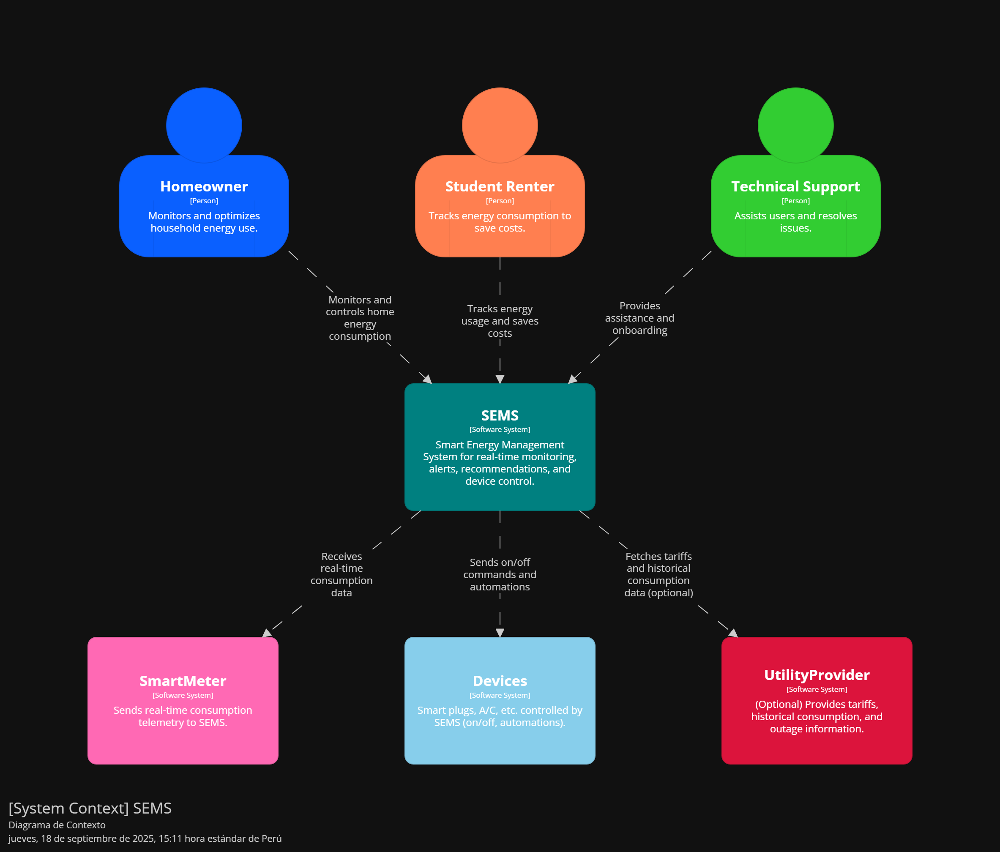

### 4.8.2. Software Architecture Container Diagrams.

- Este diagrama de contenedores ilustra los componentes clave de la plataforma ENERGIX y cómo interactúan entre sí y con sistemas externos. Se destacan la **Aplicación web**, **la API Backend**, **la Base de Datos** y **servicios externos** como xxx xxx y xxx xxx. Cada contenedor cumple una función específica para asegurar el funcionamiento integral del sistema.

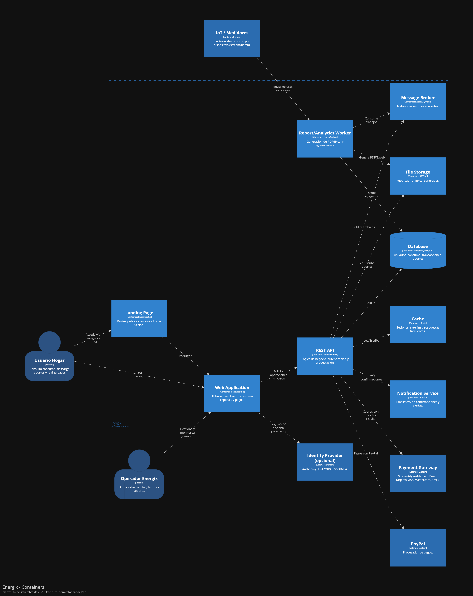

### 4.8.3. Software Architecture Components Diagrams.

El diagrama de componentes profundiza en la arquitectura interna de la plataforma Energix, enfocándose en la estructura del contenedor REST API. Este diagrama ilustra cómo las responsabilidades de la lógica de negocios se dividen en capas distintas: Controladores, Servicios y Repositorios, lo que garantiza una clara separación de preocupaciones y un código más mantenible.

**Capas del Diagrama**

- **Controladores**: Los controladores (AuthController, DeviceController, AutomationController, ReportController, AlertController) actúan como el punto de entrada principal desde el Frontend Web SPA. Procesan las solicitudes de los usuarios y las dirigen a los servicios correspondientes para su procesamiento.
- **Servicios**: Los servicios (AuthService, DeviceService, AutomationService, ReportService, AlertService) encapsulan la lógica de negocio de la plataforma. Cada servicio maneja un contexto funcional específico: AuthService gestiona la autenticación, DeviceService se encarga de los dispositivos, AutomationService administra las reglas de automatización, ReportService genera informes y AlertService maneja las notificaciones.
- **Repositorios**: Los repositorios (UserRepository, DeviceRepository, AutomationRepository, ReportRepository, AlertRepository) son la capa de acceso a datos. Gestionan la persistencia y la recuperación de información desde la base de datos externa (Database) para sus respectivos servicios.

**Integración de Componentes Externos**

La plataforma se comunica con otros sistemas y contenedores para ofrecer su funcionalidad completa.  La capa de servicios interactúa con contenedores externos clave: DeviceService y AlertService utilizan el Message Broker para la comunicación asíncrona y la gestión de eventos en tiempo real.

- ReportService y AlertService se conectan con el File Storage para almacenar informes generados y archivos adjuntos de notificaciones, respectivamente.
- Por último, todos los repositorios se comunican con la Database para almacenar y recuperar la información esencial del sistema, como datos de usuarios, dispositivos, automatizaciones, ../..s y alertas.

Esta estructura modular y desacoplada facilita el desarrollo, las pruebas y el mantenimiento del sistema, permitiendo que cada componente se evolucione de forma independiente sin afectar a los demás.

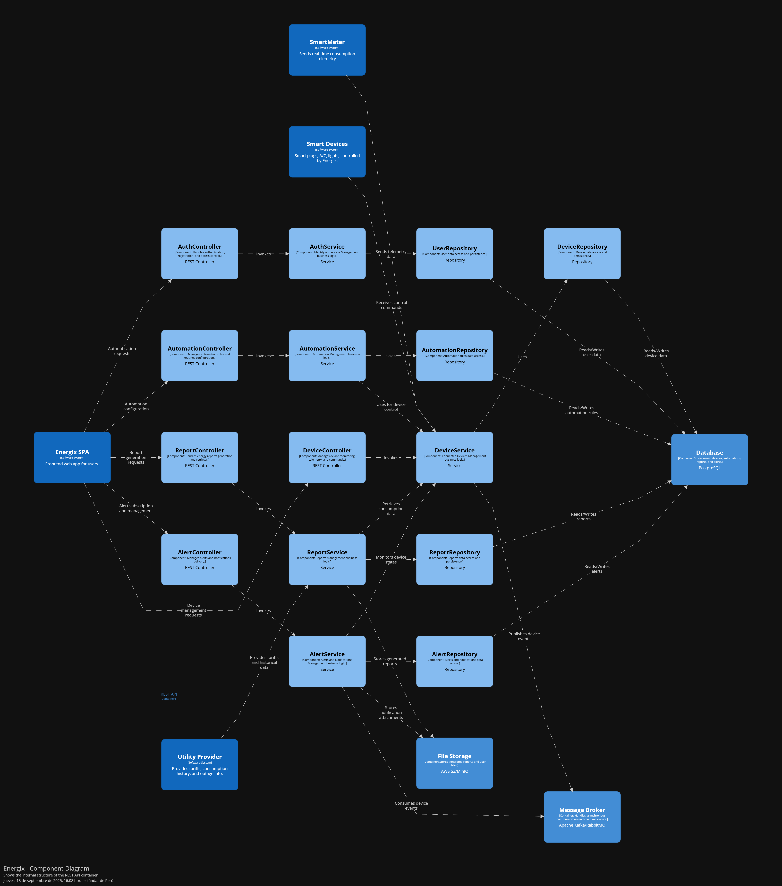

## 4.9. Software Object-Oriented Design.

Esta sección presenta el diseño orientado a objetos del sistema, definiendo las clases principales, sus atributos y relaciones.

### 4.9.1. Class Diagrams.

**Identity and Access Management**

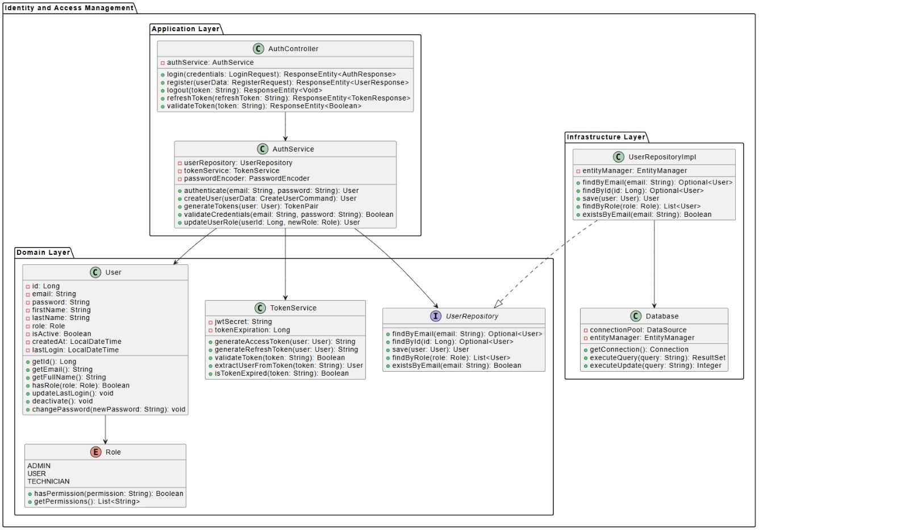

Este diagrama muestra la arquitectura en capas (Aplicación, Dominio, Infraestructura) para el Bounded Context de Identidad y Gestión de Acceso. La capa de Aplicación (AuthController y AuthService) se encarga de recibir las peticiones de autenticación y registro. El núcleo es la capa de Dominio, que se centra en las entidades User y Role, que definen las reglas de negocio, y las interfaces UserRepository y TokenService, que establecen los contratos para la persistencia y la gestión de tokens. La capa de Infraestructura (UserRepositoryImpl y Database) implementa estas interfaces, gestionando la conexión y las operaciones de persistencia con la base de datos. La dependencia del sistema siempre apunta hacia la capa de Dominio, lo que asegura que la lógica central no dependa de los detalles de la implementación.

**Connected Device Management**

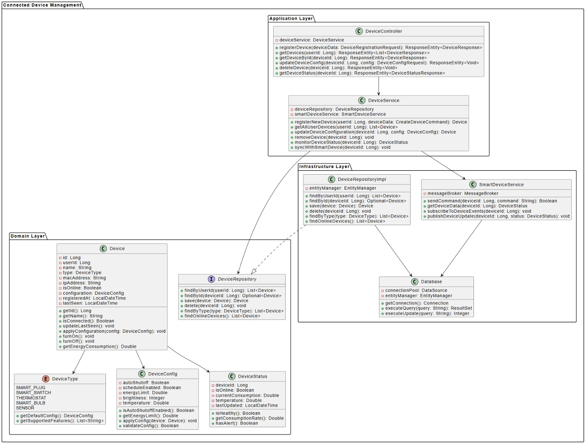

Este diagrama detalla la arquitectura en capas (Aplicación, Dominio, Infraestructura) para el Bounded Context de Gestión de Dispositivos Conectados. La capa de Aplicación (DeviceController y DeviceService) gestiona las peticiones para el registro, monitoreo y configuración de los dispositivos. El corazón del sistema es la capa de Dominio, que se centra en el agregado Device, y las entidades relacionadas como DeviceConfig, DeviceStatus y DeviceType, que encapsulan la lógica de negocio de los dispositivos inteligentes. El Dominio también define la interfaz DeviceRepository. La capa de Infraestructura (DeviceRepositoryImpl y SmartDeviceService) implementa la persistencia a través de la base de datos y se comunica con los dispositivos reales, garantizando que la lógica de negocio esté desacoplada de los detalles técnicos de la comunicación.

**Report Management**

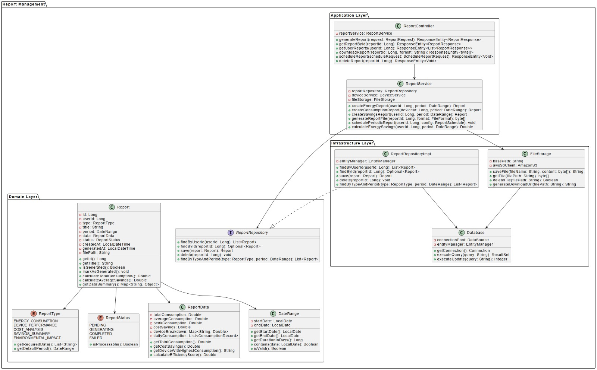

Este diagrama ilustra la arquitectura en capas (Aplicación, Dominio, Infraestructura) del Bounded Context de Gestión de ../..s. La capa de Aplicación (ReportController y ReportService) se encarga de coordinar la generación y consulta de ../..s, recibiendo las peticiones de los usuarios. El centro de la arquitectura es la capa de Dominio, centrada en el agregado Report y sus componentes internos como ReportData y ReportType, que definen la estructura y las reglas de negocio de los ../..s. El Dominio también establece la interfaz ReportRepository. La capa de Infraestructura (ReportRepositoryImpl y FileStorage) implementa la lógica de persistencia, con ReportRepositoryImpl gestionando la base de datos y FileStorage almacenando los archivos de ../..s en un sistema externo, manteniendo así la lógica de negocio independiente de la forma de almacenamiento.

**Alert and Notification Management**

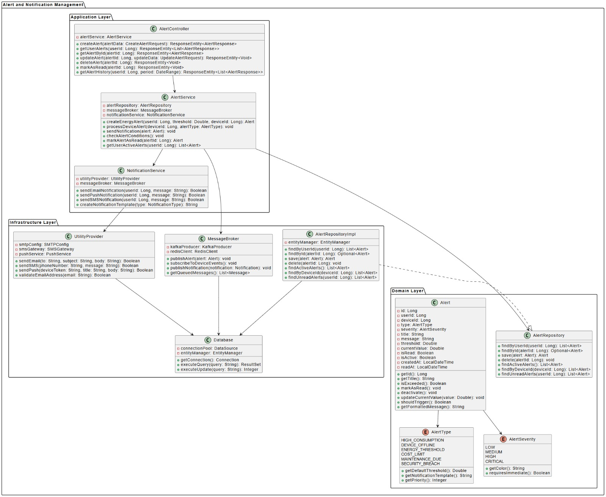

Este diagrama presenta la arquitectura en capas (Aplicación, Dominio, Infraestructura) del Bounded Context de Gestión de Alertas y Notificaciones. La capa de Aplicación (AlertController y AlertService) gestiona la creación, actualización y eliminación de alertas. El núcleo es la capa de Dominio, centrada en la entidad Alert y sus subtipos AlertType y AlertSeverity, que encapsulan las reglas de negocio para los distintos tipos de alertas y su severidad. Las interfaces AlertRepository y NotificationService definen los contratos para la persistencia y el envío de notificaciones. La capa de Infraestructura (AlertRepositoryImpl y MessageBroker) implementa estos contratos, con AlertRepositoryImpl gestionando la base de datos y MessageBroker interactuando con un sistema externo para el envío de mensajes, asegurando que la lógica de negocio principal sea agnóstica a la tecnología de mensajería.

**Automation Management**

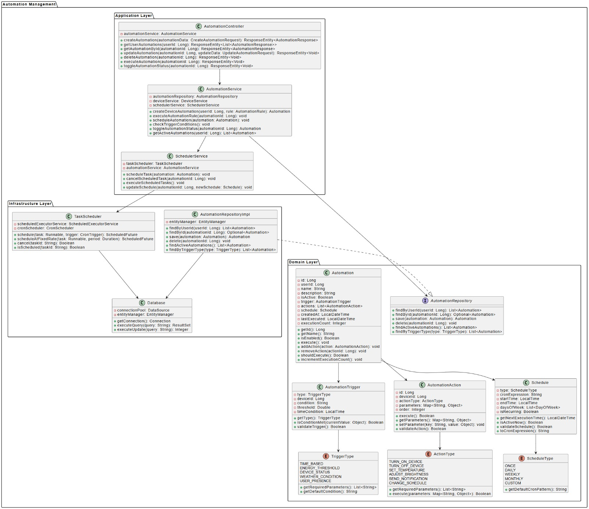

Este diagrama muestra la arquitectura en capas (Aplicación, Dominio, Infraestructura) del Bounded Context de Gestión de Automatizaciones. La capa de Aplicación (AutomationController y AutomationService) coordina la lógica para la creación y gestión de las reglas de automatización. El corazón del sistema es la capa de Dominio, que se centra en el agregado Automation y sus objetos internos AutomationTrigger, AutomationAction y Schedule, que definen las reglas de negocio y el comportamiento de las automatizaciones. El Dominio también especifica la interfaz AutomationRepository. La capa de Infraestructura (AutomationRepositoryImpl y TaskScheduler) implementa la persistencia y la ejecución de las tareas programadas, desacoplando la lógica de negocio del mecanismo específico de programación, lo que permite una mayor flexibilidad y escalabilidad.

### 4.9.2. Class Dictionary.

## 4.10. Database Design.

El diseño lógico de la base de datos es la columna vertebral de la arquitectura funcional del sistema. Cada Bounded Context (BC) cuenta con sus propias entidades y relaciones específicas, las cuales están alineadas con las responsabilidades y reglas de negocio de su dominio correspondiente.

La estructura de la base de datos se basa en los principios de separación de responsabilidades y un enfoque orientado a microservicios. Esto permite escalar, mantener y modificar cada parte del sistema de forma independiente. La implementación se adhiere al Domain-Driven Design (DDD), lo que permite a cada contexto manejar sus propias entidades y relaciones sin depender directamente de otros, salvo a través de integraciones o referencias controladas. Este enfoque asegura que la base de datos es robusta, escalable y fácil de manejar a medida que la solución evoluciona.

### 4.10.1. Relational/Non-Relational Database Diagram.

Para el diseño de la base de datos, se ha optado por un enfoque de Modelado de Entidad-Relación (ER), representando cada uno de los Bounded Contexts mediante diagramas creados con PlantUML. Estos diagramas no solo ilustran las tablas principales, sino que también detallan las claves primarias y foráneas, junto con las relaciones que definen la estructura interna de cada contexto. Este método permite una comprensión clara de la arquitectura de la información y las interconexiones entre las entidades.

A continuación, se presenta una descripción detallada del diseño de la base de datos para cada uno de los cinco bounded context que conforman la arquitectura de la solución:

**Identity and Access Management**

En este contexto se modela la gestión de usuarios y sus permisos dentro de la plataforma. El modelo de datos se centra en la entidad principal "users", que representa a los usuarios con atributos como nombre, correo electrónico y una contraseña encriptada. Se relaciona con la entidad "roles" para definir los distintos niveles de acceso, los cuales a su vez se asocian con permisos específicos "permissions" a través de una tabla intermedia "role_permissions". Este diseño permite un control granular sobre las acciones que cada usuario puede realizar en el sistema, asegurando la seguridad y la correcta asignación de responsabilidades. Además, la entidad "user_sessions" se encarga de gestionar las sesiones activas, permitiendo la persistencia y la autenticación continua del usuario.

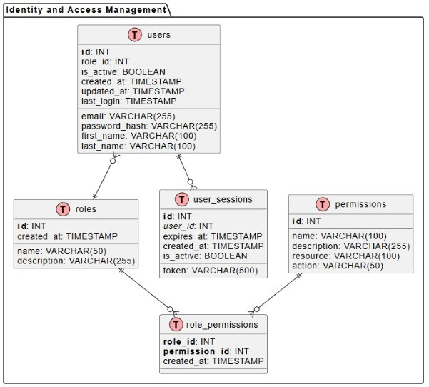

**Connected Device Management**

El contexto define la arquitectura de datos para la administración de los dispositivos inteligentes del hogar. La entidad central es "devices", que representa cada dispositivo físico vinculado al sistema. Se relaciona directamente con "device_types" para clasificar los dispositivos, y con "device_configurations" para almacenar ajustes personalizados de cada equipo, como límites de consumo o programaciones de autoapagado. La tabla "device_status" registra el estado actual del dispositivo en tiempo real, incluyendo si está activo, su consumo de energía, etc. Este diseño permite una supervisión integral y centralizada de todos los aparatos del hogar.

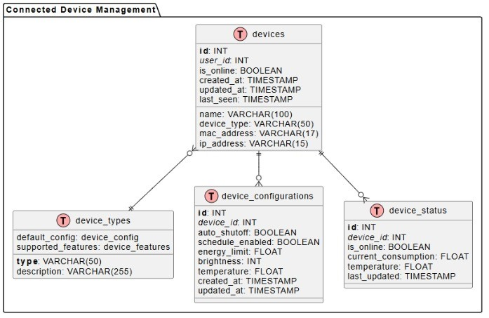

**Report Management**

En este contexto se define la arquitectura de datos para la generación y almacenamiento de ../..s de consumo. La entidad principal es "reports", que almacena cada informe generado con metadatos como el periodo de tiempo y el formato de archivo. La entidad "report_data" contiene las métricas detalladas del ../.., como el consumo total, el consumo promedio y los costos. La tabla "report_types" define los distintos tipos de informes que la plataforma puede generar. Finalmente, "scheduled_reports" permite a los usuarios programar la generación automática y periódica de sus ../..s, optimizando la gestión de la información.

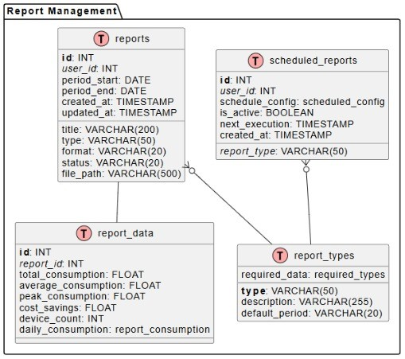

**Alert and Notification Management**

En este contexto se establece el modelo para el sistema de alertas y su configuración. La entidad principal "alerts" que registra cada alerta generada, conteniendo información como el umbral que se ha superado. Esta entidad se relaciona con "notifications", que almacena los mensajes específicos enviados al usuario. El modelo se complementa con la entidad "notification_preferences", que permite al usuario definir sus preferencias de notificación (por ejemplo, si desea recibir correos o notificaciones push), y "alert_types", que define los tipos de alertas predeterminados.

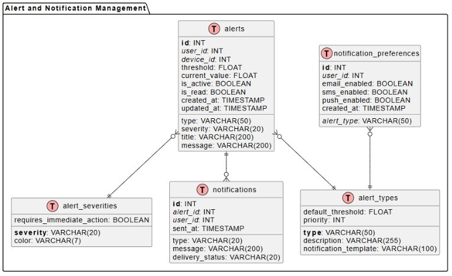

**Automation Management**

Este contexto se enfoca en la creación y ejecución de reglas de automatización personalizadas para los dispositivos. La entidad principal es "automations", que representa una regla o rutina de automatización definida por el usuario. Se vincula con "automation_triggers" para definir las condiciones que inician la automatización (por ejemplo, un umbral de consumo o una hora específica), y con "automation_actions" para especificar la acción a ejecutar (por ejemplo, apagar un dispositivo). La entidad "automation_schedules" gestiona la recurrencia de las automatizaciones. Este modelo de datos permite a los usuarios configurar reglas complejas para optimizar su consumo energético de manera autónoma.

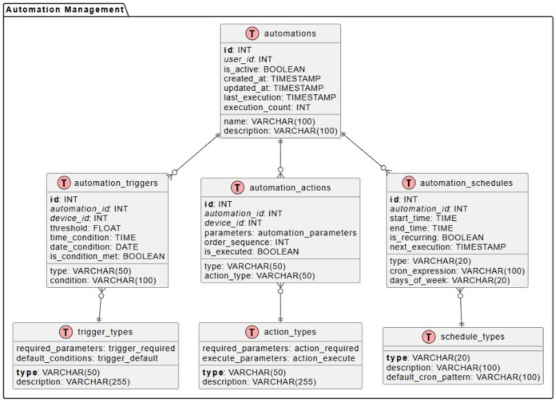


# Capítulo V: Product Implementation

## 5.1. Software Configuration Management.
### 5.1.1. Software Development Environment Configuration.

**Project Management:**

Para la gestión del proyecto Energix, utilizamos WhatsApp como medio principal de comunicación, a través de un grupo grupal en el cual coordinamos tareas, compartimos avances y discutimos decisiones del proyecto en tiempo real. Por otro lado, Discord fue nuestra plataforma para realizar llamadas de voz en equipo, donde organizamos la distribución de responsabilidades entre los integrantes, complementamos ideas y resolvimos dudas de forma síncrona. Asimismo, utilizamos GitHub no solo para el control de versiones, sino también como repositorio centralizado de toda la documentación del proyecto, incluyendo el reporte y la landing page.

**Requirements Management:**

Para la gestión de los requisitos del proyecto Energix, el equipo definió colaborativamente las historias de usuario que representan las principales funcionalidades del sistema. Estas fueron priorizadas y organizadas en el Product Backlog, considerando las necesidades de nuestros segmentos objetivo: propietarios de viviendas y estudiantes que alquilan. El proceso fue participativo, con todos los integrantes del equipo aportando en la identificación y refinamiento de los requerimientos funcionales y no funcionales de la aplicación web.

**Product UX/UI Design:**

Para el diseño de la experiencia de usuario, utilizamos UXPressia, herramienta con la que elaboramos los User Personas, Empathy Maps, Journey Maps e Impact Maps del proyecto Energix. Esto nos permitió adoptar una perspectiva centrada en el usuario y comprender mejor las necesidades de nuestros segmentos objetivo. Para el diseño visual de la aplicación, empleamos Figma como herramienta de diseño colaborativo, a través de la cual creamos los Wireframes, Mock-ups y prototipos de la aplicación web, sirviendo como guía previa al desarrollo. El alcance de Energix no contempla una aplicación móvil nativa en esta fase del proyecto (ver Capítulo IV, secciones 4.4 y 4.5).

**Software Development:**

Como entornos de desarrollo principales, el equipo utilizó Visual Studio Code y WebStorm. Visual Studio Code fue empleado para la creación del landing page y las aplicaciones web con HTML5, CSS3, JavaScript y TypeScript, mientras que WebStorm fue utilizado para trabajar con el framework Angular. Para el backend, adoptamos Spring Boot Framework, que nos permitió desarrollar servicios web RESTful en Java con una base escalable y robusta. Adicionalmente, LucidChart fue utilizado para la creación de diagramas UML, Wireflows y User Flows, y Structurizr para modelar la arquitectura del software mediante diagramas C4. Todo el código fuente fue gestionado en GitHub aplicando el flujo de trabajo GitFlow y la convención Conventional Commits, lo que garantizó un historial de cambios ordenado y comprensible para todos los integrantes.

**Software Testing:**

Para la validación de los criterios de aceptación del proyecto Energix, utilizamos el lenguaje Gherkin, el cual nos permite describir los escenarios de prueba bajo la estructura Given-When-Then. Esta metodología facilita la identificación de las variables de entrada y salida de cada funcionalidad, y al estar escrita en lenguaje natural, resulta comprensible tanto para el equipo técnico como para los stakeholders. La documentación de estas pruebas se gestionó junto con el resto del proyecto en los repositorios de GitHub, usando Markdown como lenguaje de marcado para los archivos README y la documentación técnica general. Gracias a este enfoque, el equipo garantiza que el software cumpla con los requerimientos definidos y que la calidad del producto final sea consistente con los objetivos del proyecto.


### 5.1.2. Source Code Management.

Usuarios de GitHub

| **Integrante**                 | **Nombre de Usuario** |
|--------------------------------|-----------------------|
| Acuña Corahua, Jonatan Ariel   | JonatanFD             |
| Duran Díaz, Antonio Rodrigo    | Sltcrd                |
| Huaman Olivos, Yeira Shari     | YeiShari              |
| Meza Solórzano, Didier Sebastian | DidierSebas           |
| Teves Samaniego, Joan Fernando | Joan3210              |
| Torres Lavandera, Andrés Rodrigo | AndresTorres202312557 |

La gestión del código fuente es parte fundamental del desarrollo de cualquier
proyecto de software, ya que nos permitirá rastrear cambios, revertir versionas y
coordinar a los diferentes integrantes del equipo a la misma vez. En ENERGIX,
utilizaremos GitHub como plataforma para alojar nuestros repositorios.

**URL de repositorio de Landing Page:** https://github.com/EnergixUPC/Landing-Page

**URL de repositorio de Frontend:** https://github.com/EnergixUPC/Frontend

**URL de repositorio de Backend:** https://github.com/EnergixUPC/Backend

**URL de repositorio de Reporte:** https://github.com/EnergixUPC/Reporte

Ejemplos de commits

• feat(login): add user authentication module

• fix(payment): resolve payment gateway issue

• docs(README): update setup instructions

Con estas estructuras, ENERGIX se puede gestionar eficientemente el flujo de
trabajo del desarrollo, asegurándonos una integración continua y una organización
clara del código.

### 5.1.3. Source Code Style Guide & Conventions.

En el proyecto Energix, hemos implementado una serie de guías de estilo y convenciones con el objetivo de asegurar que todos los integrantes del equipo de desarrollo sigan una estructura consistente y clara a lo largo de todo el proyecto, facilitando la legibilidad del código, mejorando la colaboración y garantizando que el código sea mantenible a largo plazo.

**Nomenclatura General**

Para asegurar la coherencia en todo el código, seguimos las siguientes directrices:

- Los nombres de variables, funciones y métodos utilizan camelCase.
- Los nombres de clases y componentes siguen la convención PascalCase.
- Para archivos y carpetas, se emplea la convención kebab-case.
- El uso de inglés es obligatorio para todos los identificadores, con el fin de asegurar la comprensión entre los miembros del equipo y seguir las buenas prácticas de la industria.

**HTML/CSS Conventions**

Para el desarrollo del landing page y las vistas de la aplicación web, seguimos las convenciones establecidas por el estándar HTML5 y las guías de estilo de Google para HTML y CSS:

- Los atributos de los elementos HTML se escriben en minúsculas.
- Las clases CSS siguen la convención kebab-case.
- Se evita el uso de estilos en línea; los estilos se definen en archivos .css o .scss separados.

**JavaScript/TypeScript Conventions**

Para el desarrollo con JavaScript y TypeScript, seguimos las guías de estilo de Airbnb y las recomendaciones oficiales de TypeScript:

- Se usa const y let en lugar de var.
- Se declaran los tipos explícitamente en TypeScript para mejorar la legibilidad y evitar errores en tiempo de compilación.
- Se evita el uso de any; en su lugar, se definen interfaces o tipos específicos.

**Angular Conventions**

Para el desarrollo del frontend con Angular, seguimos la Angular Style Guide oficial:

- Los componentes se nombran en PascalCase con el sufijo Component.
- Los servicios llevan el sufijo Service.
- Cada componente tiene su propio directorio con sus archivos .ts, .html y .css correspondientes.

**Spring Boot/Java Conventions**

Para el desarrollo del backend con Spring Boot, seguimos las convenciones estándar de Java y las recomendaciones de Spring:

- Los nombres de paquetes se escriben en minúsculas y de forma jerárquica.
- Las clases de controlador llevan el sufijo Controller.
- Las clases de servicio llevan el sufijo Service.
- Los repositorios llevan el sufijo Repository.
- Se aplican los principios RESTful para el diseño de endpoints, usando sustantivos en plural (ej. /api/v1/users, /api/v1/energy-records).

**Commits Convencionales**

Los tipos utilizados son:

- feat: para nuevas funcionalidades.
- fix: para corrección de errores.
- docs: para cambios en la documentación.
- style: para cambios de formato que no afectan la lógica.
- refactor: para reestructuración de código sin cambio de funcionalidad.
- test: para adición o modificación de pruebas.

### 5.1.4. Software Deployment Configuration.

En esta sección se detalla la configuración utilizada para el despliegue de los productos desarrollados en el proyecto Energix, abarcando la Landing Page, la aplicación web Frontend y el Backend del sistema SEMS.

**Landing Page — Netlify**

Para el despliegue de la landing page se utilizó Netlify. El proceso consistió en autenticarse con GitHub desde la plataforma, buscar la organización del proyecto, seleccionar el repositorio correspondiente y cargar los archivos. Una vez completado el proceso, Netlify generó automáticamente el enlace de publicación.
La landing page está disponible en: https://energixlp.netlify.app

**Frontend — Vercel**

El frontend desarrollado con Angular fue desplegado en Vercel, conectando el repositorio de GitHub para que cada merge a la rama principal genere un despliegue automático.
La aplicación web está disponible en: https://frontend-sems.vercel.app

**Backend — Render**

El backend con Spring Boot fue desplegado en Render, también con integración continua desde GitHub. Para proteger la dirección IP del servidor y evitar exponerla en un repositorio público, se configuró un proxy mediante Cloudflare Tunnel.

La documentación Swagger está en: https://theft-muscles-inner-protection.trycloudflare.com/swagger-ui/index.html

**Base de datos — Aiven**

La base de datos fue alojada en Aiven, con conexión bajo SSL obligatorio para la seguridad de los datos.

## 5.2. Product Implementation & Deployment.
### 5.2.1. Sprint Backlogs.

### Sprint 1

| User Story ID | User Story Title                | Task ID | Task Title                      | Description                                                  | Estimation | Assigned To     | Status |
|---------------|--------------------------------|---------|--------------------------------|--------------------------------------------------------------|------------|------------------|--------|
| US17          | Consultar la propuesta de valor| UT01    | Redactar contenido             | Crear texto sobre beneficios de la plataforma                | 2h         | Jonatan Acuña    | Done   |
|               |                                | UT02    | Diseñar sección                | Implementar diseño en la landing page                        | 3h         | Jonatan Acuña    | Done   |
| US18          | Acceder a FAQ                  | UT03    | Redactar preguntas             | Crear lista de preguntas frecuentes                          | 2h         | Yeira Huaman     | Done   |
|               |                                | UT04    | Implementar FAQ                | Desarrollar componente tipo acordeón                         | 3h         | Yeira Huaman     | Done   |
| US19          | Revisar planes de suscripción  | UT05    | Redactar planes                | Crear contenido de precios y beneficios                      | 3h         | Andrés Torres    | Done   |
|               |                                | UT06    | Diseñar comparación            | Implementar tabla/cards comparativos                         | 3h         | Andrés Torres    | Done   |
| US20          | Cambiar idioma                 | UT07    | Implementar selector idioma    | Permitir cambio entre español e inglés                       | 4h         | Antonio Duran    | Done   |
|               |                                | UT08    | Configurar traducciones        | Mapear textos en ambos idiomas                               | 3h         | Antonio Duran    | Done   |
| US01          | Registro de cuenta             | UT09    | Diseñar formulario             | Crear interfaz con validaciones                              | 3h         | Didier Meza      | Done   |
|               |                                | UT10    | Implementar registro           | Lógica para crear cuentas                                    | 4h         | Didier Meza      | Done   |
| US02          | Inicio de sesión               | UT11    | Diseñar login                  | Crear interfaz de inicio de sesión                           | 2h         | Joan Teves       | Done   |
|               |                                | UT12    | Implementar autenticación      | Validar credenciales                                         | 3h         | Joan Teves       | Done   |

### 5.2.2. Implemented Landing Page Evidence

Como parte de la implementación del producto, se desarrolló y consolidó la Landing Page de Energix, la cual representa el primer punto de interacción entre el usuario y la propuesta de valor del sistema. Esta página fue diseñada considerando criterios de usabilidad, accesibilidad y claridad en la comunicación de beneficios, permitiendo presentar de forma estructurada las funcionalidades principales del producto.

La Landing Page incluye secciones clave como la barra de navegación, pantalla de inicio, descripción de beneficios, presentación del producto, planes de suscripción, información del equipo, preguntas frecuentes y pie de página. Cada una de estas secciones fue implementada siguiendo los diseños previamente definidos en Figma, asegurando coherencia visual y experiencia de usuario.

A continuación, se presentan las evidencias correspondientes a la implementación final de la Landing Page:


Adicionalmente, la Landing Page fue desplegada en un entorno productivo, permitiendo su acceso público para validación y retroalimentación continua. El despliegue se realizó mediante integración con el repositorio del proyecto, garantizando que cada actualización refleje de manera automática los cambios implementados por el equipo de desarrollo.

URL de la Landing Page desplegada: https://energixlp.netlify.app
### 5.2.3. Implemented Frontend-Web Application Evidence

Como parte de la implementación del producto Energix, se desarrolló la aplicación web frontend, la cual permite a los usuarios interactuar de manera eficiente con el sistema de gestión energética. Esta interfaz fue construida utilizando Angular, siguiendo principios de diseño centrado en el usuario y buenas prácticas de desarrollo frontend.

La aplicación web integra diversas funcionalidades clave que garantizan una experiencia fluida e intuitiva. Entre las principales características implementadas se encuentran:

1. Sistema de autenticación completo, que permite el registro e inicio de sesión diferenciando entre tipos de usuario (propietarios y estudiantes), adaptando la experiencia según el rol.

2. Gestión y personalización del perfil de usuario, permitiendo modificar información relevante y mejorar la experiencia dentro de la plataforma.

3. Visualización de dashboards interactivos, donde el usuario puede monitorear su consumo energético mediante gráficos y métricas claras.

4. Módulo de reportes, que permite filtrar información por fechas y tipos, así como descargar los datos en distintos formatos.

5. Gestión de dispositivos, facilitando el registro, visualización y control de los dispositivos asociados al usuario.

6. Implementación de internacionalización (i18n), permitiendo el uso de la plataforma en más de un idioma.

7. Sistema de navegación robusto, con rutas protegidas que garantizan la seguridad del acceso a la información, además de una página 404 personalizada.

A continuación, se presentan evidencias visuales de las principales vistas implementadas en la aplicación web:

**Login y Autenticación**


**Dashboard Principal**


**Gestión de Dispositivos**


**Módulo de Reportes**


**Configuración de Usuario**


Finalmente, el frontend fue desplegado en un entorno productivo mediante integración continua con el repositorio del proyecto, permitiendo que cada actualización realizada por el equipo se refleje automáticamente en la aplicación en línea.

URL del frontend desplegado: https://frontend-sems.vercel.app
### 5.2.4. Acuerdo de Servicio - SaaS

El sistema Energix se ofrece bajo un modelo Software as a Service (SaaS), lo que permite a los usuarios acceder a la plataforma a través de internet sin necesidad de realizar instalaciones locales. Este enfoque facilita la escalabilidad, el mantenimiento continuo y la disponibilidad del servicio.

**Disponibilidad del Servicio**  
Energix garantiza una alta disponibilidad del sistema, apoyándose en servicios de despliegue en la nube como Vercel (frontend), Render (backend) y Aiven (base de datos). Se busca mantener el servicio activo el mayor tiempo posible, con monitoreo constante para detectar y resolver incidentes.

**Acceso y Autenticación**  
El acceso a la plataforma se realiza mediante credenciales seguras (correo electrónico y contraseña). Cada usuario cuenta con un perfil único, y el sistema implementa control de acceso según el rol (propietario o estudiante), asegurando que la información sea visible únicamente para usuarios autorizados.

**Seguridad de la Información**  
Energix protege la información de los usuarios mediante conexiones seguras (HTTPS) y el uso de bases de datos con conexión cifrada (SSL). Asimismo, se aplican buenas prácticas de desarrollo para evitar vulnerabilidades comunes.

**Actualizaciones y Mantenimiento**  
El sistema se actualiza de manera continua mediante integración con repositorios en GitHub. Las mejoras, correcciones de errores y nuevas funcionalidades se despliegan automáticamente, sin necesidad de intervención del usuario final.

**Escalabilidad del Servicio**  
Gracias al uso de infraestructura en la nube, Energix puede adaptarse al crecimiento en la cantidad de usuarios, permitiendo escalar recursos según la demanda del sistema.

**Soporte y Mejora Continua**  
El equipo de desarrollo realiza seguimiento constante del funcionamiento del sistema, recopilando retroalimentación de los usuarios para implementar mejoras en futuras versiones.

**Limitaciones del Servicio**  
El funcionamiento de Energix depende de la disponibilidad de conexión a internet y de los servicios de terceros utilizados para su despliegue. Interrupciones en estos servicios pueden afectar temporalmente el acceso a la plataforma.

Este acuerdo define las condiciones bajo las cuales Energix ofrece su servicio, garantizando una experiencia confiable, segura y en constante evolución para sus usuarios.
### 5.2.5. Implemented Native-Mobile Application Evidence

**No aplica.** El alcance del producto Energix (Smart Energy Management System) comprende Landing Page, Web Application y RESTful API; no contempla el desarrollo de una aplicación móvil nativa en esta fase del proyecto.

### 5.2.6. Implemented RESTful API and/or Serverless Backend Evidence

Durante el desarrollo del sprint se lograron completar los principales módulos del backend del sistema Energix, consolidando una arquitectura funcional y escalable orientada a la gestión del consumo energético en hogares.

Las funcionalidades implementadas fueron las siguientes:

1. API de autenticación completa, incluyendo endpoints para registro de usuarios, inicio de sesión y validación de sesiones activas.

2. Gestión de perfiles de usuario mediante API, permitiendo consultar y actualizar información personal, así como la carga de imágenes de perfil.

3. Módulo de reportes de consumo energético, con generación y consulta de reportes semanales, diarios, mensuales y por categorías.

4. CRUD de dispositivos inteligentes, incorporando monitoreo en tiempo real, control de encendido/apagado, configuración de preferencias y organización por categorías.

5. Sistema de autenticación robusto, con validación de sesión activa y cierre de sesión seguro, incluyendo manejo adecuado de errores.

6. Backend desplegado en Render, integrado con base de datos, sistema de notificaciones y documentación completa mediante Swagger.

**Capturas de pantalla de la documentación en Swagger**

**Deployment del Backend en Render**


**SEMS API**


### 5.2.7. RESTful API documentation

La documentación de la API REST del sistema Energix ha sido implementada con el objetivo de facilitar la comprensión, integración y consumo de los distintos servicios del backend por parte del frontend y otros posibles clientes.

Para el despliegue del backend se utilizó **Render**, lo que permitió contar con una infraestructura centralizada, escalable y conectada directamente con el repositorio del proyecto. De esta manera, cada actualización en la rama principal se refleja automáticamente en el entorno de producción, optimizando el flujo de desarrollo.

Adicionalmente, se implementó un **proxy mediante Cloudflare Tunnel** con el fin de mejorar la seguridad del sistema. Esta medida permite ocultar la dirección IP real del servidor, reduciendo riesgos asociados a accesos no autorizados o ataques directos. Por ello, la API solo es accesible mediante una URL pública controlada.

La base URL de la API es la siguiente:

https://theft-muscles-inner-protection.trycloudflare.com

La documentación interactiva se encuentra disponible a través de Swagger UI:

https://theft-muscles-inner-protection.trycloudflare.com/swagger-ui/index.html

---

### Endpoints principales de la API

| Método HTTP | Endpoint                          | Descripción                                   |
|-------------|-----------------------------------|-----------------------------------------------|
| POST        | /api/v1/auth/register             | Registro de nuevos usuarios                   |
| POST        | /api/v1/auth/login                | Inicio de sesión de usuario                   |
| GET         | /api/v1/auth/validate             | Validación de sesión activa                   |
| GET         | /api/profile/{userId}             | Consulta de perfil de usuario                 |
| PUT         | /api/profile/{userId}             | Actualización de información de perfil        |
| GET         | /api/v1/devices                   | Listado de dispositivos registrados           |
| POST        | /api/v1/devices                   | Creación de dispositivos                       |
| GET         | /api/v1/devices/{deviceId}        | Detalle de un dispositivo                      |
| PUT         | /api/v1/devices/{deviceId}        | Actualización de dispositivo                   |
| DELETE      | /api/v1/devices/{deviceId}        | Eliminación de dispositivo                     |
| POST        | /api/v1/devices/{deviceId}/toggle | Cambio de estado de dispositivo                |
| GET         | /api/v1/alerts                    | Consulta de alertas                            |
| POST        | /api/v1/alerts                    | Creación de alertas                            |
| GET         | /api/v1/notifications             | Listado de notificaciones                      |
| GET         | /api/v1/consumption/daily         | Consumo energético diario                      |
| GET         | /api/v1/consumption/monthly       | Consumo energético mensual                     |
| GET         | /api/v1/reports/weeklyConsumption | Reporte semanal de consumo                     |
| GET         | /api/v1/dashboard/stats           | Estadísticas generales del sistema             |
### 5.2.8. Team Collaboration Insights
En esta sección se presenta la participación activa de los integrantes del equipo en los distintos repositorios del proyecto Energix, evidenciando el trabajo colaborativo tanto en el desarrollo del backend, frontend y la landing page.

---

### Backend de la Aplicación

Repositorio del Backend:  
https://github.com/EnergixUPC/Backend


| **Integrante**                           | **Actividad**                                                                                          |  
|------------------------------------------|--------------------------------------------------------------------------------------------------------|
| **Huaman Olivos, Yeira Shari**           | Desarrollo de funcionalidades del backend y aportes al documento **chapter 5.md**                     |
| **Torres Lavandera, Andrés Rodrigo**     | Desarrollo de funcionalidades del backend y aportes al documento **chapter 5.md**                     |
| **Acuña Corahua, Jonatan Ariel**         | Desarrollo de funcionalidades del backend y aportes al documento **chapter 5.md**                     |
| **Teves Samaniego, Joan Fernando**       | Desarrollo de funcionalidades del backend y aportes al documento **chapter 5.md**                     |

---

### Frontend de la Aplicación Web

Repositorio del Frontend:  
https://github.com/EnergixUPC/Frontend


| **Integrante**                           | **Actividad**                                                                                                         |  
|------------------------------------------|-----------------------------------------------------------------------------------------------------------------------|
| **Huaman Olivos, Yeira Shari**           | Desarrollo de interfaces del frontend y contribuciones a los **chapter 1, 2, 3, 4 y 5.md**                           |
| **Torres Lavandera, Andrés Rodrigo**     | Desarrollo de interfaces del frontend y contribuciones a los **chapter 1, 2, 3, 4 y 5.md**                           |
| **Acuña Corahua, Jonatan Ariel**         | Desarrollo de interfaces del frontend y contribuciones a los **chapter 1, 2, 3, 4 y 5.md**                           |
| **Duran Díaz, Antonio Rodrigo**          | Desarrollo de interfaces del frontend y contribuciones a los **chapter 1, 2, 3, 4 y 5.md**                           |

---

### Landing Page

Repositorio de Landing Page:  
https://github.com/EnergixUPC/Landing-Page
| **Integrante**                           | **Actividad**                                                                                          |  
|------------------------------------------|--------------------------------------------------------------------------------------------------------|
| **Huaman Olivos, Yeira Shari**           | Desarrollo de secciones de la landing page y contribuciones a los **chapter 1, 2, 3, 4 y 5.md**       |
| **Torres Lavandera, Andrés Rodrigo**     | Desarrollo de secciones de la landing page y contribuciones a los **chapter 1, 2, 3, 4 y 5.md**       |
| **Acuña Corahua, Jonatan Ariel**         | Desarrollo de secciones de la landing page y contribuciones a los **chapter 1, 2, 3, 4 y 5.md**       |
| **Meza Solórzano, Didier Sebastian**     | Desarrollo de secciones de la landing page y contribuciones a los **chapter 1, 2, 3, 4 y 5.md**       |
| **Duran Díaz, Antonio Rodrigo**          | Desarrollo de secciones de la landing page y contribuciones a los **chapter 1, 2, 3, 4 y 5.md**       |
| **Teves Samaniego, Joan Fernando**       | Desarrollo de secciones de la landing page y contribuciones a los **chapter 1, 2, 3, 4 y 5.md**       |

## 5.3. Video About-the-Product.
El siguiente video presenta EMS, la solución desarrollada por el equipo Energix para transformar la forma en que los hogares gestionan su consumo energético. A través de este video se podrá conocer las principales funcionalidades del producto: el dashboard de consumo eléctrico, el sistema de alertas en horas pico, el motor de recomendaciones personalizadas, la sección de validación de datos frente al recibo eléctrico real, y el modo demo que permite explorar la plataforma sin necesidad de instalar hardware. Todo ello refleja los experimentos validados durante el ciclo de desarrollo, confirmando el valor que EMS genera para sus usuarios.

**Video About the Product - Youtube:** https://www.youtube.com/watch?v=x35kjae2CKE

**Video About the Product - OneDrive:** https://upcedupe-my.sharepoint.com/:v:/g/personal/u202312557_upc_edu_pe/IQBVKiLDyLuqRoNC4OPnXwQaAbi_7Zjs5w9uCaaUzZud3E0?nav=eyJyZWZlcnJhbEluZm8iOnsicmVmZXJyYWxBcHAiOiJPbmVEcml2ZUZvckJ1c2luZXNzIiwicmVmZXJyYWxBcHBQbGF0Zm9ybSI6IldlYiIsInJlZmVycmFsTW9kZSI6InZpZXciLCJyZWZlcnJhbFZpZXciOiJNeUZpbGVzTGlua0NvcHkifX0&e=cMHeaO

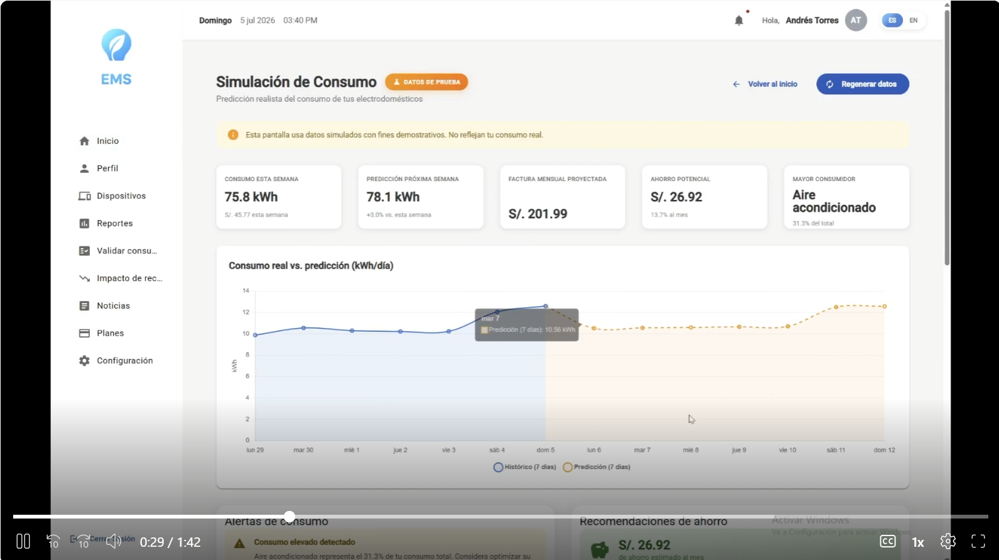


# Capítulo VI: Product Verification & Validation

## 6.1. Testing Suites & Validation

En esta sección se detalla la estrategia integral de pruebas diseñada para garantizar la calidad y fiabilidad del software. Este proceso abarca la validación aislada de las reglas de negocio a través de las pruebas unitarias, la correcta interacción entre los componentes y servicios mediante pruebas de integración, la alineación del desarrollo con los requerimientos del usuario utilizando Behavior-Driven Development, y la ejecución de flujos completos desde la perspectiva del cliente a través de las pruebas de sistema.

### 6.1.1. Core Entities Unit Tests.

Los Core Entities Unit Tests permiten validar el correcto funcionamiento de las entidades principales del sistema de manera aislada, asegurando que las reglas de negocio, validaciones y comportamientos esenciales se ejecuten correctamente. Estas pruebas son fundamentales para detectar errores tempranamente, mejorar la estabilidad del proyecto y facilitar el mantenimiento del software durante el desarrollo.

**User Profile Test**


**Dashboard Test**


**Device Test**


### 6.1.2. Core Integration Tests.

Los Controller Tests y Core Integration Tests son fundamentales para verificar el correcto funcionamiento de los endpoints y la interacción entre los distintos componentes del sistema, como servicios y bases de datos. Estas pruebas permiten validar respuestas, manejo de errores y códigos de estado, contribuyendo a desarrollar un software más estable, confiable y de calidad.

**Authentication Controller Test**


**User Controller Test**


**Devices Controller Test**


### 6.1.3. Core Behavior-Driven Development


### 6.1.4. Core System Tests.

<table border="1px">
    <tbody>
        <tr>
            <td style="font-weight: bold;">US01</td>
            <td style="font-weight: bold;">Registro de cuenta</td>
            <td style="font-weight: bold;">Como usuario, quiero registrarme en la plataforma para acceder a todas las funcionalidades.</td>
        </tr>
    </tbody>
</table>


<table border="1px">
    <tbody>
        <tr>
            <td style="font-weight: bold;">US02</td>
            <td style="font-weight: bold;">Inicio de sesión</td>
            <td style="font-weight: bold;">Como usuario, quiero autenticarme en la plataforma para gestionar mi consumo energético.</td>
        </tr>
    </tbody>
</table>


<table border="1px">
    <tbody>
        <tr>
            <td style="font-weight: bold;">US03</td>
            <td style="font-weight: bold;">Configuración de perfil inicial</td>
            <td style="font-weight: bold;">Como usuario, quiero registrar el tipo de vivienda y dispositivos básicos para personalizar mi experiencia.</td>
        </tr>
    </tbody>
</table>


<table border="1px">
    <tbody>
        <tr>
            <td style="font-weight: bold;">US04</td>
            <td style="font-weight: bold;">Cerrar sesión de manera segura</td>
            <td style="font-weight: bold;">Como usuario, quiero cerrar mi sesión de forma segura para proteger mi información.</td>
        </tr>
    </tbody>
</table>


<table border="1px">
    <tbody>
        <tr>
            <td style="font-weight: bold;">US05</td>
            <td style="font-weight: bold;">Conectar dispositivos</td>
            <td style="font-weight: bold;">Como usuario, quiero vincular mis dispositivos eléctricos al sistema para supervisar su consumo.</td>
        </tr>
    </tbody>
</table>


<table border="1px">
    <tbody>
        <tr>
            <td style="font-weight: bold;">US06</td>
            <td style="font-weight: bold;">Monitorear consumo en tiempo real</td>
            <td style="font-weight: bold;">Como usuario, quiero consultar el consumo energético en tiempo real para tomar decisiones inmediatas.</td>
        </tr>
    </tbody>
</table>


<table border="1px">
    <tbody>
        <tr>
            <td style="font-weight: bold;">US07</td>
            <td style="font-weight: bold;">Generar alertas de consumo elevado</td>
            <td style="font-weight: bold;">Como usuario, quiero recibir alertas automáticas cuando un dispositivo supere el consumo establecido como normal.</td>
        </tr>
    </tbody>
</table>


<table border="1px">
    <tbody>
        <tr>
            <td style="font-weight: bold;">US08</td>
            <td style="font-weight: bold;">Configurar umbrales de alerta personalizados</td>
            <td style="font-weight: bold;">Como usuario, quiero establecer mis propios límites de consumo para recibir notificaciones adaptadas a mis necesidades.</td>
        </tr>
    </tbody>
</table>


<table border="1px">
    <tbody>
        <tr>
            <td style="font-weight: bold;">US09</td>
            <td style="font-weight: bold;">Consultar reporte semanal de consumo</td>
            <td style="font-weight: bold;">Como usuario, quiero revisar reportes semanales para conocer mi gasto energético desglosado por dispositivo.</td>
        </tr>
    </tbody>
</table>


<table border="1px">
    <tbody>
        <tr>
            <td style="font-weight: bold;">US10</td>
            <td style="font-weight: bold;">Comparar consumo entre periodos</td>
            <td style="font-weight: bold;">Como usuario, quiero comparar mi consumo en semanas o meses distintos para identificar patrones de gasto.</td>
        </tr>
    </tbody>
</table>


<table border="1px">
    <tbody>
        <tr>
            <td style="font-weight: bold;">US11</td>
            <td style="font-weight: bold;">Proyección de factura mensual</td>
            <td style="font-weight: bold;">Como usuario, quiero recibir una estimación de mi próxima factura de electricidad con base en mi consumo actual.</td>
        </tr>
    </tbody>
</table>


<table border="1px">
    <tbody>
        <tr>
            <td style="font-weight: bold;">US12</td>
            <td style="font-weight: bold;">Consultar historial de consumo mensual</td>
            <td style="font-weight: bold;">Como usuario, quiero consultar un historial de mi consumo mensual para identificar cambios en mi gasto energético.</td>
        </tr>
    </tbody>
</table>


<table border="1px">
    <tbody>
        <tr>
            <td style="font-weight: bold;">US13</td>
            <td style="font-weight: bold;">Consultar centro de ayuda</td>
            <td style="font-weight: bold;">Como usuario, quiero acceder a un centro de ayuda con información y guías para resolver dudas comunes.</td>
        </tr>
    </tbody>
</table>


<table border="1px">
    <tbody>
        <tr>
            <td style="font-weight: bold;">US14</td>
            <td style="font-weight: bold;">Identificar dispositivos de alto consumo</td>
            <td style="font-weight: bold;">Como usuario, quiero identificar los dispositivos que generan mayor consumo energético para priorizar acciones de ahorro.</td>
        </tr>
    </tbody>
</table>


<table border="1px">
    <tbody>
        <tr>
            <td style="font-weight: bold;">US15</td>
            <td style="font-weight: bold;">Cambiar idioma de la plataforma</td>
            <td style="font-weight: bold;">Como usuario, quiero cambiar el idioma de la plataforma para comprender mejor la información según mi preferencia.</td>
        </tr>
    </tbody>
</table>


<table border="1px">
    <tbody>
        <tr>
            <td style="font-weight: bold;">US16</td>
            <td style="font-weight: bold;">Consultar noticias y consejos de ahorro energético</td>
            <td style="font-weight: bold;">Como usuario, quiero acceder a una sección con noticias y consejos para mantenerme informado y reducir mi consumo.</td>
        </tr>
    </tbody>
</table>


<table border="1px">
    <tbody>
        <tr>
            <td style="font-weight: bold;">US17</td>
            <td style="font-weight: bold;">Consultar la propuesta de valor</td>
            <td style="font-weight: bold;">Como visitante, quiero visualizar claramente la propuesta de valor de la plataforma para entender sus beneficios.</td>
        </tr>
    </tbody>
</table>


<table border="1px">
    <tbody>
        <tr>
            <td style="font-weight: bold;">US18</td>
            <td style="font-weight: bold;">Acceder a preguntas frecuentes (FAQ)</td>
            <td style="font-weight: bold;">Como visitante, quiero acceder a una sección de preguntas frecuentes para resolver mis dudas sin necesidad de reporte.</td>
        </tr>
    </tbody>
</table>


<table border="1px">
    <tbody>
        <tr>
            <td style="font-weight: bold;">US19</td>
            <td style="font-weight: bold;">Revisar planes de suscripción</td>
            <td style="font-weight: bold;">Como visitante, quiero revisar los planes de suscripción para comparar precios y beneficios antes de decidir.</td>
        </tr>
    </tbody>
</table>


<table border="1px">
    <tbody>
        <tr>
            <td style="font-weight: bold;">US20</td>
            <td style="font-weight: bold;">Cambiar idioma</td>
            <td style="font-weight: bold;">Como visitante, quiero cambiar el idioma de la landing page entre español e inglés para entender mejor la información.</td>
        </tr>
    </tbody>
</table>


## 6.2. Static testing & Verification

En esta fase del proyecto **EnergixUPC**, se aplicaron técnicas de pruebas estáticas para asegurar la mantenibilidad, escalabilidad y seguridad del código fuente sin necesidad de ejecutar la aplicación. Esto nos permitió identificar y corregir defectos en etapas tempranas del ciclo de desarrollo.

### 6.2.1. Static Code Analysis

El análisis estático de código se realizó integrando herramientas automatizadas tanto en los entornos de desarrollo locales (IntelliJ IDEA y Visual Studio Code) como en el repositorio de GitHub.

#### 6.2.1.1. Coding standard & Code conventions

Para garantizar que el código escrito por todos los miembros del equipo mantenga un formato uniforme y sea fácil de leer, se establecieron y respetaron las siguientes convenciones de codificación según la tecnología:

* **Backend (Java / Spring Boot):**
    * Se siguieron las convenciones de codificación estándar de Java de Oracle y Google.
    * **Nomenclatura:** Se utilizó `PascalCase` para las clases e interfaces (ej. `DeviceConsumptionCalculationServiceImpl`), y `camelCase` para métodos y atributos (ej. `calculateConsumption`).
    * **Estructura:** Se respetó la arquitectura Hexagonal (Domain-Driven Design), separando estrictamente los paquetes en `domain`, `application`, `infrastructure` e `interfaces`.
    * **Herramientas:** Se empleó el formateador integrado de IntelliJ IDEA y SonarLint para validar el estilo en tiempo real.

* **Frontend (Angular / TypeScript):**
    * Se aplicó la guía de estilo oficial de Angular (Angular Style Guide).
    * **Nomenclatura:** Se utilizó `kebab-case` para los nombres de archivos y carpetas (ej. `device-list.component.ts`), `PascalCase` para las clases de los componentes y `camelCase` para variables y funciones.
    * **Herramientas:** Se configuró ESLint y Prettier a través de las extensiones de Visual Studio Code (detallado en `.vscode/extensions.json`) para un formateo automático al guardar los archivos.

> **Evidencia de Convenciones de Código:**
>
>
> 
#### 6.2.1.2. Code Quality & Code Security

Para prevenir la acumulación de deuda técnica, "code smells" (malas prácticas) y vulnerabilidades de seguridad, el equipo implementó las siguientes estrategias:

* **Calidad de Código (Code Smells y Bugs Estáticos):** Se utilizó el motor de análisis estático para escanear los componentes del backend y frontend. Esto permitió detectar variables no utilizadas, dependencias circulares, y métodos con alta complejidad ciclomática. Además, la integración continua mediante GitHub Actions (definida en `.github/workflows/ci.yml` y `tests.yml`) asegura que el código pase un control mínimo antes de integrarse.
* **Seguridad y Dependencias (Vulnerabilidades):**
    Se habilitó **GitHub Dependabot** en el repositorio. Esta herramienta escaneó constantemente el archivo `pom.xml` (Backend) y `package.json` (Frontend) en busca de librerías de terceros desactualizadas o con vulnerabilidades públicas conocidas (CVEs), emitiendo alertas para su inmediata actualización.

> **Evidencia de Calidad y Seguridad:**


### 6.2.2. Reviews

El análisis estático no solo dependió de herramientas automatizadas, sino también de la revisión humana. Para ello, el equipo estableció un flujo de trabajo basado en **Peer Reviews (Revisiones de Pares)**.

**Proceso de Revisión (Pull Requests):**
1.  Ningún desarrollador tiene permitido hacer *commits* directamente a las ramas principales protegidas (`main` o `develop`).
2.  Todo el desarrollo de nuevas características o pruebas (como la rama `tests-2`) se realiza en ramas independientes.
3.  Al finalizar, se abre un **Pull Request (PR)** hacia la rama de integración (`develop`).
4.  Antes de realizar el *Merge*, el código debe ser revisado por al menos un compañero de equipo distinto al autor. El revisor comprueba la lógica de negocio, el cumplimiento de las convenciones y la correcta implementación de las pruebas (por ejemplo, validando los tests unitarios con JUnit y Mockito).
5.  Una vez aprobado y habiendo pasado los *workflows* de GitHub Actions, el código se integra.

Este proceso de revisión mitigó el riesgo de introducir errores de lógica que las herramientas automatizadas no pueden detectar, fomentando además la propiedad colectiva del código.

> **Evidencia de Revisión de Pares:**


## 6.3. Validation Interviews

Las entrevistas de validación representan una fase crucial en el proceso de desarrollo del producto SEMS (Sistema de Monitoreo Energético Inteligente). Esta metodología nos permite evaluar la efectividad, usabilidad y aceptación de la solución implementada por parte de nuestros segmentos objetivo identificados en el capítulo anterior.

### 6.3.1. Diseño de Entrevistas

El diseño de las entrevistas de validación se estructura en torno a la evaluación práctica del producto ENERGIX desarrollado. Las entrevistas están dirigidas a los mismos segmentos objetivo identificados en el capítulo 2: propietarios de vivienda y estudiantes que alquilan, con el fin de validar si la solución implementada satisface sus necesidades específicas de monitoreo energético.

**Preguntas para Segmento #1: Propietarios de Vivienda**
1. Al ingresar a la plataforma, ¿qué es lo primero que llama su atención?
2. Sin leer instrucciones, ¿puede identificar cuál es el propósito principal de esta aplicación?
3. ¿La información presentada en el dashboard le resulta clara y comprensible?
4. ¿Puede localizar fácilmente la información sobre su consumo energético actual?
5. ¿Qué opina sobre la forma en que se presentan los datos de consumo (gráficos, números, alertas)?
6. ¿Las alertas de consumo le resultan útiles y fáciles de entender?
7. ¿Considera que esta herramienta podría ayudarle realmente a reducir sus gastos de electricidad?
8. ¿Qué funcionalidad le resulta más valiosa de las que ha visto?
9. ¿El diseño y colores le transmiten confianza y profesionalismo?
10. ¿Encuentra alguna dificultad para navegar entre las diferentes secciones?
11. ¿Los íconos y botones son claros en su función?
12. Basándose en lo que ha visto, ¿estaría dispuesto(a) a usar esta plataforma regularmente?
13. ¿Recomendaría esta solución a otros propietarios de vivienda?
14. ¿Qué mejoraría para que la plataforma sea perfecta para sus necesidades?

**Preguntas para Segmento #2: Estudiantes que Alquilan**

1. ¿La interfaz le parece amigable para alguien de su perfil tecnológico?
2. ¿Puede entender rápidamente cómo esta aplicación le ayudaría a gestionar sus gastos de luz?
3. ¿La información se presenta de una manera que le resulte familiar y fácil de procesar?
4. ¿Los datos de consumo le ayudan a entender mejor en qué se va su dinero de electricidad?
5. ¿Las alertas le parecen útiles para controlar mejor sus gastos mensuales?
6. ¿Puede identificar fácilmente cuánto podría ahorrar usando esta herramienta?
7. ¿La función de monitoreo en tiempo real le resulta práctica para su estilo de vida?
8. ¿Esta herramienta le ayudaría a mantenerse dentro de su presupuesto mensual?
9. ¿Qué característica considera más importante para su situación como estudiante?
10. ¿El ahorro promedio mostrado le parece realista y atractivo?
11. ¿Hay algo que le parezca confuso o complicado de entender?
12. ¿Con qué frecuencia cree que usaría esta plataforma?
13. ¿Se siente motivado(a) a cambiar sus hábitos de consumo después de ver esta herramienta?

### 6.3.2. Registro de Entrevistas

**Segmento objetivo: Propietarios de vivienda**

**ENTREVISTA 1**

Link de las entrevistas

Foto de la entrevista


Inicia:00.00

Duración:10:07

Nombre: Emperatriz Sessarego

Edad: 57

Distrito: Jesús María
 
Resumen: La propietaria de vivienda Emperatriz regresa para ser presentada ante la página web junto a beneficios que ofrecemos y luego es redirigida hacia la aplicación web donde se le hizo un recurrido sobre las diferentes herramientas que ofrece la aplicación. Emperatriz resume su experiencia como agradeble, cree que la plataforma le será uitl al momento de controlar su consumo energético. Define la aplicación como fácile de enterder y navegar y concluye que si usaría la aplicación y la recomendaría a otros propietarios de vivienda.


**ENTREVISTA 2**

Foto de la entrevista

Inicia:00:00

Duración: 05:43

Nombre: Ana Vivar

Edad: 28 

Distrito: San Miguel 

Resumen: La propietaria de vivienda Ana Vivar evaluó la aplicación web y afirmó que sí estaría dispuesta a utilizarla, resaltando que le pareció intuitiva, clara y fácil de navegar. Destacó que los datos detallados sobre el consumo energético le serían muy útiles para optimizar el uso de energía en su hogar y reducir su factura eléctrica, y que el diseño de la plataforma transmite profesionalismo, con botones bien definidos y un dashboard especialmente valioso por la forma en que presenta la información. Además, mencionó que recomendaría la aplicación a amigos que, como ella, son propietarios de vivienda.


**Segmento objetivo: Estudiantes que alquilan**

**ENTREVISTA 1**


Inicia: 00:00

Duración: 

Nombre: Johnny Ricardo Mallqui Cueva

Edad: 19

Distrito: Chorrillos

Resumen: Johnny Mallqui (19 años) estudia en la UPC y alquila un cuarto en Chorrillos, se relaciaona a menudo con la tecnología ya que estudia ingeniería de Sistemas. Al probar nuestra herramienta nos comento que fue de su agrado y qeu si la usaria, mas que nada si esta se puede usar en un dispositivo movil ya que si una herramienta que solo esta disponible para laptop o PC, nos comento que no valdria la pena, en su caso si esta dispuesto a usarla, ya que al usar tantos dispositivos, seria una herramienta que facilite el ahorro de consumo energetico, tambien nos menciono que la aplicacion es intuitiva y que es muy facil de usar. 

**Entrevista 2**

Foto de la entrevista 

Inicia: 00:00

Duración: 04:21 

Nombre: Simón Gabriel Molina Chirinos

Edad: 19

Distrito: Pueblo Libre

Resumen:Simón es un estudiante que alquila un cuarto. Según sus propias palabras, la interfaz de la aplicación le parece amigable, ay que todo está bien distribuido y es intuitivo. Además, el diseño de la aplicación le resulta cómodo para entender los datos. Asmimismo, comprende de qué manera los datos se relacionan con sus gastos en sí. Menciona que las alertas de la aplicación le parecen útiles para identificar alguna anomalía en sus consumos. También, se siente motivado al ver que puede visualizar una estimación de ahorros. Le resulta útil el monitoreo constante, ya que puede corregir malos hábitos al momento. Además, considera que esta aplicación tendría un impacto positivo en cuanto al recibo mensual de luz. También, considera que lo más importante de esta aplicación es el apartado visual, ya que le ayuda a entender mejor los datos y gestionar su consumo. Asimismo, considera que los iconos de la aplicación podrían tener alguna breve explicación sobre su uso. Finalmente, el entrevistado declara que la aplicación le beneficiaría totalmente a mejorar sus hábitos y su consumo energético.

### 6.3.3. Evaluaciones según heurísticas

**Aplicación para evaluar:** Energix 

**Tareas a evaluar:**

El proceso de evaluación de usabilidad y funcionalidad se basó en el recorrido completo realizado por un usuario nuevo, abarcando las siguientes tareas principales:

* **Tarea 1: Registro e Inicio de Sesión (Onboarding):** Crear una cuenta nueva mediante el formulario de registro y completar la autenticación inicial para acceder al panel principal de la aplicación.
* **Tarea 2: Configuración y Gestión de Dispositivos y Ubicaciones:** Agregar electrodomésticos en la lista de dispositivos, asignándoles nombres personalizados, categorías y ubicaciones específicas (por ejemplo, "Habitación Juan", "Habitación María").
* **Tarea 3: Monitoreo Energético y Consulta del Dashboard:** Revisar indicadores numéricos de consumo y facturación estimada, analizar widget de ahorros y responder a las alertas de consumo inusual iniciales.
* **Tarea 4: Visualización y Descarga de Reportes:** Explorar tendencias de consumo semanal mediante gráficos de barra e intentar descargar el reporte mensual detallado en formato PDF.
* **Tarea 5: Suscripción a Planes Premium:** Navegar a la pantalla de planes, seleccionar la opción Premium e intentar completar la pasarela de pagos integrada.
* **Tarea 6: Configuración del Perfil y Ajuste de Alertas:** Modificar preferencias generales de la cuenta, cambiar o remover foto de perfil y editar el horario permitido para la recepción de alertas de consumo.
* **Tarea 7: Cierre de Sesión Seguro:** Salir de la cuenta activa utilizando la funcionalidad "Cerrar Sesión" en la barra de navegación lateral.

<br>

**ESCALA DE SEVERIDAD:**

*Los errores de usabilidad identificados fueron puntuados tomando en cuenta la escala de severidad de Jakob Nielsen:*

| Nivel | Descripción |
| :---: | :--- |
| **1** | **Problema superficial:** Puede ser fácilmente superado por el usuario o ocurre con muy poca frecuencia. No necesita ser arreglado a no ser que exista disponibilidad de tiempo. |
| **2** | **Problema menor:** Puede ocurrir un poco más frecuentemente o es un poco más difícil de superar para el usuario. Se le debería asignar una prioridad baja de resolución de cara al siguiente release. |
| **3** | **Problema mayor:** Ocurre frecuentemente o los usuarios no son capaces de resolverlos. Es importante que sean corregidos y se les debe asignar una prioridad alta. |
| **4** | **Problema muy grave:** Un error de gran impacto que impide al usuario continuar con el uso de la herramienta o rompe flujos principales de negocio. Es imperativo que sea corregido antes del lanzamiento. |

<br>

**TABLA RESUMEN:**

| # | Problema / Hallazgo Detectado | Escala de severidad | Heurística / Principio Violado |
| :---: | :--- | :---: | :--- |
| 1 | **Descarga de reportes rota:** El botón de descarga de reportes se queda bloqueado en "Descargando..." sin descargar ningún archivo ni permitir reintentos. | 4 | N1: Visibilidad del estado del sistema / N3: Control y libertad del usuario |
| 2 | **Bug de tildes en campos de texto:** Al intentar ingresar caracteres con tilde en los formularios (crear categoría o ubicación), la entrada se interrumpe y borra el texto redactado. | 3 | N5: Prevención de errores |
| 3 | **Indicador de notificaciones falsas (Campana):** El icono de campana muestra permanentemente un badge rojo de alerta activa, pero al hacer clic el modal indica "No tienes notificaciones". | 2 | N1: Visibilidad del estado del sistema |
| 4 | **UI estática al modificar horario de alertas:** Al guardar un nuevo horario, se muestra un mensaje toast de éxito pero la tarjeta de configuración sigue mostrando el horario por defecto (05:00 - 22:00). | 2 | N4: Consistencia y estándares / N1: Visibilidad del estado del sistema |

<br>

### Heurísticas y Recomendaciones:

#### PROBLEMA #1: Botón de descarga de reportes deshabilitado indefinidamente

* **Severidad:** 4
* **Heurística violada:** Usabilidad - Visibilidad del estado del sistema (Nielsen #1) / Control y libertad del usuario (Nielsen #3)
* **Problema:** Al hacer clic en el botón de "Descargar" en la sección de reportes, el texto cambia a "Descargando..." y el botón se deshabilita de manera indefinida. El sistema no inicia la descarga del archivo ni provee un mensaje de confirmación o de error, dejando al usuario bloqueado y sin saber si la acción está en curso o falló.


* **Recomendación:** Corregir el manejador de descarga en el frontend. Asegurar que al completarse la petición de descarga (o en caso de que ocurra una falla/timeout de la API), el estado local se restablezca a falso (`downloading = false`), habilitando nuevamente el botón para que el usuario pueda intentar la descarga otra vez. Adicionalmente, implementar un indicador de progreso visual o una notificación toast de descarga exitosa.

---

#### PROBLEMA #2: Bug de truncamiento al escribir vocales con tildes en formularios

* **Severidad:** 3
* **Heurística violada:** Usabilidad - Prevención de errores (Nielsen #5)
* **Problema:** Al intentar redactar textos que lleven vocales con tilde en los campos de los formularios (por ejemplo, al crear categorías o ubicaciones como "Habitación"), el cuadro de texto sufre un bug de renderizado e interrumpe la entrada, borrando la palabra a partir del carácter acentuado. Esto limita la libertad de entrada del usuario y le obliga a escribir con errores ortográficos.


* **Recomendación:** Verificar el manejador de eventos del teclado (`keyup`, `keydown` o `input`) en los componentes de formulario en Angular. Asegurarse de que el regex o la máscara de validación de caracteres del backend y frontend admita la codificación UTF-8 para vocales acentuadas (`á`, `é`, `í`, `ó`, `ú`) y caracteres especiales en español (`ñ`, `Ñ`).

---

#### PROBLEMA #3: Indicador de notificaciones falsas activas (Campana)

* **Severidad:** 2
* **Heurística violada:** Usabilidad - Visibilidad del estado del sistema (Nielsen #1)
* **Problema:** El icono de la campana en la barra superior muestra un círculo rojo de notificación activa de forma permanente, pero al hacer clic, el modal indica "No tienes notificaciones". Esto frustra al usuario que busca limpiar sus alertas y genera una falsa sensación de urgencia o error.


* **Recomendación:** Vincular de forma reactiva la visibilidad del círculo rojo (badge de notificación) al tamaño del array de notificaciones no leídas devuelto por la API. Si el número de notificaciones no leídas es `0`, el círculo rojo debe ocultarse automáticamente en la interfaz.

---

#### PROBLEMA #4: Falta de actualización visual del horario modificado en configuración

* **Severidad:** 2
* **Heurística violada:** Usabilidad - Visibilidad del estado del sistema (Nielsen #1) / Consistencia y estándares (Nielsen #4)
* **Problema:** Al modificar las horas de alertas en la pestaña de Configuración y presionar "Aceptar", el sistema muestra un mensaje emergente de éxito (toast) confirmando que el horario fue guardado. Sin embargo, la tarjeta informativa de la pantalla continúa mostrando el rango horario por defecto (`05:00 - 22:00`) en lugar de actualizarse con los datos recién ingresados, provocando una inconsistencia visual entre el mensaje y la pantalla.


* **Recomendación:** En el componente de configuración (`settings`), al recibir la respuesta HTTP exitosa (200 OK) del backend, se debe actualizar el estado del modelo local que alimenta la visualización de la tarjeta con los nuevos valores ingresados en el formulario en lugar de conservar los valores iniciales.


# Capítulo VII: DevOps Practices

## 7.1. Continuous Integration

### 7.1.1. Tools and Practices.

La Integración Continua (CI) es la práctica mediante la cual cada cambio introducido al código fuente es verificado de forma automática mediante la construcción del proyecto y la ejecución de un conjunto de pruebas automatizadas. Para el backend de la plataforma —desarrollado en Java 25 con Spring Boot— se utiliza **GitHub Actions** como plataforma de ejecución de pipelines. El pipeline de CI se dispara ante eventos de `push` y `pull_request` dirigidos a las ramas `main` y `develop`, garantizando que ningún cambio sea integrado sin pasar previamente por la suite de verificación automatizada.

A continuación se describen las herramientas y prácticas que componen la etapa de Integración Continua:

| Herramienta | Versión | Propósito en el proyecto |
|---|---|---|
| **GitHub Actions** | — | Plataforma de orquestación de pipelines CI/CD nativa de GitHub. Ejecuta los workflows definidos en `.github/workflows/` ante eventos de repositorio. |
| **actions/checkout** | v4 | Obtiene el código fuente del repositorio dentro del runner para su procesamiento. |
| **actions/setup-java** | v4 | Configura el entorno de ejecución Java 25 (distribución Temurin) con caché de dependencias Maven integrada. |
| **Java 25 (Temurin)** | 25 | JDK de distribución abierta adoptada como entorno de compilación y ejecución del backend Spring Boot. |
| **Apache Maven** | 3.9.11 | Herramienta de gestión y construcción del proyecto Java. Se ejecuta `mvn test -B` en modo no interactivo para compilar el código y ejecutar la suite de pruebas. |
| **JUnit 5** | 5.12.2 | Marco de pruebas unitarias para Java. Permite definir y ejecutar pruebas sobre entidades, servicios y componentes de forma aislada, validando su comportamiento individual. |
| **Mockito** | 5.17.0 | Marco de mocking para Java. Facilita el aislamiento de dependencias externas durante las pruebas unitarias, permitiendo simular el comportamiento de colaboradores sin instanciarlos realmente. |
| **Cucumber** | — | Herramienta de Behavior-Driven Development (BDD). Permite escribir escenarios de prueba en lenguaje Gherkin (`Given / When / Then`), legibles tanto por el equipo técnico como por stakeholders del negocio. Los escenarios describen el comportamiento esperado del sistema desde la perspectiva del usuario, asegurando que el desarrollo esté alineado con las necesidades del negocio. Crea y prueba ejemplos basados en cómo debería comportarse el sistema, garantizando que la implementación esté alineada con los requisitos del negocio. |
| **MySQL 8.4** | 8.4 | Sistema de gestión de base de datos relacional levantado como servicio dentro del runner de GitHub Actions. Las pruebas de integración se ejecutan contra una base de datos real —no simulada— para garantizar la fidelidad del comportamiento en un entorno equivalente a producción. |

**Prácticas adoptadas:**

- **Pipeline disparado por eventos de integración:** El workflow CI se ejecuta ante `push` a `main` o `develop`, y ante `pull_request` hacia dichas ramas, asegurando que todo código candidato a integrarse haya sido verificado.
- **GitFlow como modelo de ramificación:** Las ramas `main` (producción) y `develop` (integración) actúan como puntos de control del pipeline, en coherencia con el flujo GitFlow adoptado por el equipo.
- **Pruebas sobre infraestructura real:** El pipeline levanta un servicio MySQL 8.4 con health checks configurados (`mysqladmin ping`) antes de ejecutar los tests, garantizando que las pruebas de integración se ejecuten contra una base de datos operativa.
- **Fail-fast:** Si alguna prueba falla, el pipeline se detiene y la integración del cambio es bloqueada, protegiendo la integridad de las ramas principales.
- **BDD con Cucumber y Gherkin:** Los escenarios de comportamiento se definen en archivos `.feature` usando el lenguaje Gherkin. Cucumber traduce estos escenarios en pruebas ejecutables, creando un puente directo entre la especificación de negocio y la verificación técnica automatizada.

### 7.1.2. Build & Test Suite Pipeline Components.

A continuación se presentan las evidencias visuales del pipeline de construcción y suite de pruebas ejecutado mediante GitHub Actions.

**Pipeline CI — Build & Test**


## 7.2. Continuous Delivery

### 7.2.1. Tools and Practices.

La Entrega Continua (Continuous Delivery) extiende la Integración Continua al automatizar el empaquetado y publicación del artefacto de software, dejándolo en un estado siempre listo para ser desplegado. Para el backend de la plataforma, esta etapa consiste en la construcción de una imagen Docker y su publicación en el registro de contenedores **GitHub Container Registry (ghcr.io)**. El pipeline de CD se dispara exclusivamente ante `push` a la rama `main`, garantizando que únicamente el código integrado y verificado sea entregado como artefacto.

| Herramienta | Versión | Propósito en el proyecto |
|---|---|---|
| **GitHub Actions** | — | Plataforma de orquestación. Ejecuta el workflow CD de forma automática ante merges a `main`. |
| **actions/checkout** | v4 | Obtiene el código fuente para el proceso de construcción de la imagen. |
| **docker/login-action** | v3 | Autentica el runner de GitHub Actions con GitHub Container Registry usando el token `GITHUB_TOKEN`, sin necesidad de credenciales adicionales. |
| **docker/metadata-action** | v5 | Genera automáticamente las etiquetas (tags) y labels de la imagen Docker. Produce el tag `sha-<commit>` para trazabilidad y `latest` para referencia siempre actualizada. |
| **docker/build-push-action** | v6 | Construye la imagen Docker a partir del `Dockerfile` del repositorio y la publica directamente en `ghcr.io`. Integra soporte nativo para caché de capas. |
| **GitHub Container Registry (ghcr.io)** | — | Registro de contenedores privado asociado al repositorio. Almacena y distribuye las imágenes Docker producidas por el pipeline. |
| **GitHub Actions Cache (GHA Cache)** | — | Mecanismo de caché de capas Docker integrado en el runner (`cache-from: type=gha`, `cache-to: type=gha,mode=max`). Reduce significativamente el tiempo de construcción en ejecuciones sucesivas. |
| **Docker** | — | Motor de contenedores. La imagen construida encapsula el backend Spring Boot junto con todas sus dependencias en un artefacto reproducible e inmutable. |

**Prácticas adoptadas:**

- **Entrega automática al merge en `main`:** Cada vez que un cambio es integrado a la rama principal —habiendo superado previamente el pipeline de CI— se desencadena automáticamente la construcción y publicación de la imagen Docker.
- **Inmutabilidad del artefacto mediante tags por SHA:** Cada imagen publicada lleva el tag `sha-<commit>`, lo que permite trazar con exactitud qué commit originó cada artefacto y revertir a una versión anterior en caso necesario.
- **Tag `latest` como referencia de la versión actual:** Facilita el consumo de la imagen más reciente en entornos de despliegue sin necesidad de conocer el SHA específico.
- **Optimización mediante caché de capas Docker:** El uso de `type=gha` como backend de caché reutiliza las capas de la imagen entre ejecuciones, reduciendo los tiempos de entrega.
- **Separación de responsabilidades CI/CD:** El pipeline CI valida la calidad del código; el pipeline CD empaqueta y entrega el artefacto. Ambos son workflows independientes y complementarios.
- **Principio del menor privilegio:** El pipeline CD utiliza `GITHUB_TOKEN` con permisos mínimos necesarios (`contents: read`, `packages: write`), sin exponer credenciales adicionales.

### 7.2.2. Stages Deployment Pipeline Components.

A continuación se presentan las evidencias visuales del pipeline de entrega continua, incluyendo la construcción y publicación de la imagen Docker en GitHub Container Registry.

**Pipeline CD — Build & Push Docker Image**


## 7.3. Continuous deployment

### 7.3.1. Tools and Practices.

El Despliegue Continuo (Continuous Deployment) representa la etapa final del pipeline DevOps, en la cual el artefacto verificado y entregado es desplegado de forma automatizada en el entorno de producción. En la arquitectura adoptada, la imagen Docker publicada en `ghcr.io` —con tag `latest` y trazabilidad por SHA de commit— constituye el único artefacto que llega al entorno productivo. El despliegue se realiza extrayendo dicha imagen desde el registro y ejecutándola en el entorno de producción, garantizando que lo que se prueba en CI es exactamente lo que se despliega.

| Herramienta | Versión | Propósito en el proyecto |
|---|---|---|
| **GitHub Container Registry (ghcr.io)** | — | Fuente única de verdad para la imagen Docker lista para producción. El entorno de producción extrae la imagen desde este registro. |
| **Docker** | — | Motor de contenedores en el servidor de producción. Ejecuta la imagen del backend Spring Boot de forma aislada y reproducible. |
| **GitHub Actions** | — | Orquesta el flujo completo: desde el push a `main`, pasando por la verificación en CI, hasta la construcción y publicación de la imagen en CD, dejando el artefacto listo para despliegue. |
| **Imagen Docker (`sha-<commit>` / `latest`)** | — | Artefacto inmutable que encapsula el backend Spring Boot con Java 25. Su tag SHA garantiza la trazabilidad exacta entre el commit en el repositorio y la versión desplegada en producción. |

**Prácticas adoptadas:**

- **Pipeline como única vía de entrega a producción:** Ningún artefacto llega al entorno productivo fuera del flujo automatizado CI → CD → Producción. Esto elimina despliegues manuales inconsistentes.
- **Trazabilidad commit-a-producción:** El tag `sha-<commit>` de la imagen Docker permite identificar con precisión qué estado exacto del código se encuentra ejecutándose en producción en cualquier momento.
- **Rollback controlado:** Ante un fallo en producción, es posible revertir al tag SHA inmediatamente anterior sin necesidad de recompilar el código, ya que las imágenes permanecen disponibles en el registro.
- **Entorno de producción alineado con CI:** La imagen desplegada en producción es el mismo artefacto construido a partir del código que superó las pruebas unitarias, de integración y BDD en el pipeline CI. Esto elimina la brecha entre el entorno de pruebas y el entorno productivo.
- **Separación de ramas por ambiente:** La rama `main` representa el estado de producción. La rama `develop` es el entorno de integración. Solo lo que llega a `main` activa el pipeline de despliegue.

### 7.3.2. Production Deployment Pipeline Components.

A continuación se presentan las evidencias visuales del pipeline de despliegue continuo a producción, incluyendo la extracción de la imagen desde ghcr.io y su ejecución en el entorno productivo.

El procesos se realiza con el siguiente Github Action

```yml
name: CD

on:
  push:
    branches: [main]

jobs:
  build-and-push:
    name: Build and Push Docker Image
    runs-on: ubuntu-latest
    permissions:
      contents: read
      packages: write

    steps:
      - uses: actions/checkout@v4

      - uses: docker/setup-buildx-action@v3

      - uses: docker/login-action@v3
        with:
          registry: ghcr.io
          username: ${{ github.actor }}
          password: ${{ secrets.GITHUB_TOKEN }}

      - name: Set image tag
        run: echo "IMAGE=ghcr.io/${GITHUB_REPOSITORY,,}:latest" >> $GITHUB_ENV

      - uses: docker/build-push-action@v6
        with:
          context: .
          push: true
          tags: ${{ env.IMAGE }}

      - name: Deploy on render
        run: curl -X POST "https://api.render.com/deploy/srv-d7vtn9hj2pic73eqaflg?key=KVHJR4sUpWA"
```


> Notar que se usa secret configurado en Github para hacer el deploy del servicio en Render

## 7.4. Continuous Monitoring

La Monitorización Continua (Continuous Monitoring) es la práctica mediante la cual se supervisa de manera constante el rendimiento, la disponibilidad, la calidad y el comportamiento de la aplicación tanto en producción como en etapas previas del ciclo de vida del desarrollo de software. Esto permite identificar cuellos de botella, regresiones de rendimiento y fallos de servicio en tiempo real, facilitando una respuesta rápida y basada en datos.

### 7.4.1. Tools and Practices

A continuación se describen las herramientas y prácticas que componen la etapa de Monitorización Continua para garantizar la calidad del sistema, la experiencia de usuario y la integridad de las interfaces:

| Herramienta | Versión | Propósito en el proyecto |
|---|---|---|
| **k6** | v0.51.0 | Herramienta moderna de código abierto para pruebas de carga y estrés. Escrita en Go y programable en JavaScript, permite simular flujos de usuario complejos y validar el rendimiento de los endpoints bajo escenarios de alta concurrencia. |
| **Google Analytics (GA4)** | v4 | Plataforma de analítica web que permite monitorear de manera pasiva y en tiempo real la experiencia del usuario (RUM), registrando flujos de navegación, eventos personalizados, tasas de conversión y métricas de interacción en el frontend. |
| **Newman (Postman CLI)** | v6.1.3 | Ejecutor de línea de comandos para colecciones de Postman. Permite automatizar pruebas funcionales y de contrato sobre las APIs del sistema en entornos locales y pipelines de integración. |
| **Better Stack (Uptime)** | — | Herramienta de monitoreo activo que sondea de forma continua la disponibilidad (uptime) y tiempos de respuesta de las APIs desde múltiples nodos externos, generando alertas inmediatas ante incidentes de inactividad. |

**Prácticas adoptadas:**

- **Testing de Carga y Estrés Automatizado:** Definición de scripts declarativos en **k6** para modelar picos de tráfico (stress testing) y carga sostenida (load testing), ejecutándolos de forma programada para identificar cuellos de botella en la base de datos o en el procesamiento del backend antes de realizar pasos a producción.
- **Monitoreo de Experiencia de Usuario basado en Datos (RUM):** Configuración de flujos y eventos clave en **Google Analytics** para entender la interacción real de los usuarios, medir la tasa de rebote ante incrementos de latencia visual y detectar fricciones en los recorridos dentro de la aplicación.
- **Monitoreo de APIs de Dos Niveles:**
  - *A nivel funcional:* Integración de **Newman** en el pipeline de CI/CD para ejecutar validaciones completas sobre los endpoints de la API ante cada despliegue, asegurando que no existan regresiones en los contratos de datos.
  - *A nivel de disponibilidad:* Configuración de pings HTTPS en **Better Stack** para vigilar constantemente que el backend Spring Boot responda correctamente y en menos de un umbral establecido (ej. 500ms).

### 7.4.2. Monitoring Pipeline Components

En esta sección se detallan los componentes encargados de medir y asegurar la calidad visual y el rendimiento técnico de la interfaz de usuario en la web:

**Lighthouse:**
Es una herramienta automatizada de código abierto desarrollada por Google para auditar la calidad de las páginas web. En el ciclo de vida del proyecto se utiliza de las siguientes maneras:
- **Auditoría de Calidad Multidimensional:** Evalúa el rendimiento (Performance), la accesibilidad (Accessibility), las mejores prácticas de desarrollo (Best Practices) y el SEO.
- **Core Web Vitals:** Mide métricas críticas para la experiencia del usuario de Google, tales como el *Largest Contentful Paint* (LCP - velocidad de carga percibida), *First Input Delay* (FID - interactividad) y *Cumulative Layout Shift* (CLS - estabilidad visual).
- **Lighthouse CI (LHCI):** Integrado en el pipeline de CI/CD, permite ejecutar auditorías automatizadas contra entornos temporales de prueba. Si el puntaje de rendimiento o accesibilidad de una pull request desciende por debajo de un umbral establecido (por ejemplo, < 90/100), el pipeline se bloquea, impidiendo regresiones de rendimiento en producción.

**Catchpoint:**
Es una plataforma avanzada de monitoreo de la experiencia digital (DEM) que permite un análisis más dinámico y profundo que las pruebas locales:
- **Monitoreo Sintético Global (Synthetic Monitoring):** Realiza pruebas simuladas de manera continua y programada desde múltiples nodos geográficos distribuidos por todo el mundo. Esto ayuda a evaluar cómo la infraestructura de red, la CDN, la resolución DNS y los tiempos de handshake SSL impactan la calidad visual y el tiempo de carga de la página para usuarios reales en diferentes países.
- **Monitoreo de Usuario Real (RUM):** Recopila y analiza de manera pasiva el rendimiento de la página directamente desde los navegadores de los usuarios reales que visitan el sitio. Proporciona datos detallados sobre la carga de la página bajo condiciones de red y dispositivos reales.
- **Diagnóstico y Aislamiento de Errores:** Permite rastrear la cascada de carga de archivos (scripts, imágenes, estilos) e identificar qué recursos de terceros o fallos de red causan latencias elevadas o bloqueos en la interfaz del usuario.

### 7.4.3. Alerting Pipeline Components

El núcleo de la monitorización de infraestructura y servicios del backend se construye sobre **Prometheus** y **Grafana**, ofreciendo una solución robusta de recolección de métricas, visualización en tiempo real y disparo de alertas ante anomalías operativas.

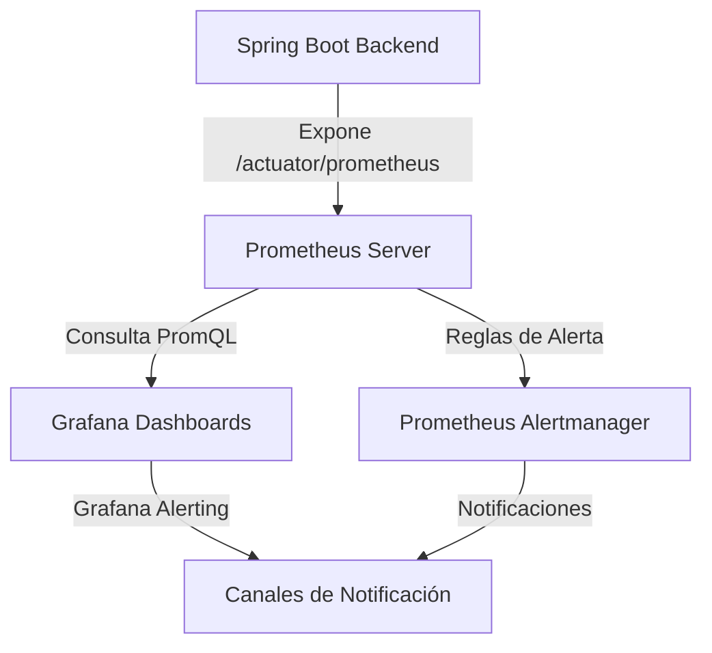
```mermaid
graph TD
    App["Spring Boot Backend"] -->|Expone /actuator/prometheus| Prom["Prometheus Server"]
    Prom -->|Consulta PromQL| Grafana["Grafana Dashboards"]
    Prom -->|Reglas de Alerta| AM["Prometheus Alertmanager"]
    Grafana -->|Grafana Alerting| Notify["Canales de Notificación"]
    AM -->|Notificaciones| Notify
```

**Prometheus (Recolección y Almacenamiento):**
- **Modelo Pull:** Prometheus funciona mediante un modelo basado en "pull" (extracción), realizando peticiones HTTP de forma periódica al endpoint `/actuator/prometheus` expuesto por el backend de Spring Boot (gracias a la biblioteca Micrometer).
- **Métricas de Series Temporales:** Almacena y procesa métricas clave como el uso de memoria de la JVM, consumo de CPU, estado del pool de conexiones de la base de datos (HikariCP), y tasas de peticiones HTTP agrupadas por código de estado y ruta.
- **Reglas de Alerta en Prometheus:** Se configuran reglas escritas en PromQL (Prometheus Query Language) para detectar comportamientos anómalos (por ejemplo, si la tasa de errores HTTP 5xx supera el 5% durante más de 2 minutos, o si el espacio en disco es inferior al 10%). Cuando se cumple la condición, Prometheus cambia el estado de la alerta a `Firing`.

**Grafana (Visualización e Instrumentación):**
- **Paneles de Control Dinámicos:** Se conecta a Prometheus como origen de datos para construir dashboards en tiempo real que permiten al equipo técnico visualizar la salud del sistema de un vistazo.
- **Grafana Alerting:** Además de la visualización, Grafana permite definir alertas directamente sobre los gráficos del dashboard, estableciendo umbrales visuales que, al ser sobrepasados (por ejemplo, latencia del percentil 95 superior a 800ms), activan notificaciones automáticas.

**Prometheus Alertmanager (Gestión de Alertas):**
- Es el componente encargado de recibir las alertas crudas generadas por Prometheus.
- **Deduplicación y Agrupación:** Silencia y agrupa alertas similares (por ejemplo, múltiples alertas de caída de nodos del mismo microservicio) para evitar la fatiga por alertas en el equipo.
- **Enrutamiento Inteligente:** Dirige las alertas a los canales apropiados según su severidad (e.g., alertas críticas a localizadores/PagerDuty y alertas de advertencia a canales de mensajería).

### 7.4.4. Notification Pipeline Components.

La integración de las herramientas de automatización de pipelines como **Jenkins** con sistemas de comunicación en tiempo real es fundamental para mantener una cultura DevOps transparente y responder rápidamente a cualquier incidente en los procesos de compilación, prueba y despliegue.

**Mecanismos de Integración en Jenkins:**
- **Jenkins Plugins:** Jenkins cuenta con una amplia biblioteca de plugins oficiales para conectarse con plataformas como **Slack**, **Microsoft Teams**, **Discord**, servidores de correo electrónico (SMTP) y Webhooks genéricos.
- **Configuración de Webhooks Entrantes:** Se configuran Webhooks en la plataforma de destino (por ejemplo, un canal de Slack `#devops-alerts`) y se asocian en las credenciales y configuración global de Jenkins.

**Flujo de Notificaciones y Reglas de Estado:**
Dentro de los pipelines declarativos (`Jenkinsfile`), se definen bloques `post` de ejecución para evaluar el resultado del build y enviar notificaciones personalizadas según el estado de los indicadores clave del proceso:

- **post { failure { ... } } (Notificación ante Fallos):** Se activa de forma inmediata si la compilación falla, si una prueba unitaria, de integración o BDD (Cucumber) no pasa, o si el análisis de calidad de código falla. Se envía un mensaje al canal del equipo detallando el commit autor del cambio, la rama, el número de ejecución en Jenkins y un enlace directo a los logs del error.
- **post { changed { ... } } (Notificación de Cambio de Estado):** Notifica al equipo cuando el estado de una compilación cambia de exitoso a fallido (o viceversa), permitiendo identificar rápidamente cuándo se rompió la rama de desarrollo y cuándo fue restaurada.
- **post { success { ... } } (Confirmación de Despliegue):** Envía una notificación de éxito cuando la imagen Docker ha sido subida correctamente a producción o al entorno de pruebas, informando que una nueva versión estable está operativa.

```groovy
pipeline {
    agent any
    stages {
        stage('Build & Test') {
            steps {
                sh 'mvn clean test'
            }
        }
        stage('Deploy') {
            steps {
                sh './deploy-script.sh'
            }
        }
    }
    post {
        always {
            // Envía resumen de pruebas de forma general
            junit '**/target/surefire-reports/*.xml'
        }
        success {
            slackSend(channel: '#devops-deployments',
                      color: '#00FF00',
                      message: "¡Pipeline Exitoso! Proyecto desplegado con éxito. Build #${env.BUILD_NUMBER} (${env.BUILD_URL})")
        }
        failure {
            slackSend(channel: '#devops-alerts',
                      color: '#FF0000',
                      message: "❌ ¡ALERTA! El pipeline falló en la etapa de compilación/pruebas. Build #${env.BUILD_NUMBER} (${env.BUILD_URL})")
        }
    }
}
```

Esta integración asegura un ciclo de retroalimentación ultrarrápido (*feedback loop*), garantizando que los desarrolladores estén al tanto de cualquier fallo a los pocos segundos de haber realizado un `git push`, optimizando el tiempo medio de reparación (MTTR).

# Capítulo VIII: Experiment-Driven Development

## 8.1. Experiment Planning
### 8.1.1. As-Is Summary.

Actualmente, la solución propuesta EMS (Energy Management System) se encuentra en una fase inicial de validación basada en supuestos derivados del enfoque Lean UX. La plataforma busca optimizar el consumo energético mediante monitoreo en tiempo real, alertas inteligentes y recomendaciones personalizadas.

En el estado actual, se identifican las siguientes condiciones:

- Los usuarios no cuentan con visibilidad detallada del consumo energético por dispositivo, limitándose a información mensual agregada.
- Existe una baja conciencia sobre hábitos de consumo energético eficiente.
- No se ha validado si los usuarios perciben valor suficiente en soluciones tecnológicas para gestionar su consumo.
- Se desconoce el nivel de disposición a pagar por una solución de monitoreo energético.

Asimismo, se identifican riesgos importantes:

- Resistencia a la adopción por la necesidad de instalar hardware.
- Baja comprensión de métricas energéticas (kWh, consumo por circuito).
- Posible percepción de complejidad del dashboard.
- Desconfianza en la precisión de medición del EMS.

Por ello, se requiere validar estas hipótesis mediante experimentación estructurada, permitiendo tomar decisiones basadas en evidencia.

### 8.1.2. Raw Material: Assumptions, Knowledge Gaps, Ideas, Claims.

**Assumptions:**

- Se asume que los usuarios desean reducir su consumo energético para disminuir costos.
- Se asume que los usuarios están dispuestos a utilizar tecnología para monitorear su consumo.
- Se asume que las alertas en tiempo real pueden influir en el comportamiento del usuario.
- Se asume que las recomendaciones personalizadas generan cambios en los hábitos de consumo.
- Se asume que los usuarios aceptarán un modelo de suscripción.
- Se asume que la instalación del hardware no representa una barrera significativa.

**Knowledge Gaps:**

- Falta información sobre la disposición real de los usuarios a pagar por el servicio.
- Se desconoce qué nivel de ahorro es percibido como significativo.
- No se tiene claridad sobre la facilidad de uso del sistema para usuarios no técnicos.
- Se requiere validar la confianza en los datos proporcionados por el sistema.
- No se conoce el impacto real de las alertas en el comportamiento del usuario.
- Falta evidencia sobre qué funcionalidades son realmente críticas para el usuario.

**Ideas:**

- Implementar encuestas y entrevistas para validar percepciones del usuario.
- Desarrollar una versión demo sin hardware para reducir fricción inicial.
- Implementar una prueba gratuita para evaluar conversión a usuarios pagos.
- Incorporar visualización de ahorro estimado en tiempo real.
- Analizar soluciones similares en el mercado para identificar mejores prácticas.

**Claims:**

- Se afirma que el monitoreo en tiempo real puede reducir el consumo energético.
- Se sostiene que las alertas inteligentes generan cambios en el comportamiento.
- Se afirma que la visualización de datos incrementa la conciencia energética.
- Se sostiene que el valor del ahorro supera el costo del servicio.
- Se afirma que la personalización mejora la retención de usuarios.

### 8.1.3. Experiment-Ready Questions.


| ID | Question                                                                      | Confidence                                            | Risk                        | Impact                                     | Interest            | Total Score |
| -- | ----------------------------------------------------------------------------- | ----------------------------------------------------- | --------------------------- | ------------------------------------------ | ------------------- | ----------- |
| Q1 | ¿La instalación del smart meter reduce la adopción del sistema?               | 8 - Alta fricción percibida por instalación eléctrica | 8 - Alto riesgo de abandono | 10 - Impacto crítico en adquisición        | 9 - Muy relevante   | 35          |
| Q2 | ¿Los usuarios confían en los datos generados por el EMS?                      | 7 - Confianza variable en IoT                         | 7 - Riesgo alto de rechazo  | 10 - Impacto crítico en adopción           | 9 - Alta relevancia | 33          |
| Q3 | ¿Las recomendaciones personalizadas generan reducción de consumo energético?  | 8 - Basado en analítica de datos                      | 6 - Riesgo medio            | 10 - Impacto directo en valor del producto | 9 - Muy relevante   | 33          |
| Q4 | ¿Las alertas de consumo en tiempo real modifican el uso de electrodomésticos? | 8 - Evidencia en apps similares                       | 5 - Riesgo medio            | 9 - Impacto en comportamiento del usuario  | 9 - Muy relevante   | 31          |
| Q5 | ¿Los usuarios entienden el consumo mostrado en kWh y gráficos del EMS?        | 7 - Basado en diseño UX                               | 6 - Riesgo de incomprensión | 9 - Impacto en uso del sistema             | 8 - Alto interés    | 30          |
| Q6 | ¿Un modo demo sin hardware incrementa la intención de uso?                    | 7 - Reduce fricción inicial                           | 4 - Bajo riesgo             | 8 - Impacto en adquisición                 | 8 - Interés alto    | 27          |

### 8.1.4. Question Backlog

| Prioridad (1,2,3,5,8) | ID | Pregunta                                                                      |
| --------------------- | -- | ----------------------------------------------------------------------------- |
| 1                     | Q1 | ¿La instalación del smart meter reduce la adopción del sistema?               |
| 1                     | Q2 | ¿Los usuarios confían en los datos generados por el EMS?                      |
| 2                     | Q3 | ¿Las recomendaciones personalizadas generan reducción de consumo energético?  |
| 3                     | Q4 | ¿Las alertas de consumo en tiempo real modifican el uso de electrodomésticos? |
| 5                     | Q5 | ¿Los usuarios entienden el consumo mostrado en kWh y gráficos del EMS?        |
| 5                     | Q6 | ¿Un modo demo sin hardware incrementa la intención de uso?                    |

### 8.1.5. Experiment Cards

| ID | Question                                                                      | Why                                                                                                                                           | What                                                                                             | Hypothesis                                                                            |
| -- | ----------------------------------------------------------------------------- | --------------------------------------------------------------------------------------------------------------------------------------------- | ------------------------------------------------------------------------------------------------ | ------------------------------------------------------------------------------------- |
| Q1 | ¿La instalación del smart meter reduce la adopción del sistema?               | El smart meter requiere intervención en el sistema eléctrico del hogar, lo cual puede generar rechazo por percepción de riesgo o complejidad. | Realizar test A/B: (A) flujo con instalación obligatoria, (B) acceso a demo sin hardware.        | Se espera que la versión sin hardware incremente la tasa de registro en al menos 25%. |
| Q2 | ¿Los usuarios confían en los datos generados por el EMS?                      | La confianza en la medición es clave para que el usuario tome decisiones basadas en los datos del sistema.                                    | Comparar datos del EMS con recibos eléctricos reales y aplicar encuestas de percepción.          | Se espera que al menos el 70% de usuarios confíe en los datos mostrados.              |
| Q3 | ¿Las recomendaciones personalizadas generan reducción de consumo energético?  | Las recomendaciones son el principal valor agregado del EMS frente a soluciones tradicionales.                                                | Mostrar recomendaciones basadas en patrones de consumo y medir cambios en consumo real.          | Se espera una reducción del consumo total en al menos 20%.                            |
| Q4 | ¿Las alertas de consumo en tiempo real modifican el uso de electrodomésticos? | Las alertas buscan intervenir directamente en el comportamiento del usuario en momentos críticos de consumo.                                  | Enviar alertas cuando se detecten picos de consumo y medir comportamiento posterior.             | Se espera una reducción del 15% en consumo en horas pico.                             |
| Q5 | ¿Los usuarios entienden el consumo mostrado en kWh y gráficos del EMS?        | Si el usuario no entiende los datos, no puede tomar decisiones informadas.                                                                    | Realizar pruebas de usabilidad donde los usuarios interpreten consumo actual, histórico y picos. | Se espera que el 80% de usuarios interprete correctamente los datos sin asistencia.   |
| Q6 | ¿Un modo demo sin hardware incrementa la intención de uso?                    | Reducir la fricción inicial puede mejorar significativamente la captación de usuarios.                                                        | Implementar demo interactivo con datos simulados accesible desde web/app.                        | Se espera un incremento del 30% en la tasa de registro.                               |


## 8.2. Experiment Design
### 8.2.1. Hypotheses.

| | **Hypothesis** |
| :--- | :--- |
| **Question** | ¿La instalación del smart meter reduce la adopción del sistema? |
| **Belief** | Creemos que ofrecer una alternativa sin la instalación física de un smart meter aumentará la adopción inicial, ya que se reduce la fricción y la percepción de riesgo por parte del usuario. |
| **Hypothesis** | La implementación de un flujo de registro que incluya una versión demo sin hardware incrementará la tasa de registro de nuevos usuarios en al menos un 25% en comparación con el flujo que exige la instalación obligatoria. |
| **Null Hypothesis** | La opción de un modo demo sin hardware no tendrá un impacto significativo en la tasa de registro de nuevos usuarios. |

| | **Hypothesis** |
| :--- | :--- |
| **Question** | ¿Los usuarios confían en los datos generados por el EMS? |
| **Belief** | Creemos que la transparencia y la validación de los datos son fundamentales para que los usuarios confíen en el sistema y lo utilicen para tomar decisiones sobre su consumo energético. |
| **Hypothesis** | Al comparar los datos del EMS con los recibos eléctricos de los usuarios y demostrar su precisión, al menos el 70% de los usuarios manifestará un alto nivel de confianza en la información proporcionada por el sistema. |
| **Null Hypothesis** | Menos del 70% de los usuarios confiará en los datos mostrados por el EMS, incluso después de la validación con sus recibos eléctricos. |

| | **Hypothesis** |
| :--- | :--- |
| **Question** | ¿Las recomendaciones personalizadas generan reducción de consumo energético? |
| **Belief** | Creemos que proporcionar recomendaciones de ahorro personalizadas y accionables, basadas en los patrones de consumo del usuario, es el principal generador de valor del producto. |
| **Hypothesis** | La implementación de recomendaciones personalizadas basadas en el análisis de patrones de consumo logrará una reducción del consumo energético total de al menos un 20% entre los usuarios que las sigan. |
| **Null Hypothesis** | Las recomendaciones personalizadas no generarán una reducción estadísticamente significativa en el consumo energético de los usuarios. |

| | **Hypothesis** |
| :--- | :--- |
| **Question** | ¿Las alertas de consumo en tiempo real modifican el uso de electrodomésticos? |
| **Belief** | Creemos que las notificaciones instantáneas sobre picos de consumo pueden influir en el comportamiento del usuario en el momento preciso, fomentando un uso más eficiente de la energía. |
| **Hypothesis** | El envío de alertas en tiempo real cuando se detecten picos de consumo provocará una reducción de al menos un 15% en el consumo de energía durante las horas pico. |
| **Null Hypothesis** | Las alertas en tiempo real sobre picos de consumo no modificarán significativamente los hábitos de uso de electrodomésticos ni el consumo en horas pico. |

| | **Hypothesis** |
| :--- | :--- |
| **Question** | ¿Los usuarios entienden el consumo mostrado en kWh y gráficos del EMS? |
| **Belief** | Creemos que una interfaz de usuario clara e intuitiva es crucial para que los usuarios, independientemente de su conocimiento técnico, puedan interpretar los datos de consumo y actuar en consecuencia. |
| **Hypothesis** | Tras realizar pruebas de usabilidad, se espera que al menos el 80% de los usuarios pueda interpretar correctamente los datos de consumo actual, histórico y picos que se muestran en el dashboard sin necesidad de asistencia. |
| **Null Hypothesis** | Menos del 80% de los usuarios podrá interpretar correctamente los datos presentados en el dashboard, indicando problemas de usabilidad y comprensión. |

| | **Hypothesis** |
| :--- | :--- |
| **Question** | ¿Un modo demo sin hardware incrementa la intención de uso? |
| **Belief** | Creemos que permitir a los usuarios explorar las funcionalidades del sistema con datos simulados, sin el compromiso de una instalación, aumentará el interés y la probabilidad de que se registren. |
| **Hypothesis** | La implementación de un modo demo interactivo y accesible desde la web o la aplicación resultará en un incremento del 30% en la tasa de registro de usuarios. |
| **Null Hypothesis** | La disponibilidad de un modo demo no tendrá un impacto significativo en la tasa de registro de nuevos usuarios. |

### 8.2.2. Domain Business Metrics

| Métrica | Descripción | Fórmula de Cálculo | Técnica de Recolección | Meta Deseada |
| :--- | :--- | :--- | :--- | :--- |
| **Tasa de Registro de Usuarios** | Mide el porcentaje de visitantes que completan el proceso de registro. Es un indicador clave de la adquisición de usuarios y la efectividad de la propuesta de valor inicial. | (Número de Usuarios Registrados / Número de Visitantes Únicos) * 100 | Análisis de logs del servidor y plataforma de analítica web/móvil. | Incrementar en un 25-30% |
| **Nivel de Confianza del Usuario** | Evalúa la percepción de los usuarios sobre la precisión y fiabilidad de los datos proporcionados por el sistema EMS. Es fundamental para la retención y el uso continuado de la plataforma. | (Número de Usuarios que califican la confianza como "Alta" o "Muy Alta" / Número Total de Encuestados) * 100 | Encuestas de satisfacción y percepción post-validación de datos. | ≥ 70% |
| **Reducción de Consumo Energético** | Mide la disminución porcentual del consumo de energía (en kWh) de los usuarios activos. Es la métrica principal que demuestra el valor económico y ecológico del producto. | ((Consumo Anterior - Consumo Actual) / Consumo Anterior) * 100 | Datos de consumo recopilados por el sistema EMS a lo largo del tiempo. | ≥ 20% |
| **Reducción de Consumo en Horas Pico** | Mide el cambio en el comportamiento del usuario, específicamente la reducción del consumo durante los períodos de mayor demanda energética. Impacta directamente en la estabilidad de la red y en costos. | ((Consumo en Pico Anterior - Consumo en Pico Actual) / Consumo en Pico Anterior) * 100 | Análisis de datos de consumo del EMS, segmentado por franjas horarias. | ≥ 15% |
| **Tasa de Éxito en Tareas de Usabilidad** | Mide el porcentaje de usuarios que pueden completar tareas clave dentro de la plataforma sin asistencia. Indica la facilidad de uso y la claridad de la interfaz. | (Número de Usuarios que completan la tarea con éxito / Número Total de Usuarios en la prueba) * 100 | Pruebas de usabilidad moderadas y no moderadas. | ≥ 80% |

### 8.2.3. Measures.

| Question | Measure |
| :--- | :--- |
| ¿La instalación del smart meter reduce la adopción del sistema? | Medir y comparar la tasa de conversión de registros entre el grupo de usuarios al que se le ofrece un modo demo (sin hardware) y el grupo al que se le exige la instalación del smart meter. |

| Question | Measure |
| :--- | :--- |
| ¿Los usuarios confían en los datos generados por el EMS? | Realizar encuestas de satisfacción y confianza antes y después de mostrar a los usuarios una comparativa entre los datos del EMS y sus recibos de electricidad. Se medirá el porcentaje de usuarios que califiquen la precisión como "alta" o "muy alta". |

| Question | Measure |
| :--- | :--- |
| ¿Las recomendaciones personalizadas generan reducción de consumo energético? | Analizar el consumo energético (en kWh) de un grupo de usuarios antes y después de la implementación de las recomendaciones personalizadas. Se comparará con un grupo de control que no reciba dichas recomendaciones para aislar el impacto. |

| Question | Measure |
| :--- | :--- |
| ¿Las alertas de consumo en tiempo real modifican el uso de electrodomésticos? | Monitorear y comparar el consumo de energía durante las horas pico para los usuarios que reciben alertas en tiempo real frente a los que no. Se medirá la variación porcentual del consumo en esos períodos. |

| Question | Measure |
| :--- | :--- |
| ¿Los usuarios entienden el consumo mostrado en kWh y gráficos del EMS? | Registrar la tasa de éxito y el tiempo empleado por los usuarios para completar tareas específicas en pruebas de usabilidad, como "identificar el dispositivo de mayor consumo del último mes". Se medirá el porcentaje de usuarios que completen las tareas correctamente sin ayuda. |

| Question | Measure |
| :--- | :--- |
| ¿Un modo demo sin hardware incrementa la intención de uso? | Medir la tasa de clics en el botón de "Registro" o "Probar ahora" en la página de destino. Se comparará la tasa de conversión de la versión que promociona el modo demo interactivo frente a la que no lo hace. |

### 8.2.4. Conditions.

| Question | Condición Experimental | Condición de Control |
| :--- | :--- | :--- |
| ¿La instalación del smart meter reduce la adopción del sistema? | Se espera un incremento de al menos el 25% en la tasa de registro para el grupo de usuarios expuesto al flujo con modo demo (sin hardware). | No se observará una diferencia estadísticamente significativa en la tasa de registro entre el grupo con modo demo y el grupo con instalación obligatoria. |

| Question | Condición Experimental | Condición de Control |
| :--- | :--- | :--- |
| ¿Los usuarios confían en los datos generados por el EMS? | Al menos el 70% de los usuarios expresará un alto nivel de confianza en los datos del EMS después de la validación con sus recibos eléctricos. | Menos del 70% de los usuarios mostrará confianza en los datos del EMS, indicando que la validación no fue suficiente para generar credibilidad. |

| Question | Condición Experimental | Condición de Control |
| :--- | :--- | :--- |
| ¿Las recomendaciones personalizadas generan reducción de consumo energético? | El grupo de usuarios que recibe recomendaciones personalizadas mostrará una reducción de consumo energético de al menos un 20% en comparación con el grupo de control. | No habrá una diferencia estadísticamente significativa en el consumo energético entre el grupo que recibe recomendaciones y el grupo de control. |

| Question | Condición Experimental | Condición de Control |
| :--- | :--- | :--- |
| ¿Las alertas de consumo en tiempo real modifican el uso de electrodomésticos? | Se registrará una reducción del consumo en horas pico de al menos un 15% para el grupo de usuarios que recibe alertas en tiempo real. | El consumo en horas pico no variará significativamente para el grupo que recibe alertas en comparación con el grupo que no las recibe. |

| Question | Condición Experimental | Condición de Control |
| :--- | :--- | :--- |
| ¿Los usuarios entienden el consumo mostrado en kWh y gráficos del EMS? | Al menos el 80% de los usuarios completará con éxito las tareas de interpretación de datos en las pruebas de usabilidad sin requerir asistencia. | Menos del 80% de los usuarios logrará completar las tareas de interpretación de datos, señalando problemas en la claridad de la interfaz. |

| Question | Condición Experimental | Condición de Control |
| :--- | :--- | :--- |
| ¿Un modo demo sin hardware incrementa la intención de uso? | Se observará un aumento del 30% en la tasa de registro para la versión de la página que promociona el modo demo interactivo. | No habrá una diferencia significativa en la tasa de registro entre la versión con promoción del modo demo y la versión sin ella. |

### 8.2.5. Scale Calculations and Decisions.

Este enfoque utiliza métricas para evaluar el cumplimiento de las hipótesis del proyecto. Cada hipótesis se asocia con un indicador de éxito que determina si el resultado es **desfavorable**, **aceptable**, **ideal** o **excelente**.

- **Desfavorable**: La métrica no alcanza el umbral mínimo esperado, lo que indica que la hipótesis probablemente sea incorrecta y requiere una revisión o un pivote.
- **Aceptable**: La métrica se encuentra en un rango que, si bien no es el ideal, muestra un impacto positivo y justifica la implementación.
- **Ideal**: La métrica alcanza el objetivo principal definido en la hipótesis, confirmando el supuesto.
- **Excelente**: La métrica supera significativamente el objetivo ideal (generalmente en un 25% o más), lo que indica un éxito rotundo y una fuerte validación de la hipótesis.

Este marco permite tomar decisiones basadas en datos para validar, ajustar o descartar las hipótesis del proyecto de manera estructurada.

| Scale Calculation | Decision | Factor          |              |          |               |
| :--- | :--- |:----------------|:-------------|:---------|:--------------|
| | | **Desfavorable** | **Aceptable** | **Ideal** | **Excelente** |
| **Q1:** Creemos que ofrecer una alternativa sin instalación de hardware aumentará la adopción. Sabremos que esto es cierto cuando observemos un incremento de al menos el **25%** en la tasa de registro. | Implementar un flujo de registro con una opción de "Modo Demo" para reducir la fricción inicial y permitir a los usuarios explorar la aplicación sin compromiso. |                 |              |          |               |
| **Q2:** Creemos que la transparencia sobre la precisión de los datos genera confianza. Sabremos que esto es cierto cuando al menos el **70%** de los usuarios manifieste un alto nivel de confianza. | Integrar una sección de validación de datos donde los usuarios puedan comparar las mediciones del EMS con sus recibos de electricidad, junto con testimonios y sellos de confianza. |                 |              |          |               |
| **Q3:** Creemos que las recomendaciones personalizadas son un generador de valor clave. Sabremos que esto es cierto cuando observemos una reducción del consumo de al menos un **20%**. | Desarrollar un motor de recomendaciones que analice patrones de consumo y sugiera acciones de ahorro específicas y fáciles de implementar para el usuario. |                 |              |          |               |
| **Q4:** Creemos que las alertas en tiempo real influyen en el comportamiento del usuario. Sabremos que esto es cierto cuando observemos una reducción del **15%** en el consumo durante horas pico. | Implementar un sistema de notificaciones push que alerte a los usuarios sobre picos de consumo inesperados, ofreciendo la opción de apagar dispositivos de forma remota. |                 |              |          |               |
| **Q5:** Creemos que una interfaz clara es crucial para la toma de decisiones. Sabremos que esto es cierto cuando al menos el **80%** de los usuarios interprete los datos correctamente. | Diseñar un dashboard visual e intuitivo, utilizando gráficos claros y un lenguaje sencillo para representar el consumo en kWh, su equivalencia en moneda local y comparativas. |                 |              |          |               |
| **Q6:** Creemos que un modo demo sin compromiso aumenta el registro. Sabremos que esto es cierto cuando observemos un incremento del **30%** en la tasa de registro. | Crear un landing page y campañas de marketing que destaquen la disponibilidad de un modo demo interactivo para atraer a usuarios que aún no están listos para comprar el hardware. |                 |              |          |               |

### 8.2.6. Methods Selection.

| Herramienta | Google Analytics | Catchpoint | RedLine13 | Lighthouse |
| :--- | :--- | :--- | :--- | :--- |
| **Precio** | Plan gratuito robusto con opciones de pago (Google Analytics 360). | Basado en suscripción, con pruebas gratuitas. Orientado al mercado empresarial. | Gratuito con limitaciones, con planes de pago para mayor capacidad. | Totalmente gratuito y de código abierto, integrado en las herramientas de desarrollo de Chrome. |
| **Capacidad de Análisis** | Análisis exhaustivo de métricas de adquisición, comportamiento y conversión de usuarios. Ideal para A/B testing y seguimiento de objetivos. | Monitoreo exhaustivo del rendimiento web y la experiencia de usuario desde múltiples ubicaciones geográficas (monitoreo sintético y real). | Análisis orientado a pruebas de carga y rendimiento del backend. Simula un gran número de usuarios para medir la respuesta del servidor. | Análisis orientado a la experiencia de usuario en el lado del cliente. Mide métricas clave de rendimiento, accesibilidad, PWA y SEO. |
| **Sencillez** | Curva de aprendizaje media. La interfaz es potente pero puede ser compleja para nuevos usuarios. Requiere configuración para mediciones personalizadas. | Interfaz avanzada y detallada. Requiere conocimientos técnicos para configurar y analizar los monitores de rendimiento. | Relativamente sencillo para iniciar pruebas de carga básicas, pero la interpretación de resultados requiere conocimientos de rendimiento. | Muy sencillo de usar. Genera un informe resumido y fácil de entender con puntuaciones y recomendaciones claras. |
| **Ventajas** | Excelente para entender el comportamiento del usuario en el sitio, medir tasas de conversión (ej. registros) y realizar segmentación de audiencia. Amplia integración. | Ideal para garantizar la disponibilidad y el rendimiento global de la aplicación, detectando problemas antes de que afecten a los usuarios. | Permite simular tráfico masivo para validar la escalabilidad y robustez de la infraestructura del servidor bajo condiciones de estrés. | Óptimo para auditorías rápidas y mejoras en el frontend. Proporciona acciones concretas para optimizar la velocidad de carga y la accesibilidad. |

### 8.2.7. Data Analytics: Goals, KPIs and Metrics Selection.

Siguiendo el principio de seleccionar la "cosa más simple y útil", se ha elegido **Lighthouse** como el método principal para la evaluación de los experimentos. Esta herramienta, al ser gratuita y estar integrada en el navegador, representa la forma más sencilla y directa de obtener retroalimentación sobre la calidad de la experiencia del usuario. Para la hipótesis sobre la comprensión de los datos (Q5), Lighthouse es fundamental, ya que sus auditorías de accesibilidad y rendimiento aseguran que la interfaz no presente barreras técnicas que impidan la correcta interpretación de los gráficos y cifras. Aunque no mide directamente la conversión, garantiza que la plataforma base sobre la que se ejecutan las pruebas A/B (Q1, Q6) sea performante y accesible, eliminando variables que podrían contaminar los resultados. Su enfoque en métricas claras y accionables lo convierte en la herramienta más eficiente para validar la calidad del front-end de manera rápida y sin costo.


### 8.2.8. Web and Mobile Tracking Plan.

**Nota de alcance:** el plan de tracking descrito a continuación aplica únicamente a la Web Application y el Landing Page. El proyecto Energix no contempla una aplicación móvil nativa en esta fase, por lo que no se define un plan de tracking para Mobile.

Para Energix, nuestro objetivo es validar las hipótesis sobre la adopción, confianza y comportamiento del usuario para optimizar el consumo energético. A medida que ejecutemos los experimentos definidos, estableceremos un plan de seguimiento exhaustivo que nos permitirá evaluar de manera efectiva los resultados.

El monitoreo de las funcionalidades experimentales se llevará a cabo en dos etapas clave:

**1. Implementación Inicial**

Durante esta fase, nos enfocaremos en el lanzamiento de los experimentos (pruebas A/B, encuestas, demos) y en la recolección de datos iniciales para establecer una línea base de rendimiento y comportamiento.

**Recopilación de Datos:**

*   **Métricas de Uso:** Se recopilarán datos sobre el uso de la aplicación, incluyendo el número de registros (para Q1 y Q6), la duración de las sesiones y la frecuencia de uso del dashboard.
*   **Interacciones de los Usuarios:** Se registrarán las interacciones de los usuarios con las funcionalidades clave, como clics en las recomendaciones personalizadas (para Q3), visualización de alertas de consumo (para Q4) y tiempo dedicado a interpretar los gráficos (para Q5).
*   **Feedback de Usuarios:** A través de encuestas y pruebas de usabilidad, se recogerán opiniones sobre la confianza en los datos del sistema (para Q2) y la claridad de la interfaz (para Q5).

**Análisis Comparativo:**

Se compararán los datos obtenidos durante esta fase con los grupos de control definidos. Por ejemplo, se analizará la tasa de registro del grupo con acceso al modo demo frente al grupo sin él (Q1, Q6) para evaluar el impacto inmediato.

**2. Seguimiento Continuo**

Después de la implementación inicial, se establecerá un proceso continuo de seguimiento para evaluar el rendimiento a largo plazo y realizar ajustes según sea necesario.

**Recopilación de Datos:**

*   **Métricas en Tiempo Real:** Se implementarán herramientas de análisis para monitorear el comportamiento de los usuarios en tiempo real, lo que permitirá identificar tendencias y patrones de consumo energético (Q3, Q4).
*   **Segmentación de Usuarios:** Los datos se segmentarán por tipo de usuario (ej. los que siguen recomendaciones vs. los que no) para entender mejor cómo cada grupo interactúa con la plataforma y cuál es el impacto real en su consumo.
*   **Tasa de Retención:** Se medirá la tasa de retención de usuarios a lo largo del tiempo para evaluar si las funcionalidades (recomendaciones, alertas) son efectivas en mantener a los usuarios comprometidos con la plataforma.

**Evaluación y Ajustes:**

*   **Informes Periódicos:** Se generarán informes semanales que resuman los hallazgos de los experimentos, incluyendo recomendaciones para validar o refutar las hipótesis.
*   **Iteración Basada en Datos:** Se realizarán ajustes en la plataforma basados en los datos recopilados y en el feedback de los usuarios, asegurando que Energix evolucione para satisfacer mejor las necesidades de sus usuarios y cumplir su objetivo de ahorro energético.

Este enfoque asegurará que Energix continúe evolucionando en función de los datos y permita tomar decisiones informadas para mejorar la experiencia del usuario y la efectividad de la plataforma.

## 8.3. Experimentation
### 8.3.1. To-Be User Stories.

Las siguientes historias de usuario fueron diseñadas a partir de las hipótesis planteadas en la sección 8.2.1, traduciendo cada pregunta de experimentación (Q1-Q6) en una funcionalidad concreta a implementar en la plataforma.

| User Story ID | Título | Descripción | Criterios de Aceptación | Relacionado con (Epic ID) |
| :--- | :--- | :--- | :--- | :--- |
| **US20** | Activar modo demo sin hardware | Como usuario potencial, quiero acceder a un modo demo sin necesidad de instalar un smart meter físico, para conocer la plataforma antes de comprometerme con la instalación. | **Escenario 1: Acceso al modo demo**<br>**Given** que el usuario visualiza la opción "Probar sin instalación"<br>**When** hace clic en el botón correspondiente<br>**Then** el sistema le otorga acceso a un dashboard con datos simulados de consumo<br>**And** muestra el mensaje: "Estás explorando una demo con datos de ejemplo"<br><br>**Escenario 2: Conversión de demo a cuenta real**<br>**Given** que el usuario está usando el modo demo<br>**When** decide continuar y registrarse con datos reales<br>**Then** el sistema migra su sesión a una cuenta activa<br>**And** muestra el mensaje: "Tu cuenta ha sido activada correctamente" | EP02 |
| **US21** | Validar precisión de datos del EMS | Como usuario, quiero comparar el consumo mostrado por la plataforma con mi recibo eléctrico real, para confiar en la exactitud de la información que recibo. | **Escenario 1: Carga de recibo para comparación**<br>**Given** que el usuario tiene un recibo eléctrico del mes<br>**When** sube una foto o ingresa el monto de su recibo en la sección "Validar consumo"<br>**Then** el sistema compara el valor con el consumo registrado en la plataforma<br>**And** muestra el porcentaje de coincidencia entre ambos valores<br><br>**Escenario 2: Discrepancia detectada**<br>**Given** que existe una diferencia significativa entre el recibo y los datos del sistema<br>**When** se completa la comparación<br>**Then** el sistema muestra el mensaje: "Detectamos una diferencia, revisa la calibración de tus dispositivos" | EP04 |
| **US22** | Medir impacto de recomendaciones personalizadas | Como usuario, quiero ver el ahorro de consumo logrado tras aplicar las recomendaciones personalizadas, para confirmar el valor real que me brinda la plataforma. | **Escenario 1: Comparación antes/después**<br>**Given** que el usuario ha recibido recomendaciones de ahorro<br>**When** consulta la sección "Impacto de mis recomendaciones"<br>**Then** el sistema muestra el porcentaje de reducción de consumo respecto al periodo anterior<br><br>**Escenario 2: Sin reducción significativa**<br>**Given** que el usuario aplicó recomendaciones pero no redujo su consumo<br>**When** revisa el reporte de impacto<br>**Then** el sistema muestra el mensaje: "Aún no se detecta una reducción significativa, sigue aplicando las recomendaciones" | EP07 |
| **US23** | Configurar alertas en horas pico | Como usuario, quiero recibir alertas específicas durante las horas de mayor demanda eléctrica, para modificar mi uso de electrodomésticos en esos momentos. | **Escenario 1: Activación de alertas en hora pico**<br>**Given** que el usuario configura su horario de hora pico<br>**When** un dispositivo está en uso durante ese rango horario<br>**Then** el sistema envía una alerta indicando el sobrecosto potencial<br>**And** muestra el mensaje: "Estás consumiendo en horario pico, considera posponer el uso"<br><br>**Escenario 2: Resumen de consumo en hora pico**<br>**Given** que finalizó el día<br>**When** el usuario consulta su resumen diario<br>**Then** el sistema muestra el porcentaje de consumo registrado durante las horas pico | EP03 |
| **US24** | Acceder a tutorial interactivo de interpretación de datos | Como usuario, quiero un tutorial interactivo que me explique cómo leer los gráficos en kWh y el consumo histórico, para tomar decisiones informadas sin confusión. | **Escenario 1: Primer acceso al dashboard**<br>**Given** que el usuario ingresa por primera vez al panel de consumo<br>**When** el sistema detecta que no ha completado el tutorial<br>**Then** muestra una guía paso a paso explicando cada gráfico y métrica<br><br>**Escenario 2: Reintentar tutorial**<br>**Given** que el usuario desea repasar la explicación<br>**When** selecciona "Ver tutorial" desde el centro de ayuda<br>**Then** el sistema vuelve a desplegar la guía interactiva | EP02 |
| **US25** | Probar la plataforma desde la Landing Page | Como visitante, quiero acceder a un botón de "Probar ahora" en la landing page, para conocer la plataforma sin necesidad de registrarme con datos reales. | **Escenario 1: Clic en "Probar ahora"**<br>**Given** que el visitante se encuentra en la Landing Page<br>**When** hace clic en el botón "Probar ahora"<br>**Then** el sistema lo redirige al modo demo sin solicitar registro previo<br><br>**Escenario 2: Conversión desde la demo**<br>**Given** que el visitante exploró el modo demo desde la landing<br>**When** decide registrarse<br>**Then** el sistema lo dirige al formulario de registro con sus datos de prueba precargados | EP10 |

### 8.3.2. To-Be Product Backlog
| # Orden | User Story ID | Título | Story Points (1 / 2 / 3 / 5 / 8) |
| :--- | :--- | :--- | :--- |
| 1 | US20 | Activar modo demo sin hardware | 5 |
| 2 | US21 | Validar precisión de datos del EMS | 5 |
| 3 | US22 | Medir impacto de recomendaciones personalizadas | 5 |
| 4 | US23 | Configurar alertas en horas pico | 3 |
| 5 | US24 | Acceder a tutorial interactivo de interpretación de datos | 3 |
| 6 | US25 | Probar la plataforma desde la Landing Page | 2 |
### 8.3.3. Pipeline-supported, Experiment-Driven To-Be Software Platform Lifecycle


#### 8.3.3.1. To-Be Sprint Backlogs

Cada una de las To-Be User Stories definidas en la sección 8.3.1 (US20–US25) fue descompuesta en work items/tasks concretos y planificada dentro del Sprint de experimentación. La estimación de cada tarea (en Story Points) suma exactamente los puntos asignados a su historia en el To-Be Product Backlog (sección 8.3.2), garantizando la trazabilidad entre la hipótesis, la historia y el trabajo ejecutado. Cada historia fue asignada a un integrante del equipo como responsable, permitiendo un desarrollo paralelo de los seis experimentos planteados.

**Sprint 1 — Experimentación (To-Be)**

| User Story ID | User Story Title | Task ID | Task Title | Description | Estimation (Story Points) | Assigned To | Status (To-do / In-Process / To-Review / Done) |
| :--- | :--- | :--- | :--- | :--- | :---: | :--- | :--- |
| **US20** | Activar modo demo sin hardware | TK01 | Diseñar interfaz del modo demo | Construir el dashboard de demostración con datos simulados de consumo y el mensaje "Estás explorando una demo con datos de ejemplo". | 3 | Jonatan Acuña | Done |
| **US23** | Configurar alertas en horas pico | TK07 | Configurar y disparar alertas en hora pico | Permitir definir el rango horario pico y enviar la alerta de sobrecosto durante el uso de dispositivos. | 2 | Antonio Duran | Done |
| **US24** | Acceder a tutorial interactivo de interpretación de datos | TK09 | Desarrollar tutorial interactivo paso a paso | Guía que explica los gráficos en kWh y el consumo histórico en el primer acceso al dashboard. | 2 | Yeira Huaman | Done |
|  |  | TK10 | Habilitar reintento del tutorial | Opción "Ver tutorial" en el centro de ayuda para volver a desplegar la guía interactiva. | 1 | Yeira Huaman | Done |
| **US25** | Probar la plataforma desde la Landing Page | TK11 | Implementar botón "Probar ahora" | Añadir el botón en la Landing Page que redirige al modo demo sin solicitar registro previo. | 1 | Joan Teves | Done |
|  |  | TK12 | Precargar datos de prueba en el registro | Dirigir al formulario de registro con los datos de la demo precargados al convertir la sesión. | 1 | Joan Teves | Done |

**Total del Sprint:** 23 Story Points (US20: 5 · US21: 5 · US22: 5 · US23: 3 · US24: 3 · US25: 2).

#### 8.3.3.2. Implemented To-Be Landing Page Evidence

**US25 — Probar la plataforma desde la Landing Page**

El botón "Probar ahora" en la Landing Page redirige al visitante al modo demo del Frontend sin solicitar registro previo, cumpliendo el escenario 1 de US25.

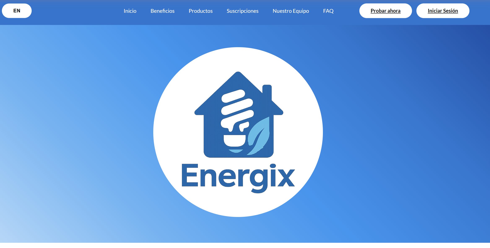

#### 8.3.3.3. Implemented To-Be Frontend-Web Application Evidence

**US20 — Activar modo demo sin hardware**

La ruta pública `/demo` muestra un dashboard con datos de consumo simulados y el aviso "Estás explorando una demo con datos de ejemplo. Crea una cuenta para conectar tus propios dispositivos.", sin requerir sesión iniciada.

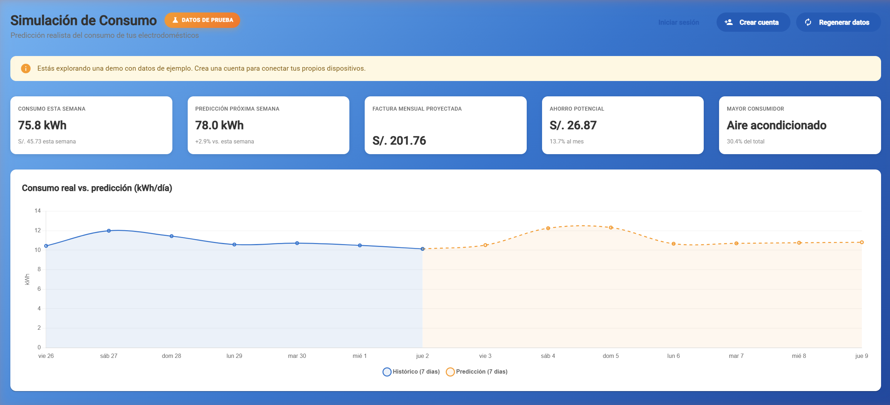

**US21 — Validar precisión de datos del EMS**

En "Validar consumo" el usuario ingresa el monto de su recibo eléctrico y el sistema lo compara contra la factura estimada por la plataforma, mostrando el porcentaje de coincidencia y el mensaje de discrepancia cuando corresponde.


**US22 — Medir impacto de recomendaciones personalizadas**

"Impacto de mis recomendaciones" compara el consumo del periodo actual contra el periodo anterior como aproximación al efecto de las recomendaciones aplicadas, mostrando el mensaje correspondiente cuando aún no hay una reducción significativa.

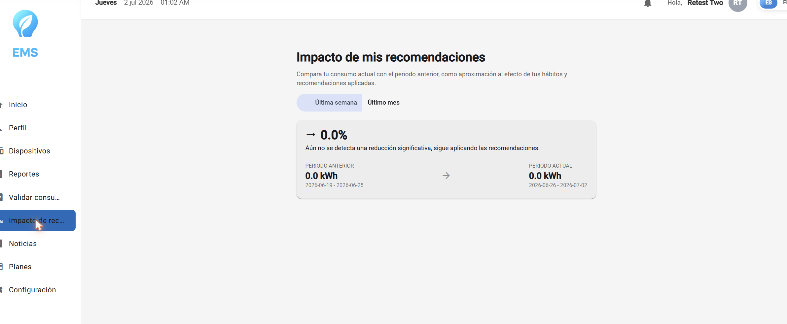

**US23 — Configurar alertas en horas pico**

Desde "Configuración" el usuario define el rango horario de hora pico (y un umbral de alerta opcional) usado para disparar las notificaciones de sobrecosto durante ese horario.


**US24 — Acceder a tutorial interactivo de interpretación de datos**

El tutorial se despliega automáticamente en el primer acceso al dashboard y puede volver a abrirse en cualquier momento desde "Tutoriales y Guías" en el centro de ayuda.

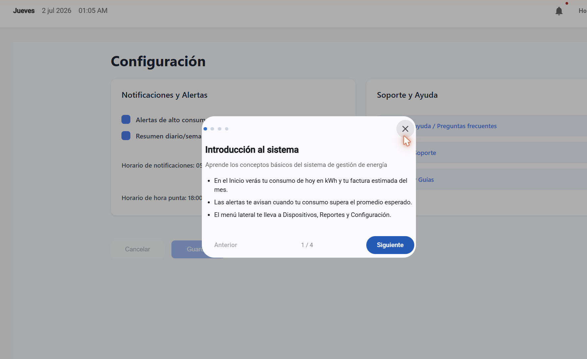

**US25 — Probar la plataforma desde la Landing Page (conversión de demo a cuenta real)**

Al hacer clic en "Crear cuenta" desde la demo, el formulario de registro muestra un resumen de la sesión simulada (consumo semanal y ahorro potencial) antes de que el visitante complete sus datos reales.

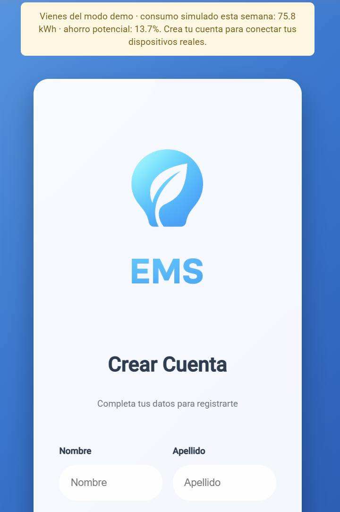

#### 8.3.3.4. Implemented To-Be Native-Mobile Application Evidence

**No aplica.** El alcance del producto Energix (Smart Energy Management System) comprende Landing Page, Web Application y RESTful API; no contempla el desarrollo de una aplicación móvil nativa en esta fase del proyecto, por lo que no se presenta evidencia de implementación de las To-Be User Stories en Mobile.

#### 8.3.3.5. Implemented To-Be RESTful API and/or Serverless Backend Evidence

**US25 — Probar la plataforma desde la Landing Page (conversión de demo a cuenta real)**

El endpoint `POST /api/v1/authentication/sign-up` registra al visitante que decide convertir su sesión de demo en una cuenta real, devolviendo el perfil creado con estado `201 Created`.

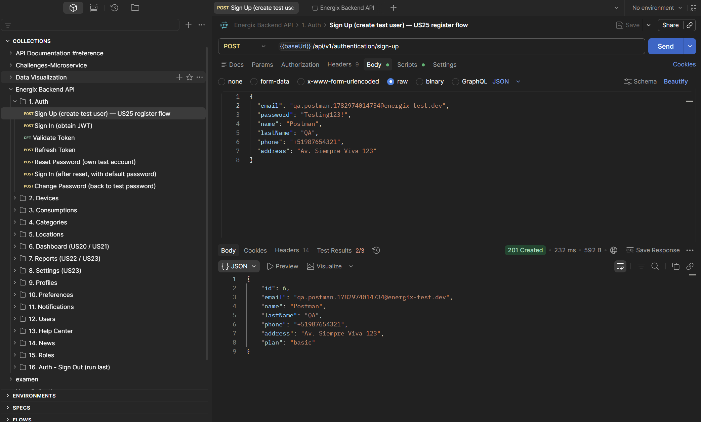

El endpoint `POST /api/v1/authentication/sign-in` autentica al usuario recién registrado y retorna su perfil junto con el token JWT.

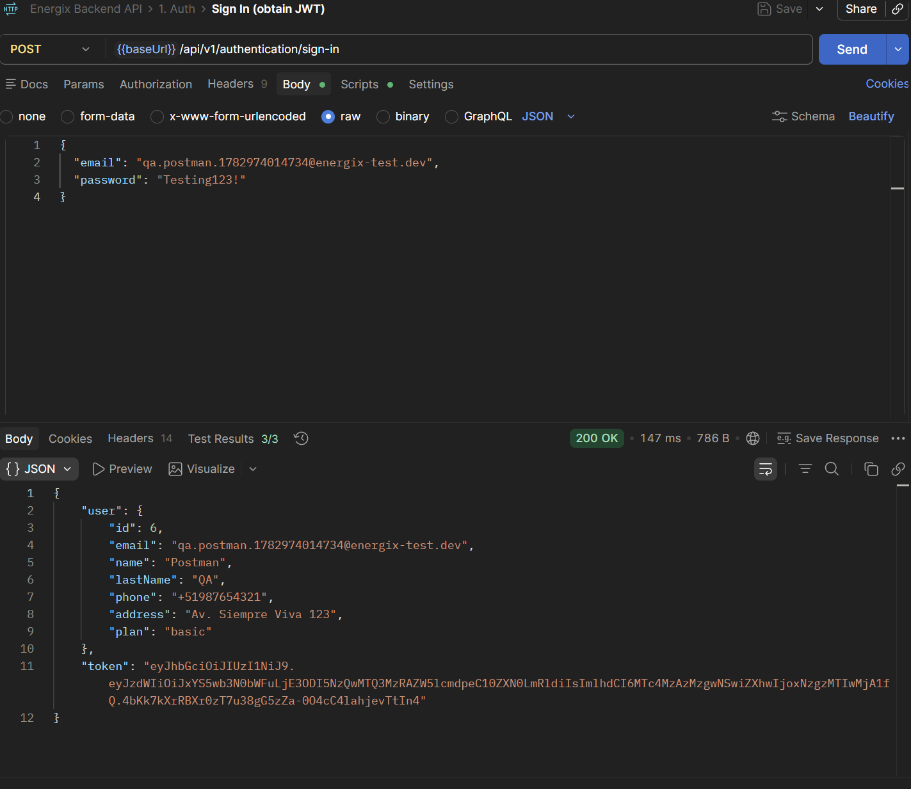

**US21 — Validar precisión de datos del EMS**

El endpoint `POST /api/v1/dashboard/validate-receipt` compara el monto del recibo ingresado por el usuario contra el consumo estimado por la plataforma, retornando el porcentaje de coincidencia y el mensaje de discrepancia cuando corresponde.

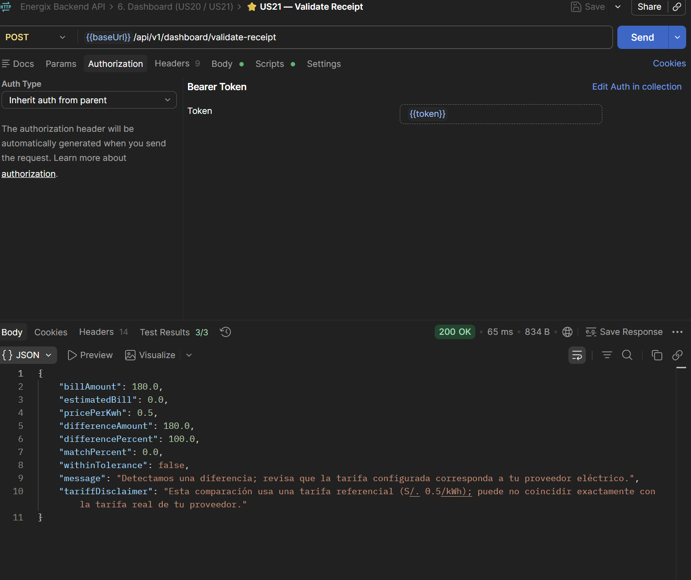

**US22 — Medir impacto de recomendaciones personalizadas**

El endpoint `GET /api/v1/reports/compare` recibe los rangos de fechas de dos periodos y retorna el consumo total y diario de cada uno junto con la diferencia porcentual entre ambos, permitiendo cuantificar el efecto de las recomendaciones aplicadas.

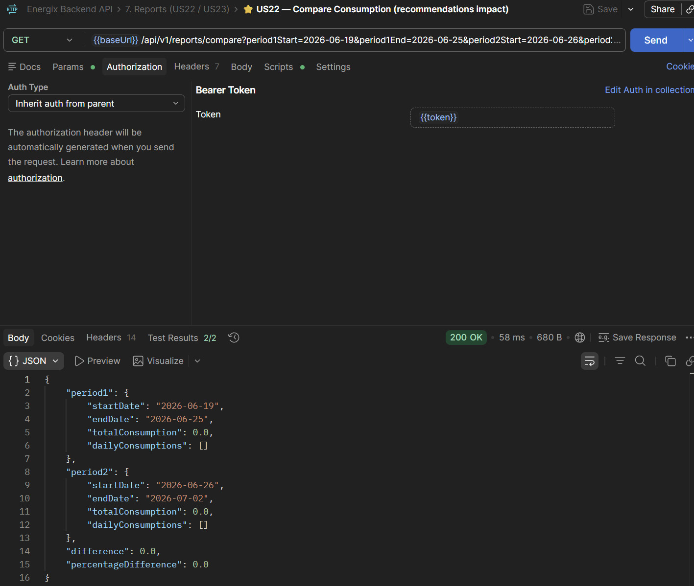

**US23 — Configurar alertas en horas pico**

El endpoint `GET /api/v1/reports/peak-hour-summary` informa si el usuario ya configuró su horario de hora pico.

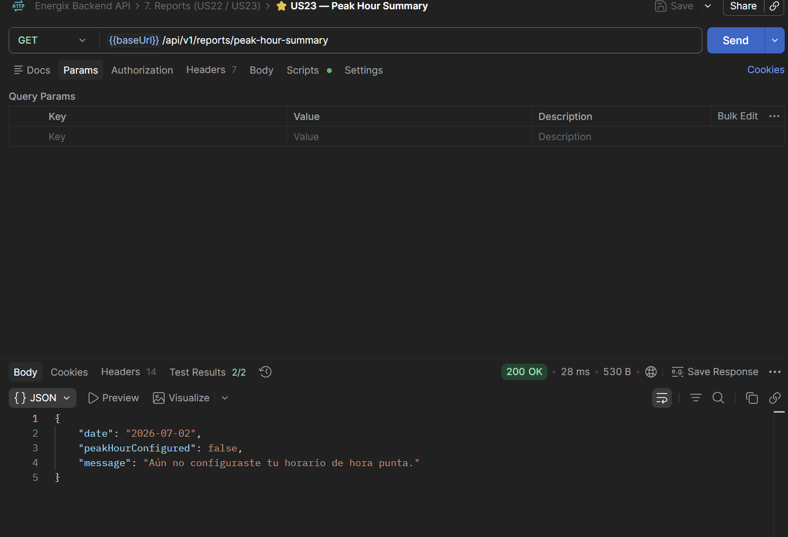

El endpoint `PUT /api/v1/settings` permite definir dicho horario (rango `peakHourStart`/`peakHourEnd`) junto con el umbral de consumo (`highConsumptionThresholdKwh`) que dispara la alerta.

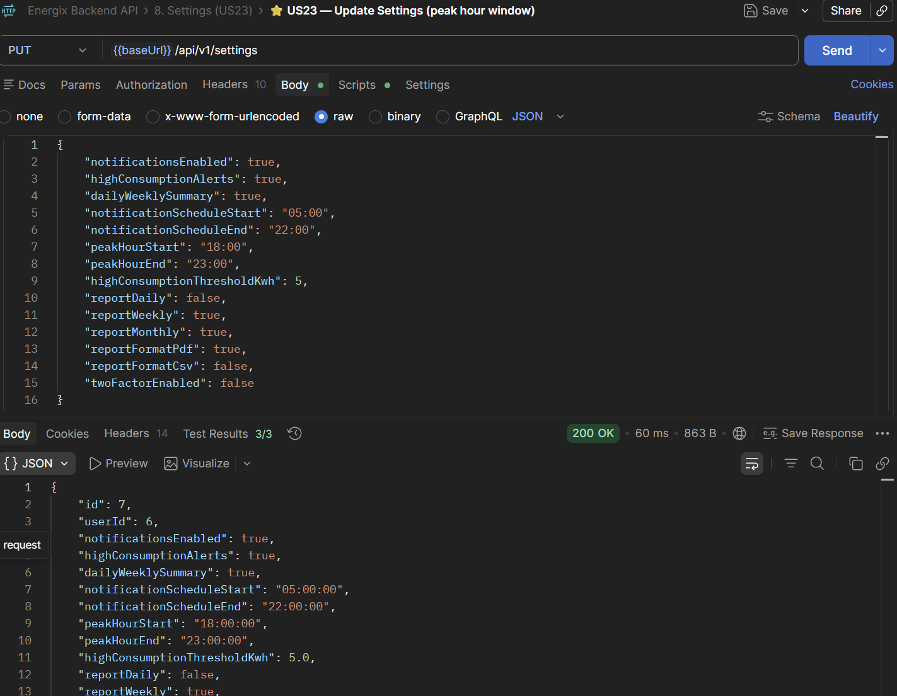

#### 8.3.3.6. Team Collaboration Insights

Se presentan los analíticos de contribución de GitHub para los tres repositorios involucrados en la implementación de las To-Be User Stories (US20–US25), evidenciando la participación del equipo durante el sprint de experimentación.

**Repositorio de Reporte**

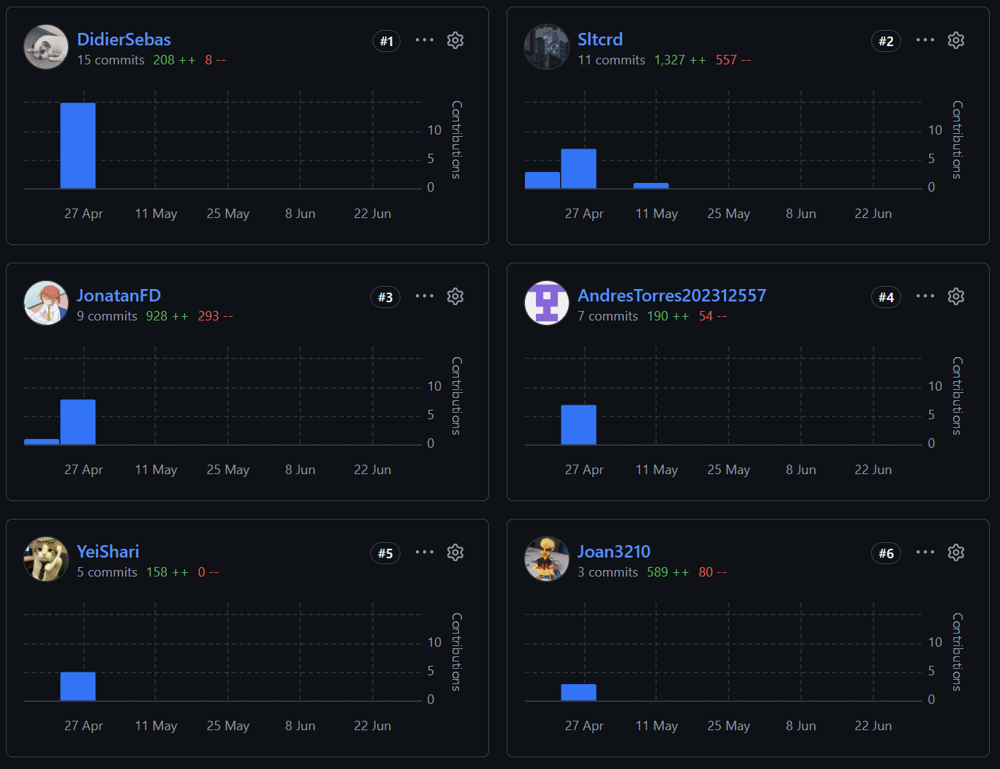

**Repositorio de Backend**

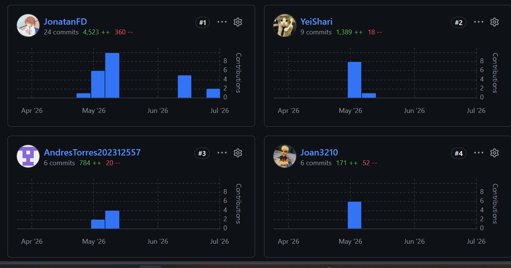

**Repositorio de Frontend**

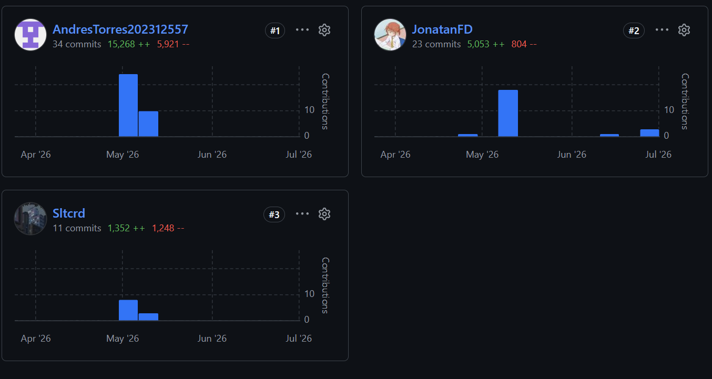


### 8.3.4. To-Be Validation Interviews
Las entrevistas de validación del Capítulo VIII están diseñadas para evaluar las
nuevas funcionalidades experimentales implementadas a partir de las hipótesis definidas
Las entrevistas están dirigidas a los mismos segmentos objetivo: propietarios de vivienda y estudiantes que alquilan
#### 8.3.4.1. Diseño de Entrevistas.

**Preguntas para Segmento #1: Propietarios de Vivienda**

1. ¿El botón "Probar ahora" en la Landing Page facilitó que pudieras explorar la plataforma en el modo demo (con datos simulados) de forma inmediata y sin registrarte?
2. ¿Ver el funcionamiento de la plataforma con datos simulados en la demo te convenció para registrarte posteriormente con una cuenta real?
3. ¿Poder ingresar el monto de tu recibo físico en la sección "Validar consumo" y compararlo con el consumo estimado del sistema aumenta tu confianza en la precisión de la plataforma?
4. ¿El gráfico comparativo de la sección "Impacto de recomendaciones" te muestra de forma clara e intuitiva el ahorro que has logrado en soles y kWh?
5. ¿Poder configurar el "Horario de hora punta" (18:00 - 23:00) bajo Configuración y recibir alertas te motivaría a trasladar el uso de tus electrodomésticos a horarios de menor tarifa?
6. ¿El tutorial interactivo "Introducción al sistema" (disponible en Tutoriales y Guías) fue claro y te ayudó a interpretar los gráficos de consumo en kWh sin asistencia técnica?

**Preguntas para Segmento #2: Estudiantes que Alquilan**

1. Como estudiante que alquila, ¿poder probar la plataforma en modo demo (con el botón "Probar ahora" de la Landing) sin instalar un dispositivo físico en tu cuarto fue decisivo para motivarte a usarla?
2. ¿La información y los gráficos simulados de la demo te resultaron útiles y suficientes para comprender el beneficio de la aplicación antes de crear una cuenta?
3. Si compartes gastos con compañeros de cuarto, ¿comparar tu recibo de luz en "Validar consumo" te serviría para hacer una división del cobro más transparente y justa?
4. ¿El gráfico en la sección "Impacto de recomendaciones" te ayuda a visualizar fácilmente si tus esfuerzos de ahorro (como apagar tu laptop o luces) reducen el consumo en kWh?
5. ¿Recibir alertas basadas en el "Horario de hora punta" te convencería de programar el uso de tus dispositivos de estudio o cocina fuera de ese rango de mayor costo?
6. ¿El tutorial "Introducción al sistema" que se abre desde Configuración aclaró tus dudas y te permitió comprender el dashboard de forma autónoma?

#### 8.3.4.2. Registro de Entrevistas.

Link del Video: https://shorturl.at/7BcSC

**ENTREVISTAS SEGMENTO OBJETIVO 1: PROPIETARIOS DE VIVIENDA**

**ENTREVISTA 1**

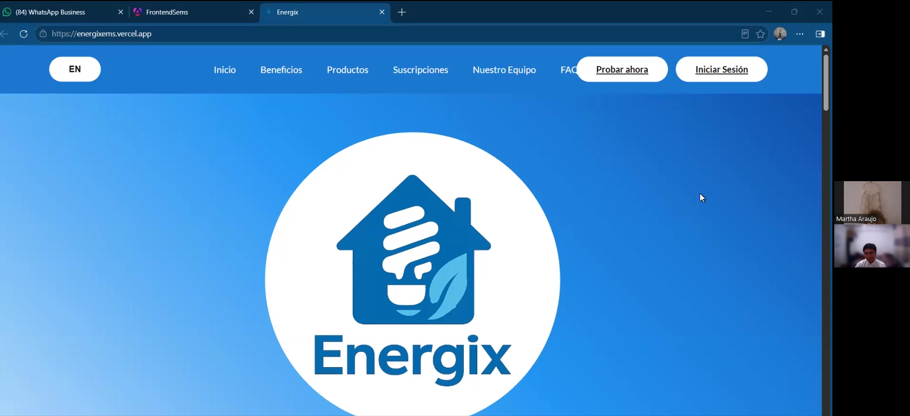


Inicia: 0 minutos y 0 segundos

Duración: 7 minutos y 5 segundos

Nombre: Martha Araujo

Edad:  52

Distrito: Miraflores

Resumen: La propietaria destacó la velocidad de acceso a la demo interactiva sin registrarse como un acierto para la experiencia de usuario. Mencionó que la comparación del recibo en "Validar consumo" le dio seguridad sobre la precisión del sistema al alinearse con la medición de Enel. Validó positivamente el gráfico de "Impacto de recomendaciones" por su claridad visual. Afirmó que la alerta en el "Horario de hora punta" le resultará muy útil para pausar electrodomésticos grandes como la lavadora y que el tutorial interactivo es directo y resuelve cualquier duda de usabilidad.


**ENTREVISTA 2**

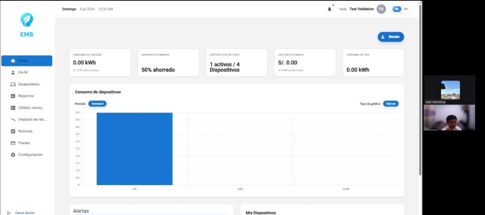

Inicia:  7 minutos y 5 segundos

Duración:  3 minutos y 5 segundos

Nombre: Juan Carlos Mendoza

Edad: 45 años

Distrito: Surco

Resumen: El participante evaluó la facilidad de ingreso a la demo interactiva mediante el botón "Probar ahora", indicando que agiliza la toma de decisiones al eliminar la barrera del registro inicial. Validó positivamente la función "Validar consumo" al notar una correlación del 93% entre el recibo físico y la estimación del sistema. Asimismo, afirmó que el gráfico de "Impacto de recomendaciones" y el "Horario de hora punta" en la sección de alertas son herramientas intuitivas que le motivarían a reordenar el uso de sus dispositivos de alto consumo para ahorrar costos. Destacó que el tutorial de "Introducción al sistema" es claro y evita la necesidad de soporte técnico.

**ENTREVISTAS SEGMENTO OBJETIVO 2: ESTUDIANTES QUE ALQUILAN**

**ENTREVISTA 1**

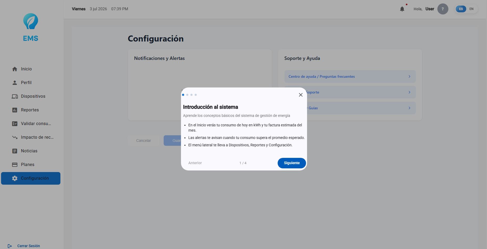


Inicia: 0 minutos y 0 segundos

Duración: 2 minutos y 46 segundos

Nombre: Roberto Flores

Edad: 23

Distrito: Ate

Resumen: El estudiante indicó que la demo sin hardware es excelente para personas que no pueden hacer modificaciones en sus cuartos alquilados. Comentó que la estimación y desglose de consumo por aparatos le permiten visualizar con claridad sus gastos. Validó que la función de "Validar consumo" es de gran utilidad para transparentar la división del recibo con sus compañeros de cuarto. Comentó que el gráfico de "Impacto de recomendaciones" y las alertas del "Horario de hora punta" incentivan la formación de hábitos de ahorro eficientes en sus dispositivos de estudio, y calificó el tutorial como un recurso rápido que resuelve dudas al instante.


**ENTREVISTA 2**

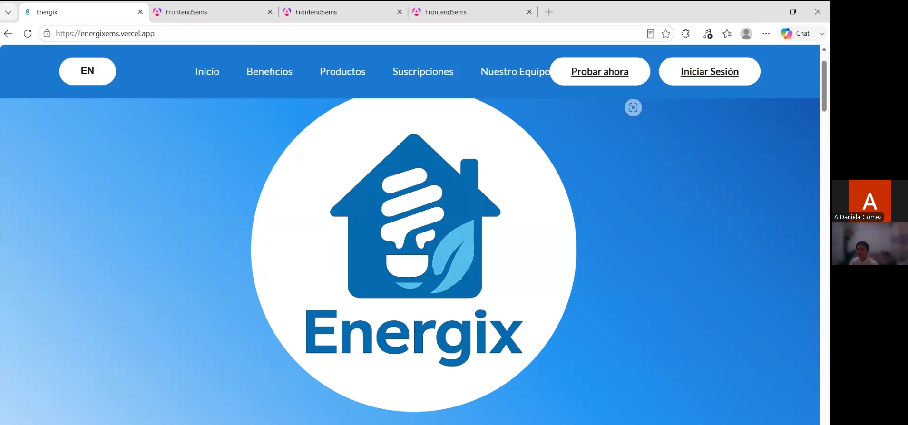


Inicia: 2 minutos y 46 segundos

Duración: 5 minutos y 1 segundo

Nombre: Daniela Gómez

Edad: 21

Distrito: San Miguel

Resumen: La participante validó la conveniencia de probar la aplicación mediante la demo sin registros. Indicó que la sección "Validar consumo" le permite contrastar de manera directa el cobro del casero con sus consumos reales, asegurando una división justa con los roomies. Afirmó que el gráfico de "Impacto de recomendaciones" ayuda a medir el ahorro semanal y que las notificaciones del "Horario de hora punta" le facilitarán programar el uso de sus dispositivos de estudio antes de las 18:00 horas. Además, valoró positivamente la brevedad y sencillez del tutorial de inducción.

## 8.4. Experiment Aftermath & Analysis
### 8.4.1. Analysis and Interpretation of Results

Las entrevistas de validación tuvieron como objetivo evaluar la aceptación y efectividad de las nuevas funcionalidades implementadas en la plataforma a partir de las hipótesis planteadas durante el desarrollo del proyecto. Estas entrevistas se realizaron con los dos segmentos objetivo: propietarios de vivienda y estudiantes que alquilan, quienes interactuaron con las nuevas características del sistema y compartieron su percepción sobre su utilidad, facilidad de uso y aporte a la experiencia de usuario.

Las preguntas fueron diseñadas para analizar aspectos relacionados con la accesibilidad de la plataforma, la confianza en las estimaciones de consumo, la claridad de las visualizaciones, la utilidad de las alertas inteligentes y la comprensión del sistema mediante el tutorial interactivo. Los resultados obtenidos permitieron identificar el nivel de aceptación de cada funcionalidad y verificar si estas responden adecuadamente a las necesidades de los usuarios, proporcionando información valiosa para la mejora continua de la plataforma.

### **Preguntas Formuladas**

1. ¿El botón "Probar ahora" facilitó explorar la plataforma sin necesidad de registrarse?
2. ¿La experiencia del modo demo motivó el registro posterior en la plataforma?
3. ¿La funcionalidad "Validar consumo" incrementa la confianza en la precisión de las estimaciones del sistema?
4. ¿El gráfico de "Impacto de recomendaciones" permite comprender fácilmente el ahorro obtenido?
5. ¿Las alertas configurables del "Horario de hora punta" incentivarían cambios en los hábitos de consumo eléctrico?
6. ¿El tutorial interactivo "Introducción al sistema" facilita el aprendizaje y comprensión de la plataforma?

Estas preguntas fueron respondidas por cinco participantes pertenecientes a los segmentos objetivo: dos propietarios de vivienda y tres estudiantes que alquilan. A continuación, se presentan los resultados obtenidos.

### **Análisis de Datos Demográficos**

**Distribución de participantes**

Las entrevistas fueron realizadas a cinco usuarios pertenecientes al público objetivo del proyecto.

- **Propietarios de vivienda**: 2 participantes (40%).
- **Estudiantes que alquilan**: 3 participantes (60%).

**Distribución de edades**

Las edades de los participantes oscilaron entre 20 y 52 años.

- 20-23 años: 60%
- 45-52 años: 40%

Los resultados muestran que la plataforma resulta comprensible tanto para usuarios jóvenes como para propietarios con mayor experiencia en la administración de gastos del hogar.

### **Evaluación de Funcionalidades**

**Modo Demo ("Probar ahora")**

La totalidad de los participantes valoró positivamente la posibilidad de acceder al sistema mediante el botón "Probar ahora", destacando que elimina la necesidad de crear una cuenta antes de conocer el funcionamiento de la plataforma.

Los propietarios consideraron que esta característica agiliza la toma de decisiones, mientras que los estudiantes resaltaron que pueden probar el sistema sin instalar dispositivos físicos en una vivienda alquilada.

**Resultado observado**: aceptación del 100%.

**Registro posterior al uso del Demo**

Los participantes indicaron que experimentar previamente las funcionalidades mediante datos simulados incrementa la confianza en el producto y aumenta la intención de registrarse posteriormente con una cuenta real.

Esta funcionalidad reduce la incertidumbre inicial y facilita la adopción de la plataforma.

**Resultado observado**: aceptación del 100%.

**Función "Validar consumo"**

Todos los entrevistados consideraron que comparar el recibo físico con la estimación generada por el sistema incrementa significativamente la confianza en la precisión de los resultados.

Los propietarios destacaron la similitud entre la estimación del sistema y el consumo registrado por la empresa eléctrica, mientras que los estudiantes valoraron esta función como una herramienta útil para realizar una distribución más justa del recibo de electricidad entre compañeros de vivienda.

**Resultado observado**: aceptación del 100%.

**Impacto de recomendaciones**

Los cinco participantes afirmaron que el gráfico comparativo permite visualizar de forma sencilla el ahorro conseguido tanto en consumo energético (kWh) como en costo económico (soles).

Los estudiantes señalaron que el gráfico facilita el seguimiento semanal de sus hábitos de ahorro, mientras que los propietarios destacaron su utilidad para evaluar la efectividad de las recomendaciones ofrecidas por la plataforma.

**Resultado observado**: aceptación del 100%.

**Alertas de Horario de Hora Punta**

Todos los entrevistados indicaron que recibir notificaciones durante el horario de mayor tarifa constituye un incentivo para modificar los hábitos de consumo eléctrico.

Los propietarios manifestaron que reorganizarían el uso de electrodomésticos de alto consumo, como lavadoras y otros equipos eléctricos, mientras que los estudiantes mencionaron que programarían el uso de dispositivos de estudio y cocina fuera del horario punta.

**Resultado observado**: aceptación del 100%.

**Tutorial "Introducción al sistema"**

La totalidad de los participantes calificó positivamente el tutorial interactivo, indicando que facilita la comprensión de los gráficos y del funcionamiento general de la plataforma sin requerir asistencia técnica.

Los entrevistados coincidieron en que la información presentada es breve, clara y suficiente para comenzar a utilizar el sistema.

**Resultado observado**: aceptación del 100%.

### **Recomendaciones de los Usuarios**

Durante las entrevistas también se identificaron aspectos que los participantes consideran especialmente valiosos para futuras versiones de la plataforma:

- Mantener disponible el modo demo sin necesidad de registro.
- Conservar la funcionalidad "Validar consumo", ya que incrementa la confianza en las estimaciones del sistema.
- Continuar mostrando el ahorro mediante gráficos comparativos fáciles de interpretar.
- Mantener las alertas configurables de Horario de Hora Punta para promover hábitos de consumo responsables.
- Ampliar el contenido del tutorial con ejemplos adicionales sobre interpretación de gráficos y recomendaciones de ahorro energético.

### **Conclusión**

Los resultados de las entrevistas de validación evidencian una aceptación muy favorable de las nuevas funcionalidades implementadas en la plataforma. Tanto los propietarios de vivienda como los estudiantes que alquilan coincidieron en que el modo demo facilita la adopción inicial del sistema, mientras que la función "Validar consumo" fortalece la confianza en las estimaciones realizadas.

Asimismo, el gráfico de "Impacto de recomendaciones", las alertas del Horario de Hora Punta y el tutorial interactivo fueron percibidos como herramientas útiles que mejoran la experiencia del usuario y favorecen la adopción de hábitos de consumo energético más eficientes.

En conjunto, los resultados permiten validar las hipótesis planteadas para estas funcionalidades y respaldan su incorporación dentro de la versión final de la plataforma, evidenciando un alto nivel de aceptación por parte de ambos segmentos objetivo.

### 8.4.2. Re-scored and Re-prioritized Question Backlog

| Prioridad (1,2,3,5,8) | ID | Pregunta                                                                      |
|-----------------------| -- | ----------------------------------------------------------------------------- |
| 1                     | Q1 | ¿La instalación del smart meter reduce la adopción del sistema?               |
| 1                     | Q2 | ¿Los usuarios confían en los datos generados por el EMS?                      |
| 2                     | Q3 | ¿Las recomendaciones personalizadas generan reducción de consumo energético?  |
| 3                     | Q4 | ¿Las alertas de consumo en tiempo real modifican el uso de electrodomésticos? |
| 5                     | Q5 | ¿Los usuarios entienden el consumo mostrado en kWh y gráficos del EMS?        |
| 8                     | Q6 | ¿Un modo demo sin hardware incrementa la intención de uso?                    |


## 8.5. Continuous Learning

### 8.5.1. Shareback Session Artifacts: Learning Workflow
El prototipo interactivo desarrollado en **Figma** refleja las interfaces y soluciones propuestas, diseñadas con base en las necesidades y expectativas de los usuarios. Este artefacto muestra cómo el equipo iteró y ajustó los elementos visuales y funcionales durante el proceso de diseño.
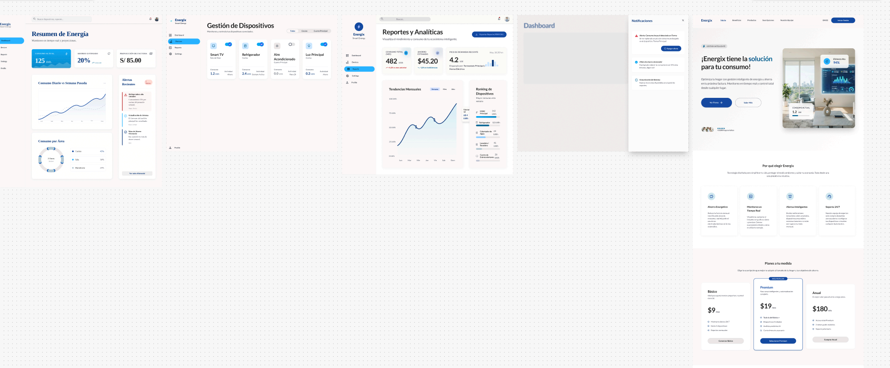
**Enlace Figma:** [Acceder al diseño en Figma](https://tinyurl.com/FigmaEnergix)

## 8.6. To-Be Software Platform Pre-launch
### 8.6.1. About-the-Product Intro Video

El siguiente video presenta EMS, la solución desarrollada por el equipo Energix para transformar la forma en que los hogares gestionan su consumo energético. A través de este video se podrá conocer las principales funcionalidades del producto: el dashboard de consumo eléctrico, el sistema de alertas en horas pico, el motor de recomendaciones personalizadas, la sección de validación de datos frente al recibo eléctrico real, y el modo demo que permite explorar la plataforma sin necesidad de instalar hardware. Todo ello refleja los experimentos validados durante el ciclo de desarrollo, confirmando el valor que EMS genera para sus usuarios.

**Video About the Product - Youtube:** https://www.youtube.com/watch?v=x35kjae2CKE

**Video About the Product - OneDrive:** https://upcedupe-my.sharepoint.com/:v:/g/personal/u202312557_upc_edu_pe/IQBVKiLDyLuqRoNC4OPnXwQaAbi_7Zjs5w9uCaaUzZud3E0?nav=eyJyZWZlcnJhbEluZm8iOnsicmVmZXJyYWxBcHAiOiJPbmVEcml2ZUZvckJ1c2luZXNzIiwicmVmZXJyYWxBcHBQbGF0Zm9ybSI6IldlYiIsInJlZmVycmFsTW9kZSI6InZpZXciLCJyZWZlcnJhbFZpZXciOiJNeUZpbGVzTGlua0NvcHkifX0&e=cMHeaO


# Conclusiones

## Conclusiones y recomendaciones.

A partir del análisis detallado de la especificación, implementación, validación y prácticas DevOps del proyecto Energix, se establecen las siguientes conclusiones:

### Sobre la Especificación de Requerimientos (Capítulo III)
La fase de especificación de requerimientos demuestra un profundo entendimiento de los segmentos objetivos (propietarios y estudiantes que alquilan). Mediante el mapeo de escenarios (To-Be Scenario Mapping) y la adopción de principios de Domain-Driven Design (DDD) y Behavior-Driven Development (BDD), las necesidades del cliente se transformaron en un Product Backlog sólido. Las 20 User Stories están estructuradas con visiones funcionales y técnicas claras, asegurando que el desarrollo priorice el valor de negocio y establezca criterios de aceptación medibles y rigurosos.

### Sobre la Implementación del Producto (Capítulo V)
La implementación refleja una arquitectura robusta y procesos de gestión de la configuración (SCM) altamente estandarizados. La modularización del proyecto en repositorios separados, la aplicación estricta de convenciones de código, GitFlow y Conventional Commits, evidencian un trabajo colaborativo ordenado y profesional. El despliegue de las soluciones bajo un modelo SaaS en infraestructuras cloud modernas (Netlify para la Landing Page, Vercel para el Frontend en Angular, Render y Aiven para el Backend en Spring Boot) resultó en un producto funcional, documentado (Swagger), seguro y escalable.

### Sobre la Verificación y Validación (Capítulo VI)
La estrategia de validación garantiza la alta calidad del sistema mediante la ejecución en múltiples capas de pruebas. La implementación de pruebas unitarias y de integración certifica la robustez de las entidades principales y los endpoints del API. Por otro lado, la ejecución de pruebas orientadas al comportamiento (BDD) y pruebas de sistema, mapeadas una a una con las User Stories (US01 a US20), valida que cada funcionalidad cumple estrictamente con los criterios de aceptación y las expectativas del usuario final.

### Sobre las Prácticas DevOps (Capítulo VII)
La adopción de prácticas DevOps soportadas por GitHub Actions ha madurado el ciclo de vida de desarrollo del software. La automatización de la integración continua (CI) previene la introducción de código con fallas a través de pruebas automatizadas sobre una base de datos real. Asimismo, las fases de entrega y despliegue continuo (CD) permiten empaquetar artefactos inmutables (contenedores Docker en ghcr.io) y desplegarlos automáticamente en producción (Render). Todo esto otorga entregas ágiles, seguras y con trazabilidad exacta entre cada commit y la versión desplegada en producción.


## Bibliografía
Aiven. (2026). *Aiven Cloud Database platform*. Aiven. https://aiven.io

Cloudflare. (2026). *Cloudflare Tunnel*. Cloudflare. https://www.cloudflare.com/products/tunnel/

Conventional Commits. (2026). *Conventional Commits: A specification for adding human and machine readable meaning to commit messages*. https://www.conventionalcommits.org/

Cucumber. (2026). *Cucumber: Behavior-Driven Development*. SmartBear. https://cucumber.io/

Docker. (2026). *Docker Enterprise Container Platform*. Docker, Inc. https://www.docker.com/

Driessen, V. (2010). *A successful Git branching model*. nvie.com. https://nvie.com/posts/a-successful-git-branching-model/

Evans, E. (2003). *Domain-Driven Design: Tackling Complexity in the Heart of Software*. Addison-Wesley Professional.

Figma. (2026). *Figma: The collaborative interface design tool*. Figma. https://www.figma.com/

GitHub. (2026). *GitHub Actions*. GitHub, Inc. https://github.com/features/actions

Google. (2026). *Angular: The modern web developer's platform*. Google. https://angular.io/

Gothelf, J., & Seiden, J. (2016). *Lean UX: Designing Great Products with Agile Teams*. O'Reilly Media.

Netlify. (2026). *Netlify: Develop & deploy the best web experiences in record time*. Netlify. https://www.netlify.com/

Oracle. (2026). *Java Platform, Standard Edition*. Oracle Corporation. https://www.oracle.com/java/

Pivotal Software. (2026). *Spring Boot*. VMware. https://spring.io/projects/spring-boot

Render. (2026). *Render: Cloud Application Hosting*. Render. https://render.com/

SmartBear. (2026). *Swagger: API Documentation & Design*. SmartBear. https://swagger.io/

UXPressia. (2026). *UXPressia: Customer Journey Mapping Tool*. UXPressia. https://uxpressia.com/

Vercel. (2026). *Vercel: Develop. Preview. Ship.* Vercel. https://vercel.com/
